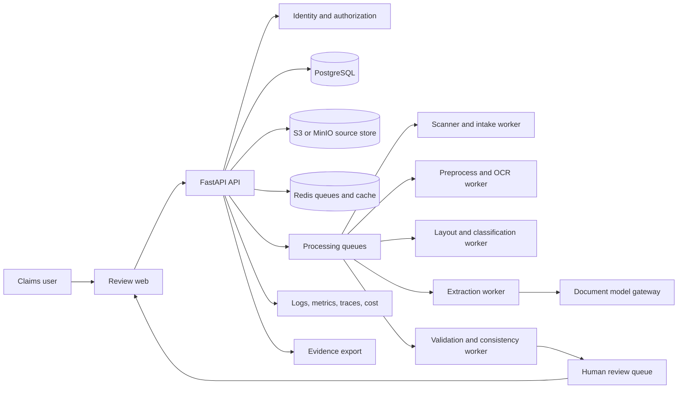

# Document Intelligence Claims Reviewer Production Implementation Guide

Updated: July 28, 2026

This file defines the third integrated portfolio project:

> Build a production-grade document intelligence system that ingests claim forms, scanned
> documents, receipts, invoices, photographs, and related attachments; classifies each artifact;
> extracts structured claim fields with page, text, and region evidence; verifies consistency
> across documents and policy rules; routes uncertain or high-risk cases to humans; and proves
> quality, privacy, reliability, and cost through evaluation and operational evidence.

This is not an OCR demo and not an automated claim-adjudication system. It is a controlled
claims-intake and review assistant. It accelerates evidence collection, normalization,
verification, and human review, but it does not approve, deny, price, or pay claims without
authorized human workflow outside the model.

Companion: the
[Document Intelligence Claims Reviewer Technical Implementation Guide](Document-Intelligence-Claims-Reviewer-Technical-Implementation-Guide.md)
turns these requirements into an executable repository and staged build. This production guide is
the normative source when the two guides conflict; material changes should update both files in the
same pull request.

## Source alignment

This guide operationalizes the local curriculum and research rather than replacing them:

- The project is the third integrated portfolio project in the
  [research project mapping](./deep-research-report.md#project-mapping), compressed from
  `ClaimVision`.
- The project covers multimodal document processing, extraction, evidence, privacy, and human
  review as called out in the
  [integrated portfolio projects](./deep-research-report.md#integrated-portfolio-projects).
- Curriculum scope comes from
  [Multimodal, document, speech, and voice AI](./AI-Industry-Curriculum.md#multimodal-document-speech-and-voice-ai).
- Completion evidence aligns to
  [Lesson 13 - Document Ingestion and Chunking](./AI-Industry-Complete-Lesson-Coverage-Map.md#lesson-13--document-ingestion-and-chunking),
  [Lesson 15 - AI Evaluation Engineering](./AI-Industry-Complete-Lesson-Coverage-Map.md#lesson-15--ai-evaluation-engineering),
  [Lesson 16 - Data Engineering for AI Systems](./AI-Industry-Complete-Lesson-Coverage-Map.md#lesson-16--data-engineering-for-ai-systems),
  [Lesson 26 - Multimodal and Document AI](./AI-Industry-Complete-Lesson-Coverage-Map.md#lesson-26--multimodal-and-document-ai),
  [Lesson 28 - AI Security and Privacy](./AI-Industry-Complete-Lesson-Coverage-Map.md#lesson-28--ai-security-and-privacy),
  [Lesson 29 - AI Governance and Risk Management](./AI-Industry-Complete-Lesson-Coverage-Map.md#lesson-29--ai-governance-and-risk-management),
  and [Lesson 50 - Multimodal AI Specialization](./AI-Industry-Complete-Lesson-Coverage-Map.md#lesson-50--multimodal-ai-specialization).
- Roadmap scope aligns to
  [Phase 6 - Multimodal, document and voice AI](./AI-Industry-Roadmap-and-Projects.md#phase-6--multimodal-document--voice-ai-lessons-2627).

When this guide is more specific than a source document, the specificity is an implementation
decision for this project. Record material choices as architecture decision records.

## Evidence and verification vocabulary

Every stage document, report, checklist, and README status must use one of these terms:

| Status | Meaning |
|---|---|
| `planned` | Scope and acceptance criteria exist; implementation has not been claimed. |
| `implemented` | Code or configuration exists; no verification claim is implied. |
| `locally verified` | Reproducible checks passed in a named local environment. |
| `externally verified` | Checks passed in CI, staging, or another independently identified environment. |
| `operationally proven` | The capability met its SLO or acceptance gate during a controlled pilot or production-like exercise. |

Use `Verified` and `Not Verified` sections in stage records. A statement such as "OCR works" is
invalid unless it names the dataset slice, document types, model or OCR version, command or
procedure, metrics, evidence location, environment, and date. Never use `complete`,
`production-ready`, or `operationally proven` as a substitute for evidence.

## 1. Production outcome

The finished system should let an authorized claims intake analyst:

- Upload or receive a claim package containing forms, receipts, invoices, estimates, photos, and
  supporting documents.
- See each artifact classified by document type and claim relevance.
- View extracted fields with exact page, region, OCR text span, model source, confidence, and
  validation status.
- Compare extracted values across forms, receipts, policy records, claimant statements, and photos.
- Identify missing, inconsistent, illegible, duplicate, out-of-policy, or low-confidence evidence.
- Send specific fields, documents, or findings to human review.
- Produce a review packet that a claims professional can approve, correct, reject, or escalate.
- Audit who changed what, when, why, and from which evidence.

The system should let a human reviewer:

- Triage review tasks by claim, document, field, risk, age, and business priority.
- Open the original artifact beside extracted fields and bounding regions.
- Correct fields and assign rejection reasons.
- Mark evidence as sufficient, conflicting, unreadable, unsupported, duplicate, or not applicable.
- Add reviewer notes without overwriting immutable model evidence.
- Feed corrected labels into evaluation datasets after quality review.

The system should let an operator:

- Trace one claim package across intake, malware scan, OCR, layout analysis, classification,
  extraction, validation, human review, export, latency, and cost.
- Compare OCR and model versions on public benchmarks and business-domain claim documents.
- See error budgets, queue backlogs, failed artifacts, parsing cost, review workload, privacy
  incidents, and model-regression status.
- Release or roll back parser, OCR, preprocessing, classifier, extractor, validation rules,
  multimodal model, prompt, schema, and UI versions independently where safe.

The project is complete only when it has working software, reproducible tests, fixed evaluation
sets, low-confidence routing, security controls, observable SLOs, deployment and recovery evidence,
a controlled pilot readout, and an honest record of what remains unverified.

## 2. Business problem, users, scope, and non-goals

### Business problem

Claims teams receive evidence in messy formats: scanned forms, low-quality photos, receipts,
repair estimates, invoices, handwritten notes, email attachments, and occasionally voice-derived
transcripts. Manual review is slow and inconsistent. Generic OCR misses layout and visual
context, while generic language models can invent unsupported fields. The business needs faster
intake and verification without weakening privacy, auditability, human judgment, or regulatory
control.

### Primary users

| Persona | Need | Risk if the system fails |
|---|---|---|
| Claims intake analyst | Normalize a claim package quickly. | Delays, missed documents, incorrect handoff, duplicate work. |
| Claims adjuster or reviewer | Inspect evidence and make a human decision. | Acts on wrong, incomplete, or unsupported extracted facts. |
| Supervisor | Monitor backlog, quality, and escalations. | Cannot find bottlenecks or recurring extraction failures. |
| Compliance or privacy reviewer | Prove provenance, access, retention, and human oversight. | Cannot reconstruct why a field was used or disclosed. |
| Data or annotation lead | Curate corrected labels and benchmarks. | Evaluation data becomes noisy, biased, or contaminated. |
| Platform or security operator | Run, monitor, recover, and investigate the service. | Outage, leakage, runaway cost, or incomplete incident evidence. |

### Initial domain

Use public, synthetic, or explicitly authorized insurance-style claim documents. The first pilot
should select one bounded claim line and one authoritative owner. Examples:

- Auto physical damage intake.
- Property damage intake.
- Warranty or equipment-damage claims.
- Travel reimbursement or expense claims.

Do not begin with every insurance product, every document type, or every jurisdiction. Medical
claims, legal claims, bodily injury claims, credit decisions, and high-impact eligibility decisions
are out of scope unless a separate regulated-domain control package is approved.

Version 1 is English-only unless a language-specific evaluation pack is approved. Record detected
language on each page and extracted field. Confidently non-English documents must be quarantined
or routed to human review with a typed `unsupported_language` reason. Do not silently translate
and extract. Adding another language requires OCR, layout, extraction, validation, reviewer UX,
privacy, and evaluation evidence for that language.

### Required scope

- Claim package intake, artifact registration, immutable source storage, and malware scanning.
- Document classification for selected claim artifact types.
- Image preprocessing, OCR, page layout, table, checkbox, stamp, signature, and form-region
  handling where in scope.
- Structured field extraction with schema validation and evidence regions.
- Cross-document consistency checks and deterministic business-rule verification.
- Low-confidence, missing, conflicting, unreadable, sensitive, and high-risk human-review routing.
- Human correction workflow with immutable source evidence and audit trail.
- Public benchmark evaluation plus business-domain evaluation.
- Privacy, retention, access control, redaction, observability, cost attribution, deployment,
  rollback, and recovery.

### Explicit non-goals for the first release

- Autonomous claim approval, denial, pricing, payout, subrogation, fraud accusation, or coverage
  determination.
- Replacing licensed adjusters, legal reviewers, medical reviewers, or compliance officers.
- General legal, medical, employment, credit, or financial advice.
- Training a foundation model.
- Perfect handwriting recognition.
- Accepting arbitrary untrusted archives without quarantine and scanner controls.
- Open-ended web search or social-media investigation.
- Multi-agent orchestration.
- Voice intake. Voice-derived transcripts are optional later inputs and must follow a separate
  consent and retention policy.
- Using model-generated confidence as calibrated confidence without calibration evidence.
- Treating public benchmark performance as proof of business-domain performance.
- Storing hidden model reasoning or requiring chain-of-thought for audit.

Non-goals may become later experiments, but they do not weaken the production requirements in this
guide.

## 3. Business outcomes and metric tree

Measure the current workflow before adding automation.

Required baseline:

- Median and P95 time from package receipt to first complete review packet.
- Manual touch time per claim.
- Rework rate caused by missing, illegible, duplicate, or inconsistent evidence.
- Percentage of packages routed to human review.
- Percentage of fields corrected by reviewers.
- Backlog age by claim type and document type.
- Cost per reviewed claim package.
- Quality defects found after downstream handoff.

Primary outcome metrics:

| Outcome | Example measure |
|---|---|
| Faster intake | Median and P95 time to a reviewer-ready package. |
| Less manual transcription | Manual corrections per required field and minutes saved per package. |
| Better evidence completeness | Missing-information detection recall on labelled packages. |
| Better review quality | Downstream defect rate and reviewer agreement on sampled cases. |
| Better user trust | Reviewer acceptance rate with evidence-open rate and correction rate. |
| Sustainable economics | Cost per package, cost per document, and cost per accepted extraction. |

Guardrail metrics:

- Critical-field false positive rate.
- Critical-field false negative rate.
- Unsupported extracted-field rate.
- Invalid evidence-region rate.
- Duplicate-document miss rate.
- Cross-document inconsistency miss rate.
- Low-confidence routing recall.
- Sensitive-data exposure rate.
- Unauthorized artifact, field, or export access rate.
- P95 and P99 package processing latency.
- OCR, layout, extraction, validation, and export failure rates.
- Human-review backlog age and override rate.

Do not claim success from throughput alone. A faster system that creates unsupported or privacy-
unsafe claim facts has failed.

## 4. What production-ready means

Production-ready for this project means:

- A claim package can be processed end to end from intake to human-review packet.
- Every extracted value has a schema, source artifact, source version, page, region or text span,
  model/rule source, confidence, validation state, and audit trail.
- Critical claim fields are evaluated separately from non-critical fields.
- Visual understanding, OCR text extraction, layout detection, field extraction, and consistency
  checks have separate metrics and failure attribution.
- Human review is a first-class workflow, not an afterthought.
- Corrections are captured as reviewer annotations, not silent mutation of model outputs.
- Security, privacy, retention, and access-control controls are testable and documented.
- Deployment, rollback, restore, cost, and incident procedures are reproducible.

The smallest acceptable pilot may support a narrow document set, but it must still prove the full
control loop: intake, extraction, evidence, validation, human review, audit, evaluation,
observability, and rollback.

## 5. Non-negotiable requirements

| ID | Requirement |
|---|---|
| DICR-INTAKE-01 | Store every source artifact immutably before derived processing. |
| DICR-INTAKE-02 | Quarantine unsupported, infected, encrypted, oversized, or ambiguous inputs. |
| DICR-EVID-01 | Every extracted field must link to source artifact version and page or region evidence. |
| DICR-EVID-02 | A reviewer must be able to open the original artifact and see the extracted region. |
| DICR-EXTRACT-01 | Use typed schemas for required, optional, repeated, and nullable fields. |
| DICR-EXTRACT-02 | Separate OCR/layout failures from extraction/model failures in metrics. |
| DICR-VERIFY-01 | Validate fields with deterministic rules before any model-generated summary. |
| DICR-VERIFY-02 | Route missing, conflicting, low-confidence, unreadable, sensitive, and high-risk cases to humans. |
| DICR-HUMAN-01 | Human reviewers can accept, correct, reject, and annotate field-level outputs. |
| DICR-HUMAN-02 | Human corrections preserve the original model output and evidence. |
| DICR-EVAL-01 | Public benchmark and business-domain results are both reported. |
| DICR-EVAL-02 | Release gates include document type, scan quality, field criticality, and demographic or locale slices where applicable. |
| DICR-SEC-01 | Authorization lives outside the model and is enforced on artifacts, fields, tasks, exports, and audit views. |
| DICR-PRIV-01 | PII and sensitive images are minimized, redacted where appropriate, retained by policy, and excluded from unsafe logs. |
| DICR-OPS-01 | Processing, review, latency, quality, cost, and failure metrics are observable by correlation ID. |
| DICR-REL-01 | Failed jobs are retryable or dead-lettered without duplicate downstream facts. |
| DICR-REL-02 | Parser, OCR, model, prompt, schema, and rule versions are recorded and rollback-capable. |

## 6. Core journeys and required UX

### Claim intake journey

1. A package arrives through upload or batch import.
2. The system records package metadata, submitter identity, source channel, tenant, and claim line.
3. Each artifact is stored immutably and scanned.
4. Unsupported or unsafe artifacts are quarantined with reviewer-visible reasons.
5. Accepted artifacts enter preprocessing, OCR, layout analysis, classification, extraction, and
   validation.
6. The package status moves to `ready_for_review`, `needs_human_review`, or `blocked`.

The intake UI must show document status without hiding failures. A package cannot appear
reviewer-ready while a required artifact is still processing or blocked.

### Extracted-field review journey

The field review view must include:

- Claim package timeline.
- Artifact list with type, source, version, pages, status, and warnings.
- Extracted fields grouped by claim section.
- Original value, normalized value, confidence, evidence, validation state, and reviewer state.
- Side-by-side source viewer with bounding boxes or text spans.
- Correction controls with required reason codes.
- Escalation controls for missing information, unreadable evidence, suspected duplicate, policy
  conflict, privacy issue, and out-of-scope case.

A reviewer must never need to trust a generated summary to verify a field. The field-level evidence
must be directly inspectable.

### Consistency and rule-review journey

The system should surface deterministic findings before any generated narrative:

- Required field missing.
- Required document missing.
- Claim number mismatch.
- Policy number mismatch.
- Date of loss after receipt date.
- Invoice total mismatch.
- Duplicate receipt or estimate.
- Damage photo timestamp outside expected window when metadata is available.
- Unsupported document type.
- Low OCR quality or unreadable region.
- Policy-rule check needs human interpretation.

Findings must include evidence and a typed severity: `info`, `warning`, `review_required`, or
`blocked`.

### Human-review queue

The review queue must support:

- Claim line, document type, priority, age, reason, and assignee filters.
- SLA and aging indicators.
- Bulk assignment by supervisor.
- Reviewer decision capture.
- Escalation to specialist queues.
- Reopen and audit history.

Human review is required for any case where the system cannot prove field sufficiency and
consistency under the accepted thresholds.

### Review packet export

The export must be scoped and evidence-backed:

- Claim package ID, status, document inventory, and processing versions.
- Accepted extracted fields and reviewer corrections.
- Open findings and blocked reasons.
- Field-level citations to page and region evidence.
- Redacted view for roles that cannot access sensitive documents.
- Audit appendix with timestamps, actors, model/rule versions, and reviewer notes.

Exports must not include raw hidden model reasoning. Summaries must be concise, evidence-backed,
and clearly labelled as generated or reviewer-authored.

### Access-first claims architecture

Authorization is not a UI filter added after extraction. It is part of package intake, source
storage, preview generation, OCR access, field visibility, review-task assignment, export creation,
telemetry, and audit.

#### Access invariants

- Deny access when identity, tenant, claim-line scope, role, queue assignment, artifact
  classification, or policy evaluation is missing.
- Resolve users and service identities from trusted authentication context; never trust tenant,
  role, claim-line, assignee, or reviewer values supplied in request JSON.
- Store access policy version and classification with each claim package, artifact, field
  prediction, review task, export, and audit event.
- Enforce authorization before source preview, OCR text display, evidence-region display, field
  display, review decision, export generation, and audit read.
- Re-authorize source artifacts and evidence regions when a user opens them, even if the package
  was previously visible.
- Never reveal restricted artifacts through document counts, missing-document hints, timings,
  thumbnails, field names, findings, errors, exports, metrics, or cache behavior.
- Bind caches to tenant, subject-scope hash, artifact/version hash, redaction profile, processing
  version tuple, and output policy.
- Invalidate affected caches when role assignments, claim-line scopes, artifact classifications,
  legal holds, retention states, or redaction policies change.
- Prefer source-system or claims-platform permissions as authoritative unless a documented
  governance decision says otherwise.

#### Authorization sequence

```mermaid
flowchart LR
    A[Authenticated subject] --> B[Resolve tenant, roles, queues, claim-line scopes]
    B --> C[Load policy and redaction profile]
    C --> D[Create authorization-scope hash]
    D --> E[Authorize package and artifact metadata]
    E --> F[Authorize source preview and OCR visibility]
    F --> G[Authorize fields, findings, and review tasks]
    G --> H[Authorize export scope]
    H --> I[Write audit event]
```



If any step is uncertain, return a user-safe denial and audit the failure. The model must never be
asked whether a user may see a document, field, image, finding, or export.

#### Canonical access semantics

The minimum model should support:

- Tenant boundary.
- Claim-line scope.
- Package ownership or assignment.
- Reviewer queue assignment.
- Supervisor scope.
- Compliance/privacy read scope.
- Sensitive artifact and field classifications.
- Redaction profile by role.
- Legal hold and retention state.
- Explicit deny where required by the source system.
- Effective and expiration timestamps.
- Policy version.

Document whether deny overrides allow, how queue reassignment works, how supervisor scope is
bounded, how sensitive images are redacted, and how stale identity data fails. Keep rules small
enough to test exhaustively for the pilot package set.

#### Access-change SLO

Define separate targets for:

- New reviewer assignment visibility.
- Reviewer assignment removal.
- Role or group change.
- Artifact reclassification.
- Redaction-policy change.
- Legal hold.
- Retention expiration.
- Package deletion.

Revocation, reclassification, retention expiration, and deletion normally require stricter targets
than new grants. Measure from the authoritative event to confirmed absence or redaction in source
preview, OCR display, field views, review queues, exports, caches, logs, and audit-access views.

## 7. Evidence, confidence, and calibration

### Evidence packet

Every field prediction must include:

| Field | Meaning |
|---|---|
| `artifact_id` | Immutable source artifact version. |
| `page_number` | One-based source page when applicable. |
| `region` | Bounding box coordinates in normalized page or image coordinates. |
| `text_span` | OCR span or extracted text offset when applicable. |
| `source_modality` | `ocr_text`, `layout_region`, `table_cell`, `checkbox`, `image_region`, `metadata`, or `human_review`. |
| `producer` | Rule, OCR engine, model, prompt, or reviewer that produced the value. |
| `producer_version` | Immutable version identifier. |
| `raw_value` | Value as extracted. |
| `normalized_value` | Canonical value used for validation. |
| `confidence` | Calibrated or uncalibrated score with method recorded. |
| `validation_status` | Deterministic rule status. |

Evidence must survive reprocessing. New processing runs create new predictions and findings; they
do not erase old ones.

### Confidence policy

Confidence is not a single model number. The system must distinguish:

- OCR quality.
- Layout-region quality.
- Document-classification confidence.
- Field-extraction confidence.
- Normalization confidence.
- Cross-document consistency.
- Calibration confidence.
- Human-review state.

Release thresholds must be set by calibration on a labelled validation set and reported by field
criticality. Critical fields require stricter routing than optional descriptive fields.

### Abstention and routing taxonomy

Use typed routing reasons:

| Reason | Meaning |
|---|---|
| `low_ocr_quality` | Text or region extraction is unreliable. |
| `low_field_confidence` | Field prediction does not meet calibrated threshold. |
| `missing_required_field` | Required field was not found. |
| `missing_required_document` | Expected artifact type is absent. |
| `conflicting_values` | Two or more sources disagree. |
| `invalid_normalization` | Extracted value cannot be normalized safely. |
| `unsupported_document_type` | Artifact is outside release scope. |
| `sensitive_or_restricted` | Access, privacy, or classification requires special handling. |
| `policy_interpretation_required` | Deterministic rule cannot resolve the case. |
| `possible_duplicate` | Duplicate or near-duplicate evidence requires review. |
| `model_or_parser_error` | Processing failed or produced invalid output. |

These reasons drive metrics, reviewer queues, and improvement work.

## 8. Reference architecture and project boundaries



### Recommended stack

| Layer | Recommended choice |
|---|---|
| API and validation | FastAPI and Pydantic v2 |
| Worker | RQ or Celery with typed job payloads |
| Database | PostgreSQL with SQLAlchemy and Alembic |
| Source storage | S3-compatible storage; MinIO locally |
| Cache and queues | Redis |
| OCR | Tesseract or a cloud document service behind an adapter |
| Image processing | OpenCV and Pillow |
| PDF/image parsing | PyMuPDF and format-specific adapters |
| Document models | Provider-neutral extraction interface with mock, hosted multimodal, and optional open-model adapters |
| Web | React, Vite, TypeScript |
| Telemetry | OpenTelemetry, Prometheus, Grafana, and structured JSON logs |
| Local runtime | Docker Compose |

The implementation may choose different tools, but it must preserve the interfaces, contracts,
versioning, evidence, and testability described here.

### Component responsibilities

| Component | Responsibility |
|---|---|
| API | Identity-aware intake, catalog, review, export, metrics, and admin endpoints. |
| Worker | Malware scanning, preprocessing, OCR, layout, classification, extraction, validation, evals, and retries. |
| Web | Claim package view, source viewer, field review, correction, queue, dashboards. |
| Model gateway | Versioned OCR/model/extraction providers with schema validation and cost tracking. |
| Authorization service | Deny-by-default artifact, field, queue, export, and admin authorization. |
| Evaluation harness | Public benchmarks, business-domain datasets, calibration, and release comparison. |
| Observability stack | Logs, traces, metrics, dashboards, alerts, and cost reports. |

### Queue isolation

Separate queues by blast radius:

- `intake`: artifact registration, metadata, source storage.
- `security`: malware scan, file validation, redaction prechecks.
- `ocr`: image preprocessing and OCR.
- `layout`: page regions, tables, checkboxes, signatures, stamps.
- `classification`: document type and relevance.
- `extraction`: field extraction and schema validation.
- `verification`: deterministic rules and cross-document findings.
- `review`: human-review task creation.
- `eval`: offline benchmarks and release reports.

Expensive queues must have concurrency, timeout, retry, cost, and dead-letter controls.

### Durable handoff and reconciliation

Use a transactional outbox or equivalent durable handoff for source writes, state transitions,
processing jobs, review-task creation, export jobs, retention jobs, and reprocessing requests. A
database commit that changes package state must not rely on an in-memory enqueue that can be lost.

The system must include reconciliation jobs that can:

- Find artifacts stored without a corresponding processing job.
- Find packages stuck in non-terminal states beyond the declared SLO.
- Find predictions without required evidence.
- Find findings without review tasks when routing policy requires review.
- Find review tasks whose package or artifact access changed.
- Find exports whose retention period expired.
- Find source objects, previews, OCR text, or derived rows that should be deleted or redacted.

Reconciliation jobs must be bounded, authorized, idempotent, observable, and safe to replay.

### Documentation and evidence system

The project needs more than a README. Use a deliberate documentation system so a reviewer can
separate current contracts, historical proof, generated measurements, and operational procedures.

#### Living authoritative contracts

Maintain these documents as current intended behavior:

- `docs/product-requirements.md`
- `docs/workflow-map.md`
- `docs/metric-tree.md`
- `docs/risk-register.md`
- `docs/data-flow-and-trust-boundaries.md`
- `docs/architecture.md`
- `docs/api-contracts.md`
- `docs/data-contracts.md`
- `docs/data-model.md`
- `docs/access-control-model.md`
- `docs/claim-schema.md`
- `docs/extraction-contract.md`
- `docs/validation-rules.md`
- `docs/review-policy.md`
- `docs/export-contract.md`
- `docs/source-register.md`
- `docs/data-policy.md`
- `docs/annotation-guide.md`
- `docs/threat-model.md`
- `docs/privacy-checklist.md`
- `docs/system-card.md`
- `docs/dataset-card.md`
- `docs/model-card.md`
- `docs/ocr-card.md`
- `docs/vendor-assessment.md`
- `docs/retention-policy.md`
- `docs/provider-data-disclosure.md`
- `docs/feedback-to-eval-loop.md`

Each living contract must state owner, status, last reviewed date, applicable environment, and
superseded decisions.

#### Immutable stage snapshots

Create exactly one immutable record for each canonical technical stage. Do not create combined
stage records and do not rewrite old records to make later results look earlier.

Every `docs/stages/stage-XX-*.md` record must contain:

- Goal and source requirement IDs.
- Scope and explicit non-scope.
- Architecture or contract decisions.
- Files and migrations added or changed.
- Test and verification commands.
- `Verified` results with environment and date.
- `Not Verified` items and why.
- Risks, assumptions, and follow-up.
- Evidence links.
- Stage status using the standard vocabulary.

The production phases aggregate outcomes across technical stage records for planning and review;
they are not a competing numbering system.

#### Generated or evidence-backed reports

At minimum, maintain:

- `docs/reports/business-baseline-report.md`
- `docs/reports/intake-processing-report.md`
- `docs/reports/ocr-layout-report.md`
- `docs/reports/document-classification-report.md`
- `docs/reports/field-extraction-report.md`
- `docs/reports/validation-routing-report.md`
- `docs/reports/public-benchmark-report.md`
- `docs/reports/golden-release-report.md`
- `docs/reports/calibration-report.md`
- `docs/reports/human-review-quality-report.md`
- `docs/reports/security-red-team-report.md`
- `docs/reports/privacy-retention-report.md`
- `docs/reports/cost-performance-report.md`
- `docs/reports/load-failure-report.md`
- `docs/reports/pilot-report.md`

A generated report must record dataset or workload version, configuration tuple, environment,
command or job identifier, timestamp, metrics, thresholds, failures, and decision. Commit a stable
summary; store oversized raw artifacts in a versioned artifact store and link them by immutable ID.

#### Operational runbooks

At minimum, maintain and exercise:

- `docs/runbooks/rollback.md`
- `docs/runbooks/reprocess-package.md`
- `docs/runbooks/backup-restore.md`
- `docs/runbooks/incident-response.md`
- `docs/runbooks/source-quarantine.md`
- `docs/runbooks/access-revocation.md`
- `docs/runbooks/delete-propagation.md`
- `docs/runbooks/ocr-provider-outage.md`
- `docs/runbooks/model-provider-outage.md`
- `docs/runbooks/stuck-queue.md`
- `docs/runbooks/review-backlog.md`
- `docs/runbooks/privacy-incident.md`

Runbooks contain preconditions, authority, commands or procedures, decision points, verification,
failure escalation, communications, and exit criteria. A runbook is not proven until an exercise is
recorded.

#### Architecture decision records

Use ADRs for choices such as:

- Claim line and first document taxonomy.
- OCR engine or cloud document service.
- Image preprocessing strategy.
- Layout, table, checkbox, and signature handling.
- Hosted multimodal provider and provider data-sharing boundary.
- Field schema and normalization policy.
- Confidence calibration and review thresholds.
- Access-control representation.
- Retention, deletion, and legal-hold behavior.
- Export redaction profiles.
- SLO and release-gate changes.

An ADR records context, decision, alternatives, consequences, evidence, and review trigger.

#### Learning and progress notes

- `docs/progress-log.md` is a chronological index of stages, evidence status, and next gate.
- `docs/learning-notes.md` explains what was learned, which assumption changed, and what evidence
  caused the change.

These notes supplement tests and reports; they cannot upgrade verification status by assertion.

## 9. Data, event, and API contracts

### Claim package contract

```json
{
  "claim_package_id": "cpkg_123",
  "tenant_id": "tenant_a",
  "claim_line": "auto_physical_damage",
  "source_channel": "portal_upload",
  "status": "needs_human_review",
  "received_at": "2026-07-28T12:00:00Z",
  "artifact_count": 4,
  "required_document_status": "missing_repair_estimate",
  "processing_version_tuple": {
    "schema": "claim_schema_v1",
    "ocr": "tesseract_5.3_config_a",
    "layout": "layout_rules_v1",
    "extractor": "extractor_prompt_v4",
    "validator": "claim_rules_v2"
  }
}
```

### Artifact contract

```json
{
  "artifact_id": "art_123",
  "claim_package_id": "cpkg_123",
  "source_filename": "receipt.pdf",
  "content_type": "application/pdf",
  "sha256": "hex_digest",
  "storage_uri": "s3://claims/raw/art_123",
  "status": "processed",
  "classification": {
    "document_type": "receipt",
    "confidence": 0.96,
    "producer_version": "doc_classifier_v3"
  },
  "page_count": 2,
  "contains_sensitive_data": true
}
```

### Field prediction contract

```json
{
  "field_prediction_id": "fp_123",
  "claim_package_id": "cpkg_123",
  "artifact_id": "art_123",
  "field_name": "invoice_total",
  "raw_value": "$1,248.20",
  "normalized_value": "1248.20",
  "value_type": "money",
  "confidence": 0.92,
  "confidence_method": "temperature_calibrated_validation_set_v1",
  "evidence": [
    {
      "page_number": 1,
      "region": {"x0": 0.63, "y0": 0.72, "x1": 0.91, "y1": 0.79},
      "text_span": "Total $1,248.20",
      "source_modality": "ocr_text"
    }
  ],
  "validation_status": "valid",
  "review_status": "pending"
}
```

### Finding contract

```json
{
  "finding_id": "find_123",
  "claim_package_id": "cpkg_123",
  "severity": "review_required",
  "reason": "conflicting_values",
  "message": "Two documents disagree on date_of_loss.",
  "related_fields": ["date_of_loss"],
  "related_artifacts": ["art_123", "art_456"],
  "created_by": "claim_rules_v2"
}
```

### Minimum API surface

| Method | Path | Purpose |
|---|---|---|
| `POST` | `/claim-packages` | Create package metadata. |
| `POST` | `/claim-packages/{id}/artifacts` | Upload an artifact. |
| `GET` | `/claim-packages/{id}` | Read package summary and status. |
| `GET` | `/claim-packages/{id}/artifacts` | List artifacts and processing state. |
| `GET` | `/artifacts/{id}/source` | Open authorized source artifact or preview. |
| `GET` | `/claim-packages/{id}/fields` | Read extracted fields and evidence. |
| `GET` | `/claim-packages/{id}/findings` | Read validation and consistency findings. |
| `POST` | `/field-predictions/{id}/review` | Accept, correct, reject, or escalate a field. |
| `GET` | `/review-tasks` | List human-review tasks. |
| `POST` | `/review-tasks/{id}/decision` | Record task decision. |
| `POST` | `/claim-packages/{id}/export` | Generate scoped evidence packet. |
| `GET` | `/metrics/quality` | Quality, workload, and operational metrics. |
| `GET` | `/admin/versions` | Processing versions and release status. |

All endpoints must enforce authorization server-side. Client-supplied tenant, role, reviewer, or
claim-line values are hints only and never proof.

### Data model boundaries

At minimum, the production data model must separate:

| Data class | Examples | Boundary |
|---|---|---|
| Source package metadata | Claim package ID, claim line, source channel, external reference. | Mutable workflow projection; no raw document content. |
| Immutable source artifacts | Original PDFs, images, receipts, forms, and attachments. | Versioned object store with hash, classification, owner, retention policy. |
| Safe previews | Rendered pages or thumbnails. | Derived display objects with redaction profile and preview-renderer version. |
| OCR and layout data | OCR blocks, lines, tables, checkboxes, regions, page quality. | Derived processing output tied to source artifact and producer version. |
| Model predictions | Classifications, extracted fields, generated summaries. | Immutable producer output with schema and version tuple. |
| Deterministic findings | Rule violations, missing fields, conflicts, duplicates. | Versioned rule output; never hidden in generated prose only. |
| Human decisions | Accept, correct, reject, escalate, request information. | Append-only decision history; current state is a projection. |
| Audit records | Access, export, admin, release, reviewer, and deletion events. | Append-only application record with minimized sensitive payloads. |
| Evaluation data | Public, synthetic, golden, corrected labels, reports. | Versioned dataset registry with split, license, privacy, and leakage controls. |
| Telemetry and cost | Logs, metrics, traces, cost events. | Minimized identifiers, hashes, counts, latencies, and safe attributes by default. |

Do not collapse these into one mutable `claims` table. The ability to reconstruct, compare,
delete, redact, and audit depends on preserving boundaries between source, derived output, human
decision, and current workflow state.

### Data invariants

- All tenant-owned rows include `tenant_id`; repositories require tenant scope explicitly.
- User-visible IDs are opaque and cannot reveal source volume, tenant sequence, or business value.
- Source artifacts are immutable after accepted storage.
- OCR, layout, classification, extraction, and validation runs are versioned.
- Model predictions are immutable; reviewer decisions create new records.
- A current package view is a projection, not the source of truth.
- Accepted fields require at least one authorized evidence record.
- Evidence-region access is re-authorized at read time.
- Raw source bytes, OCR text, generated summaries, reviewer notes, and feedback comments have
  explicit classification and retention.
- Telemetry uses IDs, hashes, counts, statuses, and bounded safe attributes by default.
- Cost and performance records survive content retention only in aggregated or minimized form
  allowed by policy.
- Audit records are append-only from the application perspective.

### Retention classes

Define separate policy for:

- Raw source artifacts.
- Safe previews and thumbnails.
- OCR blocks and normalized text.
- Layout regions and image crops.
- Document classifications.
- Field predictions and field evidence.
- Validation findings.
- Generated review summaries.
- Reviewer decisions and notes.
- Evidence packet exports.
- Evaluation fixtures and outputs.
- Logs, metrics, traces, and screenshots.
- Audit logs.
- Backups.

Deletion, legal hold, audit, and business-retention requirements may conflict. Document the lawful
and contractual decision; do not silently retain OCR text, previews, image crops, model outputs, or
backups after claiming deletion.

### Event contract

Lifecycle events should include:

- Event ID and idempotency key.
- Tenant, claim package, artifact, processing run, and optional review-task IDs.
- Operation: create, upload, scan, quarantine, preprocess, OCR, layout, classify, extract,
  validate, route, review, export, reprocess, redact, hold, release hold, delete, or restore.
- Observed timestamp and source timestamp where applicable.
- Actor or service identity.
- Producer version or rule version.
- Correlation and causation IDs.
- Attempt number.
- Expected prior state when ordering matters.

Out-of-order and duplicate events must have deterministic behavior. Events that trigger processing
must be persisted before worker execution.

## 10. Ingestion and processing lifecycle

### End-to-end flow

1. Register package and artifact metadata.
2. Store immutable source object.
3. Validate file type, size, encryption, archive structure, and allowed content type.
4. Scan for malware.
5. Extract pages or frames.
6. Preprocess images: orientation, skew, contrast, noise, resolution, and color normalization.
7. Run OCR and record OCR blocks.
8. Detect layout regions, tables, checkboxes, signatures, stamps, and photo regions.
9. Classify document type and relevance.
10. Extract fields into typed schemas.
11. Normalize values and validate deterministic rules.
12. Compare fields across artifacts.
13. Create findings and human-review tasks.
14. Publish package state and metrics.

### Processing states

Use explicit states:

- `received`
- `stored`
- `quarantined`
- `scan_pending`
- `scan_failed`
- `preprocess_pending`
- `ocr_pending`
- `layout_pending`
- `classification_pending`
- `extraction_pending`
- `verification_pending`
- `needs_human_review`
- `ready_for_review`
- `blocked`
- `archived`
- `deleted`

Every transition records actor, job, version, timestamp, and reason.

### Idempotency and retries

Every job must be idempotent. Re-running an OCR or extraction job on the same artifact version and
version tuple must either return the same derived identifiers or create a new processing run linked
to the old one. Retries must not create duplicate accepted fields or duplicate human-review tasks.

### Updates and supersession

Claim evidence changes over time. The system must support:

- New artifact addition.
- Artifact supersession.
- Reviewer correction.
- Required-document status recalculation.
- Re-verification after new evidence.
- Export regeneration with version history.
- Retention expiration and legal hold.

Derived predictions are immutable records. Current package state is a projection from source
artifacts, processing runs, reviewer decisions, and retention policy.

## 11. Extraction, verification, and human control

### Required field categories

Version 1 should define a narrow claim-line schema. For an auto-damage style package, example
categories are:

- Claim identifiers.
- Policy identifiers.
- Claimant and insured party.
- Loss date, report date, and location.
- Incident type.
- Vehicle or asset identifiers.
- Repair estimate totals.
- Receipt or invoice line items.
- Payee and vendor information.
- Photos and damage categories.
- Required document inventory.

Do not extract every possible field because a model can. Extract fields that have a downstream
workflow, validation rule, reviewer use, and evaluation label.

### Deterministic verification before summaries

Rules should handle:

- Required fields.
- Data type and format validation.
- Date order.
- Money normalization.
- Currency mismatch.
- Total equals line-item sum within policy tolerance.
- Duplicate receipt or invoice detection.
- Policy or claim number consistency.
- Vendor and payee mismatch.
- Suspiciously low OCR quality.
- Unsupported document types.
- Missing photo evidence for selected claim types.

The model may explain findings after rules run, but rule outputs are the source of truth for
structured findings.

### Generated summaries

A generated review summary is allowed only after structured extraction and validation. It must:

- Use only accepted field predictions, findings, and reviewer decisions.
- Cite package fields and evidence IDs, not hidden reasoning.
- Mark uncertainty explicitly.
- Avoid coverage, liability, fraud, medical, legal, or payout conclusions unless the project has
  a separate approved workflow for that decision type.
- Be disabled if evidence is insufficient or unsafe.

### Human oversight

Human decisions must be exact and auditable:

- Accept a field as-is.
- Correct a value.
- Reject a prediction.
- Mark evidence insufficient.
- Request more information.
- Escalate to specialist review.
- Lock a package export.

Each decision records actor identity, time, reason, old value, new value, evidence viewed, and
optional note.

## 12. Evaluation and benchmark system

### Required datasets

Use at least three dataset classes:

| Dataset | Purpose |
|---|---|
| Public document benchmark | Comparable form/document understanding evidence, such as FUNSD, DocVQA-style, or equivalent. |
| Synthetic business-domain set | Claim-like forms, receipts, estimates, invoices, and photos with controlled labels. |
| Golden release set | Hand-labelled cases representing the pilot workflow, edge cases, and expected human-routing decisions. |

Do not mix training, prompt examples, calibration, and release test cases. Dataset leakage must be
checked and documented.

### Metrics

Measure separately:

- Document classification accuracy, macro F1, and confusion matrix.
- OCR character and word error rate on labelled pages where available.
- Layout region precision, recall, F1, and region overlap.
- Table extraction cell precision, recall, and normalized value accuracy.
- Field extraction exact match, normalized match, precision, recall, F1, and critical-field recall.
- Evidence-region validity.
- Cross-document finding precision and recall.
- Low-confidence routing recall and false-review rate.
- Reviewer correction rate and inter-reviewer agreement.
- End-to-end package readiness accuracy.
- Latency and cost by document type, page count, and processing path.

Where document question-answering is used, report the task-appropriate metric beside the field
metrics. A high document-QA score does not replace field-level extraction evidence.

### Starter quality gates

These are portfolio-grade starting gates, not universal insurance requirements. Calibrate them
with a representative labelled set and record changes in an architecture decision and eval
changelog.

| Area | Starter gate |
|---|---|
| Artifact authorization | 0 unauthorized artifacts, fields, review tasks, exports, or audit events exposed. |
| Source integrity | 1.00 of sampled fields reconstruct source artifact, version, page, region, producer, and schema. |
| Document classification | Macro F1 >= 0.90 on the release set; no critical required-document class below 0.85 recall. |
| Critical field recall | >= 0.95 on required critical fields or routed to human review. |
| Critical field precision | >= 0.95 on accepted critical fields. |
| Evidence validity | >= 0.98 accepted fields have valid page or region evidence. |
| Low-confidence routing | >= 0.95 recall on cases that require human review. |
| False human routing | <= 0.30 on answerable/clean release cases for first pilot, then improve from measured baseline. |
| Consistency findings | >= 0.90 recall on labelled conflicting-value cases. |
| Sensitive logging | 0 unredacted sensitive payloads in sampled logs, traces, metrics, or exports. |
| Processing latency | P95 <= 10 minutes for package sizes defined in the pilot SLO. |
| Review queue availability | 99.5% during declared pilot service hours. |
| Cost | Alert threshold defined per package and per page before pilot. |

Security gates marked zero-tolerance cannot be relaxed to make a release pass.

### Release comparison rules

- Compare the candidate against the current approved release using the same immutable dataset
  version and environment class.
- Report absolute metrics, deltas, uncertainty where available, changed failures, and slice-level
  regressions.
- Treat changed parser, OCR configuration, preprocessing, layout rules, classifier, extractor,
  prompt, hosted model, field schema, validation rules, review policy, redaction profile, or export
  template as a configuration change requiring relevant regression suites.
- Do not promote a candidate merely because average field F1 improved.
- Critical gate failure always blocks.
- A waived non-critical failure needs named owner, expiration, mitigation, and risk acceptance.
- Store launch, hold, or rollback decision with approver, evidence links, candidate version tuple,
  and rollback target.

### Required release report

The release candidate report must contain:

- Application commit and image digest.
- Database, event, field-schema, and export-schema versions.
- Corpus snapshot, public benchmark version, synthetic dataset version, and golden release-set
  hashes.
- Parser, OCR, preprocessing, layout, classifier, extractor, hosted model, prompt, validation-rule,
  review-policy, redaction-profile, and export-template versions.
- Environment and dependency versions.
- Metric table, slice table, changed failures, and open risks.
- Field-level results for critical and non-critical fields.
- OCR/layout results for labelled pages where available.
- Low-confidence routing and human-review workload impact.
- Sensitive logging, access-control, file-safety, prompt-injection, and privacy gate results.
- Latency and cost by document type and package size.
- Decision, approvers, canary plan, rollback target, and follow-up owners.

### Minimum release dataset shape

For the smallest credible portfolio pilot, maintain at least:

- 50 labelled business-domain packages or package fragments, synthetic if real data is not allowed.
- 100 labelled critical-field instances.
- 50 labelled non-critical field instances.
- 25 missing-document or missing-field cases.
- 25 conflicting-value or duplicate-evidence cases.
- 20 low-quality scan/image cases.
- 20 unsupported or unsafe-file cases.
- 20 access-control cases across at least two tenants or claim scopes.
- 20 prompt-injection or malicious-document cases.

These are starter counts for engineering proof, not statistical sufficiency claims. A real
regulated deployment needs a sampling plan tied to business risk, claim-line volume, field
criticality, and reviewer agreement.

### Failure attribution

Every failed eval case must be assigned at least one primary cause:

- Bad source image.
- Unsupported document type.
- Preprocessing failure.
- OCR failure.
- Layout failure.
- Classification failure.
- Extraction schema failure.
- Normalization failure.
- Verification-rule gap.
- Calibration/routing failure.
- Reviewer UX ambiguity.
- Ground-truth label issue.
- Privacy or authorization block.
- Model/provider outage.

Fixes should target the failed layer, not hide every failure behind a larger model.

## 13. Security, privacy, and governance

### Trust boundaries

Treat all source artifacts as untrusted input. A document can contain:

- Malicious text meant to influence a model.
- Hidden text layers.
- QR codes, URLs, barcodes, scripts, embedded files, or macros.
- Sensitive identity, financial, medical, or personal information.
- Photos of people, locations, license plates, homes, or documents.

Model and OCR outputs are also untrusted until schema validation, deterministic checks, and
authorization pass.

### Required controls

- Deny-by-default authorization for packages, artifacts, fields, review tasks, exports, and admin
  views.
- File type allowlist, size limits, archive limits, and malware scanning.
- Source object immutability and content hashes.
- Encryption in transit and at rest.
- Secrets management outside the repository.
- PII minimization and redaction in logs, traces, screenshots, and eval exports.
- Role-based access to sensitive images and fields.
- Retention policy, deletion policy, and legal-hold support.
- Prompt-injection tests for text inside documents, receipts, and images.
- Output validation for every model-produced JSON object.
- Rate, concurrency, timeout, and spend controls.
- Audit logs for source access, reviewer decisions, exports, admin actions, and model releases.

### Parser, preview, and export security

Parser and preview code sits on a high-risk boundary because it handles untrusted files before a
human sees them. Required controls:

- Run parsers and preview renderers with bounded CPU, memory, file size, page count, wall-clock
  time, and temporary storage.
- Reject or quarantine active content, embedded files, macros, scripts, unexpected compression
  ratios, encrypted documents, and unsupported nested formats.
- Strip or isolate links, JavaScript, metadata, and hidden text layers before rendering previews.
- Do not display remote images, remote fonts, or untrusted external resources from uploaded files.
- Store preview render version and source hash so a preview can be regenerated or invalidated.
- Treat OCR text as untrusted content that may contain instructions, secrets, or malicious text.
- Render evidence overlays from normalized coordinates, not raw client-provided boxes.
- Escape all OCR text, filenames, reviewer notes, and model outputs in the web UI and exports.
- Require short-lived, scoped download tokens for exports.
- Apply export retention and deletion independently from package retention.

### Privacy

Privacy controls must be explicit because claims packages can contain names, addresses, policy
numbers, license plates, financial details, medical-adjacent details, home photos, and images of
people. The system must:

- Classify sensitive fields and artifacts at intake and after extraction.
- Minimize what is sent to hosted OCR or model providers.
- Record provider data-use assumptions and regional processing assumptions.
- Redact sensitive values from logs, traces, screenshots, eval reports, and demo artifacts.
- Support role-specific redaction profiles in source preview and export.
- Define retention, deletion, legal hold, and backup behavior before pilot.
- Prevent reviewer free-text notes from becoming training or prompt data without privacy review.

### Governance

Governance is the mechanism that prevents the assistant from drifting into unsupported claim
decisions. The release process must prove:

- Scope and non-goals remain visible in the product UI, README, system card, and reviewer training.
- High-impact decisions remain outside model authority.
- Human review exists for uncertainty, conflict, sensitive evidence, and policy interpretation.
- Dataset cards document labels, splits, limitations, privacy posture, and leakage checks.
- Model/OCR cards document provider, version, configuration, known limits, and fallback behavior.
- Risk register entries have owner, mitigation, status, and review trigger.
- Pilot decisions are reversible and tied to measured outcomes.

### Governance documents

The project package must include:

- Product requirements.
- Dataset cards.
- Model and OCR cards.
- System card.
- Privacy impact checklist.
- Threat model.
- Risk register.
- Human oversight plan.
- Retention and deletion policy.
- Release report.
- Incident response runbook.
- Reviewer training guide.

### Prohibited claims

Do not claim:

- Automated claim adjudication.
- Fraud detection or fraud accusation.
- Medical, legal, credit, or coverage-decision readiness.
- Regulatory compliance certification.
- Bias-free behavior.
- Production accuracy from public benchmark results alone.
- Human replacement.

The defensible claim is narrower: the system assists document intake and evidence review within a
bounded claim workflow, with measurable extraction quality and human control.

## 14. Observability, feedback, and cost

### Correlation model

Every request, package, artifact, processing run, model call, review task, export, and evaluation
run must carry correlation IDs. A single package should be traceable through:

- Intake request.
- Source storage.
- Malware scan.
- OCR.
- Layout.
- Classification.
- Extraction.
- Validation.
- Human-review task creation.
- Reviewer decision.
- Export.
- Cost attribution.

### Metrics

Track:

- Packages received, processed, blocked, reviewed, and exported.
- Artifacts by type, status, size, page count, and source channel.
- OCR, layout, classification, extraction, validation, and export latency.
- Job retries, dead-letter counts, and stuck states.
- Field acceptance, correction, rejection, and escalation rates.
- Low-confidence routing rate by field and document type.
- Quality metrics by release version.
- Human-review backlog and SLA breach risk.
- PII redaction events and sensitive access denials.
- Model/OCR calls, tokens or pages, cost, and failure rates.

### Dashboards

Minimum dashboards:

- Intake and package throughput.
- Processing health and queue backlog.
- Quality and evaluation release gates.
- Human-review workload.
- Privacy and security events.
- Cost by claim line, package, document type, and processing version.
- SLO and incident dashboard.

### Feedback loop

Reviewer corrections can improve the system only after governance:

1. Capture correction and reason code.
2. Sample and quality-review annotations.
3. Add accepted examples to a versioned dataset.
4. Run regression evals.
5. Compare old and new parser/model/rule versions.
6. Approve, reject, or roll back release.
7. Update dataset/model/system cards.

Do not train or prompt on raw reviewer notes without privacy review and data-quality checks.

## 15. Reliability, SLOs, and degraded modes

### Required service indicators

- Intake API availability.
- Package processing latency.
- Human-review UI availability.
- Export availability.
- Queue backlog age.
- OCR/model provider failure rate.
- Dead-letter job rate.
- Source object store availability.
- Database availability.
- Evaluation gate pass/fail status.

### Example initial objectives

| Indicator | Initial objective |
|---|---|
| Intake API | 99.5% during pilot business hours. |
| Human-review UI | 99.5% during pilot business hours. |
| Package processing | 95% of pilot-size packages reach a terminal processing state within 10 minutes. |
| Review task creation | 99% of routed cases create a task within 2 minutes after verification. |
| Source preview | P95 first page preview under 2 seconds for warmed common formats. |
| Export | P95 scoped export under 30 seconds for pilot package sizes. |

Record corpus size, page count, hardware, provider, concurrency, and warm/cold status beside every
latency number.

### Degraded modes

The system should degrade safely:

- If hosted multimodal extraction fails, use OCR plus deterministic extraction where possible and
  route unresolved fields to humans.
- If OCR fails, mark the artifact unreadable and route to humans.
- If source preview fails, block review decisions that require visual evidence.
- If validation rules fail, block generated summaries and route findings to operations.
- If export fails, preserve review decisions and allow retry.
- If evaluation gates fail, block release promotion.
- If authorization is uncertain, deny access.

Safe degradation prefers delay and human review over unsupported automation.

## 16. Deployment, release, rollback, and incident response

### Local production-like topology

The local stack should include:

- API service.
- Worker service.
- Web service.
- PostgreSQL.
- Redis.
- MinIO or equivalent object storage.
- OCR/runtime dependencies.
- Optional mock and hosted model providers.
- Prometheus and Grafana.

### Staging and production-style target

Staging must use production-like identity, storage, queues, secrets, telemetry, and retention
settings. Production-style deployment should support separate release of:

- Application code.
- Database migrations.
- Field schema.
- OCR configuration.
- Preprocessing pipeline.
- Layout rules or model.
- Classifier.
- Extractor prompt/model.
- Validation rules.
- Reviewer UI.
- Export template.

### Release version tuple

Every package and prediction records:

- Application version.
- Schema version.
- Parser version.
- OCR version.
- Preprocessing version.
- Layout version.
- Classification version.
- Extraction model and prompt version.
- Validation-rule version.
- Human-review policy version.
- Export-template version.

This tuple allows rollback, comparison, and incident reconstruction.

### Rollback options

- Disable generated summaries.
- Disable hosted multimodal provider.
- Fall back to OCR-only extraction.
- Raise human-review thresholds.
- Disable a document type.
- Roll back classifier, extractor, prompt, or rule versions.
- Reprocess affected packages with previous version tuple.
- Revoke an export template.
- Freeze reviewer corrections from entering datasets.

### Incident priorities

| Priority | Example |
|---|---|
| P0 | Unauthorized artifact, field, image, export, or audit disclosure. |
| P1 | Incorrect accepted critical field reaches downstream workflow at material scale. |
| P1 | Human-review routing failure for high-risk cases. |
| P2 | Processing outage or stuck queue causing SLA breach. |
| P2 | Cost runaway or provider failure. |
| P3 | Non-critical extraction regression with workaround. |

Every incident must produce a timeline, affected packages, version tuple, root cause, customer or
reviewer impact, remediation, evaluation gap, and prevention task.

## 17. Step-by-step implementation plan

### Phase 0: Discovery, claim line, and controls

- Select one claim line and one bounded document package.
- Define users, decisions, non-decisions, required documents, required fields, escalation rules,
  retention, access, and success metrics.
- Create product requirements, metric tree, risk register, data policy, and annotation guide.
- Build the first synthetic labelled examples before selecting models.

### Phase 1: Repository, contracts, and local platform

- Create reproducible Python, web, Docker, test, lint, type-check, and CI foundations.
- Define `DICR-*` requirements and evidence status vocabulary.
- Stand up PostgreSQL, Redis, MinIO, API, worker, and web shell.

### Phase 2: Identity, authorization, and audit foundation

- Implement tenants, users, roles, claim-line scopes, reviewer queues, and deny-by-default access.
- Audit source access, field decisions, exports, admin actions, and model releases.

### Phase 3: Claim package intake and source storage

- Implement package and artifact APIs.
- Store immutable source objects with hashes.
- Add file validation, size limits, malware scan adapter, and quarantine states.

### Phase 4: Preprocessing, OCR, layout, and provenance

- Implement image normalization, page extraction, OCR blocks, layout regions, tables, checkboxes,
  and page previews.
- Prove source-to-region reconstruction.

### Phase 5: Document classification

- Define selected document types and required-document inventory.
- Implement classifier baseline, confusion matrix, and low-confidence route.

### Phase 6: Field schema, extraction, and normalization

- Define required and optional fields.
- Implement rule-based and model-based extraction through a provider-neutral interface.
- Validate JSON schema and normalize dates, money, IDs, addresses, and names where in scope.

### Phase 7: Verification and findings

- Implement deterministic validation rules.
- Compare values across artifacts.
- Create findings and human-review tasks from typed reasons.

### Phase 8: Human-review workflow

- Build queue, package viewer, source preview, evidence overlays, corrections, reason codes, and
  audit history.
- Capture reviewer decisions without mutating original predictions.

### Phase 9: Evaluation harness and calibration

- Add public benchmark adapter, synthetic business-domain set, golden release set, annotation
  checks, calibration, and release reports.
- Block releases on failed zero-tolerance gates.

### Phase 10: Generated review summaries

- Add generated summaries only after field extraction and verification are reliable.
- Ground summaries in accepted fields, findings, and reviewer decisions.
- Disable summaries when evidence is insufficient or unsafe.

### Phase 11: Privacy, security, and red-team hardening

- Add PII redaction, sensitive logging tests, prompt-injection tests, file-abuse tests, access
  tests, retention, deletion, and legal hold.

### Phase 12: Observability, cost, and operations

- Add traces, structured logs, metrics, dashboards, cost attribution, queue alerts, and runbooks.

### Phase 13: Reliability and failure injection

- Test retries, DLQ, provider outage, OCR failure, storage failure, database failure, export
  failure, rollback, restore, and stuck-state reconciliation.

### Phase 14: Staging deployment and controlled pilot

- Deploy production-like staging.
- Run labelled replay, user pilot, privacy review, and operational drills.
- Compare against manual baseline.

### Phase 15: Portfolio defense

- Package architecture, evidence, eval reports, threat model, cost report, incident exercise,
  release notes, demo script, and interview defense answers.

## 18. Completion evidence checklist

### Product and business

- Product requirements name the claim line, users, decisions, non-decisions, workflow, and
  measured baseline.
- Metric tree links business outcomes to extraction, review, privacy, latency, and cost metrics.
- Controlled pilot report compares manual and assisted workflow.

### Data and evidence

- Source artifact registry includes licenses or authorization, classifications, retention, and
  owners.
- Every accepted field reconstructs exact source, page, region or text span, producer, and schema.
- Public benchmark, synthetic domain set, and golden release set are versioned and separated.

### Engineering

- Reproducible local setup, CI, linting, typing, tests, migrations, and Docker compose exist.
- Processing jobs are idempotent and versioned.
- API and event contracts are documented and tested.

### Extraction and validation

- OCR, layout, classification, field extraction, normalization, and validation metrics are reported
  separately.
- Critical-field gates pass or fields route to humans.
- Deterministic validation runs before generated summaries.

### Human review

- Review queue, source preview, evidence overlays, corrections, reason codes, and audit history
  work end to end.
- Reviewer corrections preserve original predictions and evidence.
- Annotation quality review gates feedback before dataset promotion.

### Security, privacy, and governance

- Threat model, privacy checklist, retention policy, access tests, red-team tests, and sensitive
  logging tests exist.
- Zero unauthorized artifact, field, task, export, or audit access in the release test suite.
- No raw hidden reasoning or unredacted sensitive payloads in logs, traces, eval exports, or demo
  artifacts.

### Operations

- Dashboards show intake, processing, quality, human review, privacy, cost, and SLOs.
- Runbooks cover outage, stuck queue, provider failure, privacy incident, extraction regression,
  rollback, restore, and reprocessing.
- Deployment and rollback are demonstrated in a production-like environment.

### Portfolio

- README explains scope, non-goals, setup, architecture, metrics, and demo.
- Architecture decision records explain model, OCR, data, security, and rollout tradeoffs.
- Final defense package includes demo script, eval report, cost report, threat model, incident
  exercise, limitations, and next steps.

## 19. Industry-level implementation order

This order is intentionally stricter than a quick demo. It prevents the project from becoming a
model wrapper without source integrity, evidence, review, or privacy controls.

| Order | Build | Why it comes here |
|---:|---|---|
| 1 | Claim-line discovery, non-decisions, PRD, metric tree, risk register, and data policy. | Scope and authority determine every later technical choice. |
| 2 | Repository, CI, local platform, health/readiness, logging, and stage records. | Reproducibility and evidence discipline start before model work. |
| 3 | Identity, authorization, audit, and access-control truth table. | Sensitive claim evidence cannot be retrofitted safely. |
| 4 | Package/artifact intake, immutable storage, file safety, quarantine, and preview. | Source integrity and safe handling are the first runtime proof. |
| 5 | OCR, preprocessing, layout, tables, visual regions, and source-to-region evidence. | Extraction quality depends on reliable page and region provenance. |
| 6 | Document classification and required-document inventory. | The system must know what kind of evidence it has and what is missing. |
| 7 | Field schema, deterministic baselines, extraction provider contract, and normalization. | Typed outputs and baselines make model value measurable. |
| 8 | Validation rules, consistency checks, findings, and human-review routing. | Business safety depends on deterministic checks before summaries. |
| 9 | Human-review UI with source overlays, corrections, reason codes, and audit. | Uncertain extraction must have an ergonomic human path. |
| 10 | Evaluation harness, public benchmark, golden set, calibration, and release gates. | Quality claims need fixed datasets and failure attribution. |
| 11 | Hosted multimodal adapter and optional generated summaries. | Models are added behind proven contracts and gates, not as the foundation. |
| 12 | Security, privacy, retention, deletion, and red-team hardening. | File and PII risk must be tested before pilot. |
| 13 | Observability, cost, SLOs, runbooks, rollback, restore, and failure injection. | Operators need evidence to investigate and recover. |
| 14 | Staging, controlled pilot, feedback-to-eval loop, and portfolio defense. | The final claim is evidence-backed, reversible, and honest about limits. |

Skipping directly to OCR plus model extraction is acceptable only as a labelled spike. It cannot be
called the production implementation path.

## 20. Common failure modes

| Failure mode | Symptom | Prevention |
|---|---|---|
| Treating OCR text as clean truth | Wrong fields accepted from damaged scans. | Track OCR quality and route weak regions to humans. |
| No field-level evidence | Reviewers cannot verify values. | Require page/region evidence for every accepted field. |
| One aggregate accuracy number | Critical-field failures hide behind easy fields. | Report by field, document type, scan quality, and criticality. |
| Public benchmark overclaim | Strong benchmark result fails on claim packages. | Maintain business-domain golden set. |
| Model confidence misuse | Low-quality fields bypass review. | Calibrate thresholds and separate confidence sources. |
| Human-review afterthought | Queue becomes a dumping ground. | Design triage, reason codes, SLAs, and correction workflows early. |
| Privacy leakage in telemetry | Sensitive images or IDs appear in logs. | Redaction, sampling controls, and sensitive logging tests. |
| Duplicate downstream facts | Retries create multiple accepted predictions. | Idempotent jobs and immutable processing runs. |
| Unsupported decisions | System appears to deny or approve claims. | Restrict outputs to intake/review support and enforce non-goals. |
| Dataset contamination | Prompt examples leak into release tests. | Dataset versioning, split policy, and leakage checks. |

## 21. Interview defense questions

### Product and workflow

- What exact claim decision does the system support, and what does it refuse to decide?
- Which manual baseline did you measure before automation?
- Why did you choose this claim line and document set first?

### Document AI

- Where does OCR end and multimodal extraction begin?
- How do you evaluate forms, receipts, tables, and photos separately?
- How do you prove a field came from a specific page and region?
- What happens when a document is rotated, blurry, handwritten, or partially missing?

### Evaluation

- Why are public benchmark results insufficient by themselves?
- How did you calibrate human-review thresholds?
- Which fields are critical, and what gates apply to them?
- How do reviewer corrections become evaluation data without contaminating tests?

### Security and privacy

- How do you prevent a malicious document from injecting instructions into a model?
- What sensitive data is minimized or redacted?
- How do you prove unauthorized users cannot access artifacts, fields, exports, or audit events?

### Reliability and operations

- What is the system's safe degraded mode when OCR or a model provider fails?
- How do you reprocess affected packages after a bad extractor release?
- What dashboards would an operator use during a stuck queue or quality regression?

### Portfolio honesty

- What remains unverified?
- Which document types are intentionally unsupported?
- What would you change before using this on regulated medical, legal, or high-impact claims?

## 22. Final definition of done

The Document Intelligence Claims Reviewer is done when another engineer can clone the repository,
run the local stack, process a representative claim package, inspect extracted fields with source
evidence, route uncertain cases to human review, correct fields, export an evidence packet, run the
evaluation suite, review security/privacy controls, inspect dashboards, perform rollback and
restore drills, and defend the system's limitations without claiming autonomous claim decisions.
