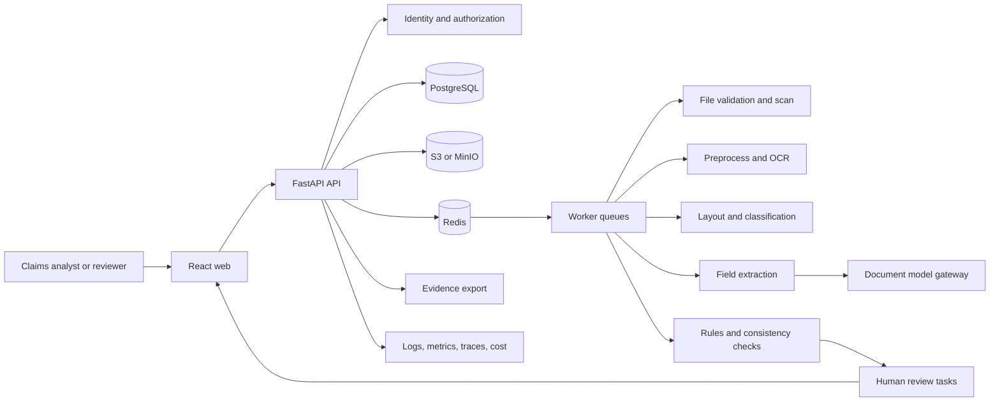

# Document Intelligence Claims Reviewer Technical Implementation Guide

Updated: July 28, 2026

This is the hands-on build guide for the **Document Intelligence Claims Reviewer**. Its normative
requirements are defined in the companion
[Document Intelligence Claims Reviewer Production Implementation Guide](Document-Intelligence-Claims-Reviewer-Production-Implementation-Guide.md).
If the two guides conflict, the production guide wins. Update both guides in the same pull request
when a requirement or architecture decision changes.

This guide turns those requirements into an executable repository, implementation stages,
commands, tests, evaluation gates, operational evidence, and a reviewer-ready proof path. It builds
a controlled claims-intake assistant over public, synthetic, or explicitly authorized claim-like
documents.

Relevant local curriculum sources:

- [Deep research report](deep-research-report.md), which identifies the project as the compressed
  `ClaimVision` portfolio artifact.
- [AI Industry Roadmap and Projects](AI-Industry-Roadmap-and-Projects.md), especially Phase 6.
- [Complete AI Industry Lesson Coverage and Production Plan](AI-Industry-Complete-Lesson-Coverage-Map.md),
  especially Lessons 13, 15-16, 26, 28-29, and 50.
- [AI Industry Curriculum](AI-Industry-Curriculum.md), especially multimodal and document
  intelligence.
- [AI Industry Detailed Lessons](AI-Industry-Detailed-Lessons.md), especially OCR, layout,
  extraction, evidence, human review, evaluation, and production concerns.
- [Enterprise RAG Technical Implementation Guide](Enterprise-RAG-Knowledge-Assistant-Technical-Implementation-Guide.md)
  for the staged build-and-evidence convention.

## How to use this guide

Build one stage at a time. Every stage uses the same contract:

1. Read the objective and prerequisites.
2. Create only the listed files and contracts.
3. Implement the steps in order.
4. Run the commands and tests.
5. Inspect the required telemetry.
6. Commit the evidence and stage record.
7. Move on only when every `Done when` item is true.

The fastest useful vertical slice is:

```text
upload synthetic claim package
-> store immutable artifacts
-> scan and validate files
-> extract pages and OCR blocks
-> classify document types
-> extract one critical field with page/region evidence
-> validate and route low-confidence fields
-> review/correct in UI
-> export an evidence packet
-> run the field-level eval
```

Do not begin by asking a multimodal model to summarize the whole package. Source integrity,
field-level evidence, validation, routing, and human review are the system's foundation.

## 0. Scope, non-goals, and prerequisites

### In scope

- One bounded claim line, such as auto physical damage, property damage, warranty, or expense
  reimbursement.
- Claim packages containing forms, receipts, invoices, estimates, photographs, and selected
  supporting documents.
- Immutable source storage with content hashes and artifact versions.
- File validation, quarantine states, malware scanning adapter, and safe preview generation.
- Image preprocessing, page extraction, OCR, layout regions, tables, checkboxes, stamps,
  signatures, and photo regions where in scope.
- Document classification and required-document inventory.
- Typed field extraction, normalization, validation, evidence packets, and consistency findings.
- Human-review queue, field correction workflow, reason codes, and audit trail.
- Public document benchmark adapter plus synthetic and business-domain golden datasets.
- Privacy, redaction, access control, observability, cost accounting, CI/CD, rollback, restore,
  and pilot evidence.

### Non-goals for the first production-style version

- Automated claim approval, denial, pricing, payout, fraud accusation, or legal/medical decision.
- Training a foundation model.
- Perfect handwriting recognition.
- Every claim line, every jurisdiction, every document type, or every language.
- Open-ended web search.
- Voice ingestion unless a later consent and retention workflow is explicitly added.
- Multi-agent orchestration.
- Kubernetes or specialized GPU serving as the default local build.
- Treating model confidence as calibrated confidence without calibration evidence.

### Local prerequisites

Install:

- Git.
- Python 3.12.
- `uv`.
- Docker with Docker Compose.
- Node.js LTS and npm.
- Tesseract available in the worker image or host environment.
- At least 12 GB available RAM and 20 GB free disk for the full local stack.
- Optional hosted multimodal-model credentials. Mock providers are the default in tests.

Before starting, be able to explain:

- HTTP request and response basics.
- Tables, primary keys, foreign keys, indexes, transactions, and migrations.
- Authentication versus authorization.
- Why source documents and OCR text are untrusted.
- Precision, recall, F1, calibration, latency percentiles, and labelled evaluation cases.
- The difference between extraction, validation, review assistance, and claim adjudication.

### Pre-build discovery gate

Before Stage 1:

1. Select one bounded claim line and document package.
2. Identify intake analysts, claim reviewers, supervisors, compliance/privacy reviewers, data
   annotators, and platform/security operators.
3. Define required documents, required fields, optional fields, review reasons, escalation paths,
   retention, access roles, and downstream handoff.
4. Measure or define a plan to measure baseline intake time, manual correction rate, rework rate,
   review backlog, and cost.
5. Approve public, synthetic, or authorized data sources, licenses, classifications, owners, and
   prohibited data classes.
6. Define in-scope formats, languages, package-size limits, pilot cohort, non-goals, success
   metrics, guardrails, SLOs, cost limits, and stop conditions.
7. Create `docs/product-requirements.md`, `docs/metric-tree.md`,
   `docs/risk-register.md`, `docs/data-policy.md`, and `docs/annotation-guide.md`.
8. Map every `DICR-*` requirement to an acceptance criterion and evidence owner.

Do not select an OCR vendor, hosted model, or open-model checkpoint until the claim-line scope,
data-use rights, and non-decision boundaries are at least `locally verified`.

### Canonical executable stack

| Layer | Canonical choice |
|---|---|
| Language and package tool | Python 3.12 and `uv` |
| API and validation | FastAPI and Pydantic v2 |
| Authentication | OIDC discovery/JWKS with `PyJWT[crypto]`; explicitly gated local adapter |
| ORM and migrations | SQLAlchemy 2 and Alembic |
| Primary database | PostgreSQL 16 |
| Queue and cache | Redis and RQ |
| Source object storage | S3-compatible storage; MinIO locally |
| PDF and image IO | PyMuPDF, Pillow, and OpenCV |
| OCR | Tesseract through `pytesseract`; provider adapter for cloud document services |
| Document model gateway | Provider-neutral `DocumentModelProvider`; deterministic mock plus hosted HTTP adapter |
| Schema validation | Pydantic models and JSON Schema snapshots |
| Web | React, Vite, and TypeScript |
| Tests and quality | pytest, Ruff, mypy, and Playwright |
| Telemetry | OpenTelemetry, Prometheus, Grafana, and structured JSON logs |
| Local runtime | Docker Compose |
| Reference cloud | AWS: ECS Fargate, RDS PostgreSQL, ElastiCache, S3, ALB/ACM, Secrets Manager |

Model names are replaceable configuration, not business logic. Every OCR engine, parser,
classifier, extractor, prompt, schema, validation-rule set, and preview renderer must have an
immutable version recorded on processing runs and predictions.

## 1. Final system and invariants

The runtime has three application services:

- `api`: identity-aware claim package, artifact, field, finding, review, export, metrics, and
  administration endpoints.
- `worker`: file validation, malware scan adapter, preprocessing, OCR, layout, classification,
  extraction, validation, evals, retries, and reprocessing.
- `web`: claim package review UI, source preview, field/evidence viewer, review queue, correction
  workflow, dashboards, and export launcher.

It depends on PostgreSQL, Redis, MinIO, OCR/runtime dependencies, and optional hosted document or
multimodal providers.



Non-negotiable invariants:

- Deny access when identity, tenant, role, queue assignment, claim-line scope, or artifact
  permission is uncertain.
- Store source artifacts immutably before derived processing.
- Never trust OCR text, extracted metadata, or model output without schema validation.
- Every accepted field maps to source artifact version, page, region or text span, producer, and
  schema version.
- Deterministic validation runs before generated summaries.
- Low-confidence, conflicting, missing, unreadable, sensitive, and high-risk cases route to humans.
- Human corrections never erase the original model or rule output.
- Processing jobs are idempotent and observable.
- Public benchmark, synthetic-domain, and release-test datasets are separated.
- Logs, traces, metrics, screenshots, and eval exports exclude unredacted sensitive payloads.

## 2. Starter quality gates

These are portfolio-grade starting gates, not universal business truth. Calibrate them with a
representative labelled set and record any change in an architecture decision and eval changelog.
Security gates marked zero-tolerance cannot be relaxed to make a release pass.

| Area | Starter gate |
|---|---|
| Authorization | 0 unauthorized packages, artifacts, fields, review tasks, exports, or audit rows exposed |
| Source integrity | 1.00 of sampled predictions reconstruct immutable artifact, version, page/region, producer, and schema |
| File safety | 1.00 unsafe file fixtures are quarantined and never processed downstream |
| Classification | Macro F1 >= 0.90; required-document recall >= 0.85 per critical class |
| Critical fields | Accepted critical-field precision >= 0.95 and recall >= 0.95 or routed to review |
| Evidence validity | >= 0.98 accepted fields have valid page/region or text-span evidence |
| Validation | >= 0.90 recall on labelled conflicting-value and missing-document cases |
| Routing | >= 0.95 recall on cases that require human review |
| Sensitive telemetry | 0 unredacted sensitive payloads in sampled logs, traces, metrics, screenshots, or exports |
| Idempotency | 1.00 duplicate/retry/reprocess tests avoid duplicate accepted facts and duplicate review tasks |
| Processing latency | P95 <= 10 minutes for pilot package-size SLO |
| UI review path | A reviewer can accept, correct, reject, escalate, and export from a fresh local run |
| Cost | Cost per package and per page reported with alert thresholds |

Record hardware, page count, document mix, provider, concurrency, and warm/cold status beside every
latency number.

### Release comparison rules

Every candidate release must compare against the current approved release with the same immutable
dataset version and environment class. The release report must include:

- Application commit and image digest.
- Database and event schema versions.
- Claim schema, parser, preprocessing, OCR, layout, classifier, extractor, prompt, model,
  validation-rule, review-policy, redaction-profile, and export-template versions.
- Public benchmark, synthetic-domain, and golden release-set versions and hashes.
- Metric table, slice table, changed failures, open risks, and owner for each risk.
- Critical-field metrics separate from non-critical fields.
- Latency and cost by package size, page count, and document type.
- Security, privacy, file-safety, prompt-injection, authorization, retention, and deletion gate
  results.
- Launch, hold, or rollback decision with approver and rollback target.

Critical gate failures block release. A waived non-critical failure requires named owner,
expiration date, mitigation, and risk acceptance. Do not promote a candidate because its average
score improved while critical fields, sensitive slices, routing, access control, or latency
regressed.

## 3. Build order

1. Repository, reproducible tooling, and local dependencies.
2. API configuration, health, readiness, logging, and correlation IDs.
3. Relational schema and migrations.
4. Identity, tenants, roles, claim-line scopes, review queues, and audit events.
5. Claim package and artifact intake with immutable source storage.
6. File validation, quarantine, preview, and malware scan adapter.
7. Preprocessing, page extraction, OCR blocks, and OCR quality metrics.
8. Layout regions, tables, checkboxes, signatures, stamps, and photo regions.
9. Document classification and required-document inventory.
10. Field schema, extraction provider interface, deterministic mock extractor, and normalization.
11. Field evidence, validation rules, consistency findings, and routing.
12. Human-review queue, source viewer, evidence overlays, corrections, and audit history.
13. Public benchmark, synthetic-domain, golden release set, and calibration.
14. Hosted multimodal or document-model adapter behind the same extraction interface.
15. Generated review summaries grounded only in accepted fields and findings.
16. Security, privacy, injection, file-abuse, redaction, retention, and deletion tests.
17. Observability, feedback, cost, SLOs, alerts, and runbooks.
18. CI/CD, deployment, rollback, restore, and production-like staging.
19. Controlled pilot and feedback-to-eval improvement loop.
20. Final portfolio defense package.

Each stage should be a small pull request whose tests and evidence stand alone.

## 4. Beginner milestones

| Milestone | Working output | Main concept | Requirement proof |
|---|---|---|---|
| M0 | Reproducible repo and test command | Packaging, lint, types, tests | Engineering baseline |
| M1 | Health/readiness API and local dependencies | Services and configuration | Operational baseline |
| M2 | Tenant, user, package, artifact schema | Relational modelling | DICR-SEC-01 |
| M3 | Authorized package and artifact upload | Object storage and trust boundaries | DICR-INTAKE-01 |
| M4 | File validation and quarantine fixtures | File safety | DICR-INTAKE-02 |
| M5 | Page preview and OCR blocks | OCR and provenance | DICR-EVID-01 |
| M6 | Layout regions and evidence overlays | Visual evidence | DICR-EVID-02 |
| M7 | Document classifier and inventory | Document AI baseline | DICR-EXTRACT-02 |
| M8 | One critical field extracted to schema | Typed extraction | DICR-EXTRACT-01 |
| M9 | Validation findings and routing | Deterministic review logic | DICR-VERIFY-01/02 |
| M10 | Reviewer accepts/corrects/rejects field | Human control | DICR-HUMAN-01/02 |
| M11 | Public benchmark and golden eval report | Evaluation | DICR-EVAL-01/02 |
| M12 | Hosted model adapter with regression gate | Model gateway | DICR-REL-02 |
| M13 | Privacy and security suite | Sensitive data controls | DICR-SEC-01/PRIV-01 |
| M14 | Dashboards, traces, costs, DLQ | Operations | DICR-OPS-01 |
| M15 | Deploy, rollback, restore | Release engineering | DICR-REL-01/02 |
| M16 | Pilot report and defense package | Portfolio proof | Final proof |

Complete M0-M11 before adding generated review summaries or a hosted multimodal provider.

## 5. Target repository and artifact manifest

Create this repository:

```text
document-intelligence-claims-reviewer/
  README.md
  pyproject.toml
  uv.lock
  alembic.ini
  .env.example
  .gitignore
  .dockerignore
  docker-compose.yml
  Dockerfile.api
  Dockerfile.worker
  Dockerfile.web
  .github/
    workflows/
      ci.yml
      release.yml
  apps/
    api/
      claims_reviewer_api/
        __init__.py
        main.py
        settings.py
        dependencies.py
        middleware.py
        errors.py
        readiness.py
        auth/
          oidc.py
          local.py
          authorization.py
        routes/
          health.py
          claim_packages.py
          artifacts.py
          fields.py
          findings.py
          review_tasks.py
          exports.py
          metrics.py
          admin.py
        schemas/
          common.py
          claim_packages.py
          artifacts.py
          fields.py
          findings.py
          review_tasks.py
          exports.py
    worker/
      claims_reviewer_worker/
        __init__.py
        main.py
        queues.py
        jobs/
          intake.py
          file_safety.py
          preview.py
          preprocess.py
          ocr.py
          layout.py
          classification.py
          extraction.py
          validation.py
          review.py
          evals.py
          retention.py
    web/
      package.json
      vite.config.ts
      src/
        main.tsx
        app.tsx
        api/
          client.ts
        components/
          SourceViewer.tsx
          EvidenceOverlay.tsx
          FieldTable.tsx
          FindingList.tsx
          ReviewQueue.tsx
          MetricsDashboard.tsx
        routes/
          ClaimPackagePage.tsx
          ReviewTaskPage.tsx
          QueuePage.tsx
          AdminVersionsPage.tsx
  packages/
    db/
      claims_reviewer_db/
        __init__.py
        models.py
        migrations.py
    document_ai/
      claims_reviewer_document_ai/
        __init__.py
        contracts.py
        preprocessing.py
        ocr.py
        layout.py
        classify.py
        extract.py
        normalize.py
        validate.py
        evidence.py
        providers/
          mock.py
          tesseract.py
          hosted_http.py
    evals/
      claims_reviewer_evals/
        __init__.py
        datasets.py
        annotations.py
        metrics.py
        calibration.py
        runner.py
        reports.py
  tests/
    api/
    worker/
    db/
    document_ai/
    evals/
    security/
    deployment/
    fixtures/
      claims/
      unsafe_files/
      ocr/
      golden/
  docs/
    product-requirements.md
    metric-tree.md
    risk-register.md
    data-policy.md
    source-register.md
    annotation-guide.md
    architecture.md
    api-contracts.md
    data-model.md
    threat-model.md
    privacy-checklist.md
    evaluation-plan.md
    cost-report.md
    deployment.md
    rollback.md
    incident-response.md
    progress-log.md
    learning-notes.md
    stages/
    reports/
    adr/
  infra/
    prometheus/
      prometheus.yml
    grafana/
      dashboards/
    staging/
      docker-compose.staging.yml
      env.example
  scripts/
    seed_demo.py
    run_eval.py
    export_evidence.py
    deployment_smoke.ps1
```

The repo tree is intentionally explicit. Remove a file only if its responsibility is clearly owned
elsewhere and the architecture document says where.

## 6. Data model

### Core tables

Implement these tables first:

| Table | Purpose |
|---|---|
| `tenants` | Tenant boundary. |
| `users` | User identity reference. |
| `roles` | Role definitions, such as analyst, reviewer, supervisor, compliance, operator. |
| `user_roles` | Scoped user-role assignment. |
| `claim_packages` | Package-level workflow state. |
| `artifacts` | Immutable source artifact metadata and storage reference. |
| `artifact_pages` | Page previews, dimensions, hashes, language, quality. |
| `processing_runs` | Versioned parser/OCR/layout/classifier/extractor/validator run records. |
| `ocr_blocks` | OCR words, lines, confidence, regions, and producer version. |
| `layout_regions` | Tables, key-value regions, checkboxes, signatures, stamps, photos. |
| `document_classifications` | Document type predictions and review state. |
| `field_predictions` | Extracted field values, confidence, validation, review state. |
| `field_evidence` | Page, region, text-span, and modality evidence for predictions. |
| `validation_findings` | Missing, conflicting, invalid, duplicate, or review-required findings. |
| `review_tasks` | Human-review queue items. |
| `review_decisions` | Accept, correct, reject, escalate, or request-info decisions. |
| `exports` | Scoped evidence packet export records. |
| `audit_events` | Access, decision, admin, release, and export audit trail. |
| `retention_jobs` | Deletion, redaction, legal-hold, and backup-retention work. |
| `cost_events` | OCR, model, storage, queue, export, and infrastructure cost attribution. |
| `outbox_events` | Transactional lifecycle work awaiting idempotent publication. |
| `eval_datasets` | Dataset metadata, split, source, and version. |
| `eval_cases` | Labelled benchmark and release cases. |
| `eval_runs` | Metrics, gates, versions, and reports. |

### Required constraints

- `artifact.sha256` is immutable.
- `artifact.storage_uri` is immutable after source write.
- `processing_runs.version_tuple` is immutable.
- `field_predictions` cannot be updated to hide original model output.
- Reviewer corrections create `review_decisions` and may update current projection state.
- Every accepted field must have at least one `field_evidence` row.
- Review tasks use idempotency keys from claim package, field/finding, reason, and version tuple.
- Audit events are append-only.
- Outbox events are inserted in the same transaction as the lifecycle state they publish.
- Retention jobs never physically delete or redact content without checking legal hold and audit
  policy.
- Cost events store minimized identifiers and safe metadata, not raw source text or images.

### Example version tuple

```json
{
  "app_version": "0.6.0",
  "schema_version": "claim_schema_auto_v1",
  "parser_version": "pymupdf_1.24_profile_a",
  "preprocess_version": "opencv_pipeline_v2",
  "ocr_version": "tesseract_5.3_eng_config_b",
  "layout_version": "layout_rules_v3",
  "classifier_version": "doc_classifier_v2",
  "extractor_version": "mock_then_hosted_v5",
  "prompt_version": "extract_claim_fields_v4",
  "validation_rules_version": "auto_claim_rules_v3",
  "review_policy_version": "human_review_policy_v2",
  "export_template_version": "review_packet_v1"
}
```

### Data invariants

- All tenant-owned tables include `tenant_id`.
- Repository methods require tenant scope explicitly.
- External references are never used as authorization proof.
- User-visible IDs are opaque.
- Source artifacts, processing runs, model predictions, and audit events are immutable from the
  application perspective.
- Current package state is a projection from artifacts, processing runs, predictions, findings,
  review decisions, retention policy, and legal hold.
- Accepted fields require at least one evidence row with source artifact, page, region or text
  span, producer, and version.
- Evidence access is re-authorized at read time.
- Raw source bytes, OCR text, field values, reviewer notes, generated summaries, and feedback
  comments have explicit classification and retention.
- Logs, traces, metrics, screenshots, and eval exports use IDs, hashes, counts, and bounded safe
  attributes by default.
- Historical cost and performance records survive only in aggregated or minimized form permitted
  by policy after content deletion.

### Retention classes

Implement retention policy IDs for:

- Raw source artifacts.
- Page previews and thumbnails.
- OCR blocks and normalized text.
- Layout regions and cropped evidence images.
- Classifications, predictions, findings, and generated summaries.
- Reviewer decisions and reviewer notes.
- Evidence packet exports and download tokens.
- Evaluation fixtures, labels, reports, and sampled errors.
- Logs, metrics, traces, screenshots, and dashboards.
- Audit logs.
- Database and object-store backups.

Deletion must be observable. A deletion report should show source object deletion or redaction,
preview deletion, OCR/layout/prediction access removal, export expiry, cache invalidation, backup
policy, and audit survival. Do not claim deletion if OCR text, previews, image crops, exports, or
backups remain accessible outside the documented policy.

### Outbox and reconciliation

Use an `outbox_events` table or equivalent durable handoff for:

- Artifact accepted for scan.
- Artifact quarantined.
- OCR requested.
- Layout requested.
- Classification requested.
- Extraction requested.
- Validation requested.
- Review task requested.
- Export requested.
- Reprocess requested.
- Delete or redact requested.
- Dataset promotion requested.

Each outbox event includes event ID, idempotency key, tenant, package, artifact or task ID,
operation, expected prior state, producer version, actor or service identity, correlation ID,
causation ID, attempt count, and next-visible retry time.

Add reconciliation jobs that find:

- Source artifacts without downstream processing state.
- Packages stuck in non-terminal processing states.
- Predictions without evidence.
- Findings that should have review tasks.
- Review tasks whose package access changed.
- Expired exports or download tokens.
- Deleted artifacts that still have source previews, OCR text, derived rows, or cache entries.
- Outbox events that exceeded retry or age thresholds.

Reconciliation must be bounded, authorized, idempotent, observable, and safe to replay.

## 7. API contracts

### Package creation

`POST /claim-packages`

Request:

```json
{
  "claim_line": "auto_physical_damage",
  "external_claim_ref": "CLM-2026-0001",
  "source_channel": "portal_upload",
  "metadata": {
    "state_or_region": "synthetic",
    "pilot_case_type": "repair_estimate"
  }
}
```

Response:

```json
{
  "claim_package_id": "cpkg_01",
  "status": "received",
  "required_documents": [
    {"document_type": "claim_form", "status": "missing"},
    {"document_type": "repair_estimate", "status": "missing"}
  ]
}
```

### Artifact upload

`POST /claim-packages/{claim_package_id}/artifacts`

Use multipart upload. The response must include an artifact ID, source hash, status, and next
state. The API must reject unauthenticated, unauthorized, oversized, unsupported, or ambiguous
uploads before workers process derived artifacts.

### Field review

`POST /field-predictions/{field_prediction_id}/review`

Request:

```json
{
  "decision": "correct",
  "corrected_value": "1248.20",
  "reason_code": "ocr_digit_error",
  "note": "The original receipt shows 1248.20; OCR read 1243.20.",
  "evidence_viewed": ["ev_01"]
}
```

Response:

```json
{
  "review_decision_id": "rd_01",
  "field_prediction_id": "fp_01",
  "current_field_state": "corrected",
  "audit_event_id": "audit_01"
}
```

### Evidence export

`POST /claim-packages/{claim_package_id}/export`

Request:

```json
{
  "export_type": "review_packet",
  "redaction_profile": "claims_reviewer",
  "include_audit_appendix": true
}
```

Response:

```json
{
  "export_id": "exp_01",
  "status": "queued",
  "download_available": false
}
```

### Minimum API surface

| Method | Path | Purpose |
|---|---|---|
| `GET` | `/health/live` | Process liveness without external dependency checks. |
| `GET` | `/health/ready` | Capability-aware readiness and dependency state. |
| `POST` | `/claim-packages` | Create package metadata. |
| `GET` | `/claim-packages` | List authorized packages with bounded filters. |
| `GET` | `/claim-packages/{id}` | Read package summary, status, required documents, and current projection. |
| `POST` | `/claim-packages/{id}/artifacts` | Upload an artifact with idempotency. |
| `GET` | `/claim-packages/{id}/artifacts` | List authorized artifacts and processing state. |
| `GET` | `/artifacts/{id}/preview` | Re-authorize and open safe source preview. |
| `GET` | `/artifacts/{id}/ocr` | Read authorized OCR blocks for reviewer/operator views. |
| `GET` | `/artifacts/{id}/layout-regions` | Read authorized layout and evidence-overlay data. |
| `POST` | `/artifacts/{id}:reprocess` | Create approved reprocessing job. |
| `GET` | `/claim-packages/{id}/fields` | Read field predictions, current state, and evidence. |
| `GET` | `/claim-packages/{id}/findings` | Read validation and consistency findings. |
| `GET` | `/review-tasks` | List authorized tasks by queue, assignee, reason, age, and status. |
| `POST` | `/field-predictions/{id}/review` | Accept, correct, reject, or escalate a field. |
| `POST` | `/review-tasks/{id}/decision` | Record task-level decision. |
| `POST` | `/claim-packages/{id}/export` | Generate scoped evidence packet. |
| `GET` | `/exports/{id}` | Read authorized export status and manifest. |
| `POST` | `/exports/{id}:download-token` | Issue short-lived scoped download token. |
| `GET` | `/metrics/product` | Product and adoption metrics for allowed scope. |
| `GET` | `/metrics/quality` | Extraction, validation, routing, and review metrics. |
| `GET` | `/metrics/operations` | Processing, queue, dependency, and SLO metrics. |
| `GET` | `/metrics/cost` | Cost by allowed claim line, package, document type, and version. |
| `POST` | `/admin/releases/{id}:promote` | Operator-only release promotion after gates pass. |
| `POST` | `/admin/releases/{id}:rollback` | Operator-only rollback to known-good version tuple. |

Administrative routes must be separated and more strongly authorized than analyst or reviewer
routes.

### API contract requirements

- Typed request and response models.
- Reproducible OpenAPI generation or checked-in schema snapshots.
- Consistent error envelope with correlation ID.
- Idempotency for package creation, artifact upload, reprocessing, review decisions, export, and
  deletion.
- Pagination and bounded filters for list endpoints.
- Bounded upload size, page count, result count, export size, and processing time.
- Asynchronous job responses for scan, OCR, layout, extraction, validation, export, reprocess, and
  deletion.
- No stack trace, raw provider error, policy detail, source URI, storage URI, or sensitive payload
  in user errors.
- Rate limits and quotas scoped by subject, tenant, claim line, and operation risk.
- Contract, authorization, negative, and redaction tests.

### Capability-aware readiness

`GET /health/live` proves only that the process can answer. `GET /health/ready` must return
time-bounded per-dependency state and a capability map such as `intake`, `preview`, `ocr`,
`layout`, `classification`, `extraction`, `review`, `export`, `evaluation`, `administration`, and
`telemetry`.

Rules:

- Each deployment role declares required capabilities. Return HTTP `200` only when every required
  capability for that role is ready; otherwise return controlled `503` details.
- Optional degraded capabilities may be false while the role remains ready.
- Intake readiness requires database, object storage, identity/authorization configuration, and
  file-safety policy.
- Processing readiness requires database, object storage, Redis, worker queues, OCR configuration,
  and compatible version tuple.
- Review readiness requires source preview, field/finding APIs, authorization, and audit writer.
- Export readiness requires export template, redaction profile, object storage, short-lived token
  issuer, and audit writer.
- Evaluation readiness requires dataset manifests and metric configuration; it does not block
  interactive intake unless the deployment role requires it.

Readiness responses must be safe for operators but must not expose secrets, raw provider errors,
storage URIs, tenant data, or policy internals to ordinary users.

## 8. Stage 1 - Reproducible repository and dependencies

### Objective

Create the repository skeleton, dependency management, linting, typing, unit test command, Docker
baseline, and first documentation files.

### Implement

- `pyproject.toml` with project packages and dev tools.
- `docker-compose.yml` with PostgreSQL, Redis, MinIO, API, worker, and web placeholders.
- API, worker, package, and test package skeletons.
- `docs/product-requirements.md`, `docs/metric-tree.md`, `docs/risk-register.md`,
  `docs/data-policy.md`, and `docs/progress-log.md`.
- `.github/workflows/ci.yml` running lint, type check, tests, and frontend checks.

### Tests and commands

```powershell
uv sync
uv run ruff check .
uv run mypy apps packages tests
uv run pytest
docker compose config
npm --prefix apps/web install
npm --prefix apps/web run build
```

### Done when

- A fresh clone can install dependencies and run all empty quality gates.
- Docker Compose validates.
- Stage record `docs/stages/stage-01-repository.md` names verified and unverified evidence.

## 9. Stage 2 - API foundation and operational baseline

### Objective

Build FastAPI service foundations with configuration, structured errors, health/readiness,
correlation IDs, logs, and basic metrics.

### Implement

- `claims_reviewer_api/settings.py`.
- `main.py`, `readiness.py`, `middleware.py`, `errors.py`.
- `/health/live` and capability-aware `/health/ready`.
- JSON logging with correlation ID.
- Prometheus metrics endpoint.
- Tests for settings, error shape, health, readiness, and correlation propagation.

### Done when

- API starts locally.
- Readiness checks database, Redis, object storage, identity configuration, queues, and declared
  capability requirements.
- Logs include correlation ID without sensitive payloads.

## 10. Stage 3 - Schema, migrations, and seed data

### Objective

Implement the relational schema, migrations, seed data, and lifecycle constraints.

### Implement

- SQLAlchemy models for tenants, users, roles, packages, artifacts, pages, processing runs, OCR
  blocks, layout regions, classifications, predictions, evidence, findings, tasks, decisions,
  exports, audit events, retention jobs, cost events, outbox events, and eval records.
- Alembic migrations.
- Seed script with one tenant, roles, users, and synthetic claim package.
- Model tests for constraints, relationships, immutable records, outbox handoff, retention guards,
  and cost-event minimization.

### Done when

- `uv run alembic upgrade head` works from a fresh database.
- Duplicate source hashes and retry idempotency rules are tested.
- Immutable fields cannot be changed through ORM helpers.
- Outbox events are written transactionally with lifecycle state changes.

## 11. Stage 4 - Identity, authorization, and audit

### Objective

Enforce deny-by-default access before artifact, field, review, export, and audit data are exposed.

### Implement

- OIDC/JWKS adapter and local development adapter.
- Authorization service with tenant, role, claim-line, queue, and compliance scopes.
- Audit event writer.
- Tests for cross-tenant denial, role denial, unassigned review task denial, export denial, and
  admin-only release views.

### Done when

- Unauthorized users cannot see packages, artifacts, fields, review tasks, exports, or audit rows.
- Every mutation endpoint writes an audit event.

## 12. Stage 5 - Claim package and artifact intake

### Objective

Implement package creation, artifact upload, immutable source storage, hash calculation, metadata,
and processing enqueue.

### Implement

- `/claim-packages` and `/claim-packages/{id}/artifacts`.
- MinIO/S3 source object adapter.
- Artifact status transitions.
- Content hash and idempotency key.
- Upload tests with allowed and denied users.

### Done when

- An authorized user can create a package and upload a PDF/image fixture.
- Source artifact is immutable and retrievable only through authorized preview/source endpoints.
- Upload retry does not duplicate artifacts.

## 13. Stage 6 - File safety, quarantine, and preview

### Objective

Prevent unsafe files from entering downstream OCR and extraction.

### Implement

- File type allowlist.
- Size and page-count limits.
- Archive rejection or bounded archive unpacking if explicitly in scope.
- Encrypted file detection.
- Malware scanner adapter with deterministic test double.
- Quarantine reasons and UI-visible artifact status.
- Safe preview renderer for PDFs and images.

### Tests

Include fixtures for:

- Unsupported extension.
- Mismatched MIME and extension.
- Oversized file.
- Encrypted PDF.
- Nested archive.
- Malware-positive test double.
- Empty or corrupt file.

### Done when

- Unsafe files are quarantined with typed reasons.
- Quarantined files never enter OCR, layout, extraction, or model queues.

## 14. Stage 7 - Preprocessing, page extraction, OCR, and quality

### Objective

Extract pages, normalize images, run OCR, store OCR blocks, and compute OCR quality signals.

### Implement

- PDF page extraction.
- Image orientation, deskew, contrast, denoise, resolution, and grayscale controls.
- OCR provider interface and Tesseract implementation.
- OCR block schema for words, lines, confidence, region, page, and producer version.
- OCR quality metrics per page.
- Page preview endpoint and tests.

### Done when

- A PDF fixture produces pages, previews, OCR blocks, and quality scores.
- OCR results reconstruct source page coordinates.
- Low-quality pages create review findings rather than accepted fields.

## 15. Stage 8 - Layout, tables, checkboxes, and visual regions

### Objective

Detect document structure needed for evidence-backed extraction.

### Implement

- Layout-region contract.
- Heuristic baseline for text blocks, tables, key-value regions, checkboxes, signatures, stamps,
  and photo regions.
- Region overlap and coordinate utilities.
- Evidence overlay API for web source viewer.
- Tests for rotated pages, table fixtures, checkbox fixtures, and image-region fixtures.

### Done when

- The web can draw stable overlays on source previews.
- Region coordinates are normalized and independent of preview pixel size.
- Layout failure is measured separately from OCR and extraction failure.

## 16. Stage 9 - Document classification and inventory

### Objective

Classify selected document types and compute required-document status for the claim package.

### Implement

- Document type taxonomy for the selected claim line.
- Baseline classifier using OCR/layout features and deterministic rules.
- Provider interface for optional model classifier.
- Required-document inventory rules.
- Classification confusion matrix and release report.
- Tests for low-confidence and unsupported document routing.

### Done when

- Claim package shows required document status.
- Unsupported or uncertain document types route to review.
- Classification metrics are reported by document type.

## 17. Stage 10 - Field schema, extraction, and normalization

### Objective

Extract typed fields with evidence while preserving original outputs and schema validation.

### Implement

- Claim-line field schema with required, optional, repeated, and nullable fields.
- `DocumentModelProvider` interface.
- Deterministic mock extractor for tests.
- Rule-based baseline for selected fields.
- Hosted HTTP adapter placeholder with schema validation, retries, timeout, and cost tracking.
- Normalizers for dates, money, identifiers, phone/email where in scope.
- JSON Schema snapshots.

### Done when

- At least one critical field and one non-critical field are extracted with evidence.
- Invalid provider JSON is rejected and routed to review.
- Raw and normalized values are both stored.

## 18. Stage 11 - Validation, consistency findings, and routing

### Objective

Turn extracted fields into deterministic findings and human-review tasks.

### Implement

- Rule engine for required fields, type checks, date order, money totals, duplicate documents,
  policy/claim number consistency, required photo evidence, and OCR quality.
- Finding severity taxonomy.
- Human-review routing policy.
- Idempotent review task creation.
- Tests for missing fields, conflicting fields, invalid normalization, duplicates, and retries.

### Done when

- Findings show source evidence and typed severity.
- Low-confidence or conflicting critical fields cannot become accepted without reviewer decision.
- Re-running verification does not create duplicate tasks.

## 19. Stage 12 - Web UI and human-review workflow

### Objective

Build a usable review surface for package triage, source inspection, field correction, findings,
and export initiation.

### Implement

- Claim package page.
- Source viewer with zoom, page selector, region overlays, and field highlighting.
- Field table grouped by claim section.
- Finding list with severity and related evidence.
- Review queue with filters for reason, age, claim line, document type, and assignee.
- Review task page with accept/correct/reject/escalate/request-info controls.
- Audit history.
- Accessibility and responsive layout checks.

### Tests

- API contract tests for review endpoints.
- Playwright tests for upload, package view, source overlay, field correction, task decision, and
  export request.

### Done when

- A fresh local seed package can be reviewed end to end from the UI.
- Corrections create review decisions and preserve original predictions.

## 20. Stage 13 - Evaluation harness and calibration

### Objective

Build repeatable evaluation for public benchmarks, synthetic business-domain examples, golden
release cases, and human-routing thresholds.

### Implement

- Dataset registry and split policy.
- Public benchmark adapter for form/document understanding datasets.
- Synthetic claim fixture generator or curated synthetic package set.
- Golden release set loader.
- Annotation validation and leakage checks.
- Metrics for classification, OCR quality where labelled, layout, table cells, field extraction,
  evidence validity, findings, routing, reviewer agreement, latency, and cost.
- Calibration report for field thresholds and routing decisions.
- Release report template.

### Commands

```powershell
uv run python scripts/run_eval.py --dataset public --report docs/reports/public-benchmark.md
uv run python scripts/run_eval.py --dataset golden --report docs/reports/golden-release.md
uv run pytest tests/evals
```

### Done when

- Public and golden reports are generated from versioned datasets.
- Release gates block promotion when zero-tolerance checks fail.
- Metrics are reported by document type, field criticality, and scan-quality slice.

## 21. Stage 14 - Hosted multimodal adapter

### Objective

Add a hosted document or multimodal model behind the same extraction interface without changing
business logic.

### Implement

- Provider-neutral request and response contracts.
- Prompt or instruction templates with immutable versions.
- Timeout, retry, response-size, spend, and token/page controls.
- JSON schema validation.
- Prompt-injection and malicious document-content tests.
- Model output comparison against deterministic baseline.
- Provider cost and latency tracing.

### Done when

- The hosted adapter can be disabled without breaking intake, OCR, validation, or human review.
- Eval report compares baseline and hosted extraction on the same dataset.
- Hosted provider regressions block release promotion.

## 22. Stage 15 - Generated review summaries

### Objective

Generate concise, evidence-backed review summaries only after structured extraction and validation
are reliable.

### Implement

- Summary input contract containing accepted fields, findings, reviewer decisions, and evidence IDs.
- Summary generation provider with deterministic mock.
- Output schema with `summary`, `open_items`, `unsupported_items`, and `evidence_ids`.
- Guardrails that disable summaries for insufficient evidence, unsafe documents, authorization
  uncertainty, or failed validation.
- Tests that summaries do not introduce claim approval, denial, pricing, payout, fraud, medical,
  legal, or coverage conclusions.

### Done when

- Summaries are optional, grounded, and clearly labelled.
- A reviewer can complete the workflow without summaries enabled.

## 23. Stage 16 - Security, privacy, retention, and deletion

### Objective

Harden the system against file abuse, data leakage, prompt injection, unauthorized access, and
retention failures.

### Implement

- Threat model.
- Privacy checklist.
- PII/sensitive-data redaction utilities for logs, traces, screenshots, reports, and exports.
- Prompt-injection fixtures embedded in OCR text, receipt lines, QR-like text, and image captions.
- Cross-tenant and role-permission tests.
- Retention classes, legal hold, deletion job, and reprocessing after deletion.
- Export redaction profiles.
- Dependency scanning in CI.

### Done when

- Security test suite runs in CI.
- Sensitive telemetry sampling shows zero unredacted sensitive payloads.
- Deletion removes source and derived access according to retention policy.

## 24. Stage 17 - Observability, cost, SLOs, and operations

### Objective

Make package processing, quality, review workload, failures, and cost visible enough to operate.

### Implement

- OpenTelemetry traces for intake, scan, preprocessing, OCR, layout, classification, extraction,
  validation, review, export, and eval.
- Prometheus metrics for queues, latencies, quality gates, review decisions, failures, and cost.
- Grafana dashboards.
- Alerts for stuck queues, DLQ growth, provider failure, quality regression, privacy event, and
  cost threshold.
- Runbooks for common incidents.
- Cost report by package, page, document type, provider, and version tuple.

### Done when

- One seeded package can be traced end to end by correlation ID.
- Dashboards show live local processing and review metrics.
- Runbooks name exact commands and rollback options.

## 25. Stage 18 - CI/CD, deployment, rollback, restore, and DR

### Objective

Package the system for reproducible delivery and production-like operation.

### Implement

- GitHub Actions CI with backend tests, frontend tests, security tests, eval smoke, and Docker
  build.
- Production-like Docker Compose for staging.
- Environment variable and secret documentation.
- Database backup and restore scripts.
- Object-store backup and restore procedure.
- Rollback procedure for app, schema, OCR config, extractor, prompt, rule set, and export template.
- Deployment smoke script.

### Done when

- A clean staging environment can be deployed from the documented commands.
- Rollback and restore are demonstrated and recorded.
- Failed release gates block deployment.

## 26. Stage 19 - Controlled pilot and improvement loop

### Objective

Run a bounded pilot against the manual baseline and promote reviewed feedback safely.

### Implement

- Pilot cohort and package set.
- Manual baseline report.
- Assisted workflow report.
- Reviewer training guide.
- Feedback capture and annotation quality review.
- Dataset promotion workflow.
- Before/after eval comparison for one approved improvement.
- Post-pilot limitations and next-step report.

### Done when

- Pilot report compares manual and assisted outcomes.
- At least one reviewer correction is promoted into a new dataset version through review.
- A regression suite approves or rejects one versioned improvement.

## 27. Documentation governance and stage records

The production guide is the requirements authority. This technical guide is the build authority.
Living repository contracts are the implementation authority. Generated reports describe a
specific run; stage snapshots describe what was proved at a point in time. Never quietly use a
stale stage note to override a current contract.

Document classes:

| Class | Examples | Change rule |
|---|---|---|
| Living authoritative contract | Architecture, API, data, access control, extraction, validation, review, export. | Update with implementation in the same PR. |
| Architecture decision record | OCR/model/provider/schema/access/retention/release choices. | Append a superseding decision; keep history. |
| Immutable stage snapshot | `docs/stages/stage-*.md`. | Correct factual errors visibly; do not rewrite history. |
| Generated report | Eval, calibration, cost, privacy, benchmark, load/failure. | Regenerate with run/config/data lineage. |
| Operational runbook | Incident, rollback, reprocess, backup/restore, provider outage. | Review and exercise on schedule. |
| Learning/progress record | `learning-notes.md`, `progress-log.md`. | Append verified work, failures, and open questions. |

Every stage must create or update:

- `docs/progress-log.md`.
- `docs/learning-notes.md`.
- `docs/stages/stage-NN-name.md`.
- Relevant ADRs in `docs/adr/`.
- Relevant reports in `docs/reports/`.

Use this evidence vocabulary consistently:

- `planned`: specified, no implementation claim.
- `implemented`: code or configuration exists, verification not yet recorded.
- `locally verified`: reproducible verification passed in the reference local environment.
- `externally verified`: passed in staging or an independent environment.
- `operationally proven`: exercised successfully during a controlled pilot or real operation.

Do not write "production ready" as an evidence level. State exactly what was verified and where.

Every stage snapshot uses these stable headings:

1. Status and evidence level.
2. Goal.
3. Guide and requirement mapping.
4. Runtime flow.
5. Files changed.
6. Contracts and data.
7. Failure behavior.
8. Tests.
9. Verification commands.
10. Verified evidence.
11. Not verified.
12. Learning questions.
13. Next stage.

Canonical stage IDs never drift from guide sections:

| Stage ID | Guide section | Stage record |
|---:|---:|---|
| 01 | 8 | `stage-01-repository-platform.md` |
| 02 | 9 | `stage-02-api-foundation.md` |
| 03 | 10 | `stage-03-schema-migrations.md` |
| 04 | 11 | `stage-04-identity-authorization-audit.md` |
| 05 | 12 | `stage-05-package-artifact-intake.md` |
| 06 | 13 | `stage-06-file-safety-preview.md` |
| 07 | 14 | `stage-07-preprocessing-ocr.md` |
| 08 | 15 | `stage-08-layout-visual-regions.md` |
| 09 | 16 | `stage-09-document-classification.md` |
| 10 | 17 | `stage-10-field-extraction-normalization.md` |
| 11 | 18 | `stage-11-validation-routing.md` |
| 12 | 19 | `stage-12-web-human-review.md` |
| 13 | 20 | `stage-13-evaluation-calibration.md` |
| 14 | 21 | `stage-14-hosted-multimodal-adapter.md` |
| 15 | 22 | `stage-15-generated-review-summaries.md` |
| 16 | 23 | `stage-16-security-privacy-retention.md` |
| 17 | 24 | `stage-17-observability-cost-operations.md` |
| 18 | 25 | `stage-18-ci-cd-deployment-dr.md` |
| 19 | 26 | `stage-19-controlled-pilot-improvement.md` |

Do not create combined stage records. A pull request may implement two stages, but each retains its
own contract, evidence level, unverified list, and progress entry.

Stage records may use this Markdown starter, but the stable headings above are authoritative:

```markdown
# Stage NN - Name

Status: locally verified
Date: YYYY-MM-DD
Environment: local Docker Compose

## Objective

## Implemented

## Verified

## Not Verified

## Commands

## Evidence

## Risks and Follow-ups
```

Avoid saying "done" unless the stage record shows how it was verified.

## 28. Minimal and full build paths

### Smallest complete portfolio build

The smallest defensible build includes:

1. Reproducible repo, API, worker, web, database, queues, and source storage.
2. One claim line and two to four document types.
3. File safety, immutable source storage, preview, OCR, and layout.
4. Document classification.
5. Five to ten fields, including at least three critical fields.
6. Field evidence, validation rules, findings, and human-review routing.
7. Review UI with source overlays and correction workflow.
8. Public benchmark adapter and golden release set.
9. Privacy/security suite and sensitive logging tests.
10. Traces, dashboards, cost report, rollback, restore, and final defense package.

### Full production-style path

The full path adds:

- More document types and package variants.
- Better layout/table extraction.
- Hosted multimodal provider comparison.
- Generated review summaries.
- Stronger calibration.
- More reviewer roles and escalation queues.
- Retention/legal-hold workflows.
- Staging deployment and pilot report.
- One feedback-to-dataset-to-release improvement loop.

Do not add breadth before field-level evidence, evaluation, human review, and privacy controls are
solid.

## 29. Requirement traceability matrix

### Production requirement crosswalk

| Requirement | Primary stage | Evidence |
|---|---|---|
| DICR-INTAKE-01 | Stages 5-6 | Immutable source storage tests and source hash reconstruction |
| DICR-INTAKE-02 | Stage 6 | Unsafe fixture quarantine tests |
| DICR-EVID-01 | Stages 7-11 | Field-to-source reconstruction tests |
| DICR-EVID-02 | Stages 8 and 12 | Web evidence overlay tests |
| DICR-EXTRACT-01 | Stage 10 | Schema snapshots and extraction contract tests |
| DICR-EXTRACT-02 | Stages 7-13 | OCR/layout/classification/extraction metrics by layer |
| DICR-VERIFY-01 | Stage 11 | Deterministic rule tests |
| DICR-VERIFY-02 | Stage 11 | Routing-policy tests |
| DICR-HUMAN-01 | Stage 12 | Review decision API and Playwright tests |
| DICR-HUMAN-02 | Stage 12 | Original prediction immutability tests |
| DICR-EVAL-01 | Stage 13 | Public and golden eval reports |
| DICR-EVAL-02 | Stage 13 | Slice report and release gates |
| DICR-SEC-01 | Stages 4 and 16 | Authorization and red-team tests |
| DICR-PRIV-01 | Stage 16 | Redaction, retention, deletion, sensitive telemetry tests |
| DICR-OPS-01 | Stage 17 | Dashboard screenshots, traces, and cost report |
| DICR-REL-01 | Stages 11 and 18 | Idempotency, DLQ, rollback, restore tests |
| DICR-REL-02 | Stages 10, 14, 18 | Version tuple and release/rollback report |

### Production-phase crosswalk

This prevents the production plan and technical stage numbering from drifting:

| Production phase | Technical realization |
|---:|---|
| 0 - Discovery, claim line, controls | Pre-build discovery gate; Sections 27 and 29 |
| 1 - Repository, contracts, platform | Sections 8-9 and 27 |
| 2 - Identity, authorization, audit | Sections 10-11 and access tests |
| 3 - Claim package intake and source storage | Sections 12-13 |
| 4 - Preprocessing, OCR, layout, provenance | Sections 14-15 |
| 5 - Document classification | Section 16 |
| 6 - Field schema, extraction, normalization | Sections 17 and 21 |
| 7 - Verification and findings | Section 18 |
| 8 - Human-review workflow | Section 19 |
| 9 - Evaluation and calibration | Section 20 |
| 10 - Generated review summaries | Section 22 |
| 11 - Privacy, security, red-team hardening | Section 23 |
| 12 - Observability, cost, operations | Section 24 |
| 13 - Reliability and failure injection | Sections 24-25 |
| 14 - Staging deployment and pilot | Sections 25-26 |
| 15 - Portfolio defense | Sections 28, 33, and 35 |

### Requirement-to-evidence manifest

For every release candidate, produce a machine-readable traceability manifest such as:

```json
{
  "requirement_id": "DICR-EVID-01",
  "implementation_version": "git-sha",
  "version_tuple": {
    "schema_version": "claim_schema_auto_v1",
    "ocr_version": "tesseract_5.3_eng_config_b",
    "extractor_version": "extractor_prompt_v4",
    "validation_rules_version": "auto_claim_rules_v3"
  },
  "tests": [
    "test_field_reconstructs_source_region",
    "test_deleted_artifact_evidence_denied"
  ],
  "eval_run_id": "eval_2026_07_28_golden",
  "evidence_paths": [
    "docs/reports/field-extraction-report.md",
    "docs/reports/golden-release-report.md"
  ],
  "status": "locally verified"
}
```

A requirement is incomplete when code exists but its negative tests, evaluation slice, or evidence
record is missing.

### Curriculum crosswalk

| Curriculum area | Project proof |
|---|---|
| Lesson 13 document ingestion | Immutable artifacts, page extraction, OCR blocks, source lineage |
| Lesson 15 evaluation | Public benchmark, golden release set, calibration, release gates |
| Lesson 16 data engineering | Dataset registry, annotation workflow, feedback-to-dataset loop |
| Lesson 26 multimodal and document AI | OCR, layout, forms, photos, evidence regions, human routing |
| Lesson 28 security and privacy | File abuse, prompt injection, PII controls, authorization, retention |
| Lesson 29 governance | Risk register, system card, dataset card, oversight plan, release report |
| Lesson 50 specialization | Multimodal workflow, document/image evidence, reviewer UX, benchmark pack |

## 30. Test strategy

### Unit tests

- Normalizers.
- Coordinate transforms.
- Schema validation.
- Validation rules.
- Authorization decisions.
- Idempotency key generation.
- Redaction utilities.

### Integration tests

- Upload to object storage.
- File quarantine.
- OCR job pipeline.
- Layout and evidence persistence.
- Extraction provider contract.
- Review task creation.
- Export generation.
- Deletion and retention.

### Contract tests

- API request/response schemas.
- Provider request/response schemas.
- Version tuple shape.
- Export packet schema.
- Eval report schema.

### Security tests

- Cross-tenant access denial.
- Role and queue denial.
- Unauthorized export denial.
- Prompt injection through OCR text.
- Oversized/malformed provider output.
- Sensitive payload redaction.
- Unsafe file quarantine.
- Deleted artifact denial.

### Evaluation tests

- Public benchmark smoke.
- Golden release metrics.
- Calibration report generation.
- Dataset split leakage check.
- Regression gate pass/fail.

## 31. Data and annotation plan

### Dataset folders

Use:

```text
data/
  README.md
  public/
    manifest.json
  synthetic/
    manifest.json
  golden/
    manifest.json
  annotations/
    schema.json
```

Do not commit sensitive real claim documents. Use synthetic fixtures in Git. Store larger or
licensed datasets outside Git with manifests, checksums, licenses, and retrieval instructions.

### Annotation schema

Each labelled field should include:

- Claim package ID.
- Artifact ID.
- Page.
- Field name.
- Raw label.
- Normalized label.
- Region coordinates when available.
- Label source.
- Annotator ID or role.
- Review status.
- Disagreement notes.

### Annotation quality

Require:

- Double annotation for golden critical fields where feasible.
- Adjudication for disagreements.
- Label changelog.
- Split policy.
- Leakage check.
- Privacy review before dataset promotion.

### Minimum dataset sizes for portfolio proof

Use these as starter engineering counts, not statistical sufficiency claims:

| Slice | Minimum count |
|---|---:|
| Labelled business-domain packages or package fragments | 50 |
| Labelled critical-field instances | 100 |
| Labelled non-critical field instances | 50 |
| Missing-document or missing-field cases | 25 |
| Conflicting-value or duplicate-evidence cases | 25 |
| Low-quality scan/image cases | 20 |
| Unsupported or unsafe-file cases | 20 |
| Access-control cases across at least two tenants or claim scopes | 20 |
| Prompt-injection or malicious-document cases | 20 |

Record which examples are public, synthetic, generated, manually labelled, reviewer-corrected, or
excluded from release testing. Never put the same case in prompt examples, calibration, and release
tests.

## 32. Operational runbooks

Create runbooks for:

- Stuck intake queue.
- OCR provider outage.
- Hosted model provider outage.
- Bad extractor release.
- Classification regression.
- Human-review backlog spike.
- Unauthorized access alert.
- Sensitive telemetry finding.
- Object-store outage.
- Database restore.
- Reprocess affected packages.
- Disable generated summaries.
- Raise review thresholds.
- Roll back version tuple.

Each runbook must name symptoms, dashboards, commands, decision owner, rollback option, customer or
reviewer communication, and evidence to preserve.

## 33. Final reviewer proof

A reviewer should be able to run commands like these from the README:

```powershell
git clone $env:CLAIMS_REVIEWER_REPOSITORY_URL
cd document-intelligence-claims-reviewer
copy .env.example .env
uv sync
npm --prefix apps/web install
docker compose up --build -d
uv run alembic upgrade head
uv run python scripts/seed_demo.py
uv run pytest
uv run python scripts/run_eval.py --dataset public --report docs/reports/public-benchmark-report.md
uv run python scripts/run_eval.py --dataset golden --report docs/reports/golden-release-report.md
powershell -File scripts/deployment_smoke.ps1
uv run python scripts/export_evidence.py --package cpkg_demo --output docs/reports/demo-evidence-packet.json
```

Then, using two synthetic tenants or claim scopes and at least three identities, the reviewer
should:

1. Open API docs and the web UI.
2. Upload a synthetic claim form, receipt, estimate, and low-quality image.
3. Inspect immutable source artifact, hash, preview, OCR blocks, layout regions, and processing
   version tuple.
4. Confirm unsafe fixtures are quarantined and never enter OCR or extraction queues.
5. Inspect document classification and required-document inventory.
6. Inspect extracted fields and resolve each accepted critical field to source page and region.
7. Trigger missing-field, conflicting-value, duplicate-evidence, and low-OCR-quality findings.
8. Prove low-confidence and high-risk cases create human-review tasks.
9. Correct one field as a human reviewer and confirm the original prediction remains immutable.
10. Prove an unauthorized identity cannot access restricted artifact, OCR text, field, review task,
    export, or audit data.
11. Reclassify or revoke access and confirm previews, fields, exports, and caches respect the
    change.
12. Export a scoped review packet and verify redaction profile, evidence IDs, audit appendix, and
    short-lived download behavior.
13. Run public benchmark, golden release, security, and privacy suites.
14. Follow one package through traces and find version tuple, latency, queue timings, and cost.
15. Disable hosted extraction and prove OCR/rule baseline plus human review still works.
16. Exercise rollback, restore, and reprocessing for an affected package.
17. Inspect eval reports, threat model, system/dataset/model/OCR cards, dashboards, stage records,
    and open `not verified` claims.

The proof is not a video alone. It must include commands, test results, reports, dashboards,
architecture notes, limitations, and the exact date/environment of verification.

## 34. First practical assignment

Start with a tiny vertical slice:

1. Create `claim_schema_auto_v1` with `claim_number`, `policy_number`, `date_of_loss`,
   `invoice_total`, and `vendor_name`.
2. Create two synthetic PDF fixtures: one claim form and one receipt.
3. Upload both through the API.
4. Store source artifacts in MinIO and metadata in PostgreSQL.
5. OCR both documents.
6. Extract `invoice_total` with region evidence.
7. Validate money format and route low confidence to review.
8. Correct the value in the UI.
9. Export a review packet.
10. Add one golden eval case and report exact match, normalized match, evidence validity, and
    review-routing result.

This assignment proves the architecture better than a broad demo that extracts many fields without
evidence or review.

## 35. Final definition of done and interview defense

The technical implementation is done when:

- A fresh clone can run the local stack and tests.
- The database schema, API contracts, provider contracts, and eval reports are documented.
- A representative claim package processes end to end.
- Every accepted field has source evidence.
- Human review can correct and audit predictions.
- Public and golden evaluation reports exist.
- Security, privacy, retention, and sensitive telemetry tests pass.
- Dashboards and traces reconstruct a package by correlation ID.
- Rollback and restore are demonstrated.
- The final defense can explain what the system does not decide, why human review exists, where
  the model can fail, how quality is measured, and what remains unverified.
