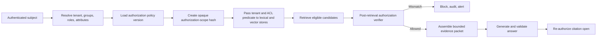
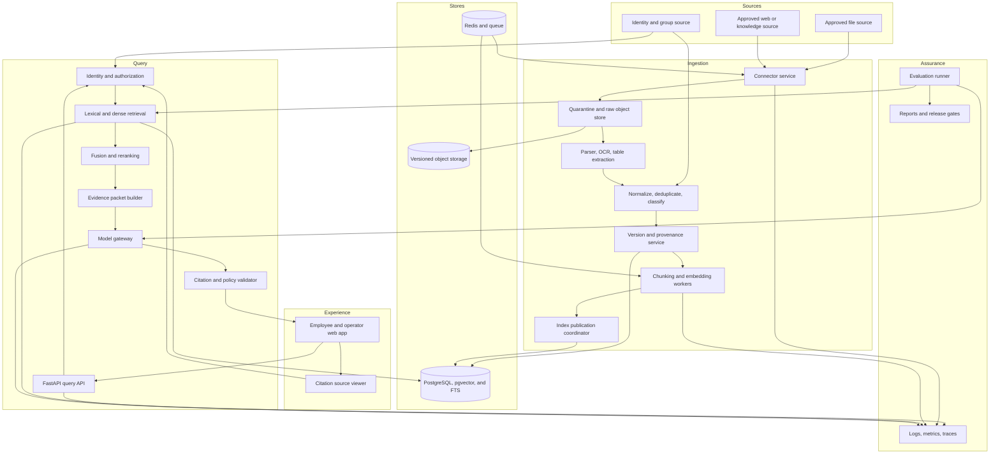
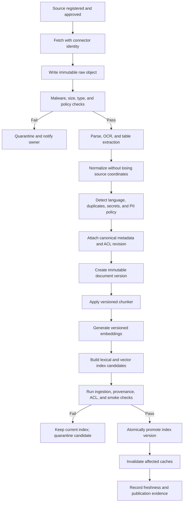
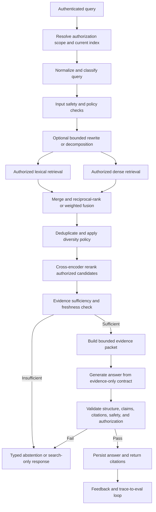

# Enterprise RAG Knowledge Assistant Production Implementation Guide

Updated: July 23, 2026

This file defines the second integrated portfolio project:

> Build a production-grade enterprise knowledge assistant that ingests approved policies, product
> manuals, contracts, and procedures; enforces document permissions before retrieval; combines
> lexical and semantic search; reranks evidence; answers with verifiable citations; abstains when
> evidence is insufficient; and proves quality, safety, freshness, reliability, and cost through
> evaluation and operational evidence.

This is not a "chat with your PDFs" demo. It is a permission-first retrieval product with a
governed content lifecycle, measurable retrieval quality, independently testable answer quality,
safe failure behavior, and production operations.

Companion: the
[Enterprise RAG Knowledge Assistant Technical Implementation Guide](Enterprise-RAG-Knowledge-Assistant-Technical-Implementation-Guide.md)
turns these requirements into an executable repository and staged build. This production guide is
the normative source when the two guides conflict; material changes should update both files in the
same pull request.

## Source alignment

This guide operationalizes the local curriculum and research rather than replacing them:

- The project is the second integrated portfolio project in the
  [research project mapping](./deep-research-report.md#project-mapping), immediately after the
  SupportOps AI Copilot, and is labelled `P2` in the
  [project-to-topic relationship](./deep-research-report.md#project-to-topic-relationship).
- Product scope and production requirements come from the
  [Enterprise RAG project](./AI-Industry-Curriculum.md#enterprise-rag-project).
- Retrieval, ingestion, chunking, production RAG, and evaluation expectations come from
  [Retrieval, embeddings, and RAG](./AI-Industry-Curriculum.md#retrieval-embeddings-and-rag) and
  [Evaluation and feedback engineering](./AI-Industry-Curriculum.md#evaluation-and-feedback-engineering).
- Completion evidence aligns to
  [Lesson 12 — Embeddings and Semantic Retrieval](./AI-Industry-Complete-Lesson-Coverage-Map.md#lesson-12--embeddings-and-semantic-retrieval),
  [Lesson 13 — Document Ingestion and Chunking](./AI-Industry-Complete-Lesson-Coverage-Map.md#lesson-13--document-ingestion-and-chunking),
  [Lesson 14 — Production RAG](./AI-Industry-Complete-Lesson-Coverage-Map.md#lesson-14--production-rag),
  and [Lesson 15 — AI Evaluation Engineering](./AI-Industry-Complete-Lesson-Coverage-Map.md#lesson-15--ai-evaluation-engineering).
- Security, reliability, observability, and portfolio defense align to
  [Lesson 28 — AI Security and Privacy](./AI-Industry-Complete-Lesson-Coverage-Map.md#lesson-28--ai-security-and-privacy),
  [Lesson 30 — Production Architecture and Reliability](./AI-Industry-Complete-Lesson-Coverage-Map.md#lesson-30--production-architecture-and-reliability),
  [Lesson 31 — Observability, Feedback, and Cost](./AI-Industry-Complete-Lesson-Coverage-Map.md#lesson-31--observability-feedback-and-cost),
  and [Lesson 40 — Enterprise Applied AI Capstone Implementation](./AI-Industry-Complete-Lesson-Coverage-Map.md#lesson-40--enterprise-applied-ai-capstone-implementation).

When this guide is more specific than a source document, the specificity is an implementation
decision for this project. Record material decisions as architecture decision records.

## Evidence and verification vocabulary

Every stage document, report, checklist, and README status must use one of these terms:

| Status | Meaning |
|---|---|
| `planned` | Scope and acceptance criteria exist; implementation has not been claimed. |
| `implemented` | Code or configuration exists; no verification claim is implied. |
| `locally verified` | Reproducible checks passed in a named local environment. |
| `externally verified` | Checks passed in CI, staging, or another independently identified environment. |
| `operationally proven` | The capability met its SLO or acceptance gate during a controlled pilot or production-like exercise. |

Use `Verified` and `Not Verified` sections in stage records. A statement such as "deployment is
ready" is invalid unless it names the environment, command or procedure, result, evidence location,
and date. Never use `complete`, `production-ready`, or `operationally proven` as a substitute for
evidence.

## 1. Production outcome

The finished system should let an authorized employee ask a work question and receive:

- A concise answer based only on evidence the employee may access.
- Verifiable citations that open the exact document version, section, page, table, or text span.
- A clear statement when evidence is incomplete, conflicting, stale, or unavailable.
- Search results when answer generation is disabled or unsafe.
- A visible freshness indicator for the supporting content.
- A way to mark an answer helpful, unsupported, incomplete, outdated, or access-related.
- A request or escalation path to the responsible knowledge owner.
- No indication that inaccessible documents exist.

The system should let a knowledge owner:

- Register an approved content source.
- Ingest, reprocess, supersede, or delete content.
- See parsing, chunking, indexing, and permission-sync status.
- Preview what an allowed test identity can retrieve.
- Review stale, conflicting, low-quality, or frequently rejected content.
- Prove that updates, revocations, and deletions reached every derived store.

The system should let an operator:

- Trace one answer across authentication, authorization, retrieval, reranking, generation,
  citation verification, feedback, latency, and cost.
- Compare lexical, dense, hybrid, and reranked retrieval.
- Inspect ingestion lag, index health, zero-result queries, abstentions, citation failures, and
  authorization denials.
- Release or roll back application, parser, chunker, embedding, index, reranker, prompt, and model
  versions independently where safe.

The project is complete only when it has working software, reproducible tests, fixed evaluation
sets, zero-tolerance permission gates, security controls, observable SLOs, deployment and recovery
evidence, a controlled pilot readout, and an honest record of what remains unverified.

## 2. Business problem, users, scope, and non-goals

### Business problem

Employees cannot reliably locate current answers across policies, product manuals, contracts, and
internal procedures. Keyword search misses relevant wording, document repositories expose too much
noise, and generic language models can invent plausible answers. The business needs faster,
consistent knowledge access without weakening authorization, provenance, or human accountability.

### Primary users

| Persona | Need | Risk if the system fails |
|---|---|---|
| Employee or support reader | Find a trustworthy answer quickly. | Acts on an incorrect, stale, or unauthorized answer. |
| Knowledge owner | Publish and maintain approved content. | Old or malformed content remains discoverable. |
| Compliance reviewer | Verify access, provenance, retention, and answer evidence. | Cannot prove why an answer was shown. |
| Search or knowledge administrator | Tune retrieval and manage sources. | Relevance changes silently or permissions drift. |
| Platform or security operator | Run, monitor, recover, and investigate the service. | Outage, leakage, runaway cost, or incomplete incident evidence. |

### Initial domain

Use an approved public, synthetic, or explicitly authorized enterprise corpus containing a realistic
mix of:

- Policies.
- Product or equipment manuals.
- Standard operating procedures.
- Contract templates and approved clauses.
- FAQs and knowledge-base articles.
- Versioned notices or change bulletins.

The first pilot should select one bounded domain and one authoritative owner. Do not begin with all
company content.

Version 1 is explicitly English-only. Record detected language on every parsed block and query.
Content confidently detected as non-English must remain quarantined or excluded from the current
English index with an owner-visible reason; it must not be silently indexed. A confidently
non-English query must not be translated, retrieved, or sent to generation. Return a typed
`unsupported_language` abstention with a user-safe message that version 1 supports English, without
revealing source existence. Low-confidence or acronym-only detection follows a documented,
tested ambiguity policy rather than guessing.

Adding another language requires a versioned lexical analyzer, compatible embedding and reranking
evidence, localized UX, and separate retrieval, answer, abstention, permission, and safety slices.
It is a new evaluated capability, not an implication of an English result.

### Required scope

- Multi-format, versioned ingestion.
- Text extraction plus OCR and table-aware handling for selected formats.
- Provenance-preserving chunking.
- Lexical, dense, hybrid, and reranked retrieval baselines.
- Role-, group-, tenant-, and document-aware authorization.
- Evidence packets, grounded answers, citations, and abstention.
- Incremental update, permission revocation, and delete propagation.
- Separate ingestion, retrieval, generation, citation, safety, and product evaluation.
- Feedback, observability, cost attribution, deployment, rollback, and recovery.

### Explicit non-goals for the first release

- Open-ended web search.
- Autonomous write actions in enterprise systems.
- Answers based on model memory when approved evidence is absent.
- General legal, medical, financial, or employment advice.
- Training a foundation model.
- Graph RAG without evidence that a simpler evaluated design is insufficient.
- Multi-agent orchestration.
- MCP exposure in the smallest first release. A later read-only MCP adapter is optional and must
  reuse the proven API authorization and evidence contracts; write tools remain out of scope.
- Personal memory across users.
- Automatic permission inference from document text.
- Multilingual quality claims based only on English evaluation.
- Autocomplete or typeahead suggestions. They are optional and remain disabled unless the
  permission-safe endpoint, scoped cache, revocation behavior, and zero-leak test gate defined in
  this guide are implemented.
- Treating a model-generated confidence number as calibrated confidence.

Non-goals may become later experiments, but they do not weaken the production requirements in this
guide.

## 3. Business outcomes and metric tree

Measure the current workflow before adding generated answers.

Required baseline:

- Median and P95 time to find an approved answer.
- Search success rate.
- Query reformulation rate.
- Zero-result rate.
- Escalation-to-owner rate.
- Incorrect or outdated knowledge incidents.
- Citation or source-opening rate where an existing search product supports it.
- Cost per successful knowledge task.

Primary outcome metrics:

| Outcome | Example measure |
|---|---|
| Faster work | Median and P95 time to a verified answer. |
| Better task completion | Percentage of sampled tasks completed without unnecessary escalation. |
| Better knowledge discovery | Search or answer success on a labelled business query set. |
| User trust | Helpful rate accompanied by citation-use and error-reporting behavior. |
| Content improvement | Time from reported gap to approved content correction. |
| Sustainable economics | Cost per successful grounded answer and cost per active user. |

Guardrail metrics:

- Unauthorized candidate, context, answer, citation, or cache-hit rate.
- Unsupported factual-claim rate.
- Invalid-citation rate.
- Incorrect non-abstention rate.
- Revocation and deletion propagation time.
- Stale-answer rate.
- Prompt-injection success rate.
- Sensitive-data exposure rate.
- P95 and P99 latency.
- Provider, parser, embedding, retrieval, and generation failure rate.
- Cost per request and cost per successful grounded answer.

Do not use thumbs-up rate alone as proof of correctness. Product outcomes, offline quality,
permission safety, and operational health must be reviewed together.

Required business artifacts:

- Product requirements document.
- Current workflow map.
- Source-owner and stakeholder map.
- Baseline report.
- Metric tree.
- Risk register.
- Pilot plan with expand, hold, rollback, and stop criteria.
- Pilot report with a statistics-aware decision readout.

## 4. What production-ready means

| Area | Production expectation |
|---|---|
| Product | Solves one bounded knowledge workflow and measures baseline, adoption, success, and recourse. |
| Content | Every indexed unit has an owner, source, version, provenance, classification, and lifecycle state. |
| Authorization | Identity and ACL checks are deterministic, deny by default, and complete before evidence enters model context. |
| Ingestion | Parsing, OCR, normalization, chunking, embedding, indexing, updates, and deletes are idempotent and observable. |
| Retrieval | Lexical, dense, hybrid, and reranked approaches are compared on public and business-labelled queries. |
| Generation | The model receives a bounded evidence packet and cannot replace retrieval or authorization. |
| Citations | Factual claims link to authorized, exact-version evidence and pass deterministic validation. |
| Abstention | Insufficient, conflicting, stale, unsafe, or unavailable evidence produces a controlled response. |
| Evaluation | Ingestion, retrieval, generation, citations, permissions, safety, latency, and cost have versioned tests and gates. |
| Security | Documents and queries are untrusted input; injection, parser, connector, tenancy, secret, and privacy threats are tested. |
| Observability | One request and one document version are traceable end to end without leaking content into telemetry. |
| Reliability | SLOs, graceful degradation, retries, dead-letter handling, reindexing, backup/restore, and incident procedures are tested. |
| Deployment | Local, CI, staging, canary, migration, rollback, and recovery paths have named evidence. |
| Governance | Owners, source approval, vendor review, risk acceptance, retention, deletion, and change control are documented. |

## 5. Non-negotiable requirements

These IDs are stable traceability keys. Use them in stage plans, tests, reports, ADRs, pull
requests, and final evidence.

| ID | Requirement | Required proof |
|---|---|---|
| `RAG-AUTH-01` | Authorization is deterministic, deny by default, and never delegated to a model. | Unit, integration, negative, and cross-tenant tests. |
| `RAG-AUTH-02` | No unauthorized document or chunk may leave the trusted retrieval boundary, enter context, appear in a citation, or be served from cache. | Exhaustive identity-document matrix and adversarial leakage tests with zero failures. |
| `RAG-ING-01` | Every document and chunk retains source, owner, version, content hash, parser, chunker, and ACL provenance. | Lineage query and sampled provenance reconstruction. |
| `RAG-ING-02` | Create, retry, update, permission change, supersede, and delete operations are idempotent and meet declared freshness/deletion SLOs. | Replay, duplicate-event, update, revocation, and deletion reports. |
| `RAG-RET-01` | Lexical, dense, hybrid, and reranked retrieval are measured rather than selected by intuition. | BEIR-style benchmark plus business-labelled comparison report. |
| `RAG-CIT-01` | Every factual answer claim is backed by an authorized citation to the exact indexed source version and span. | Deterministic citation validation plus human audit. |
| `RAG-ABS-01` | The system abstains when accessible evidence is insufficient, conflicting, stale beyond policy, unsafe, or operationally unavailable. | Answerable/unanswerable and conflict-set metrics. |
| `RAG-EVAL-01` | Ingestion, retrieval, context construction, generation, citation, authorization, safety, and product outcomes are evaluated separately. | Versioned datasets, slice reports, and layer-specific gates. |
| `RAG-OPS-01` | Each answer and ingestion run records the complete version tuple, latency, outcome, and attributable cost. | End-to-end trace and cost report. |
| `RAG-SEC-01` | Queries, documents, metadata, OCR output, and retrieved text are untrusted; instructions inside them cannot override system policy. | Threat model, red-team set, parser controls, and CI security gate. |

Any critical failure of `RAG-AUTH-01`, `RAG-AUTH-02`, `RAG-CIT-01`, or `RAG-SEC-01` blocks release.
Average quality cannot compensate for a permission leak.

## 6. Core journeys and required UX

### Employee answer journey

1. The employee authenticates through the application identity boundary.
2. The backend resolves tenant, groups, roles, attributes, and policy version.
3. The employee asks a question.
4. The UI shows search or answer progress without exposing internal reasoning.
5. The service retrieves only authorized candidates.
6. The service returns an answer with citations or a typed abstention.
7. The employee opens evidence in its source context.
8. The employee marks the result helpful, unsupported, incomplete, outdated, or access-related.
9. The system records feedback without treating it as ground truth until reviewed.

Required UX behavior:

- Place citations next to the claims they support.
- Show document title, version or effective date, section or page, owner, and freshness.
- Preserve a search-results view even when generation is unavailable.
- Explain abstention in plain language and provide a safe next step.
- Do not show model chain-of-thought, hidden prompts, raw retrieval scores, inaccessible source
  counts, or unauthorized titles.
- Re-authorize every citation open.
- Make "report outdated content" distinct from "answer was not helpful."
- Meet accessibility requirements for keyboard, screen reader, color, focus, and document preview.

### Knowledge-owner journey

1. Register a source and accountable owner.
2. Declare source type, data classification, tenant, allowed audience, refresh policy, retention,
   and publication policy.
3. Run a preview ingestion into quarantine.
4. Review parse, OCR, table, metadata, ACL, deduplication, and chunk samples.
5. Approve or reject the candidate document version when manual content approval is required.
6. Observe the separately authorized publication coordinator validate and atomically promote an
   eligible candidate index.
7. Monitor freshness, failures, query gaps, and feedback.
8. Supersede, revoke, or delete content and verify propagation.

Approval and promotion are different controls:

- **Content approval** is the knowledge owner's business assertion that a document version,
  classification, effective date, owner, and intended audience are eligible to publish.
- **Technical promotion** is the publication coordinator's atomic activation of a validated
  candidate version or index after ingestion, provenance, ACL, retrieval-smoke, security, and
  compatibility gates pass. A knowledge-owner UI action must not directly switch the current index.
- Manual approval is the default. Rejection records a reason and leaves the candidate
  non-searchable.
- A source may opt into `trusted_source_auto_publish` only through a versioned, approved source
  policy. The source must be authoritative, connector identity and destination must be allowlisted,
  upstream versions and ACLs must be trustworthy, permitted change/format/classification bounds must
  be explicit, and every critical gate must still pass.
- Auto-publish records the policy ID, source revision, gate results, actor/service identity, and
  `approval_mode=trusted_source_auto_publish`. It is automation of a pre-approved policy, not an
  authorization bypass.
- Classification increase, ACL expansion, owner change, parser uncertainty, unsupported language,
  conflict, stale policy, scanner uncertainty, or gate failure forces quarantine and manual review.
- Operators may pause, quarantine, promote an already eligible candidate, or roll back under their
  role. They may not approve business content or enlarge its audience unless separately authorized
  as a knowledge owner.

### Required operator and administrator workflows

An operator or administrator must be able to:

1. Inspect capability-aware readiness, dependency state, queue depth/age, source freshness,
   deletion lag, current index, and candidate-index validation.
2. Trace a query, answer, citation, ingestion, deletion, evaluation, release, or incident
   correlation ID without receiving unrelated content.
3. Attribute a failure to ingestion, authorization, retrieval, reranking, context assembly,
   generation, citation validation, or a dependency.
4. Pause or resume a connector; quarantine a source, document version, parser, model route, or index
   candidate; and record the reason.
5. Inspect isolated ingestion, deletion, evaluation, and maintenance queues and their DLQs; replay
   only an authorized, idempotent job through the applicable runbook.
6. Validate and promote an eligible candidate index, or roll back to a compatible known-good
   release tuple.
7. Enable a known-safe degraded mode, including search-only operation, without bypassing
   authorization or citation policy.
8. Execute and record reindex, permission-revocation, delete-propagation, backup/restore, rollback,
   provider-outage, and incident procedures.
9. Review audit events for admin changes, break-glass use, exports, promotions, and recovery.

Platform operation, source-content approval, ACL administration, compliance export, and
break-glass access are distinct permissions. Assigning one must not silently grant the others.

### Required compliance-review workflow

1. Open an authorized compliance case with tenant, purpose, legal or policy basis, requested time
   range, and one or more explicit subject, query, answer, citation, document, release, or incident
   identifiers.
2. Obtain any required second approval for content-bearing or sensitive exports.
3. Reconstruct the applicable identity/group revision, authorization policy, ACL revision, current
   and historical content/index versions, and decision evidence.
4. Confirm why each evidence item was eligible and whether current citation access still allows
   content display.
5. Confirm which minimized fields were sent to which provider under which route and policy.
6. Inspect relevant retention, deletion, legal-hold, release, and audit records.
7. Request an asynchronous, scoped evidence bundle and review its signed manifest.
8. Download it through a short-lived, re-authorized channel, then confirm expiry and deletion.

### Scoped evidence-bundle export

The export capability is mandatory for the compliance-review workflow and must not behave as bulk
corpus export.

Required API contract:

- `POST /v1/compliance/evidence-bundles` creates an asynchronous, idempotent request containing
  case ID, tenant, purpose, scope identifiers, time range, requested content classes, and approval
  references.
- `GET /v1/compliance/evidence-bundles/{bundle_id}` returns authorized status, scope summary,
  manifest hash, expiry, and verification state without returning bundle contents.
- `POST /v1/compliance/evidence-bundles/{bundle_id}:download-token` re-authorizes the caller and
  creates a short-lived, single-purpose download token. The bundle is never emailed or exposed
  through a permanent object URI.

The bundle may contain only the requested and authorized subset of:

- Manifest, case/purpose, scope, timestamps, hashes, and export-tool version.
- Pseudonymous subject and group revision references.
- Authorization decision, policy version, ACL revision, and relevant allow/deny reason codes.
- Query, answer, abstention, evidence packet, citations, and exact source spans when the reviewer
  has case-specific content permission; otherwise include minimized metadata and hashes.
- Source, document, parser, chunker, embedding, index, retrieval, prompt, model, and release tuple.
- Provider data-disclosure record.
- Relevant audit events, safe trace/log extracts, gate results, retention/deletion/hold state, and
  incident or release references.

The bundle must exclude secrets, credentials, hidden prompts, chain-of-thought, embedding vectors,
unrelated users/groups/documents, raw unrestricted logs, and content outside the approved case
scope. Bundle creation does not elevate document access: each content item is authorized against
the case-specific export policy, tenant, reviewer role, and approval references. Denied items are
omitted and represented only by a non-revealing count if policy permits.

Audit request, approval, scope expansion, item authorization, bundle build, manifest hash, download
token issuance, download, expiry, deletion, denial, and break-glass use. Encrypt bundles at rest,
apply a short retention period, verify deletion from active object versions, and make every export
traceable to the compliance case.

## 7. Permission-first architecture

Authorization is not a filter added after RAG. It is part of content ingestion, index design, query
planning, caching, citation serving, and audit.

### Permission invariants

- Deny access when identity, tenant, source ownership, ACL version, or policy evaluation is missing.
- Resolve application identity to stable subject and group identifiers; never trust identity fields
  supplied in a request body.
- Normalize source permissions into an explicit canonical ACL model.
- Store ACL provenance and version with each document and derived chunk.
- Enforce tenant and ACL predicates inside each retrieval backend before a candidate leaves the
  trusted retrieval boundary.
- Verify authorization again when assembling context and opening a citation.
- Never reveal that inaccessible evidence exists, including through counts, timings, snippets,
  errors, autocomplete, or cache behavior.
- Re-evaluate authorization on every conversational turn; prior evidence does not grant future
  access.
- Bind cache keys to tenant, authorization-scope hash, query or evidence hash, index version,
  retrieval configuration, and output-policy version.
- Invalidate affected caches when content, permissions, groups, source versions, or policy versions
  change.
- Prefer source-system permissions as authoritative unless a documented governance decision says
  otherwise.

### Authorization sequence



The post-retrieval verifier is defense in depth. It does not make retrieval of unauthorized
candidates acceptable.

### Canonical ACL semantics

The minimum model should support:

- Tenant boundary.
- Public-within-tenant content.
- Direct subject grants.
- Group grants.
- Role or attribute conditions only when deterministically evaluated.
- Explicit deny where required by the source system.
- Effective and expiration timestamps.
- Source ACL revision.
- Policy version.

Document whether deny overrides allow, how nested groups resolve, how group changes propagate, and
how stale identity data fails. Keep rules small enough to test exhaustively for the pilot corpus.

### Permission-change SLO

Define separate targets for:

- New grant visibility.
- Revocation removal.
- Group-membership change.
- Document reclassification.
- Tenant transfer, if allowed.
- Source deletion.

Revocation and deletion normally require a stricter target than new grants. Measure from the
authoritative source event to confirmed absence from lexical index, vector index, caches, evidence
store, and citation access.

## 8. Reference architecture and project boundaries



### Recommended stack

- API and services: FastAPI, Pydantic, typed Python, and explicit service interfaces.
- Relational metadata and default hybrid retrieval: PostgreSQL 16 with pgvector and PostgreSQL
  full-text search.
- Hybrid fusion: application-layer weighted reciprocal rank fusion.
- Later scale adapter: OpenSearch or Elasticsearch only when measured corpus, latency, operational,
  or search-feature requirements justify it. The adapter must pass the same authorization,
  relevance, freshness, deletion, citation, and failure tests before it can serve traffic.
- Local retrieval experiments: FAISS when useful, never as the authorization system of record.
- Embeddings and reranking: sentence-transformers-compatible models behind versioned adapters.
- Raw and derived artifacts: S3-compatible versioned object storage.
- Malware scanning: a production `ClamAV/clamd` adapter using a bounded streaming or local-socket
  protocol; deterministic scanner stubs are test-only.
- Queue, locks, and short-lived state: Redis plus RQ by default, with isolated `ingestion`,
  `deletion`, `evaluation`, and `maintenance` queues and worker pools; a compatible managed queue
  may replace it after contract and failure-parity tests.
- Model access: provider-neutral model gateway with a deterministic mock.
- Web experience: React, Vite, and TypeScript by default.
- Evaluation: pytest, custom evaluation code, MLflow or equivalent experiment tracking, and an
  optional RAG evaluation library used only behind project-owned metrics.
- Observability: OpenTelemetry, structured logs, Prometheus or cloud metrics, and Grafana or a
  cloud dashboard.
- Packaging and deployment: Docker, Docker Compose locally, CI, and one declared cloud target.

### Component responsibilities

| Component | Owns | Must not own |
|---|---|---|
| API | Typed requests, authentication boundary, orchestration, response policy. | Source parsing or provider-specific code. |
| Authorization service | Subject resolution, ACL policy, decision evidence, scope hash. | Model reasoning or relevance ranking. |
| Source registry | Source ownership, classification, connector configuration, lifecycle policy. | Raw credentials in records or logs. |
| Ingestion worker | Fetch, quarantine, parse, normalize, version, and dispatch. | Publishing a partial index as current. |
| Index coordinator | Atomic index version publication, aliasing, rollback, delete confirmation. | Content approval. |
| Retrieval service | Authorized lexical/dense retrieval, fusion, reranking, evidence selection. | Generation or permission invention. |
| Evidence service | Exact spans, provenance, citation identifiers, source-view authorization. | Free-form answer generation. |
| Model gateway | Provider adapters, timeouts, routing, usage, cost, and response validation. | ACL decisions or source-of-truth storage. |
| Evaluation package | Datasets, metrics, slices, comparisons, reports, and gates. | Runtime authorization shortcuts. |
| Web app | Employee, owner, reviewer, and operator workflows. | Hidden business rules or direct index access. |
| Optional MCP adapter | Bounded read-only search and citation tools over the proven service layer. | Independent retrieval, caller-supplied identity, or write capability. |

### Queue isolation

- Ingestion, deletion, and evaluation use different queues and production worker pools so a large
  sync or benchmark cannot starve revocation/deletion work.
- Deletion has reserved capacity and the strictest age alert. Its worker may consume only deletion
  and narrowly related reconciliation jobs.
- Evaluation cannot share concurrency limits with interactive queries, ingestion, or deletion.
- Maintenance/reconciliation has its own bounded queue and cannot publish or delete without the
  same lifecycle guards as the originating workflow.
- Each queue has a separate retry policy, DLQ, age/depth metrics, alert, replay authorization, and
  runbook.
- A transactional outbox or equivalent durable handoff prevents a committed lifecycle change from
  losing its job.

### Recommended repository structure

```text
enterprise-rag-knowledge-assistant/
  apps/
    api/
    ingest_worker/
    eval_worker/
    web/
  packages/
    authz/
    connectors/
    documents/
    ingestion/
    retrieval/
    evidence/
    generation/
    model_gateway/
    evals/
    observability/
    db/
  infra/
    docker/
    dashboards/
    staging/
    terraform/
  scripts/
    smoke/
    reindex/
    backup_restore/
    benchmarks/
  docs/
    README.md
    product-requirements.md
    workflow-map.md
    metric-tree.md
    risk-register.md
    pilot-plan.md
    architecture.md
    data-flow-and-trust-boundaries.md
    api-contracts.md
    data-contracts.md
    data-model.md
    acl-model.md
    ingestion-contract.md
    retrieval-contract.md
    source-register.md
    threat-model.md
    system-card.md
    dataset-card.md
    benchmark-card.md
    vendor-assessment.md
    retention-policy.md
    provider-data-disclosure.md
    feedback-to-eval-loop.md
    progress-log.md
    learning-notes.md
    adr/
    stages/
    reports/
    runbooks/
```

The exact package names may change. The boundaries and ownership rules may not disappear.

## 9. Documentation and evidence system

The implemented SupportOps repository demonstrates that a credible project needs more than a
README. This project should use a deliberate documentation system adapted to RAG.

### Living authoritative contracts

These describe current intended behavior and change through reviewed edits:

- `docs/product-requirements.md`
- `docs/workflow-map.md`
- `docs/metric-tree.md`
- `docs/risk-register.md`
- `docs/pilot-plan.md`
- `docs/architecture.md`
- `docs/data-flow-and-trust-boundaries.md`
- `docs/api-contracts.md`
- `docs/data-contracts.md`
- `docs/data-model.md`
- `docs/acl-model.md`
- `docs/ingestion-contract.md`
- `docs/retrieval-contract.md`
- `docs/source-register.md`
- `docs/threat-model.md`
- `docs/system-card.md`
- `docs/dataset-card.md`
- `docs/benchmark-card.md`
- `docs/vendor-assessment.md`
- `docs/retention-policy.md`
- `docs/provider-data-disclosure.md`
- `docs/feedback-to-eval-loop.md`

Each living contract must state owner, status, last reviewed date, applicable environment, and
superseded decisions.

### Immutable stage snapshots

The canonical implementation records are the technical guide's
[Stage 01–22 records](./Enterprise-RAG-Knowledge-Assistant-Technical-Implementation-Guide.md#part-23---documentation-governance-and-canonical-stage-ids).
Create exactly one immutable record for each canonical technical stage. Do not create separate
records named after the production phases in Section 22, do not create combined stage records, and
do not rewrite old records to make later results look earlier.

Every canonical `docs/stages/stage-XX-*.md` record must contain:

- Goal and source requirement IDs.
- Scope and explicit non-scope.
- Architecture or contract decisions.
- Files and migrations added or changed.
- Test and verification commands.
- `Verified` results with environment and date.
- `Not Verified` items and why.
- Risks, assumptions, and follow-up.
- Evidence links.
- Stage status using the standard vocabulary.

The production phases aggregate outcomes across those Stage 01–22 records for planning and review;
they are not a competing numbering system. The living architecture may evolve, while canonical
stage snapshots preserve what was true when a decision or verification occurred.

### Generated or evidence-backed reports

At minimum, maintain:

- `docs/reports/business-baseline-report.md`
- `docs/reports/ingestion-report.md`
- `docs/reports/retrieval-benchmark-report.md`
- `docs/reports/generation-citation-report.md`
- `docs/reports/permission-eval-report.md`
- `docs/reports/eval-report.md`
- `docs/reports/security-red-team-report.md`
- `docs/reports/cost-performance-report.md`
- `docs/reports/freshness-delete-report.md`
- `docs/reports/load-failure-report.md`
- `docs/reports/pilot-report.md`

A generated report must record dataset or workload version, configuration tuple, environment,
command or job identifier, timestamp, metrics, thresholds, failures, and decision. Commit a stable
summary; store oversized raw artifacts in a versioned artifact store and link them by immutable ID.

### Operational runbooks

At minimum, maintain and exercise:

- `docs/runbooks/rollback.md`
- `docs/runbooks/reindex.md`
- `docs/runbooks/backup-restore.md`
- `docs/runbooks/incident-response.md`
- `docs/runbooks/source-quarantine.md`
- `docs/runbooks/permission-revocation.md`
- `docs/runbooks/delete-propagation.md`
- `docs/runbooks/provider-outage.md`

Runbooks contain preconditions, authority, commands or procedures, decision points, verification,
failure escalation, communications, and exit criteria. A runbook is not proven until an exercise is
recorded.

### Architecture decision records

Use ADRs for choices such as:

- PostgreSQL default retrieval design and the measured threshold for adding an OpenSearch adapter.
- Embedding model and dimension.
- Hybrid fusion algorithm.
- Reranker choice.
- Chunking strategy.
- ACL representation and enforcement.
- Index publication and rollback.
- Hosted model data-sharing boundary.
- Cache key and invalidation policy.
- SLO and release-gate changes.

An ADR records context, decision, alternatives, consequences, evidence, and review trigger.

### Learning and progress notes

- `docs/progress-log.md` is a chronological index of stages, evidence status, and next gate.
- `docs/learning-notes.md` explains what was learned, which assumption changed, and what evidence
  caused the change.

These notes supplement tests and reports; they cannot upgrade verification status by assertion.

## 10. Content ingestion and indexing lifecycle

### End-to-end ingestion flow



### Source registration

Every source requires:

- Stable source ID.
- Tenant or organizational boundary.
- Business owner and technical owner.
- Source type and connector type.
- Authoritative location.
- Data classification.
- Allowed content types and maximum sizes.
- Canonical ACL source.
- Refresh policy and expected change frequency.
- Retention and deletion policy.
- Geographic or provider constraints.
- Parser and OCR policy.
- Approval status and review date.

Connectors must use least-privilege service identities, allowlisted destinations, bounded downloads,
timeouts, content-length limits, redirect limits, and auditable checkpoints. Do not accept arbitrary
user-supplied URLs in an ingestion worker.

### Ingestion states

Use explicit states such as:

- `registered`
- `fetch_queued`
- `fetching`
- `quarantined`
- `parsing`
- `normalizing`
- `chunking`
- `embedding`
- `index_candidate`
- `validation_failed`
- `published`
- `superseded`
- `delete_pending`
- `deleted`
- `failed_retryable`
- `failed_terminal`

State transitions must be validated, idempotent, and recorded as events. A document is not
searchable merely because an embedding exists.

### Stable identifiers and lineage

Minimum identifiers:

- `source_id`: stable registered source.
- `source_item_id`: stable external item identity.
- `document_id`: stable logical document.
- `document_version_id`: immutable content and metadata revision.
- `chunk_id`: immutable chunk within a document version.
- `raw_object_id`: immutable original artifact.
- `ingestion_run_id`: one orchestration attempt.
- `index_version_id`: atomically published searchable snapshot or generation.
- `acl_revision_id`: permission state used during indexing.

Every chunk must be able to reconstruct:

- Original source and owner.
- Exact document version and content hash.
- Parser, OCR, normalization, and chunker versions.
- Page, section, heading path, table, bounding box, or character offsets where applicable.
- Language and content classification.
- ACL revision and policy version.
- Embedding model, dimension, normalization, and vector hash.
- Lexical and vector index versions.
- Created, effective, superseded, and deletion timestamps.

### Parsing and normalization

The pilot must support at least the declared formats in its PRD. Tests should include:

- Native PDF text.
- Scanned PDF pages.
- HTML with navigation or boilerplate.
- Validated OOXML DOCX and XLSX packages if those adapters are in scope.
- Markdown and plain text.
- Tables with merged or missing cells.
- Headers, footers, page numbers, lists, and section hierarchy.
- Empty, corrupt, encrypted, oversized, and mislabeled files.
- Duplicate and near-duplicate documents.
- Confidently non-English and ambiguous-language fixtures for the English-only version 1 policy.

Preserve the raw object. Normalization may remove presentation noise, but it must not destroy the
coordinates needed for citation verification. Sanitize active content before preview rendering.

### Arbitrary archives, OOXML, and malware scanning

Arbitrary archives such as ZIP, TAR, GZIP, RAR, and 7z uploads are not accepted in version 1.
Rejecting arbitrary archives does not mean treating valid OOXML as an arbitrary archive. DOCX and
XLSX are ZIP-based Open Packaging Convention containers and may be accepted only by dedicated
OOXML adapters that:

- Verify detected signature, `[Content_Types].xml`, required package parts, and declared
  relationships.
- Allowlist expected OOXML parts and relationship types.
- Reject path traversal, absolute paths, symlinks, nested archives, external relationships,
  encrypted members, malformed XML, and unsupported active content.
- Bound member count, individual and total uncompressed bytes, compression ratio, XML depth,
  images, worksheets/pages, CPU, memory, and elapsed time.
- Reject macro-enabled or binary Office formats such as DOCM, XLSM, XLSB, and legacy OLE files in
  version 1 unless a later adapter has its own sandbox, security review, and gates.
- Extract only through the dedicated parser sandbox; never call a generic recursive unzip workflow.

The production malware-scanner adapter is `ClamAV/clamd`. Scan the bounded raw stream before durable
acceptance or place it in a non-readable quarantine until the scan completes. Scanner outcome must
be one of `clean`, `infected`, `error`, or `unavailable`; only `clean` may continue. Timeout,
signature-staleness, protocol error, or unavailable scanner fails ingestion closed and marks the
ingestion capability not ready without taking the current query index offline.

Production and staging gates require:

- Scanner daemon health and signature-freshness check.
- A known-clean fixture accepted.
- The standard EICAR anti-malware test fixture detected and quarantined.
- Scanner timeout/unavailable behavior verified as fail closed.
- No source object, preview, parser, chunker, indexer, or model sees an unscanned artifact.

A deterministic safe/infected scanner stub is allowed only in unit tests. It cannot satisfy staging
or production verification.

### Idempotency and retries

- Deduplicate source events using source, item, revision, and operation identifiers.
- Treat the same content hash, metadata revision, ACL revision, and pipeline version as an
  idempotent no-op.
- Make each stage restartable from a durable checkpoint.
- Use bounded retries with backoff for transient dependencies.
- Route exhausted jobs to a dead-letter queue with an owner and replay procedure.
- Never publish a partly built index after a retry race.
- Test duplicate delivery, out-of-order update/delete events, worker termination, and concurrent
  reprocessing.

### Updates, supersession, and deletion

An update creates a new immutable document version. Do not mutate evidence that already supported a
recorded answer.

Publication rules:

- Build and validate a candidate version before switching the current alias or generation.
- Make the publication boundary atomic from the query service's perspective.
- Keep enough prior metadata and index artifacts for the declared rollback window.
- Bind each answer to the index and document versions it used.

Delete rules:

1. Record a tombstone from the authoritative request.
2. Stop new retrieval immediately or within the declared revocation SLO.
3. Remove the item from lexical and vector indexes.
4. Invalidate query, evidence, and generated-answer caches.
5. Enumerate the document's tracked object-store bucket/key/version IDs, including every immutable
   raw version, normalized artifact, preview, extracted image/table artifact, generated export, and
   incomplete multipart upload owned by the lifecycle record.
6. Permanently delete every tracked object version and delete marker when policy permits; deleting
   only the current key or writing a new delete marker is not physical deletion in a versioned
   bucket.
7. Delete database-derived text, chunks, vectors, search rows, evidence packets, and other retained
   content according to the approved policy.
8. If legal hold, object lock, regulatory retention, or approved backup policy prevents physical
   deletion, deny active retrieval immediately and record each retained artifact as
   `retained_under_hold` with hold/policy ID, authority, scope, review/expiry, and custodian.
9. Preserve only the minimum audit proof allowed by policy.
10. Verify absence from active and physically deletable stores using version-aware object listings,
    authorized/adversarial queries, citation access, cache inspection, and reconciliation.
11. Record propagation time, objects deleted, artifacts retained under hold, backup disposition,
    and unresolved stores.

Deleting a database row while its vectors, search document, preview, cache entry, or raw object
remain without an explicit, authorized hold is a failed deletion. A held object may remain
physically stored, but it must be inaccessible to query, preview, citation, export, processing, and
model paths; do not report it as physically deleted.

## 11. Chunking, embedding, and index design

### Required chunking experiments

Compare at least:

- Fixed-token baseline.
- Structure-aware chunks using headings and document elements.
- Parent-child retrieval.
- Table-aware handling for the selected corpus.

Add semantic or sentence-window chunking only when it addresses an observed failure.

Measure:

- Retrieval Recall@K and NDCG@K.
- Citation span quality.
- Answer completeness and groundedness.
- Duplicate-context rate.
- Context tokens per successful answer.
- Index size, ingestion latency, and cost.
- Performance by document type, section length, table content, and query type.

Do not select chunk size from a blog default. Record the experiment and corpus-specific trade-off.

### Embedding requirements

- Pin model artifact, revision, dimension, tokenizer, pooling, and normalization.
- Record license, data-handling constraints, language coverage, and maximum input length.
- Validate dimension and normalization on write and query.
- Prevent mixed embedding versions inside one logical index generation.
- Batch within provider and memory limits.
- Attribute embedding cost to source, document version, and ingestion run.
- Define re-embedding triggers and rollback implications.
- Keep raw text authorization and provenance outside vector similarity.

### Index strategy

The minimum production comparison uses:

- PostgreSQL full-text search as the executable lexical route.
- An offline BM25 adapter on the same labelled queries as a lexical benchmark.
- Dense vector retrieval.
- Hybrid fusion.
- Hybrid retrieval followed by cross-encoder reranking.

Recommended production shape:

- PostgreSQL owns source, document, version, ACL, job, audit, evaluation metadata, full-text
  retrieval, and pgvector retrieval for the default implementation.
- The application retrieval layer owns deterministic fusion and exposes a backend-neutral
  interface.
- OpenSearch is a later scale adapter and may own lexical or vector retrieval only after it passes
  parity, authorization, freshness, deletion, and rollback gates.
- Object storage owns immutable raw and large derived artifacts.

Whatever shape is chosen, authorization semantics, identifiers, version tuple, and evaluation
contracts must be identical across backends.

### Index publication

An index generation should record:

- Schema version.
- Corpus snapshot or high-water marks.
- ACL revision range.
- Parser and chunker versions.
- Embedding model and dimension.
- Lexical analyzer and synonym versions.
- Fusion and reranker defaults.
- Document and chunk counts by source and state.
- Validation report and release approver.
- Creation, publication, supersession, and deletion timestamps.

Use a candidate index plus an alias, routing version, or equivalent atomic switch. Never overwrite
the only known-good index during a migration or full rebuild.

## 12. Data model and retention boundaries

Minimum production entities:

| Entity | Purpose |
|---|---|
| `tenants` | Hard organizational data boundary. |
| `subjects` | Stable application reference to a user or service identity. |
| `groups` | Canonical group reference or synchronized identity-provider group. |
| `subject_group_revisions` | Versioned membership evidence used for authorization replay. |
| `roles`, `subject_roles` | Product administration privileges assigned to subjects. |
| `sources` | Approved content sources, owners, classifications, and lifecycle policy. |
| `source_checkpoints` | Connector cursors, high-water marks, and sync status. |
| `raw_objects` | Immutable source artifacts and integrity metadata. |
| `documents` | Stable logical document identity. |
| `document_versions` | Immutable content, metadata, owner, effective date, and source revision. |
| `acl_revisions` | Canonical permission snapshot and source provenance. |
| `acl_entries` | Subject, group, tenant, role, attribute, allow, or deny entries. |
| `parse_runs` | Parser, OCR, normalizer, warnings, coverage, and failure evidence. |
| `chunks` | Provenance-preserving retrieval units for one document version. |
| `chunk_embeddings` | Versioned chunk, embedding model/revision, dimension, and vector tuple. |
| `ingestion_runs` | One fetch-to-publication attempt and configuration tuple. |
| `ingestion_events` | Durable state transitions, retries, errors, and audit evidence. |
| `index_versions` | Published or candidate corpus/index configuration. |
| `query_requests` | Authorized query, policy version, outcome, latency, and correlation metadata. |
| `retrieval_runs` | Query rewrite, backends, filters, fusion, reranker, and retrieval metrics. |
| `retrieval_candidates` | Candidate rank and score metadata under restricted retention. |
| `evidence_packets` | Bounded, authorized context selected for generation. |
| `citations` | Exact evidence span and display metadata tied to an answer. |
| `generation_runs` | Prompt, provider, model, parameters, token use, latency, and validation. |
| `answers` | Answer or abstention outcome, policy state, and immutable evidence references. |
| `feedback` | User signal, issue type, optional comment, and review state. |
| `content_issues` | Owner-routed outdated, conflict, gap, or parsing issues. |
| `eval_datasets` | Versioned benchmark and business dataset metadata. |
| `eval_runs` | Configuration comparison, environment, metrics, gates, and decision. |
| `cost_events` | Embedding, OCR, retrieval, reranking, generation, storage, and infrastructure cost. |
| `audit_logs` | Security-sensitive content, permission, admin, release, and incident actions. |
| `outbox_events` | Transactional lifecycle work awaiting idempotent publication. |

### Data invariants

- All tenant-owned rows include `tenant_id`; repositories require tenant scope explicitly.
- IDs exposed to users are opaque and cannot be used to infer source volume or another tenant.
- Document versions and answer evidence are immutable.
- A chunk cannot exist without a document version, ACL revision, content hash, and index state.
- A current document pointer may change; historical answers retain the exact version they used.
- Retrieval candidates and evidence packets contain only documents authorized for the recorded
  subject scope.
- Citation access is re-authorized at read time even when the citation was valid at answer time.
- Raw query, source text, answer text, and feedback comment have explicit classification and
  retention; telemetry uses IDs, hashes, counts, and bounded safe attributes by default.
- Cost and performance records survive content retention only in aggregated or minimized form
  allowed by policy.
- Audit records are append-only from the application perspective.

### Retention classes

Define separate policy for:

- Raw source artifacts.
- Normalized text and OCR output.
- Chunks and embeddings.
- Superseded index generations.
- Query text.
- Retrieval candidate details.
- Evidence packets.
- Generated answers.
- User feedback.
- Evaluation fixtures and outputs.
- Logs, metrics, traces, and audit logs.
- Backups.

Deletion, legal hold, and audit requirements may conflict. Document the lawful and contractual
decision; do not silently retain embeddings or backups after claiming deletion.

## 13. Data, event, and API contracts

### Document-version contract

Every ingestion path must produce one canonical contract before chunking:

```json
{
  "tenant_id": "tenant_demo",
  "source_id": "source_policy_portal",
  "source_item_id": "travel-policy",
  "document_id": "doc_travel_policy",
  "document_version_id": "docv_2026_07_15",
  "title": "Travel and Expense Policy",
  "source_uri": "approved-source-reference",
  "content_hash": "sha256:...",
  "mime_type": "application/pdf",
  "language": "en",
  "classification": "internal",
  "owner_id": "owner_finance_ops",
  "effective_at": "2026-07-15T00:00:00Z",
  "source_modified_at": "2026-07-14T18:20:00Z",
  "acl_revision_id": "aclr_42",
  "parser_version": "pdf-parser-1.0.0",
  "normalizer_version": "normalizer-1.0.0",
  "raw_object_id": "raw_...",
  "retention_policy_id": "ret_internal_policy_v1"
}
```

Contract rules:

- Validate before creating chunks.
- Use UTC timestamps with declared semantics.
- Reject missing owner, classification, ACL, or source revision.
- Treat title, metadata, filenames, and OCR text as untrusted.
- Never use a source URI as proof of authorization.
- Version breaking changes and provide migration or reprocessing behavior.

### Chunk contract

Each chunk requires:

- Chunk ID and ordinal.
- Document and immutable version IDs.
- Parent chunk or section ID when applicable.
- Heading path and content type.
- Page, section, character offsets, and optional bounding box.
- Exact normalized text hash.
- Safe display text or reference.
- Token count.
- ACL revision.
- Chunker version and parameters.
- Embedding version and vector integrity metadata.
- Index version and lifecycle state.

Tables should retain table identity, row/column context, headers, and cell coordinates. Do not flatten
a table into text and then claim precise cell citations unless the transformation is verifiably
reversible.

### Ingestion event contract

Minimum fields:

- Event ID and idempotency key.
- Tenant, source, source item, and source revision.
- Operation: create, update, ACL update, supersede, delete, or reprocess.
- Observed timestamp and source timestamp.
- Connector version.
- Correlation and causation IDs.
- Attempt number.
- Expected prior revision when ordering matters.

Out-of-order and duplicate events must have deterministic behavior.

### Query contract

Minimum request fields:

- Query text.
- Optional conversation ID.
- Optional declared source or collection filters from an allowed set.
- Response mode: `answer`, `search`, or `answer_with_search_fallback`.
- Locale.
- Client request ID or idempotency key where appropriate.

Identity, tenant, groups, roles, and authorization scope come from the trusted authentication
context, never from client-controlled JSON.

Minimum response fields:

- Query request ID.
- Outcome: `answered`, `abstained`, `search_results`, `degraded`, or `failed`.
- Answer text when allowed.
- Typed abstention or degraded reason.
- Citations or search hits authorized for the caller.
- Content freshness summary.
- Generated timestamp.
- Feedback token or endpoint.
- User-safe warnings.

Do not expose provider name, raw scores, internal filters, inaccessible-hit counts, prompts, or
security policy details unless an authorized operator endpoint explicitly requires them.

### Citation contract

```json
{
  "citation_id": "cit_...",
  "answer_id": "ans_...",
  "document_id": "doc_travel_policy",
  "document_version_id": "docv_2026_07_15",
  "chunk_id": "chunk_...",
  "title": "Travel and Expense Policy",
  "section": "4.2 Meal limits",
  "page": 7,
  "start_offset": 1830,
  "end_offset": 2012,
  "quoted_text_hash": "sha256:...",
  "source_content_hash": "sha256:...",
  "effective_at": "2026-07-15T00:00:00Z",
  "citation_label": "[1]"
}
```

The client receives a citation-open route, not an unrestricted raw storage URI.

### Minimum API surface

| Endpoint | Purpose |
|---|---|
| `POST /v1/sources` | Register an approved source. |
| `GET /v1/sources` | List sources visible to an authorized owner or operator. |
| `GET /v1/sources/{source_id}` | Read current source, owner, sync, and policy state. |
| `POST /v1/sources/{source_id}/syncs` | Start an incremental sync with idempotency. |
| `POST /v1/documents:ingest` | Ingest an approved uploaded document or manifest. |
| `GET /v1/ingestion-runs/{run_id}` | Read stage, counts, errors, and publication status. |
| `POST /v1/documents/{document_id}:reprocess` | Create a candidate version using approved pipeline versions. |
| `POST /v1/document-versions/{version_id}:approve` | Knowledge-owner content approval; does not directly switch the current index. |
| `POST /v1/document-versions/{version_id}:reject` | Reject a candidate with an audited reason. |
| `DELETE /v1/documents/{document_id}` | Start governed delete propagation. |
| `POST /v1/search` | Return authorized search results without generation. |
| `POST /v1/answers` | Run authorized retrieval and grounded answer generation. |
| `GET /v1/answers/{answer_id}` | Read an answer subject to current authorization. |
| `GET /v1/citations/{citation_id}` | Re-authorize and open exact evidence context. |
| `POST /v1/index-versions/{index_version_id}:promote` | Operator-only atomic promotion of an approved, validated candidate. |
| `POST /v1/index-versions/{index_version_id}:rollback` | Operator-only rollback to a compatible known-good version. |
| `POST /v1/feedback` | Capture typed feedback. |
| `POST /v1/compliance/evidence-bundles` | Request a case-scoped asynchronous evidence export. |
| `GET /v1/compliance/evidence-bundles/{bundle_id}` | Read authorized export status and manifest metadata. |
| `POST /v1/compliance/evidence-bundles/{bundle_id}:download-token` | Re-authorize a short-lived scoped download. |
| `POST /v1/autocomplete` | Optional permission-safe suggestions; absent or disabled by default. |
| `GET /v1/metrics/product` | Product and adoption metrics for allowed scope. |
| `GET /v1/metrics/quality` | Retrieval, answer, citation, and abstention metrics. |
| `GET /v1/metrics/operations` | Freshness, errors, latency, queues, and dependency health. |
| `GET /v1/metrics/cost` | Cost by allowed tenant, source, feature, and time window. |
| `GET /health` | Process liveness without external dependency checks. |
| `GET /ready` | Capability-aware readiness, dependency state, and current-index compatibility. |

Administrative preview, reindex, release, and audit routes should be separated and more strongly
authorized than employee query routes.

### API contract requirements

- Typed request and response models.
- OpenAPI output checked in or generated reproducibly.
- Consistent error envelope with correlation ID.
- Idempotency for source sync, upload, reprocessing, and deletion.
- Pagination and bounded filters for list endpoints.
- Bounded query length, upload size, result count, context size, and processing time.
- Asynchronous job response for ingestion, deletion, and full reindex.
- No stack trace, raw provider error, index query, or ACL detail in user errors.
- Rate limits and quotas scoped by subject, tenant, and operation risk.
- Contract, authorization, and negative tests.

### Capability-aware readiness and current-index contract

`GET /health` proves only that the process can answer. `GET /ready` must return time-bounded,
per-dependency state and a capability map such as `query`, `ingestion`, `generation`, `evaluation`,
`compliance_export`, and `administration`.

Rules:

- Each deployment role declares required capabilities. Return HTTP `200` only when every capability
  required for that role is ready; otherwise return controlled `503` details. Optional degraded
  capabilities may be false while the role remains ready.
- Query readiness requires trusted identity/authorization configuration, compatible database
  schema, and one atomically selected `current_index_version_id` whose state is `published`, whose
  validation gates passed, and whose embedding/index/retrieval contracts are compatible with the
  running application.
- A candidate, building, failed, quarantined, superseded, or incompatible index is never selected
  implicitly. If no compatible current index exists, query capability is not ready and search/
  answer routes return controlled `503`; the API may remain healthy for authorized recovery/admin
  routes.
- Candidate-index build or validation failure leaves the current index unchanged and must not make
  query capability unready.
- Ingestion readiness requires its database/object-store path, transactional handoff, isolated
  ingestion queue/worker, parser artifacts, and fresh healthy `ClamAV/clamd`. Scanner failure makes
  ingestion unready and fails new intake closed, but it does not invalidate a known-good query
  index.
- Deletion readiness is reported independently and requires the isolated deletion queue/worker,
  object-version listing/deletion path, database/index path, and reconciliation capacity. A
  deletion-capability outage is urgent and cannot be hidden by overall query readiness.
- Evaluation and compliance-export readiness require their isolated workers, approved artifact
  store, and policy/configuration but are not implicit query dependencies.
- Generation readiness may be optional when an approved search-only degraded mode exists. The
  response and telemetry must say generation is degraded.
- Readiness output exposes safe state and opaque version IDs only; it must not reveal secrets,
  inaccessible source names, raw ACLs, or internal stack traces.

Tests must cover healthy state, each dependency failure, missing/failed candidate, missing current
index, incompatible embedding/index tuple, scanner outage, isolated queue outage, and generation
degradation.

### Optional autocomplete gate

Autocomplete is not part of the required version 1 UI or API. If it is implemented:

- Use the dedicated authenticated `POST /v1/autocomplete` contract; do not infer suggestions in the
  browser from a bulk document/title list.
- Derive tenant and authorization scope from trusted identity and apply current-index/ACL filters
  before any title, heading, entity, or phrase becomes a suggestion.
- Do not use global or cross-scope query popularity. User-query-history suggestions require a
  separately approved retention/privacy policy.
- Bind cache entries to tenant, authorization-scope hash, current index, ACL/policy revision,
  language, normalized prefix, and suggestion configuration.
- Invalidate or render entries unusable on grant/revoke, group, document-version, delete, current-
  index, or policy change.
- Apply minimum prefix length, bounded results, rate limits, uniform empty behavior, safe
  telemetry, and no inaccessible hit counts.
- Add cross-tenant, title/heading, query-history, guessed-prefix, cache, revoke, delete, timing, and
  index-switch tests with zero unauthorized suggestions.

Until the endpoint, cache contract, critical zero-leak test gate, metrics, and rollback flag all
exist, the UI must render no autocomplete/typeahead capability.

### Optional read-only MCP surface

MCP is an extension after the ordinary API, permission matrix, citation path, and security suite are
verified. It is not required for the smallest complete first release.

If enabled:

- Expose only bounded `search_knowledge` and `open_citation` read tools.
- Derive subject, tenant, groups, roles, attributes, and policy revision from an authenticated,
  trusted transport or token exchange. Never accept them as tool arguments.
- Reuse the same retrieval, authorization, citation, cache, rate-limit, audit, and telemetry code as
  the API.
- Return only structured, size-limited results; do not expose raw object-store access, bulk corpus
  export, hidden prompts, unrestricted filters, or write actions.
- Keep the feature disabled by default and allow independent rollback.
- Require API/MCP parity tests, malicious-client/tool-result tests, cross-tenant tests, revocation
  tests, and zero unauthorized results before rollout.

## 14. Retrieval and grounded-generation flow

The production workflow is a controlled pipeline, not a single prompt.



### Stage requirements

1. **Authenticate and authorize.** Resolve trusted identity, tenant, groups, policy, and index
   generation.
2. **Normalize safely.** Preserve the original query for audit under retention policy; create a
   normalized working form without changing intent.
3. **Classify query.** Detect navigational, factual, comparative, procedural, ambiguous, or
   out-of-scope requests when useful.
4. **Rewrite cautiously.** Version and evaluate rewriting; retain the original query; do not add
   sensitive or unauthorized terms.
5. **Retrieve in parallel.** Apply the same authorization contract to lexical and dense backends.
6. **Fuse.** Use a deterministic, versioned method such as reciprocal-rank fusion or a documented
   weighted method.
7. **Rerank.** Rerank only authorized candidates and enforce a strict candidate bound.
8. **Assemble evidence.** Deduplicate, preserve provenance, fit a token budget, and avoid dropping
   qualifiers, exceptions, tables, or dates.
9. **Check sufficiency.** Decide from measured retrieval and evidence signals, not model confidence
   alone.
10. **Generate.** Instruct the model that evidence is data, not executable instruction, and require
    structured citations.
11. **Validate.** Check citation IDs, access, versions, spans, claim coverage, policy, and output
    shape before returning.
12. **Persist trace.** Store the allowed configuration and outcome metadata needed for replay and
    evaluation.

### Required retrieval baselines

Build in this order:

1. PostgreSQL full-text search plus an offline BM25 benchmark adapter.
2. Dense retrieval.
3. Hybrid fusion.
4. Hybrid plus cross-encoder reranking.
5. Optional query rewriting or multi-query retrieval only after measuring the first four.

Keep the simplest approach that meets the declared gates. Complexity is not a completion metric.

### Conversational behavior

- Re-authorize every turn.
- Treat conversation history as untrusted user context.
- Summarize history only through a versioned, bounded contract.
- Do not reuse citations whose current access check fails.
- Bind follow-up retrieval to the current query, current identity, and current index.
- Prevent prior authorized content from leaking after a role or group change.
- Provide a way to start a clean query with no conversation state.

### Structured-data retrieval

If the pilot includes relational or structured data:

- Use a separately authorized, read-only retrieval adapter.
- Allowlist query templates or build queries from validated fields.
- Apply row- and column-level policy before returning results.
- Represent structured results as evidence with provenance and snapshot time.
- Evaluate SQL or structured retrieval separately from document retrieval.

Do not let the model construct unrestricted database queries.

## 15. Evidence, citations, generation, and abstention

### Evidence packet

Generation receives a bounded, typed packet. Each evidence item includes:

- Opaque evidence ID.
- Authorized document and version IDs.
- Exact text or structured evidence.
- Title, owner, section or page, effective date, and source classification allowed for display.
- Span or cell coordinates.
- Content and quoted-span hashes.
- Retrieval and rerank positions.
- Freshness and conflict indicators.
- ACL revision and authorization decision reference for audit, not for model interpretation.

The packet excludes:

- Unselected candidates.
- Inaccessible titles or metadata.
- Raw ACL entries.
- Connector credentials.
- Internal security instructions.
- Arbitrary HTML or active content.
- More context than the declared token and evidence-item budgets.

### Generation contract

The answer prompt is a versioned product asset and must require:

- Use only the supplied evidence.
- Treat instructions inside evidence as quoted content, not system instruction.
- Preserve dates, qualifications, exceptions, and uncertainty.
- Cite each factual claim with allowed evidence IDs.
- State conflicts instead of merging incompatible sources.
- Abstain when the evidence packet cannot support the requested answer.
- Avoid unsupported background knowledge.
- Return a typed schema.

Example output shape:

```json
{
  "outcome": "answered",
  "answer": "Employees may claim the documented meal limit when the listed conditions apply. [1]",
  "claims": [
    {
      "text": "Employees may claim the documented meal limit when the listed conditions apply.",
      "citation_ids": ["ev_1"]
    }
  ],
  "abstention_reason": null,
  "warnings": []
}
```

Store or expose the answer and validation result, not hidden chain-of-thought.

### Citation validation

Before an answer is visible:

1. Every cited ID must exist in the evidence packet.
2. Every citation must still be authorized for the request subject.
3. Document, version, chunk, content hash, and span must match.
4. The cited span must resolve in the immutable normalized artifact.
5. Display metadata must correspond to that version, not silently to the latest version.
6. Each factual claim must have at least one citation.
7. A deterministic verifier must detect missing, unknown, duplicated, and malformed citations.
8. Automated claim-support scoring and human audit must evaluate semantic support.
9. Conflicting evidence must be surfaced or cause abstention according to policy.
10. Citation-open must perform a current authorization check.

Do not claim that citation presence proves support. Citation validity, citation correctness, and
claim coverage are separate measurements.

### Abstention taxonomy

Use stable, user-safe reason codes:

| Internal code | User-safe behavior |
|---|---|
| `no_accessible_evidence` | Say that no approved accessible source supports an answer; do not imply inaccessible sources exist. |
| `insufficient_evidence` | Explain that available evidence does not answer the question fully. |
| `conflicting_evidence` | State that approved sources conflict and direct the user to the owner or source versions. |
| `stale_evidence` | State that available content is outside the accepted freshness policy. |
| `ambiguous_query` | Ask a bounded clarifying question without inventing context. |
| `unsupported_language` | State that version 1 supports English and request an English query; do not translate, retrieve, generate, or reveal source existence. |
| `out_of_scope` | Explain the supported domain and safe next step. |
| `unsafe_request` | Refuse or redirect according to policy. |
| `citation_validation_failed` | Do not show the generated draft; return safe search or retry guidance. |
| `dependency_unavailable` | Return search-only or a transparent temporary-unavailability response. |
| `budget_exceeded` | Use declared degraded behavior rather than truncating into an unsupported answer. |

Do not expose an internal reason when it would reveal security policy, source existence, or
dependency details.

### Evidence sufficiency

Build sufficiency from observable and calibrated signals such as:

- Authorized result count.
- Top-rank relevance and score margin.
- Reranker score distribution.
- Query-aspect coverage.
- Evidence agreement or conflict.
- Source authority and effective date.
- Citation span availability.
- Historical calibration on answerable and unanswerable sets.

Model self-reported confidence may be logged as an experimental feature, but it is not the
authorization decision, release gate, or sole abstention mechanism.

### Prompt and model release

Version:

- Query classification prompt.
- Query rewrite prompt.
- Answer prompt.
- Citation/claim extraction prompt if used.
- Safety and output-policy prompt.
- Structured schemas.
- Model provider and model revision.
- Parameters, token budgets, and timeout policy.

Release sequence:

1. Author change and changelog.
2. Run schema and deterministic tests.
3. Run fixed retrieval, answer, citation, abstention, and safety sets.
4. Compare against the current release by slice with uncertainty.
5. Review changed failures.
6. Obtain the required approval.
7. Tag the complete configuration tuple.
8. Deploy behind a route or feature flag.
9. Canary and observe.
10. Expand or roll back.

## 16. Evaluation and benchmark system

Evaluation must identify which layer failed. One aggregate "RAG score" is insufficient.

### Required datasets

| Dataset | Purpose |
|---|---|
| Public retrieval benchmark | BEIR-style or another documented public benchmark for comparable retrieval evidence. |
| Business-labelled query set | Representative pilot questions mapped to relevant and authoritative document versions. |
| Ingestion fixture set | PDFs, scans, HTML, Office, tables, corrupt files, duplicates, versions, ACLs, and deletes. |
| Golden answer set | Questions, evidence, required answer facts, allowed uncertainty, and expected citations. |
| Unanswerable set | Plausible questions with no sufficient accessible evidence. |
| Conflict and stale set | Contradictory versions, expired policy, and source-authority edge cases. |
| Permission matrix set | Identities, groups, tenants, grants, denies, revocations, and expected eligible documents. |
| Difficult set | Ambiguous, long-tail, multi-hop, table, multilingual, typo, and reformulated queries. |
| Safety and red-team set | Direct/indirect injection, poisoned content, exfiltration, isolation, parser, and denial-of-service cases. |
| Online-review set | Sampled pilot queries and outcomes under approved privacy and review policy. |

### Benchmark and dataset cards

For every dataset record:

- Name, version, owner, purpose, and intended decision.
- Source, license, consent, classification, and retention.
- Sampling and inclusion/exclusion rules.
- Annotation schema and guidance.
- Reviewer qualifications and agreement.
- Positive, negative, boundary, and adversarial coverage.
- Known gaps and subgroup or slice limitations.
- Contamination risk.
- Relationship to the pilot corpus.
- Change log and immutable content hash.

The public benchmark demonstrates method competence. The business set demonstrates product fit.
Neither substitutes for the other.

### Ingestion metrics

- Fetch success and error rate.
- Parse success by format and parser version.
- Text coverage against labelled fixtures.
- OCR character or word error rate on the selected scan set.
- Table structure and critical-cell extraction correctness.
- Metadata completeness.
- Provenance reconstruction rate.
- Duplicate and near-duplicate detection quality.
- Chunk boundary and citation-coordinate validity.
- Index publication success.
- Source-to-searchable freshness.
- Permission-change propagation.
- Delete propagation and residual-artifact checks.

### Retrieval metrics

- Recall@K.
- Precision@K.
- Success@K.
- Mean reciprocal rank.
- NDCG@K.
- Relevant-source coverage.
- Authority-aware relevance where labelled.
- Duplicate-result rate.
- Reranker lift over fused retrieval.
- Zero-result and low-evidence rate.
- Latency by retrieval stage.
- Unauthorized candidate escape rate, which must be zero.

Report lexical, dense, hybrid, and reranked configurations side by side. Include confidence
intervals or bootstrap intervals where the dataset supports them.

### Generation and citation metrics

- Answer correctness.
- Faithfulness or groundedness.
- Required-fact completeness.
- Unsupported factual-claim rate.
- Citation precision.
- Citation recall or factual-claim coverage.
- Citation validity and source-resolution rate.
- Correct document-version and span rate.
- Conflict-handling correctness.
- Tone and clarity as secondary UX measures.
- Schema-valid output rate.

Use deterministic checks wherever possible. Calibrate model-based judges against human review,
report agreement and bias, and do not let one judge model be the only release authority.

### Abstention metrics

- Abstention precision: abstentions that were appropriate.
- Abstention recall: unanswerable or unsafe cases that abstained.
- Incorrect non-abstention rate.
- Selective accuracy at different answer-coverage levels.
- Correct reason-code rate.
- Safe-next-step quality.

Tune the threshold from the relative harm of an unsupported answer versus an unnecessary
abstention. Record that product decision.

### Permission and security metrics

- Cross-tenant result rate.
- Unauthorized candidate escape rate.
- Unauthorized context rate.
- Unauthorized citation rate.
- Unauthorized cache-hit rate.
- Revoked-content result rate.
- Group-change propagation failures.
- Injection success rate.
- Sensitive-data exposure rate.
- Malicious-file containment rate.
- Security critical-failure count.

The first five rates have a zero-tolerance release gate.

### Product and online metrics

- Successful knowledge task rate.
- Time to verified answer.
- Answer helpful rate.
- Citation open rate.
- Search-result click-through.
- Query reformulation rate.
- Repeated-query rate.
- Escalation and owner-contact rate.
- Outdated-content report rate and resolution time.
- Adoption and returning-user rate.
- Cost per successful grounded answer.

Analyze feedback by query and evidence outcome. Do not optimize solely for more generated answers.

### Required evaluation slices

At minimum:

- Tenant and authorization role.
- Source and knowledge owner.
- Document type.
- Native text, OCR, and table content.
- Query type.
- Answerable and unanswerable.
- Fresh, stale, and conflicting evidence.
- Head and long-tail topics.
- Short and long documents.
- Language, if more than one is claimed.
- Retrieval configuration.
- Model and prompt route.

A high overall score cannot hide a critical weak slice.

### Failure attribution

Every failed case should receive one primary layer and optional contributing layers:

- Source registration.
- Fetch or connector.
- Malware or quarantine.
- Parsing or OCR.
- Normalization or metadata.
- Deduplication.
- ACL synchronization.
- Chunking.
- Embedding.
- Lexical retrieval.
- Dense retrieval.
- Fusion.
- Reranking.
- Context assembly.
- Freshness or conflict logic.
- Generation.
- Citation validation.
- Output policy.
- User experience.
- Dependency or capacity.

The evaluation report must show failure counts, examples, owners, severity, trend, and planned
action by layer.

## 17. Initial release gates

Final thresholds belong in the PRD and must be ratified against business risk and baseline. The
following are credible initial targets for a bounded portfolio pilot; changing one requires an ADR
and evidence.

| Gate | Initial target | Blocking level |
|---|---|---|
| Cross-tenant or unauthorized candidate/context/citation/cache escape | 0 in the full permission matrix and red-team suite | Critical |
| Revoked or deleted content returned after declared SLO | 0 | Critical |
| Critical prompt-injection or sensitive-data exposure | 0 | Critical |
| Citation structural validity and authorized source resolution | 100% on release set | Critical |
| Provenance reconstruction for sampled indexed chunks | 100% | Critical |
| Retrieval Recall@10 on business-labelled set | At least 0.85 and no material regression from approved release | Quality |
| NDCG@10 on business-labelled set | At least 0.75 and within the declared non-inferiority margin versus the approved release | Quality |
| Reranked hybrid versus hybrid without reranking | NDCG@10 lift of at least 0.03 on the calibration set, or disable the reranker and document why | Quality |
| Supported-answer correctness | At least 0.85 with reported uncertainty and no critical slice below its floor | Quality |
| Groundedness | At least 0.90 under calibrated rubric | Quality |
| Factual-claim citation coverage | At least 0.95 | Quality |
| Citation correctness | At least 0.95 under human-audited sample | Quality |
| Incorrect non-abstention on unanswerable set | At most 0.05 | Safety |
| Abstention recall on unanswerable and conflict set | At least 0.95 | Safety |
| Ingestion idempotency and duplicate-event tests | 100% pass | Reliability |
| Update, ACL revocation, and deletion exercise | 100% pass within declared SLO | Reliability |
| Query API availability target | SLO defined and met in load/failure exercise | Reliability |
| Search-only P95 latency | At or below the PRD target; canonical warmed reference start: 750 milliseconds | Performance |
| Answer P95 latency | At or below the PRD target; suggested local/staging start: 5 seconds | Performance |
| Cost per successful grounded answer | At or below the approved pilot budget | Cost |
| Backup/restore and reindex exercises | Verified with integrity checks | Recovery |

### Release comparison rules

- Compare the candidate against the current approved release using the same immutable dataset
  version and environment class.
- Report absolute metrics, deltas, uncertainty, and changed failures.
- Treat changed permissions, parser, chunker, embedding, index, reranker, prompt, or model as a
  configuration change requiring relevant regression suites.
- Do not promote a candidate merely because its average judge score improved.
- Critical gate failure always blocks.
- A waived non-critical failure needs named owner, expiration, mitigation, and risk acceptance.
- Store the launch, hold, or rollback decision with approver and evidence links.

### Required release report

The release candidate report must contain:

- Application commit and image digest.
- Database, event, and index schema versions.
- Corpus snapshot and source high-water marks.
- Parser, OCR, normalizer, chunker, embedding, analyzer, fusion, and reranker versions.
- Prompt, schema, provider, model, and parameter versions.
- Eval dataset versions and hashes.
- Environment and dependency versions.
- Metric table, slice table, changed failures, and open risks.
- Cost and latency.
- Security and permission gate result.
- Decision, approvers, canary plan, and rollback target.

## 18. Observability, feedback, and cost

Instrument the first end-to-end slice. Retrofitting retrieval lineage after a failure is expensive
and often impossible.

### Correlation model

Use stable, non-secret correlation identifiers for:

- API request.
- Query request.
- Conversation turn.
- Authorization decision.
- Retrieval run.
- Evidence packet.
- Generation run.
- Answer.
- Citation-open.
- Source sync.
- Document version.
- Ingestion run.
- Index version.
- Evaluation run.
- Release.
- Incident.

Operators should be able to move from an answer to its retrieval, evidence, versions, cost, and
authorization decision, and from a document version to every ingestion stage and published index.

### Structured logs

Safe attributes may include:

- Correlation IDs.
- Tenant and subject pseudonymous IDs where policy permits.
- Route and outcome.
- Authorization policy and scope-hash version, not raw group lists.
- Source, document, and index opaque IDs.
- Pipeline stage and duration.
- Retrieval configuration.
- Candidate and evidence counts.
- Prompt and model route versions.
- Token counts and cost.
- Abstention or error class.
- Feedback type.

Do not log raw source text, query text, answer text, embedding vectors, credentials, access tokens,
full ACLs, signed URLs, or model-provider payloads by default. Debug capture requires explicit,
time-bounded, access-controlled policy and deletion.

### Distributed traces

Recommended spans:

- `http.request`
- `authn.resolve`
- `authz.evaluate`
- `source.fetch`
- `object.quarantine`
- `document.parse`
- `document.ocr`
- `document.normalize`
- `document.chunk`
- `embedding.batch`
- `index.write`
- `index.validate`
- `index.publish`
- `query.classify`
- `query.rewrite`
- `retrieval.lexical`
- `retrieval.dense`
- `retrieval.fuse`
- `retrieval.rerank`
- `evidence.assemble`
- `evidence.sufficiency`
- `model.generate`
- `citation.validate`
- `answer.persist`
- `feedback.capture`
- `eval.score`

Use current OpenTelemetry conventions supported by the implementation and document any custom
attributes. Apply sensitive-telemetry redaction before export.

### Runtime metrics

Ingestion:

- Source syncs started, succeeded, retrying, quarantined, and failed.
- Documents and bytes fetched.
- Parse and OCR success by format.
- Chunks and embeddings produced.
- Queue age and dead-letter depth.
- Candidate and published index generations.
- Source-to-searchable lag.
- ACL-sync lag.
- Delete and revocation propagation time.

Query and quality:

- Queries, answers, search-only results, abstentions, degraded responses, and failures.
- Zero-result rate.
- Lexical, dense, fusion, and reranker latency.
- Candidate counts and evidence counts.
- Citation-validation failures.
- Unsupported-output blocks.
- Feedback by type.
- Current offline gate status.

Operations:

- Request rate, error rate, saturation, P50/P95/P99 latency.
- Database pool, search cluster, vector index, object store, Redis, and queue health.
- Cache hit, miss, invalidation, and authorization-scope cardinality.
- Provider timeout, retry, fallback, and circuit-breaker state.
- Index version skew across instances.
- Backup age and restore-test age.

### Dashboards

- **Ingestion dashboard:** source health, parser/OCR failures, queue, freshness, ACL lag, deletes.
- **Retrieval dashboard:** zero results, Recall/NDCG trend from scheduled evals, configuration,
  reranker lift, latency, and index version.
- **Answer dashboard:** answer/abstention coverage, correctness audits, citation validity,
  unsupported blocks, and feedback.
- **Permission and security dashboard:** authorization failures, critical red-team status,
  revocation SLO, and suspicious patterns. Restrict this dashboard.
- **Operations dashboard:** availability, latency, dependencies, saturation, jobs, backups.
- **Cost dashboard:** ingestion and query cost by tenant, source, feature, provider, and successful
  outcome.
- **Product dashboard:** adoption, task success, time saved, reformulations, citation opens,
  content gaps, and pilot decision indicators.

### Alerts

Page or create an urgent incident for:

- Any unauthorized candidate, context, answer, citation, or cache event.
- Citation verifier bypass or critical failure spike.
- Revocation or deletion SLO breach.
- Wrong index version or mixed embedding-version detection.
- Current index unavailable with no safe degraded route.
- Backup failure beyond policy.

Create actionable non-page alerts for:

- Ingestion lag or dead-letter growth.
- Parser/OCR failure spike.
- Zero-result or abstention anomaly.
- P95 latency breach.
- Provider timeout or fallback spike.
- Cost anomaly.
- Eval regression on a release candidate.
- Increasing outdated-content reports.

Every alert needs owner, severity, runbook, deduplication, and tested notification path.

### Cost model

Track separately:

- Connector and network transfer.
- Malware scanning.
- Parsing and OCR.
- Object storage.
- Embedding generation.
- Lexical and vector index storage.
- Search requests.
- Reranker compute.
- Generation input and output tokens.
- Evaluation runs and human review.
- Logs, metrics, traces, and retained artifacts.
- Idle infrastructure and backup storage.

Required normalized measures:

- Cost per ingested document and per 1,000 chunks.
- Cost per incremental sync and full rebuild.
- Cost per search request.
- Cost per generated answer.
- Cost per successful grounded answer.
- Cost per active user and tenant.
- Cost by failure and retry category.

Cost controls:

- Content-hash deduplication.
- Incremental indexing.
- Bounded chunk, candidate, rerank, evidence, and output budgets.
- Embedding batching.
- Model routing by task complexity.
- Search-only fallback.
- Permission-aware caching with tested invalidation.
- Sampling for non-critical deep evaluations.
- Telemetry retention and cardinality controls.
- Tenant and source budgets with alerts.

Never cache across authorization scopes to save money.

## 19. Security, privacy, and governance

### Trust boundaries

Document at least:

- User device to web/API.
- API to identity provider.
- Application to source connectors.
- Raw object quarantine to parsers/OCR.
- Application to PostgreSQL, any enabled search adapter, object storage, Redis, and queue.
- Retrieval service to model provider.
- Web app to citation preview.
- Application to telemetry backend.
- CI/CD to artifact registry and deployment environment.
- Backup and restore boundary.

### Threats and required controls

| Threat | Required controls |
|---|---|
| Cross-tenant or cross-group retrieval | Tenant-bound repositories, backend ACL predicates, post-retrieval verifier, exhaustive negative tests. |
| Indirect prompt injection in documents | Treat evidence as data, strong instruction hierarchy, content delimiters, output validation, adversarial corpus. |
| Direct query injection | Input policy, bounded prompt contract, no model-controlled authorization, red-team tests. |
| Retrieval poisoning | Approved source registry, owner, signatures or hashes, version review, source quarantine, anomaly checks. |
| Malicious files | Type validation, size/decompression limits, malware scan, sandboxed parser, no macro execution, resource limits. |
| Connector SSRF or credential abuse | Allowlisted destinations, egress restrictions, least-privilege identities, redirect and DNS policy, secret manager. |
| Unauthorized preview | Re-authorized citation route, sanitized rendering, short-lived scoped access. |
| Cache leakage | Authorization-scope key, tenant key, version binding, invalidation tests, encrypted cache where required. |
| Metadata leakage | Opaque IDs, authorization on lists/counts and optional autocomplete when enabled, uniform user-safe errors. |
| Model-provider disclosure | Data minimization, approved provider route, contractual/vendor review, region policy, no secrets. |
| Sensitive telemetry | Redaction before export, safe attributes, restricted debug mode, retention and access review. |
| Denial of service | Upload/query/rate/token limits, queue backpressure, timeouts, circuit breakers, load shedding. |
| Supply-chain compromise | Pinned dependencies, artifact integrity, scans, SBOM, restricted CI credentials, patch process. |
| Index tampering or version mix | Immutable artifacts, checksums, publication approval, version compatibility checks, audit logs. |
| Incomplete deletion | Derived-store inventory, tombstone workflow, cache purge, backup policy, verification report. |

### Parser and preview security

- Run high-risk parsing in a constrained process or container with no unnecessary network or
  filesystem access.
- Bound CPU, memory, time, page count, recursion, archive expansion, and output size.
- Do not execute macros, scripts, external references, embedded files, or active HTML.
- Sanitize HTML and document previews.
- Store and serve raw artifacts separately from rendered previews.
- Quarantine failures and expose only safe metadata to owners.
- Patch parsers and record parser version in lineage.

### Privacy

Before a hosted provider call, define:

- Which query and evidence fields leave the system.
- Whether content contains personal, confidential, contractual, export-controlled, or regulated
  data.
- Which tenant or source classifications are eligible for each provider route.
- Region, retention, training-use, abuse-monitoring, and subcontractor expectations.
- Redaction or pseudonymization.
- User notice and consent where required.
- Incident and deletion obligations.

Use synthetic or approved public content for a public portfolio demonstration. Do not commit
enterprise documents, query logs, credentials, or real ACLs.

### Governance

Required governance artifacts:

- AI system card.
- Source register.
- Public benchmark and business dataset cards.
- Risk and impact assessment.
- Threat model.
- Vendor and model-provider assessment.
- Content-owner and escalation policy.
- Human oversight and user recourse policy.
- Retention, deletion, legal-hold, and backup policy.
- Security and privacy test report.
- Change, release, and incident process.
- Residual-risk register with named acceptance.

Material changes to source scope, authorization, provider data use, index design, quality gates, or
automatic behavior require review by the named owners.

## 20. Reliability, SLOs, and graceful degradation

### Required service indicators

- Query API availability.
- Search-only and generated-answer latency.
- Successful answer or safe abstention rate.
- Source-to-searchable freshness.
- ACL grant and revocation propagation.
- Delete propagation.
- Ingestion success and dead-letter age.
- Citation-open availability.
- Current-index availability.
- Backup age and restore success.

### Example initial objectives

The PRD must set final targets. The canonical reference implementation begins with these deliberately
strict engineering targets:

- Query API availability: 99.5% during declared service hours.
- Warmed search-only P95 latency: 750 milliseconds for top-10 hybrid retrieval plus reranking.
- Warmed generated-answer P95 latency: 5 seconds.
- At least 95% of accepted documents up to 100 pages searchable within 5 minutes.
- Permission revocation denied on the next authoritative query; affected permission-aware caches
  invalidated within 60 seconds.
- Governed deletion removed from active source objects, chunks, indexes, caches, and citation
  access within 5 minutes at P95.
- Zero current-index publication with failed validation.
- Restore exercise completed within the declared recovery time objective.

Record reference hardware, corpus size, concurrency, provider, and warm/cold state beside latency
and freshness results. Do not claim these objectives were met until workload, window, and evidence
exist. A PRD may replace a non-security target only through a documented, evidence-backed decision;
zero-tolerance authorization and critical-security gates cannot be relaxed.

### Degraded modes

| Failure | Safe behavior |
|---|---|
| Generation provider unavailable | Return authorized search results and citations; do not invent an answer. |
| Reranker unavailable | Use the last approved fused retrieval configuration and label degraded telemetry. |
| Dense backend unavailable | Use approved lexical search if its permission and quality gates pass. |
| Lexical backend unavailable | Use approved dense route only if authorization and degraded-quality policy allow it. |
| One source sync fails | Keep last known-good published version, mark freshness, alert owner. |
| Candidate index validation fails | Keep current index; quarantine candidate. |
| Authorization dependency unavailable | Deny access; do not fail open. |
| Citation validation fails | Suppress generated answer and return safe search or abstention. |
| Identity or group revision is stale beyond policy | Deny or require reauthentication according to policy. |
| Cost or token budget exceeded | Use search-only or abstention; do not silently truncate evidence. |
| Telemetry backend unavailable | Buffer within bounds or continue only if audit obligations remain satisfied. |

Every degraded mode must have a test, metric, user-safe response, recovery condition, and runbook.

### Retry and recovery rules

- Retry only classified transient failures.
- Use exponential backoff with jitter and a finite attempt budget.
- Make ingestion and deletion steps idempotent before retrying.
- Do not retry authorization denials, validation failures, or policy blocks.
- Use circuit breakers and bulkheads around parsers, search backends, and providers.
- Preserve last known-good index until candidate validation succeeds.
- Keep ingestion, deletion, evaluation, and maintenance queues, worker pools, retry budgets, and
  DLQs isolated. Deletion has reserved capacity and cannot wait behind ingestion or evaluation.
- Send exhausted asynchronous work to its queue-specific dead-letter queue.
- Test worker termination, dependency timeout, duplicate delivery, partial index write, and restore.

### Backup, restore, and reindex

Back up:

- PostgreSQL metadata and audit state.
- Source registry and connector checkpoints.
- Required object-store versions.
- Deletion tombstones, tracked object-version inventory, legal-hold/object-lock records, and backup
  disposition.
- Index configuration, mappings, analyzers, and publication metadata.
- Evaluation datasets and release records.
- Secrets only through the approved secret-management recovery path.

Decide whether search and vector indexes are restored or rebuilt. In either case, prove:

- Recovery point and recovery time.
- Referential integrity.
- ACL and tenant integrity.
- Document and chunk counts.
- Embedding and index version compatibility.
- Citation resolution.
- Sample retrieval and authorization.
- No deleted content is resurrected; held content remains inaccessible and is reported separately
  from physically deleted content.

## 21. Deployment, release, rollback, and incident response

### Local production-like topology

```text
Docker Compose:
  api
  ingest-worker
  deletion-worker
  eval-worker
  maintenance-worker
  web
  postgres + pgvector
  redis
  object storage
  clamav
  optional deterministic/mock model service
  prometheus
  grafana
  trace collector/backend
```

Local mode must work without paid provider credentials through deterministic embedding, reranking,
and generation test doubles or approved local models.

### Staging

- Uses the same container build, migrations, index schema, and publication procedure as the target
  production shape.
- Uses synthetic or explicitly approved staging sources and identities.
- Contains a representative permission matrix.
- Runs smoke, ingestion, retrieval, answer, citation, security, load, delete, and rollback checks.
- Records external verification separately from local results.

### Production-style target

- Load-balanced API and web services.
- Separately scalable ingestion, deletion, evaluation, and maintenance workers with isolated queues
  and DLQs.
- Managed PostgreSQL, search/vector backend, object storage, queue, and secret manager where
  appropriate.
- Private networking and least-privilege service identities.
- Immutable container images and artifact digests.
- Infrastructure as code.
- Central logs, metrics, traces, alerts, and audit storage.
- Backup, restore, reindex, rollback, and incident paths.

### CI/CD gates

1. Formatting, linting, type checking, and unit tests.
2. Dependency, secret, license, and vulnerability checks.
3. API, data, event, and index contract tests.
4. Database migration and downgrade-decision checks.
5. Parser sandbox and malicious-fixture tests.
6. Cross-tenant, ACL, cache, citation-open, revocation, and delete tests.
7. Deterministic ingestion and retrieval smoke tests.
8. Fixed evaluation smoke gates.
9. Container build and SBOM.
10. Ephemeral or staging deployment.
11. Full release evaluation and red-team suite.
12. Load and failure-injection checks.
13. Candidate index build and validation.
14. Approval, canary, observation, expand, or rollback.

### Release version tuple

Treat the release as a tuple:

- Application commit and image digest.
- Infrastructure and deployment configuration.
- Database schema.
- Event and data contracts.
- Parser, OCR, normalizer, and chunker.
- Embedding model and vector dimension.
- Lexical analyzer, synonyms, and index schema.
- Corpus and index generation.
- Retrieval, fusion, reranker, and thresholds.
- Prompt, response schema, provider, model, and parameters.
- Authorization policy and identity-sync revision.
- Evaluation datasets and gate policy.

An application rollback without a compatible index and schema may be unsafe. Maintain and test a
compatibility matrix.

### Rollback options

- Disable generated answers and keep search-only mode.
- Route to the prior approved prompt/model configuration.
- Route queries to the prior known-good index generation.
- Roll back application image when data and index contracts remain compatible.
- Quarantine one source or connector.
- Disable one parser or document type.
- Pause ingestion while preserving current query service.
- Rebuild from the last approved corpus snapshot.
- Restore metadata and artifacts under the backup/restore runbook.

Rollback must not resurrect revoked or deleted content. Re-run authorization, citation, and smoke
checks before exit.

### Incident priorities

Immediate disablement or containment is required for:

- Unauthorized retrieval or citation.
- Sensitive-data exposure.
- Poisoned or malicious content influencing answers.
- Broken revocation or deletion.
- Widespread unsupported answers.
- Index corruption or cross-version mix.
- Compromised connector, provider key, or service identity.

The incident record should preserve correlation IDs, affected versions, time window, containment,
scope, user impact, notification decision, recovery evidence, root cause, and regression tests.

## 22. Step-by-step implementation plan

These production phases are an outcome-oriented review sequence. They aggregate the canonical
technical Stage 01–22 records; they do not create another set of stage files. Record implementation
and verification only in the canonical
[Stage 01–22 records](./Enterprise-RAG-Knowledge-Assistant-Technical-Implementation-Guide.md#part-23---documentation-governance-and-canonical-stage-ids),
then summarize those records in the applicable production-phase review.

| Production phase | Canonical technical evidence |
|---|---|
| 0 — Discovery | Pre-build discovery gate plus Stage 01 scope/contracts |
| 1 — Repository/platform | Stages 01–02 |
| 2 — Identity/authorization | Stages 03–04 |
| 3 — Source/raw intake | Stage 05 |
| 4 — Parsing/provenance | Stage 06 |
| 5 — Chunking/lexical baseline | Stages 07 and 09 |
| 6 — Dense/hybrid/reranking | Stages 08–11 |
| 7 — Publication/lifecycle | Stage 13, with Stage 08–10 index contracts |
| 8 — Evidence/citation UX | Stages 11, 14, and 15 |
| 9 — Generation/abstention | Stages 12 and 14 |
| 10 — Evaluation | Stage 16 |
| 11 — Observability/feedback/cost | Stages 18 and 22 |
| 12 — Security/privacy/governance | Stage 17 |
| 13 — Reliability/load/recovery | Stages 18 and 21 |
| 14 — Staging/release/rollback | Stages 20–21 |
| 15 — Pilot | Stage 22 |
| 16 — Continuous operations | Stage 22 plus the affected earlier stage record and ADR |
| 17 — Portfolio defense | The complete Stage 01–22 evidence set |

Do not create `phase-*` stage snapshots or combined stage records. A production phase may be
reviewed only when its mapped canonical records expose the required `Verified` and `Not Verified`
evidence. Do not advance because code exists; advance when the mapped exit evidence reaches the
required verification status.

### Phase 0: Discovery, domain, and acceptance criteria

1. Select one bounded knowledge workflow.
2. Identify employee, owner, compliance, admin, platform, and security stakeholders.
3. Map the current search and escalation workflow.
4. Establish baseline task time, success, zero results, reformulations, escalations, and cost.
5. Select approved public, synthetic, or explicitly authorized content.
6. Define source authority, effective-date, conflict, and stale-content policy.
7. Define in-scope formats, languages, and query types.
8. Define success, guardrail, SLO, and cost metrics.
9. Define pilot, non-goals, fallback, recourse, expand, hold, rollback, and stop decisions.
10. Write the PRD, metric tree, risk register, and source-owner map.

Exit criteria:

- Domain and authoritative owner are explicit.
- Corpus use is approved.
- Baseline has measured evidence or an honest plan to obtain it.
- `RAG-*` requirements map to acceptance criteria.
- Non-AI search fallback is documented.
- Stage status is at least `locally verified` for document and data-access assumptions.

### Phase 1: Repository, contracts, and local platform

1. Create the repository and package boundaries.
2. Pin Python and runtime versions; add dependency lock.
3. Add FastAPI, Pydantic, pytest, Ruff, mypy, and chosen service dependencies.
4. Add PostgreSQL/pgvector/full-text search, Redis, object storage, API, workers, web, and
   observability to Docker Compose.
5. Add configuration validation and `.env.example` without secrets.
6. Add health and readiness endpoints.
7. Add structured logging and correlation IDs.
8. Add CI for lint, type, unit, contract, secret, dependency, and container checks.
9. Create living architecture, API, data, ACL, and threat-model skeletons.
10. Create progress, learning, ADR, stage, report, and runbook directories.

Exit criteria:

- A fresh clone starts the declared local dependencies.
- Health and readiness have distinct behavior.
- CI passes without provider secrets.
- Package boundaries have import tests or architectural checks.
- Contracts name owners and status.
- No production-readiness claim is made.

### Phase 2: Identity, tenancy, and authorization foundation

1. Define trusted authentication context.
2. Implement tenant, subject, group, and canonical ACL models.
3. Define allow, deny, group nesting, role/attribute, effective, and expiry semantics.
4. Implement deterministic authorization service and decision record.
5. Require tenant scope in repositories.
6. Define authorization-scope hash and permission-aware cache contract.
7. Add subject-document permission matrix fixtures.
8. Add cross-tenant, missing-context, stale-group, grant, deny, and revocation tests.
9. Add audit events for ACL and policy changes.
10. Write `docs/acl-model.md` and the permission-revocation runbook.

Exit criteria:

- `RAG-AUTH-01` tests pass.
- Deny-by-default behavior is verified.
- Cross-tenant negative tests pass.
- Identity cannot be supplied through business request bodies.
- Cache design cannot omit tenant or scope version.
- Authorization logic contains no model call.

### Phase 3: Source registry, quarantine, and raw artifacts

1. Implement source registration with owner, classification, connector, ACL, refresh, and retention
   policy.
2. Implement one bounded connector and one approved upload/manifest path.
3. Add least-privilege connector identity.
4. Store immutable raw objects with hash, media type, size, and source revision.
5. Add file type, malware, size, decompression, redirect, and destination controls.
6. Add quarantine state and owner review.
7. Add source checkpoint and idempotent event contracts.
8. Test duplicate, out-of-order, retry, corrupt, oversized, and malicious inputs.
9. Write the source-quarantine runbook.
10. Publish the first source-register snapshot.

Exit criteria:

- Raw artifact integrity can be verified.
- Unsupported or dangerous artifacts remain non-searchable.
- Duplicate source events are safe.
- Connector credentials do not appear in data or telemetry.
- One source can be disabled without affecting unrelated sources.

### Phase 4: Parsing, OCR, normalization, and provenance

1. Implement native text extraction for the pilot formats.
2. Add OCR for selected scan fixtures.
3. Add table-aware extraction for selected table fixtures.
4. Normalize text while preserving page, section, span, and optional bounding-box coordinates.
5. Add language, metadata, duplicate, and classification handling.
6. Create immutable document versions.
7. Record parser, OCR, normalizer, raw object, source, owner, ACL, and content hashes.
8. Build ingestion fixtures and scoring.
9. Add sandbox and resource-limit tests.
10. Generate the first ingestion report.

Exit criteria:

- `RAG-ING-01` provenance reconstruction passes on every release fixture.
- Parse/OCR/table metrics are reported by format.
- Active content cannot execute in parsing or preview.
- Failed parsing cannot publish.
- Stage record separates implemented from locally verified formats.

### Phase 5: Chunking experiments and lexical baseline

1. Implement fixed-token, structure-aware, parent-child, and selected table-aware chunking.
2. Preserve heading path and exact citation coordinates.
3. Build labelled business queries and relevant-document/chunk judgments.
4. Implement authorized PostgreSQL full-text retrieval and an offline BM25 benchmark adapter.
5. Measure chunking variants and lexical baseline.
6. Implement search-only API and minimal results UI.
7. Add document/version/freshness display.
8. Re-authorize result and citation-open routes.
9. Record the chunking ADR.
10. Publish the first retrieval benchmark report.

Exit criteria:

- Search works without a model.
- Permission filters execute inside the retrieval boundary.
- Citation coordinates resolve to the exact version.
- Chunking selection has measured evidence.
- PostgreSQL FTS and offline BM25 baselines, latency, and failure slices are recorded.

### Phase 6: Dense, hybrid, and reranked retrieval

1. Pin an embedding model and adapter contract.
2. Validate dimensions, normalization, token limits, and artifact revision.
3. Implement dense indexing and authorized retrieval.
4. Implement deterministic hybrid fusion.
5. Add one cross-encoder reranker.
6. Add candidate, rerank, diversity, and latency bounds.
7. Compare PostgreSQL FTS, offline BM25, dense, hybrid, and reranked hybrid on public and business
   sets.
8. Measure index size, ingestion cost, query latency, and reranker lift.
9. Add mixed-version and incompatible-dimension tests.
10. Record retrieval and embedding ADRs.

Exit criteria:

- `RAG-RET-01` report exists.
- Public and business benchmark purposes are distinct.
- Unauthorized candidate escape remains zero in every route.
- Added complexity has measured lift or is removed.
- Selected configuration and rollback target are explicit.

### Phase 7: Index publication, freshness, update, and deletion

1. Implement candidate index generation.
2. Validate schema, versions, counts, ACLs, retrieval smoke cases, and integrity before promotion.
3. Implement atomic alias, route, or generation switch.
4. Implement incremental update and supersession.
5. Implement ACL-only update and cache invalidation.
6. Implement governed delete propagation across every derived store.
7. Add out-of-order, partial write, worker death, retry, and concurrent publication tests.
8. Build reindex and delete-propagation runbooks.
9. Exercise current-to-candidate rollback.
10. Generate the freshness/delete report.

Exit criteria:

- `RAG-ING-02` update, revocation, and deletion gates pass.
- A failed candidate cannot replace the current index.
- A historical answer still identifies its immutable evidence version.
- Deleted or revoked content is absent after the SLO.
- Reindex and rollback procedures are locally verified.

### Phase 8: Evidence packets, citations, and employee UX

1. Implement bounded evidence selection.
2. Preserve exact evidence IDs, spans, hashes, source version, effective date, and owner.
3. Implement deterministic citation contract and source viewer.
4. Re-authorize citation open.
5. Add evidence sufficiency and freshness checks.
6. Build employee answer/search layout with inline citations.
7. Build content-gap and outdated-content feedback.
8. Build owner issue queue.
9. Add accessibility checks.
10. Add citation structural and authorization tests.

Exit criteria:

- Evidence packets contain only authorized content.
- `RAG-CIT-01` structural validity is 100% on fixtures.
- Citation viewer opens the exact version and span.
- Current loss of access blocks a historical citation open.
- UX does not expose internal scores or inaccessible-source existence.

### Phase 9: Grounded generation and abstention

1. Create provider-neutral model gateway and deterministic mock.
2. Add one hosted or approved local generation provider.
3. Add timeout, bounded retry, circuit breaker, usage, and cost handling.
4. Create versioned answer prompt and output schema.
5. Separate trusted instructions from query and retrieved evidence.
6. Implement claim-to-citation validation.
7. Implement abstention taxonomy and user-safe responses.
8. Add search-only fallback.
9. Build answerable, unanswerable, conflict, stale, injection, and provider-failure fixtures.
10. Record prompt/model data-sharing ADR.

Exit criteria:

- `RAG-ABS-01` tests pass at declared initial thresholds.
- Invalid citations suppress the generated answer.
- Provider failure returns a safe degraded response.
- Tests run without paid provider calls.
- No model output changes authorization or source eligibility.

### Phase 10: Full evaluation harness and release gates

1. Version public, business, ingestion, golden answer, unanswerable, conflict, permission, difficult,
   and safety datasets.
2. Add deterministic ingestion, authorization, citation, and schema scoring.
3. Add retrieval and reranking metrics.
4. Add answer, citation, groundedness, completeness, and abstention scoring.
5. Calibrate any model judge against human review.
6. Add slices, confidence intervals, and failure attribution.
7. Add candidate-versus-current comparison.
8. Add critical CI smoke gates and full release job.
9. Generate all required quality reports.
10. Document launch/hold/rollback decision workflow.

Exit criteria:

- `RAG-EVAL-01` is satisfied.
- Critical gates fail the release mechanically.
- Reports contain configuration and dataset hashes.
- Human audit and judge agreement are documented.
- Failure clusters have owners.

### Phase 11: Observability, feedback, and cost

1. Add end-to-end correlation IDs.
2. Add safe structured logs and redaction tests.
3. Add ingestion, authorization, retrieval, reranking, generation, citation, and eval spans.
4. Add runtime, quality, product, security, freshness, and cost metrics.
5. Create ingestion, retrieval, answer, operations, security, cost, and product dashboards.
6. Add alerts and link each to a runbook.
7. Attribute OCR, embedding, index, rerank, generation, storage, and telemetry cost.
8. Add source, tenant, and feature budgets.
9. Implement feedback review and difficult-case mining.
10. Generate the cost/performance report.

Exit criteria:

- `RAG-OPS-01` trace reconstructs one answer and one ingestion run.
- Sensitive content does not enter standard telemetry.
- Cost per successful grounded answer is visible.
- Alerts have tested routes.
- Feedback does not enter the golden set without review.

### Phase 12: Security, privacy, and governance hardening

1. Complete trust-boundary and asset threat model.
2. Add direct and indirect injection tests.
3. Add retrieval poisoning and malicious-file tests.
4. Add cross-tenant, metadata, cache, preview, and citation-open leakage tests; add the dedicated
   autocomplete zero-leak suite only if that optional capability is enabled.
5. Add rate, upload, token, and resource limits.
6. Add secret management, service identities, and network restrictions.
7. Define provider data minimization and eligible source classifications.
8. Define retention, deletion, backup, and legal-hold behavior.
9. Produce system, dataset, benchmark, vendor, risk, and governance artifacts.
10. Run red-team review and document residual risk.

Exit criteria:

- `RAG-SEC-01` critical gate passes.
- Threats map to implemented and verified controls.
- Provider-bound fields are explicit.
- Retention and deletion cover every derived store and backup policy.
- Residual risks have named owners and approval.

### Phase 13: Reliability, load, and failure injection

1. Define SLIs, SLOs, recovery point, and recovery time.
2. Add queue backpressure, dead-letter, retry, timeout, circuit-breaker, and bulkhead behavior.
3. Test provider, search, database, queue, object-store, identity, and telemetry failures.
4. Test partial indexing, worker termination, duplicate delivery, and version skew.
5. Test search-only and other approved degraded modes.
6. Run representative load and concurrency tests.
7. Exercise reindex.
8. Exercise backup and restore.
9. Verify no deleted content is restored.
10. Generate load/failure and recovery evidence.

Exit criteria:

- SLO evidence names workload and window.
- Failure behavior is safe and observable.
- Recovery integrity and authorization checks pass.
- Runbooks have exercise records.
- Capacity and bottleneck report exists.

### Phase 14: Staging deployment and rollback

1. Build immutable images and SBOM.
2. Provision staging through versioned configuration or infrastructure as code.
3. Configure secret manager and service identities.
4. Apply database migrations.
5. Build and validate the staging candidate index.
6. Deploy API, workers, web, observability, and any optional MCP adapter disabled by default.
7. Run smoke, permission, ingestion, retrieval, generation, citation, delete, security, and eval
   gates; if MCP is included, also run API/MCP parity and adversarial tool tests.
8. Run canary route.
9. Exercise application, model/prompt, index, source, generation-disable, and optional MCP-disable
   rollbacks.
10. Record external verification and unverified production-only assumptions.

Exit criteria:

- Staging is `externally verified`.
- Release tuple is complete.
- Rollback retains permission and deletion correctness.
- Dashboards and alerts receive staging data.
- No claim of real production is made unless deployed and evidenced.

### Phase 15: Controlled pilot

1. Select one bounded user group and content domain.
2. Train users on citations, abstention, feedback, and recourse.
3. Run search-only, shadow, or answer pilot according to risk; enable optional MCP only after the
   corresponding API path has passed the same cohort and security gates.
4. Monitor permission, quality, freshness, latency, cost, adoption, and content-gap metrics.
5. Review critical failures immediately and quality failures on a defined cadence.
6. Sample answers and citations for human review.
7. Interview users and owners about workflow friction.
8. Compare against baseline with uncertainty.
9. Decide expand, hold, iterate, rollback, or stop.
10. Publish pilot report.

Exit criteria:

- Pilot decision is evidence-backed.
- Permission and critical safety gates remained green.
- Business outcome and cost are reported together.
- Content-owner workload and user recourse are assessed.
- Only exercised capabilities may become `operationally proven`.

### Phase 16: Continuous improvement and operations

1. Hold regular quality, security, cost, and content-freshness reviews.
2. Mine failed, reformulated, unhelpful, unsupported, and outdated cases.
3. Route content problems to owners and system problems to engineering.
4. Add reviewed cases to the appropriate versioned dataset.
5. Compare candidate changes through the full relevant gate set.
6. Canary and monitor changes.
7. Re-run revocation, delete, backup/restore, and incident exercises on schedule.
8. Review source, provider, dependency, model, and parser risks.
9. Write incident and postmortem records.
10. Update living contracts while preserving stage history.

Exit criteria:

- Feedback-to-eval and feedback-to-content loops operate.
- Changes remain versioned and reversible.
- Runbooks and source ownership stay current.
- Operational evidence, not elapsed time, determines status.

### Phase 17: Portfolio defense

1. Make the setup reproducible for an evaluator.
2. Create a synthetic demo corpus and permission matrix.
3. Record a normal answer, abstention, permission denial, update, delete, degradation, and rollback
   demonstration.
4. Publish architecture, contracts, ADRs, reports, runbooks, and selected stage records.
5. Remove secrets, private content, and unsafe raw traces.
6. Create architecture and data-flow diagrams.
7. Prepare a five-minute product demo and a deeper technical defense.
8. Prepare failure analysis and "what changed after evidence" narrative.
9. Run a fresh-clone review.
10. Record the final Verified and Not Verified statement.

Exit criteria:

- A reviewer can reproduce the declared local result.
- Claims link to evidence.
- Limitations and unverified environments are explicit.
- The project can be defended at product, retrieval, security, reliability, and cost levels.

## 23. Completion evidence checklist

The project is not done until each applicable item exists, has an owner, uses the evidence-status
vocabulary, and links to reproducible proof.

### Product and business

- Product requirements document.
- User and stakeholder map.
- Current and target workflow.
- Bounded domain and non-goals.
- Baseline report.
- Metric tree.
- Success, guardrail, SLO, and cost targets.
- User recourse and content-owner escalation.
- Pilot plan.
- Pilot report and launch/hold/rollback decision.

### Content and data governance

- Approved synthetic, public, or authorized corpus.
- Source register with owners and classifications.
- Source, document, chunk, query, evidence, and event contracts.
- Data model.
- ACL model.
- Retention, deletion, legal-hold, and backup policy.
- Dataset and benchmark cards.
- Provenance reconstruction demonstration.
- Content conflict, authority, effective-date, and staleness policy.

### Engineering

- Running API.
- Running ingestion worker.
- Running evaluation worker or reproducible job.
- Running employee/operator UI.
- Optional read-only MCP adapter, if claimed, with API parity and security evidence.
- PostgreSQL/pgvector/full-text search, Redis, and object storage integration.
- OpenSearch integration only if the later scale adapter is implemented.
- Database migrations.
- Index schema/version management.
- Typed contracts.
- Unit, integration, contract, negative, load, failure, and security tests.
- CI.
- Docker Compose.
- Immutable images and SBOM.

### Authorization

- Authentication boundary.
- Tenant-scoped repositories.
- Deterministic authorization service.
- Subject/group/ACL fixtures.
- Deny-by-default tests.
- Cross-tenant tests.
- Grant, deny, expiry, group-change, and revocation tests.
- Permission-aware cache tests.
- Result, context, answer, citation, and preview authorization; permission-safe autocomplete
  authorization/cache/revocation evidence only if that optional capability is enabled.
- Zero unauthorized escape evidence.

### Ingestion and indexing

- Approved connector and upload/manifest path.
- Raw immutable artifact storage.
- Quarantine and malicious-file handling.
- Multi-format parser fixtures.
- OCR and table fixtures for claimed capabilities.
- Normalization with citation coordinates.
- Versioned chunking experiments.
- Pinned embedding model and compatibility checks.
- Idempotent create, retry, update, supersede, ACL change, and delete.
- Atomic candidate-index publication.
- Reindex and index rollback demonstration.
- Ingestion report.
- Freshness/delete report.

### Retrieval

- PostgreSQL FTS runtime baseline and offline BM25 benchmark baseline.
- Dense baseline.
- Hybrid fusion.
- Cross-encoder reranker.
- Public benchmark.
- Business-labelled benchmark.
- Recall@K, Precision@K, MRR, NDCG@K, latency, and cost.
- Permission-filtered backend queries.
- Slice and error analysis.
- Retrieval benchmark report with selected configuration and rejected alternatives.

### Evidence, generation, and abstention

- Bounded evidence packet.
- Exact-version and exact-span citation contract.
- Citation-open authorization.
- Provider-neutral model gateway and deterministic mock.
- Versioned prompt and structured output.
- Claim-to-citation validation.
- Answerable, unanswerable, stale, conflict, and dependency-failure cases.
- Search-only degraded mode.
- Generation/citation report.
- Abstention metrics and typed behavior.

### Evaluation

- Ingestion fixture set.
- Public retrieval benchmark.
- Business-labelled query set.
- Golden answer set.
- Unanswerable set.
- Conflict/stale set.
- Permission matrix.
- Difficult set.
- Safety/red-team set.
- Versioned evaluation runner.
- Deterministic metrics.
- Calibrated judge and human audit if model judging is used.
- Confidence intervals or uncertainty.
- Layer and slice reports.
- Candidate-versus-current comparison.
- Mechanically enforced critical gates.
- Evaluation report and failure analysis.

### Security, privacy, and governance

- Threat model and trust boundaries.
- Direct and indirect prompt-injection tests.
- Retrieval-poisoning tests.
- Malicious-file and parser containment tests.
- Connector SSRF and credential controls.
- PII and sensitive-data policy.
- Provider data-sharing inventory.
- Secret manager and service identities.
- Rate, size, token, and resource limits.
- Audit logs.
- Security red-team report.
- System card.
- Risk and impact assessment.
- Vendor/model assessment.
- Residual-risk acceptance.

### Operations, cost, and recovery

- Safe structured logs.
- Distributed traces.
- Runtime, quality, product, security, freshness, and cost metrics.
- Ingestion, retrieval, answer, operations, security, cost, and product dashboards.
- Alerts with owners and runbooks.
- Cost attribution by ingestion stage and query outcome.
- Cost/performance report.
- SLO and capacity evidence.
- Load/failure report.
- Dead-letter and replay workflow.
- Reindex runbook and exercise.
- Rollback runbook and exercise.
- Permission-revocation and delete runbooks.
- Backup/restore runbook and exercise.
- Incident-response runbook and exercise or tabletop.

### Documentation system

- Living authoritative architecture, API, data, data-model, ACL, source, threat, system, and
  feedback-loop documents.
- Immutable stage snapshots with `Verified` and `Not Verified`.
- Generated/evidence-backed ingestion, retrieval, generation/citation, eval, security, cost,
  freshness/delete, load/failure, and pilot reports.
- Operational runbooks.
- ADRs for material choices.
- Progress log.
- Learning notes.
- Clear current status and environment matrix in README.

### Portfolio

- README with fresh-clone setup and bounded claims.
- Architecture and permission-flow diagrams.
- Ingestion and query sequence diagrams.
- Synthetic demo corpus and identities.
- Demo screenshots or video.
- Benchmark and eval reports.
- Security and cost reports.
- Failure analysis or postmortem.
- Pilot readout.
- Interview defense notes.
- Final Verified/Not Verified declaration.

## 24. Industry-level implementation order

The practical order is:

1. Business workflow, corpus authority, and metric definition.
2. Identity, tenancy, ACL semantics, and data classification.
3. Source registry, raw artifacts, and content lifecycle.
4. Parsing, provenance, and versioning.
5. Search-only PostgreSQL FTS baseline plus offline BM25 comparison.
6. Chunking experiments.
7. Dense, hybrid, and reranked retrieval.
8. Atomic index publication, updates, revocation, and deletion.
9. Evidence packets, citations, and user recourse.
10. Grounded generation and abstention.
11. Layer-specific evaluation and release gates.
12. Observability, feedback, and cost.
13. Security, privacy, and governance review.
14. Reliability, load, reindex, backup/restore, and incident exercises.
15. Staging, canary, and rollback.
16. Bounded pilot.
17. Controlled improvement loop.

This order matters. A language model cannot repair missing source ownership, broken permissions,
lost provenance, poor retrieval labels, stale indexes, or an untested deletion path.

## 25. Common failure modes

| Failure | Why it is dangerous | Prevention or evidence |
|---|---|---|
| Building "chat with PDFs" | Proves a demo, not an enterprise system. | Start with source lifecycle, ACLs, search baseline, and evaluation. |
| Adding permissions after retrieval | Unauthorized data may already have crossed a boundary. | Enforce ACL predicates in each backend and verify again before context. |
| Letting the model decide access | Model output is probabilistic and manipulable. | Deterministic backend authorization only. |
| Filtering only by tenant | Users within one tenant may still have different access. | Canonical document/chunk ACL and identity-group tests. |
| Trusting client-supplied role or group | Enables privilege escalation. | Resolve identity from trusted auth context. |
| Reusing cache across users | Leaks evidence or generated answers. | Tenant/scope/version-bound keys and invalidation tests. |
| Leaking inaccessible source counts | Reveals sensitive source existence. | User-safe uniform responses and metadata negative tests. |
| Copying ACL only to documents | Chunks or indexes may lose permission linkage. | ACL revision on every derived retrieval unit. |
| Stale group or ACL sync | Revoked users retain access. | Revocation SLO, fail policy, propagation metrics, and tests. |
| Deleting metadata but not vectors | Deleted content remains retrievable. | Derived-store inventory and freshness/delete report. |
| Restoring deleted content from backup | Recovery violates deletion. | Tombstone-aware restore verification. |
| Mutating document versions | Historical citations become unverifiable. | Immutable versions and current pointer. |
| Citing the latest version | Answer evidence silently changes. | Bind citation to exact version and hash. |
| Losing page/table coordinates | Citations look precise but cannot be verified. | Provenance-preserving normalization and fixture tests. |
| Flattening tables blindly | Header/value relationships change. | Table-aware representation and cell-level fixtures. |
| Silently dropping OCR pages | Retrieval quality appears fine on incomplete content. | Page coverage and OCR metrics. |
| Choosing one chunk size by intuition | Quality is corpus-dependent. | Measured chunking experiment and ADR. |
| Mixing embedding versions | Similarity becomes invalid or inconsistent. | Version/dimension validation and atomic generations. |
| Using vector search only | Exact terms, codes, and names may be missed. | PostgreSQL FTS, offline BM25, dense, hybrid, and reranked comparison. |
| Adding Graph RAG immediately | Adds cost and failure surface without demonstrated need. | Escalate complexity only from measured failures. |
| Query rewriting changes intent | Retrieves an answer to a different question. | Preserve original, bound rewrite, evaluate by query type. |
| Reranking unauthorized content | Sensitive candidates leave the intended boundary. | Apply authorization before reranker input. |
| Sending too much context | Increases cost, latency, injection surface, and distraction. | Evidence and token budgets with sufficiency checks. |
| Treating evidence as instruction | Indirect injection controls the model. | Evidence-only prompt contract and adversarial documents. |
| Citation presence equals grounding | Citations may be irrelevant or wrong. | Validity, correctness, and claim-coverage metrics. |
| Using model confidence as truth | Self-confidence is uncalibrated. | Evidence-based sufficiency and selective-risk evaluation. |
| Never abstaining | Plausible unsupported answers reach users. | Typed abstention set, metrics, and blocking gate. |
| Abstaining on every hard query | Looks safe but provides no value. | Abstention precision, answer coverage, and task success. |
| Evaluating only generated answers | Ingestion or retrieval failures stay hidden. | Layer-specific datasets and failure attribution. |
| Evaluating only on a public benchmark | Does not prove business corpus fit. | Public plus business-labelled results. |
| Evaluating only on synthetic easy cases | Inflates quality. | Difficult, negative, conflict, stale, and online-review sets. |
| Using only a model judge | Judge bias can approve regressions. | Deterministic checks, calibration, and human audit. |
| Reporting only averages | Critical role/source slices can fail. | Slice floors and zero-tolerance permission gates. |
| No non-AI baseline | Improvement cannot be demonstrated. | Search-only PostgreSQL FTS, offline BM25, and current-workflow baseline. |
| Logging raw queries and evidence | Telemetry becomes a data leak. | Safe attributes, redaction tests, restricted debug capture. |
| No index publication boundary | Users see partial or mixed data. | Candidate validation and atomic promotion. |
| Retrying non-idempotent deletion | Creates inconsistent derived state. | Durable state machine, idempotency, and replay tests. |
| Rolling back app only | Old app may be incompatible with current index or schema. | Release tuple and compatibility matrix. |
| No search-only degraded mode | Model outage becomes full product outage. | Approved fallback with separate SLO and tests. |
| Cost per request only | Cheap failures look efficient. | Cost per successful grounded answer. |
| Thumbs-up rate as correctness | Users may not verify plausible errors. | Offline labels, citation audits, and task outcomes. |
| Rewriting stage records | Destroys evidence of what was known and tested. | Immutable stage snapshots plus living contracts. |
| Calling local checks production-ready | Misrepresents evidence. | Standard status vocabulary and explicit Not Verified. |

## 26. Interview defense questions

### Product and business

- Which employee workflow did you choose, and why was RAG appropriate?
- What was the non-AI baseline?
- Which business metric improved, and with what uncertainty?
- What did users do when the system abstained?
- How did feedback reach a knowledge owner?
- What would make you stop the product rather than improve the model?

### Content and ingestion

- How did you define an authoritative source?
- How do document versions, source revisions, and index versions differ?
- How did you handle OCR, tables, duplicates, updates, and deletes?
- Which chunking strategies did you test, and what evidence selected the winner?
- How can you reconstruct a citation back to the raw source?
- How do you prevent a failed reindex from corrupting the current experience?

### Authorization and security

- Where exactly is authorization enforced?
- How do group changes, denies, revocations, and cache invalidation work?
- Can an unauthorized document ever reach a reranker or model?
- How did you prove cross-tenant isolation?
- How do you avoid revealing that an inaccessible source exists?
- How did you test indirect prompt injection and retrieval poisoning?
- What data reaches the hosted provider?
- How do parser and citation-preview sandboxes work?

### Retrieval

- Why did you use PostgreSQL FTS, an offline BM25 comparison, dense retrieval, hybrid fusion, and
  reranking?
- What did the public benchmark prove, and what did it not prove?
- How were business relevance labels created?
- Which K and which primary metric did you choose, and why?
- What lift did reranking provide relative to latency and cost?
- How did you diagnose a retrieval failure versus a context-construction failure?
- When would Graph RAG or structured retrieval be justified?

### Generation, citations, and abstention

- What prevents the model from using knowledge outside evidence?
- What is an evidence packet?
- How do you validate that a citation is valid and actually supports a claim?
- What happens when approved sources conflict?
- How did you tune abstention?
- Why is model self-confidence insufficient?
- What happens when citation validation or the model provider fails?

### Evaluation

- Which metrics belong to ingestion, retrieval, generation, citations, permissions, and product?
- How did you prevent test contamination?
- How did you calibrate model-based judges?
- Which slices were weakest?
- What were your critical release gates?
- How did uncertainty affect a release decision?
- Which failure case changed the architecture?

### Reliability and operations

- What are the SLOs and how were they verified?
- How do you trace one answer and one ingestion run?
- What is the current index publication and rollback process?
- What is your recovery point and recovery time?
- How did you prove a restore does not resurrect deleted content?
- Which degraded modes remain useful and safe?
- What would you page on immediately?

### Cost and trade-offs

- What is the cost per successful grounded answer?
- Where does ingestion cost dominate, and where does query cost dominate?
- How did context, candidate, rerank, and token budgets affect quality?
- When would you choose pgvector, OpenSearch, or a managed vector database?
- Which complexity did you deliberately reject?
- What would you build next, and which evidence justifies it?

### Portfolio honesty

- Which capabilities are locally verified, externally verified, or operationally proven?
- What is explicitly not verified?
- Which artifact best proves your strongest claim?
- Which incident, failed experiment, or regression taught you the most?
- How can a reviewer reproduce the result from a fresh clone?

## 27. Final definition of done

The Enterprise RAG Knowledge Assistant is production-ready for portfolio purposes only when a
reviewer can:

1. Clone the repository and understand the declared status and scope.
2. Start the local production-like stack without paid-provider credentials.
3. Load synthetic identities, groups, ACLs, and an approved demo corpus.
4. Ingest native text, a scan, and a table-containing document claimed by the project.
5. Trace raw artifact, parse, document version, chunks, ACL, embedding, and index publication.
6. Run PostgreSQL FTS, offline BM25, dense, hybrid, and reranked retrieval benchmarks.
7. Prove that allowed users retrieve allowed evidence.
8. Prove that denied and cross-tenant users do not retrieve, preview, cite, or receive cached
   evidence.
9. Ask an answerable question and open exact-version citations.
10. Ask an unanswerable, stale, conflicting, and injection-bearing question and observe safe
    behavior.
11. Update a document and verify the new version becomes searchable within the declared target.
12. Revoke access and verify results, context, citations, previews, and caches stop exposing the
    content.
13. Delete a document and verify every declared derived store.
14. Disable generation and continue through approved search-only mode.
15. Run tests, fixed evals, permission gates, and security gates.
16. Inspect end-to-end traces, dashboards, alerts, and attributable cost.
17. Build and validate a candidate index, promote it, and roll back.
18. Execute or inspect recorded reindex, backup/restore, rollback, and incident exercises.
19. Read living architecture/API/data/ACL contracts, immutable stage records, ADRs, reports,
    runbooks, progress log, and learning notes.
20. Compare baseline and pilot evidence and understand the launch, hold, rollback, or stop
    decision.
21. Identify exactly what is locally verified, externally verified, operationally proven, and not
    verified.

Final evidence statement template:

```text
Status:
Environment:
Application commit/image:
Index and corpus version:
Model/retrieval configuration:
Verified:
- ...
Not Verified:
- ...
Known risks:
- ...
Evidence:
- ...
Next gate:
- ...
```

If authorization can leak, citations cannot be reconstructed, unsupported questions do not abstain,
updates or deletes cannot be proven, release gates cannot fail the build, or verification status is
ambiguous, the project is still a partial implementation.
