# Atlas AI Platform - Visual Architecture Diagrams

## 1. Purpose

This document gives architecture reviewers the visual view of Atlas. The master blueprint explains the system in text; this file shows how the parts connect.

All diagrams use Mermaid so they can be rendered by Markdown tools that support Mermaid and can be edited as the architecture changes.

## 2. C4 Context Diagram

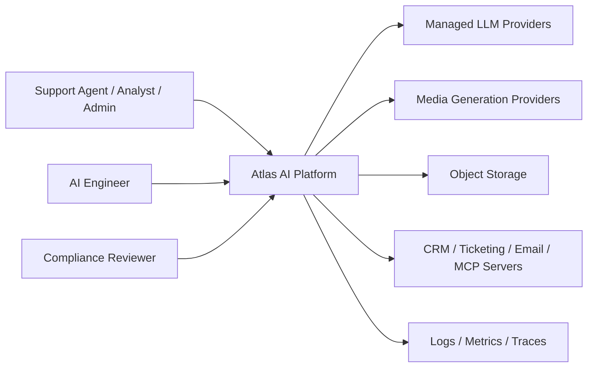

Key idea:

```text
Users and engineers interact only with Atlas. Atlas controls provider calls, external tools, safety, evaluation, audit, and permissions.
```

## 3. C4 Container Diagram

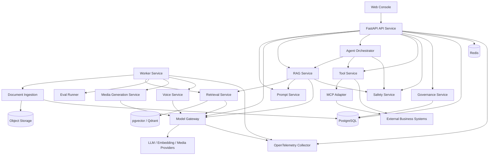

## 4. Module Boundary Diagram

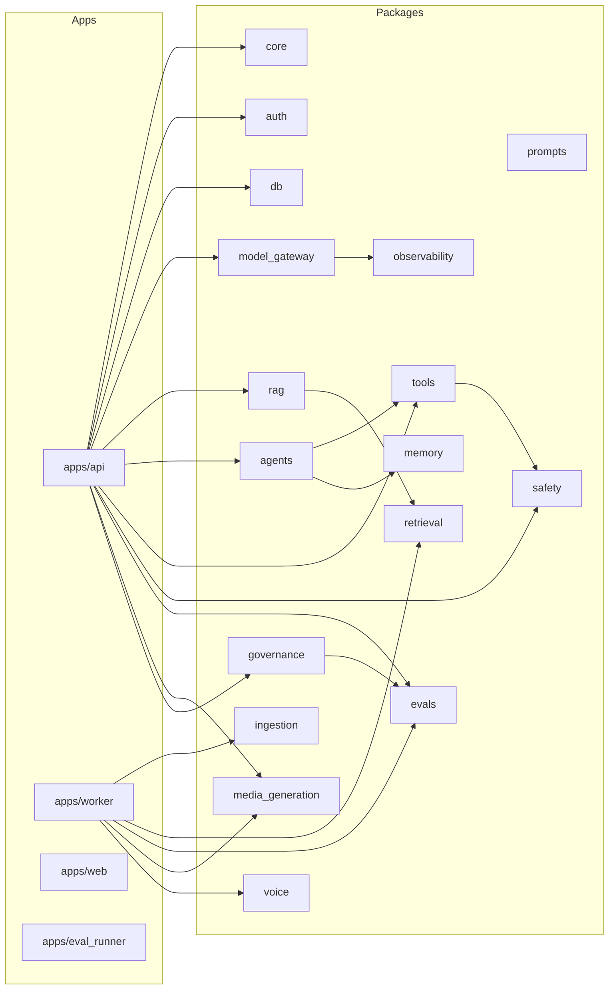

Boundary rule:

```text
Application entry points call packages. Packages do not import route files. All model calls go through model_gateway.
```

## 5. ERD Overview

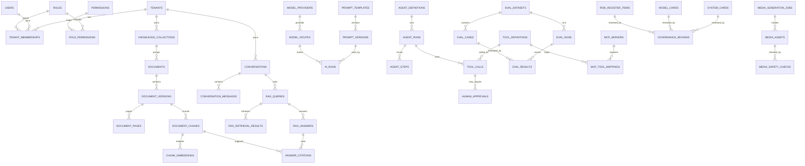

## 6. RAG Sequence Diagram

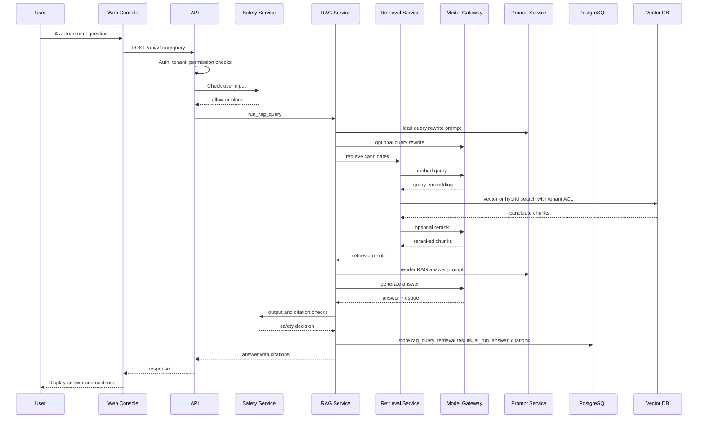

## 7. Document Ingestion Sequence Diagram

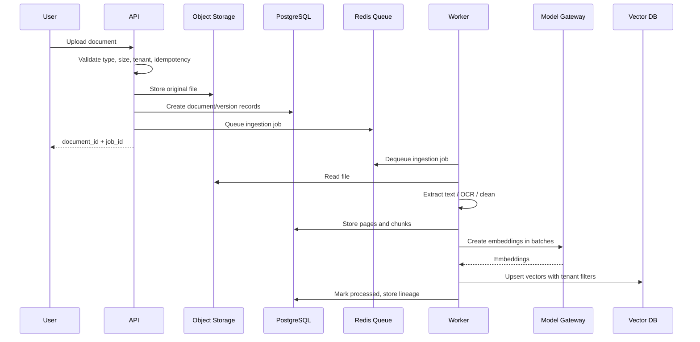

## 8. Agent Flow Diagram

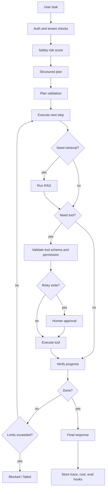

## 9. MCP Tool Call Sequence Diagram

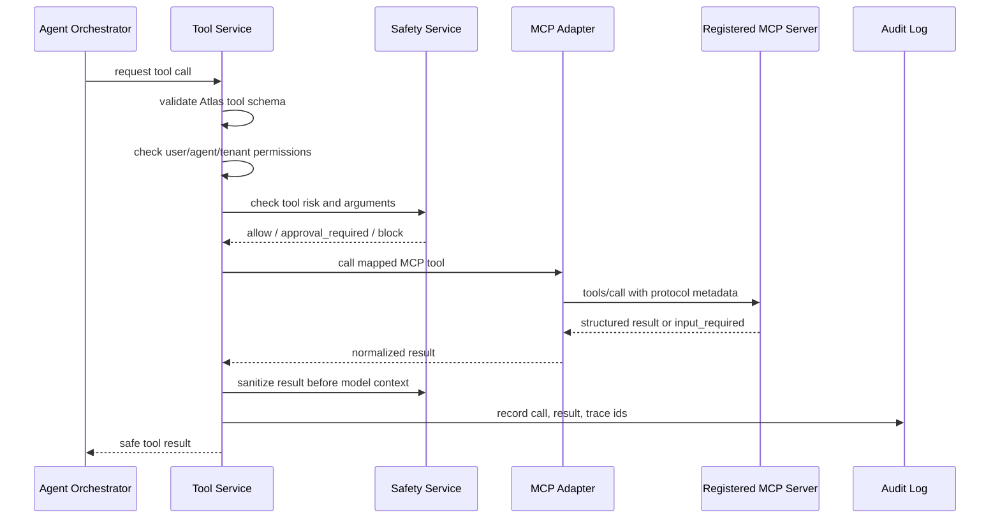

## 10. Evaluation Flow Diagram

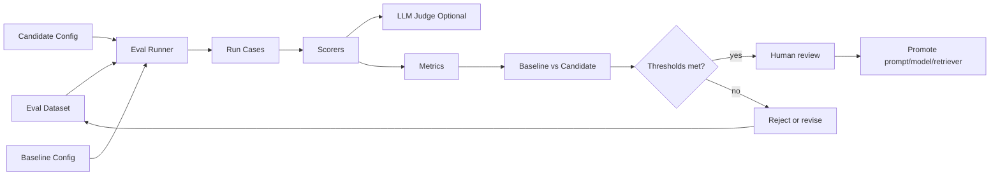

## 11. Deployment Diagram

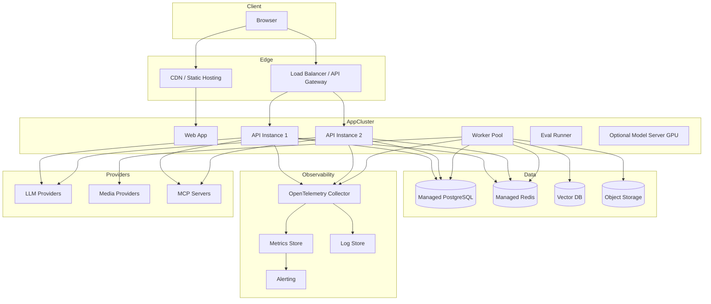

## 12. MVP Spine Diagram

```mermaid
flowchart LR
  A[Phase 00 Foundation] --> B[Phase 01 LLM Gateway]
  B --> C[Phase 02 Prompt System]
  C --> D[Phase 03 Structured Outputs]
  D --> E[Phase 04 Document Ingestion]
  E --> F[Phase 05 Embeddings]
  F --> G[Phase 06 RAG]
  G --> H[Phase 07 Evaluation]
  H --> I[Phase 18 Light Deployment]
  I --> J[Phase 19 Portfolio Demo]
```

Scope rule:

```text
Do not add Phase 26 before the MVP spine has working code, tests, evals, and a demo.
```
