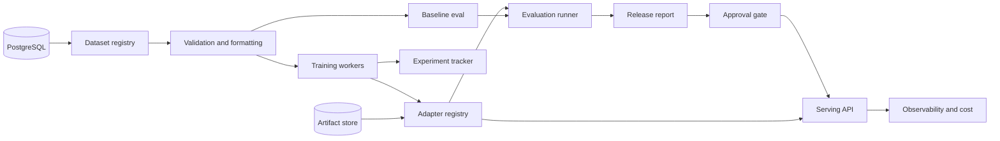

# Open-Model Adaptation Pipeline Production Implementation Guide

Updated: July 28, 2026

This file defines the fifth integrated portfolio project:

> Build a production-grade open-model adaptation pipeline that selects a bounded domain task,
> creates validated instruction and preference datasets, compares base prompting and RAG baselines,
> runs SFT, LoRA, QLoRA, and DPO experiments, tracks every run in an experiment registry, stores
> versioned adapter artifacts, evaluates task quality, safety, latency, memory, and cost, and
> produces an evidence-backed decision on whether adaptation is better than simpler approaches.

This is not a "fine-tune a model and hope" demo. It is a governed post-training lifecycle. The
project must prove data quality, training reproducibility, baseline comparison, adapter provenance,
safety regression control, serving tradeoffs, rollback behavior, and cost per successful task.

Companion: the
[Open-Model Adaptation Pipeline Technical Implementation Guide](Open-Model-Adaptation-Pipeline-Technical-Implementation-Guide.md)
turns these requirements into an executable repository and staged build. This production guide is
the normative source when the two guides conflict; material changes should update both files in the
same pull request.

## Source alignment

This guide operationalizes the local curriculum and research rather than replacing them:

- The project is the fifth integrated portfolio project in the
  [research project mapping](./deep-research-report.md#project-mapping), compressed from
  `DomainTune`.
- The project covers SFT, LoRA, QLoRA, DPO, adapter registry, model comparison, and serving
  tradeoffs as called out in the
  [integrated portfolio projects](./deep-research-report.md#integrated-portfolio-projects).
- Curriculum scope comes from
  [Model adaptation and post-training](./AI-Industry-Curriculum.md#model-adaptation-and-post-training).
- Completion evidence aligns to Lessons 19-25 for PyTorch fundamentals, tokenizers, SFT, LoRA,
  QLoRA, DPO, advanced post-training decisions, and efficient training; Lessons 34-36 for LLMOps,
  open-model serving, and inference optimization; and Lesson 43 for LLM Engineer specialization.
- Roadmap scope aligns to
  [Phase 5 - Model adaptation and post-training](./AI-Industry-Roadmap-and-Projects.md#phase-5--model-adaptation--post-training-lessons-1925).

When this guide is more specific than a source document, the specificity is an implementation
decision for this project. Record material choices as architecture decision records.

## Evidence and verification vocabulary

Every stage document, report, checklist, README status, model card, adapter card, and dataset card
must use one of these terms:

| Status | Meaning |
|---|---|
| `planned` | Scope and acceptance criteria exist; implementation has not been claimed. |
| `implemented` | Code, config, dataset, or artifact exists; no verification claim is implied. |
| `locally verified` | Reproducible checks passed in a named local environment. |
| `externally verified` | Checks passed in CI, staging, or another independently identified environment. |
| `operationally proven` | The capability met its SLO or acceptance gate during a controlled pilot or production-like exercise. |

Use `Verified` and `Not Verified` sections in stage records. A statement such as "LoRA improved
quality" is invalid unless it names the dataset version, baseline, training config, model and
adapter versions, metric, command or run ID, environment, evidence location, and date.

## 1. Production outcome

The finished system should let an LLM engineer:

- Select one bounded domain task and decide whether adaptation is justified.
- Build instruction, evaluation, and preference datasets with license, privacy, leakage, and split
  controls.
- Apply the selected model's chat template and label masking correctly.
- Run reproducible baseline, SFT, LoRA, QLoRA, and DPO experiments.
- Track code, data, hyperparameters, hardware, metrics, costs, checkpoints, and artifacts.
- Register versioned adapters with model, tokenizer, dataset, license, and evaluation metadata.
- Compare task quality, safety, refusal behavior, general regression, training time, GPU memory,
  inference latency, throughput, and cost per successful task.
- Produce a decision memo that may conclude prompting or RAG is sufficient.

The system should let a reviewer or approver:

- Inspect dataset cards, model cards, adapter cards, training configs, run logs, and eval reports.
- See why a candidate adapter was approved, rejected, or held.
- Verify that held-out test sets were not used for prompts, training, preference generation, or
  checkpoint selection.
- Check safety and behavior regression reports.
- Approve serving only for compatible base model, tokenizer, adapter, prompt, and policy versions.

The system should let an operator:

- Trace one model response to base model, adapter, tokenizer, prompt, generation config, dataset
  version, training run, eval run, serving route, latency, and cost.
- Roll back a bad adapter, disable adaptation, or route traffic to a baseline.
- Monitor adapter load failures, incompatible base model, safety regressions, GPU memory,
  throughput, latency, and cost.

The project is complete only when it has working software, reproducible experiments, fixed
evaluation sets, tracked artifacts, safety controls, serving evidence, rollback evidence, and an
honest record of what remains unverified.

## 2. Business problem, users, scope, and non-goals

### Business problem

A general model may understand a domain but fail to follow the organization's schema, terminology,
style, refusal rules, or policy requirements consistently. Teams often jump to fine-tuning without
proving that prompting, RAG, better data formatting, or retrieval fixes would solve the problem
more cheaply. The business needs a repeatable way to decide when adaptation is justified and to
ship adapters without losing safety, provenance, or rollback control.

### Primary users

| Persona | Need | Risk if the system fails |
|---|---|---|
| LLM engineer | Train and compare adapters reproducibly. | Ships an overfit or untraceable adapter. |
| Data or annotation lead | Create instruction and preference datasets. | Bad labels, leakage, privacy issues, or biased preferences. |
| Product owner | Decide whether adaptation is worth cost and risk. | Pays for training that does not beat simpler baselines. |
| Safety reviewer | Check refusal, over-refusal, policy, and harmful-output regressions. | Adapter improves task score while degrading safety. |
| Platform operator | Serve, monitor, and roll back adapters. | Latency, memory, cost, or compatibility failure in production. |
| Portfolio reviewer | Verify technical depth and honesty. | Cannot reproduce claims or compare approaches fairly. |

### Initial domain

Choose one bounded task where adaptation plausibly helps:

- Financial filing tagging.
- Radiology-style report structuring with synthetic or public non-clinical data.
- Support-policy structured response formatting.
- Contract clause classification and rewrite suggestions.
- Product taxonomy or catalog normalization.

Version 1 must use public, synthetic, or explicitly authorized data. Do not use proprietary,
medical, legal, financial, or customer data unless licensing, privacy, and governance controls are
documented and approved.

### Required scope

- Baseline prompting and optional RAG comparison.
- Dataset registry with source, license, split, privacy, and contamination controls.
- Tokenizer and chat-template validation.
- Instruction data formatting and label-mask tests.
- Small reproducible PyTorch training baseline.
- SFT experiment.
- LoRA experiment.
- QLoRA experiment where hardware supports it.
- Preference rubric and DPO experiment.
- MLflow or equivalent experiment tracking.
- Adapter registry with immutable artifact metadata.
- Safety, refusal, over-refusal, behavior, latency, memory, throughput, and cost evaluation.
- Serving decision memo: merged adapter, dynamic adapter, hosted baseline, self-hosted baseline,
  or no adaptation.
- Rollback and release evidence.

### Explicit non-goals for the first release

- Training a foundation model from scratch beyond a small educational baseline.
- Continued pretraining on large domain corpora unless a later ADR proves SFT/LoRA/RAG are
  insufficient.
- RLHF, PPO, GRPO, reward-model productionization, or general reinforcement learning.
- High-risk medical, legal, credit, employment, or safety-critical decisions.
- Claiming the adapted model is generally better than the base model.
- Claiming safety improvement without a safety regression suite.
- Training on unlicensed, private, scraped, or unclear-origin data.
- Using benchmark contamination or prompt leakage to inflate results.
- Serving adapters without base-model, tokenizer, and prompt compatibility checks.
- Using `latest`, `main`, or mutable artifact names outside insecure local experiments.

Non-goals may become later experiments, but they do not weaken the production requirements in this
guide.

## 3. Business outcomes and metric tree

Measure the current workflow before adaptation.

Required baseline:

- Prompt-only task accuracy or rubric score.
- Prompt plus retrieval task score where applicable.
- Structured-output validity.
- Policy-compliance rate.
- Human correction rate.
- Unsupported or unsafe response rate.
- Latency and cost per successful task.
- Engineering time to maintain prompts or retrieval rules.

Primary outcome metrics:

| Outcome | Example measure |
|---|---|
| Better task behavior | Exact match, rubric score, structured validity, or domain F1 on held-out set. |
| Better policy adherence | Policy-compliance rate and refusal quality. |
| Lower operational cost | Cost per successful task versus hosted model, prompt-only, or RAG baseline. |
| Lower latency or higher throughput | P95 latency, tokens/sec, adapter load time, GPU memory. |
| Better maintainability | Fewer prompt patches or manual corrections for the selected task. |

Guardrail metrics:

- Test leakage rate.
- Training data license or privacy violation rate.
- Invalid chat-template or label-mask rate.
- Memorization or near-duplicate leakage rate.
- General capability regression.
- Safety regression.
- Over-refusal and under-refusal.
- Unsupported answer rate.
- Adapter/base-model incompatibility.
- Serving error rate.
- GPU out-of-memory rate.
- P95 latency and throughput regression.
- Cost per successful task regression.

Do not claim success from eval average alone. An adapter that improves one domain metric but
degrades safety, refusal behavior, or cost may be a failed release.

## 4. What production-ready means

Production-ready for this project means:

- The adaptation decision is justified against prompting and RAG baselines.
- Dataset sources, licenses, splits, privacy posture, and contamination checks are documented.
- Chat templates, label masks, truncation, packing, and token-length distributions are verified.
- Training runs are reproducible from code, data, config, and model revisions.
- SFT, LoRA, QLoRA, and DPO candidates are compared on the same immutable eval set.
- Checkpoint selection uses validation data, never release test data.
- Adapters are registered with immutable artifact digests and compatibility metadata.
- Serving validates base model, tokenizer, adapter, prompt, and policy compatibility.
- Safety, refusal, over-refusal, latency, memory, throughput, and cost are measured.
- Rollback to baseline or prior adapter is demonstrated.

The smallest acceptable pilot may use a small open model and synthetic data, but it must still
prove the full control loop: data validation, training, tracking, evaluation, registry, serving
decision, safety review, observability, and rollback.

## 5. Non-negotiable requirements

| ID | Requirement |
|---|---|
| OMA-DECIDE-01 | Compare prompt-only and optional RAG baselines before claiming adaptation value. |
| OMA-DATA-01 | Dataset sources, licenses, splits, privacy, and contamination checks are documented. |
| OMA-DATA-02 | Chat templates, truncation, packing, and label masks are tested before training. |
| OMA-TRAIN-01 | Training runs record code, data, base model, tokenizer, config, hardware, seed, metrics, and artifacts. |
| OMA-TRAIN-02 | Checkpoint selection uses validation data and supports resume from checkpoint. |
| OMA-SFT-01 | SFT candidate is evaluated against untouched baselines and held-out test set. |
| OMA-LORA-01 | LoRA target modules, rank, alpha, dropout, trainable parameters, and artifacts are recorded. |
| OMA-QLORA-01 | QLoRA quantization config, dtype, memory, checkpointing, and hardware assumptions are recorded. |
| OMA-DPO-01 | Preference pairs follow a documented rubric and pass pair-quality checks. |
| OMA-DPO-02 | DPO candidate is compared with SFT for helpfulness, policy compliance, refusal, and over-refusal. |
| OMA-EVAL-01 | Task, safety, behavior, latency, memory, throughput, and cost are reported by version. |
| OMA-REG-01 | Adapters are immutable, versioned, digest-addressed, and compatible with declared base/tokenizer versions. |
| OMA-SERVE-01 | Serving route validates adapter compatibility and supports rollback or disablement. |
| OMA-SEC-01 | Training data, prompts, outputs, artifacts, and telemetry are governed by privacy and access policy. |
| OMA-OPS-01 | Training, eval, registry, serving, latency, memory, cost, and failure metrics are observable by run ID. |
| OMA-REL-01 | Candidate promotion requires release report, approver, risk decision, and rollback target. |

## 6. Core journeys and required UX

### Adaptation decision journey

1. Select a bounded domain task.
2. Define accepted outputs, refusal rules, and non-goals.
3. Build prompt-only baseline.
4. Build prompt plus retrieval baseline where relevant.
5. Measure task, safety, latency, and cost baselines.
6. Decide whether adaptation is worth trying.
7. Record the decision in an ADR.

Fine-tuning is not allowed to become the default answer. The decision memo must allow "do not
adapt" as a successful outcome when simpler systems are sufficient.

### Dataset journey

The dataset workflow must include:

- Source registration.
- License and data-use review.
- Privacy classification and redaction.
- Split creation and immutability.
- Chat-template application.
- Label-mask validation.
- Token-length and truncation report.
- Near-duplicate and leakage check.
- Dataset card.
- Promotion to training, validation, preference, or release-test split.

Release tests must remain isolated from training, prompt examples, preference generation,
checkpoint selection, and calibration.

### Training journey

Each training run must:

- Start from immutable base model and tokenizer revisions.
- Use immutable dataset versions.
- Record config, seed, hardware, device map, precision, optimizer, scheduler, batch size,
  accumulation, epochs, warmup, gradient clipping, checkpointing, and library versions.
- Track training loss, validation loss, task metrics, memory, throughput, and cost.
- Save checkpoints and final artifacts with digests.
- Support resume or record why resume is unsupported.

### Adapter approval journey

A candidate adapter can be approved only after:

- Dataset and training cards are complete.
- Eval report compares the candidate with baselines.
- Safety and behavior regression report passes gates.
- Serving compatibility is verified.
- Cost and latency are acceptable.
- Rollback target exists.
- Approver records launch, hold, or reject decision.

### Serving and rollback journey

The serving path must:

- Validate base model, tokenizer, adapter type, adapter digest, prompt version, and generation
  config.
- Support disabled-adapter baseline routing.
- Support previous adapter rollback.
- Record adapter ID on every generation.
- Report adapter load time, memory, tokens/sec, latency, and errors.
- Deny incompatible adapters rather than silently loading them.

## 7. Governance, access, and artifact-first architecture

Training and adaptation artifacts are part of the product's trust boundary. Authorization and
governance apply to datasets, prompts, training configs, checkpoints, adapters, eval reports,
model outputs, and serving routes.

### Governance invariants

- Deny access when identity, tenant, project, dataset, model, artifact, run, or policy evaluation
  is missing.
- Resolve users and service identities from trusted authentication context.
- Store owner, license, policy, privacy classification, and retention metadata with each dataset,
  training run, checkpoint, adapter, eval run, release candidate, and serving route.
- Never use a dataset, base model, or preference set whose license or privacy status is unknown.
- Never promote an adapter whose base model, tokenizer, prompt, or policy compatibility is
  unknown.
- Never publish a metric without dataset version, run ID, environment, and config tuple.
- Bind caches and serving routes to base model, tokenizer, adapter, prompt, generation config,
  safety policy, and eval gate version.
- Invalidate serving routes when base model, adapter, prompt, policy, tokenizer, or safety gate
  changes.
- The model must never decide whether its own adapter is approved.

### Canonical approval sequence

```mermaid
flowchart LR
    A[Dataset registered] --> B[License, privacy, leakage checks]
    B --> C[Baseline eval]
    C --> D[SFT, LoRA, QLoRA, DPO runs]
    D --> E[Candidate adapter registry]
    E --> F[Task and safety eval]
    F --> G[Serving compatibility check]
    G --> H[Release report]
    H --> I[Human approval]
    I --> J[Canary or local serving route]
    J --> K[Rollback target recorded]
```



### Policy-change SLO

Define separate targets for:

- Dataset takedown.
- License restriction update.
- Privacy classification update.
- Model-card restriction update.
- Adapter revocation.
- Safety gate update.
- Serving route disablement.
- Export deletion.

Revocation and serving disablement normally require stricter targets than new approvals. Measure
from authoritative event to confirmed absence or denial in dataset loaders, caches, registries,
serving routes, eval jobs, reports, and exported artifacts.

## 8. Reference architecture and project boundaries



### Recommended stack

| Layer | Recommended choice |
|---|---|
| Language and package tool | Python 3.12 and `uv` |
| Training | PyTorch, Transformers, Accelerate |
| SFT/DPO | TRL |
| PEFT | PEFT, bitsandbytes where supported |
| Data | Hugging Face Datasets plus project-owned manifests |
| Experiment tracking | MLflow or equivalent |
| Metadata | PostgreSQL |
| Artifact storage | S3-compatible storage; MinIO locally |
| Queue | Redis and RQ for jobs |
| Serving | FastAPI with mock/local generation; optional vLLM adapter later |
| Web | Minimal React dashboard or static report viewer |
| Telemetry | OpenTelemetry, Prometheus, Grafana, structured JSON logs |
| Local runtime | Docker Compose |

The implementation may choose different tools, but it must preserve contracts, immutable
versioning, artifact digests, reproducible commands, and evaluation evidence.

### Component responsibilities

| Component | Responsibility |
|---|---|
| Dataset registry | Sources, licenses, splits, privacy, manifests, hashes, dataset cards. |
| Formatter | Chat templates, masks, truncation, packing, token reports. |
| Training runner | SFT, LoRA, QLoRA, DPO jobs and checkpoint handling. |
| Experiment tracker | Params, metrics, artifacts, environment, code, hardware, costs. |
| Adapter registry | Artifact digests, compatibility, approval state, model/adapter cards. |
| Evaluation runner | Baseline, task, safety, refusal, latency, memory, cost comparisons. |
| Release gate | Candidate report, approver, risk acceptance, rollback target. |
| Serving API | Compatibility checks, baseline route, adapter route, rollback, telemetry. |
| Observability stack | Logs, traces, metrics, dashboards, alerts, cost reports. |

### Queue isolation

Separate queues by blast radius:

- `data_validation`: source, license, privacy, formatting, leakage checks.
- `training`: SFT, LoRA, QLoRA, DPO jobs.
- `evaluation`: task, safety, latency, cost, benchmark runs.
- `registry`: artifact registration and digest verification.
- `serving_release`: route promotion, canary, rollback.
- `retention`: dataset/artifact deletion and policy updates.
- `maintenance`: reconciliation and stuck-run cleanup.

Training cannot starve retention, revocation, or release rollback work.

### Durable handoff and reconciliation

Use a transactional outbox or equivalent durable handoff for dataset approval, training job
creation, checkpoint registration, adapter registration, eval job creation, release decision,
serving route change, retention job, and export job.

Reconciliation jobs must find:

- Datasets approved without immutable manifest hashes.
- Training runs without terminal status.
- Checkpoints not registered or not digest-verified.
- Adapter records without corresponding artifacts.
- Eval reports missing required baseline comparison.
- Release candidates without rollback target.
- Serving routes pointing to revoked or incompatible adapters.
- Artifacts past retention expiration.

Reconciliation jobs must be bounded, authorized, idempotent, observable, and safe to replay.

### Documentation and evidence system

Maintain:

- `docs/product-requirements.md`
- `docs/adaptation-decision-framework.md`
- `docs/metric-tree.md`
- `docs/risk-register.md`
- `docs/data-flow-and-trust-boundaries.md`
- `docs/architecture.md`
- `docs/dataset-contracts.md`
- `docs/training-contracts.md`
- `docs/adapter-registry-contract.md`
- `docs/evaluation-plan.md`
- `docs/serving-contract.md`
- `docs/release-policy.md`
- `docs/threat-model.md`
- `docs/privacy-checklist.md`
- `docs/system-card.md`
- `docs/dataset-card.md`
- `docs/model-card.md`
- `docs/adapter-card.md`
- `docs/provider-data-disclosure.md`
- `docs/feedback-to-eval-loop.md`

Generated reports must include:

- `docs/reports/baseline-comparison-report.md`
- `docs/reports/tokenization-formatting-report.md`
- `docs/reports/sft-report.md`
- `docs/reports/lora-report.md`
- `docs/reports/qlora-report.md`
- `docs/reports/dpo-report.md`
- `docs/reports/safety-regression-report.md`
- `docs/reports/serving-benchmark-report.md`
- `docs/reports/cost-performance-report.md`
- `docs/reports/release-report.md`
- `docs/reports/pilot-report.md`

Operational runbooks must include rollback, adapter disablement, bad adapter release, dataset
takedown, training job failure, artifact corruption, serving outage, privacy incident, and
backup/restore.

## 9. Data, training, adapter, and serving contracts

### Dataset manifest

```json
{
  "dataset_id": "domain_instructions_v1",
  "tenant_id": "tenant_demo",
  "task": "support_policy_structured_response",
  "source_type": "synthetic",
  "license": "project-owned",
  "privacy_classification": "synthetic",
  "split": "train",
  "record_count": 1200,
  "sha256": "manifest_digest",
  "created_at": "2026-07-28T12:00:00Z",
  "approved_by": "data_owner"
}
```

### Training config

```json
{
  "run_id": "train_lora_001",
  "method": "lora",
  "base_model_id": "open-model-id",
  "base_model_revision": "immutable_revision",
  "tokenizer_revision": "immutable_revision",
  "dataset_versions": ["domain_instructions_v1"],
  "seed": 42,
  "precision": "bf16",
  "max_seq_length": 2048,
  "learning_rate": 0.0002,
  "epochs": 2,
  "batch_size": 2,
  "gradient_accumulation_steps": 8,
  "lora": {
    "rank": 16,
    "alpha": 32,
    "dropout": 0.05,
    "target_modules": ["q_proj", "v_proj"]
  }
}
```

### Adapter registry record

```json
{
  "adapter_id": "adapter_lora_support_v1",
  "method": "lora",
  "base_model_id": "open-model-id",
  "base_model_revision": "immutable_revision",
  "tokenizer_revision": "immutable_revision",
  "artifact_uri": "s3://adapters/adapter_lora_support_v1",
  "artifact_sha256": "adapter_digest",
  "training_run_id": "train_lora_001",
  "eval_run_id": "eval_lora_001",
  "approval_status": "candidate",
  "compatible_serving_modes": ["dynamic_adapter", "merged"]
}
```

### Evaluation result

```json
{
  "eval_run_id": "eval_lora_001",
  "candidate_id": "adapter_lora_support_v1",
  "baseline_ids": ["prompt_baseline_v1", "rag_baseline_v1", "sft_v1"],
  "dataset_id": "release_set_v1",
  "metrics": {
    "task_score": 0.87,
    "schema_validity": 0.96,
    "policy_compliance": 0.93,
    "safety_regression_failures": 0,
    "p95_latency_ms": 920,
    "cost_per_successful_task_usd": 0.0021
  },
  "decision": "hold_for_review"
}
```

### Minimum API surface

| Method | Path | Purpose |
|---|---|---|
| `GET` | `/health/live` | Process liveness. |
| `GET` | `/health/ready` | Capability-aware readiness. |
| `POST` | `/datasets` | Register dataset manifest. |
| `POST` | `/datasets/{id}:validate` | Run license, privacy, format, split, and leakage checks. |
| `POST` | `/baselines` | Register or run prompt/RAG baseline. |
| `POST` | `/training-runs` | Create SFT/LoRA/QLoRA/DPO run. |
| `GET` | `/training-runs/{id}` | Read run status, metrics, artifacts. |
| `POST` | `/adapters` | Register adapter artifact. |
| `GET` | `/adapters/{id}` | Read adapter metadata and approval state. |
| `POST` | `/eval-runs` | Run task/safety/latency/cost eval. |
| `POST` | `/release-candidates` | Create candidate from adapter and evals. |
| `POST` | `/release-candidates/{id}:approve` | Approve candidate with evidence. |
| `POST` | `/serving-routes/{id}:promote` | Promote adapter route. |
| `POST` | `/serving-routes/{id}:rollback` | Roll back route. |
| `POST` | `/generate` | Generate through baseline or approved adapter route. |
| `GET` | `/metrics/quality` | Quality and safety metrics. |
| `GET` | `/metrics/operations` | Training, registry, serving metrics. |
| `GET` | `/metrics/cost` | Cost by run, route, adapter, and task. |

## 10. Training and adaptation lifecycle

### End-to-end flow

1. Select task and non-goals.
2. Register dataset sources and licenses.
3. Create train, validation, preference, safety, and release-test splits.
4. Validate chat templates, masks, packing, truncation, and leakage.
5. Run prompt-only and optional RAG baselines.
6. Run small PyTorch training smoke.
7. Run SFT.
8. Run LoRA.
9. Run QLoRA where hardware supports it.
10. Build preference pairs and run DPO.
11. Evaluate all candidates on the same release set.
12. Run safety, refusal, over-refusal, general regression, latency, memory, throughput, and cost
    evaluation.
13. Register adapter artifacts.
14. Produce release report and decision memo.
15. Serve approved route or record "do not adapt".
16. Monitor and roll back if needed.

### Run states

Use explicit states:

- `planned`
- `queued`
- `validating_data`
- `running`
- `checkpointing`
- `evaluating`
- `registered`
- `failed`
- `cancelled`
- `approved`
- `rejected`
- `served`
- `rolled_back`
- `archived`

Every transition records actor or service, timestamp, reason, version tuple, and correlation ID.

## 11. Evaluation and release gates

### Required datasets

Use at least four dataset classes:

| Dataset | Purpose |
|---|---|
| Instruction dataset | SFT/LoRA/QLoRA demonstrations. |
| Preference dataset | Chosen/rejected pairs for DPO. |
| Safety and behavior set | Refusal, over-refusal, jailbreak, policy, and general regression. |
| Golden release set | Held-out task cases never used for training, prompts, preference creation, or checkpoint selection. |

Optional public preference datasets such as OpenAssistant, UltraFeedback, HelpSteer, or equivalent
may be used only with license, contamination, and task-fit review.

### Starter quality gates

| Area | Starter gate |
|---|---|
| Dataset governance | 1.00 sources have license, split, privacy, and manifest hash. |
| Leakage | 0 release-test records appear in training, prompts, preference generation, or validation. |
| Formatting | 1.00 chat-template and label-mask tests pass before training. |
| Baseline comparison | Prompt-only and optional RAG baseline reported before adaptation claim. |
| Reproducibility | Training run records code, data, model, tokenizer, config, seed, hardware, metrics, artifacts. |
| Adapter integrity | 1.00 adapter artifacts have immutable digest and compatibility metadata. |
| Task quality | Candidate beats baseline by declared margin or release report says adaptation is not justified. |
| Safety regression | 0 critical safety regressions. |
| Refusal quality | Under-refusal and over-refusal reported; no critical slice below floor. |
| Serving compatibility | 1.00 incompatible base/tokenizer/adapter routes are rejected. |
| Rollback | Baseline or previous adapter rollback demonstrated. |
| Cost | Cost per successful task reported and compared to baseline. |

Security and safety gates marked zero-tolerance cannot be relaxed to make a release pass.

### Release comparison rules

- Compare candidates against the current approved baseline using the same immutable dataset version
  and environment class.
- Report absolute metrics, deltas, uncertainty where available, changed failures, and slice-level
  regressions.
- Treat changed base model, tokenizer, dataset, formatter, label mask, training config, adapter,
  prompt, decoding config, safety policy, or serving route as a configuration change requiring
  relevant regression suites.
- Do not promote a candidate merely because task average improved.
- Critical gate failure always blocks.
- A waived non-critical failure needs named owner, expiration, mitigation, and risk acceptance.
- Store launch, hold, reject, or rollback decision with approver, evidence links, candidate
  version tuple, and rollback target.

### Required release report

The release candidate report must contain:

- Application commit and image digest.
- Base model, tokenizer, prompt, formatter, dataset, adapter, and serving-route versions.
- Training config, seed, hardware, library versions, and artifact digests.
- Dataset versions and hashes.
- Metric table, slice table, changed failures, and open risks.
- Task, schema, policy, safety, refusal, over-refusal, general-regression results.
- Training time, GPU memory, latency, throughput, and cost.
- Serving compatibility and rollback result.
- Decision, approvers, canary plan, rollback target, and follow-up owners.

### Minimum release dataset shape

For the smallest credible portfolio pilot, maintain at least:

- 200 instruction examples.
- 50 validation examples.
- 100 held-out release examples.
- 100 preference pairs.
- 50 safety and refusal cases.
- 25 over-refusal cases.
- 25 schema-invalid or difficult-format cases.
- 20 prompt-injection or policy-violation cases.
- 20 baseline/RAG comparison cases where retrieval may be enough.

These are starter counts for engineering proof, not statistical sufficiency claims.

## 12. Security, privacy, and governance

### Trust boundaries

Treat datasets, prompts, preference pairs, generated outputs, training configs, checkpoints, and
adapters as governed artifacts. They can contain sensitive data, license-restricted text,
contaminated benchmark examples, malicious instructions, memorized content, or unsafe behavior.

### Required controls

- Deny-by-default access to datasets, runs, checkpoints, adapters, eval reports, release decisions,
  and serving routes.
- Source, license, privacy, and consent checks before dataset use.
- Secrets management outside the repository.
- PII minimization and redaction in logs, traces, reports, examples, and artifacts.
- Prompt-injection and data-poisoning tests.
- Model output validation for structured tasks.
- Rate, duration, GPU, token, and spend controls.
- Audit logs for dataset approval, training runs, adapter registration, evals, releases, serving
  promotion, rollback, and deletion.

### Governance documents

The project package must include:

- Product requirements.
- Dataset cards.
- Model cards.
- Adapter cards.
- Training run cards.
- System card.
- Privacy checklist.
- Threat model.
- Risk register.
- Release report.
- Serving decision memo.
- Incident response runbook.

### Prohibited claims

Do not claim:

- The adapted model is generally better than the base model.
- Fine-tuning was necessary unless baselines prove it.
- Safety improvement without a safety regression suite.
- Production readiness for high-impact domains.
- License compliance without source and artifact records.
- Reproducibility without code, data, model, tokenizer, config, seed, hardware, and artifact
  evidence.

## 13. Observability, feedback, and cost

### Correlation model

Every dataset validation, formatting job, training run, checkpoint, adapter registration, eval run,
release candidate, serving route, generation, rollback, retention job, and export must carry
correlation IDs.

### Metrics

Track:

- Dataset records, rejected records, token lengths, truncation, packing efficiency, leakage hits.
- Training loss, validation loss, learning rate, gradient norm, checkpoint metrics.
- GPU memory, utilization, throughput, training time, failures, restarts.
- Eval task metrics, safety metrics, refusal/over-refusal, schema validity.
- Adapter size, load time, compatibility failures.
- Serving latency, tokens/sec, memory, error rate, cost.
- Cost by dataset, run, adapter, route, and successful task.

### Feedback loop

Production or pilot feedback can improve the system only after governance:

1. Capture failure with prompt, output, route, adapter, dataset and policy versions.
2. Review privacy and license eligibility.
3. Add accepted examples to a versioned dataset.
4. Run regression evals.
5. Compare old and new adapter or prompt versions.
6. Approve, reject, or roll back release.
7. Update cards and reports.

Do not train on raw feedback without privacy, license, and data-quality review.

## 14. Reliability, deployment, and rollback

### Required service indicators

- Dataset validation success.
- Training job completion.
- Checkpoint resume success.
- Adapter registration success.
- Eval gate execution.
- Serving route availability.
- Generation latency.
- GPU memory and OOM rate.
- Rollback success.
- Retention job completion.

### Degraded modes

- If training fails, preserve logs, checkpoint state, and cost; do not register incomplete adapter.
- If eval fails, block promotion.
- If adapter loading fails, route to baseline or previous adapter.
- If safety gate fails, block serving.
- If GPU memory is insufficient, use smaller model, lower sequence length, gradient checkpointing,
  LoRA, QLoRA, or CPU-only eval fallback.
- If artifact integrity fails, quarantine adapter and block serving.

### Rollback options

- Disable adapter and route to prompt-only baseline.
- Route to RAG baseline.
- Route to previous approved adapter.
- Roll back prompt or decoding config.
- Disable dynamic adapter loading.
- Revoke adapter approval.
- Freeze feedback-to-dataset promotion.

## 15. Step-by-step implementation plan

### Phase 0: Discovery, task, and adaptation decision

- Select domain task, supported outputs, non-goals, baseline metrics, data sources, and risk
  policy.

### Phase 1: Repository, contracts, and local platform

- Create reproducible Python, Docker, test, lint, type-check, CI, registry, and report foundation.

### Phase 2: Dataset registry and formatting

- Implement source manifests, licenses, splits, chat templates, masks, packing, truncation, and
  leakage checks.

### Phase 3: Baseline evaluation

- Implement prompt-only and optional RAG baselines and first release set.

### Phase 4: Training fundamentals

- Implement small PyTorch smoke training, checkpointing, resume, MLflow tracking, and profiler
  report.

### Phase 5: SFT

- Run SFT with validation checkpoint selection and task/safety comparison.

### Phase 6: LoRA and QLoRA

- Train LoRA and QLoRA adapters, measure memory/quality/cost, and register artifacts.

### Phase 7: Preference data and DPO

- Build preference rubric, validate pairs, train DPO, compare with SFT.

### Phase 8: Evaluation, safety, and release gates

- Run fixed evals, safety regressions, refusal/over-refusal, latency, memory, cost, and release
  report.

### Phase 9: Serving and rollback

- Implement serving route, compatibility checks, adapter disablement, previous-adapter rollback,
  and telemetry.

### Phase 10: Security, privacy, and governance

- Add privacy, license, prompt-injection, data-poisoning, artifact integrity, and access tests.

### Phase 11: Operations and pilot

- Add dashboards, runbooks, cost report, controlled pilot, feedback-to-eval loop, and final
  defense package.

## 16. Completion evidence checklist

### Product and decision

- Product requirements name task, users, supported outputs, non-goals, and baseline.
- Adaptation decision memo compares prompt, RAG, SFT, LoRA, QLoRA, and DPO.
- Report may honestly conclude adaptation is not justified.

### Data

- Dataset cards include source, license, privacy, split, hash, contamination, and leakage checks.
- Chat-template, label-mask, token-length, truncation, and packing reports exist.
- Preference rubric and pair-quality report exist.

### Training

- Runs record code, data, model, tokenizer, config, seed, hardware, metrics, and artifacts.
- Checkpoint resume and validation-based checkpoint selection are demonstrated.
- SFT, LoRA, QLoRA, and DPO runs are tracked and comparable.

### Evaluation

- Baseline, task, schema, policy, safety, refusal, over-refusal, latency, memory, throughput, and
  cost reports exist.
- Release gates block unsafe or unproven candidates.

### Registry and serving

- Adapter artifacts are immutable and digest-addressed.
- Serving validates compatibility and records adapter IDs on generations.
- Baseline and previous-adapter rollback work.

### Security, privacy, and governance

- Threat model, privacy checklist, license review, model cards, adapter cards, system card, and
  release report exist.
- No unredacted sensitive examples appear in logs, traces, reports, or demos.

### Operations and portfolio

- Dashboards show training, eval, registry, serving, latency, memory, cost, and failures.
- Runbooks cover training failure, bad adapter, serving outage, dataset takedown, rollback, and
  restore.
- Final defense package includes demo script, eval report, cost report, decision memo, limitations,
  and next steps.

## 17. Industry-level implementation order

| Order | Build | Why it comes here |
|---:|---|---|
| 1 | Domain task, non-goals, baseline, data policy, and adaptation decision framework. | Fine-tuning must be justified before compute is spent. |
| 2 | Repository, CI, tracking, registry, stage records. | Reproducibility begins before training. |
| 3 | Dataset registry, licenses, splits, privacy, leakage. | Bad data invalidates every later result. |
| 4 | Tokenizer, chat template, labels, packing, truncation. | Formatting bugs can silently train the wrong objective. |
| 5 | Prompt and RAG baselines. | Adaptation value needs a fair comparator. |
| 6 | Small PyTorch training smoke and checkpointing. | Training fundamentals prove the pipeline before LLM trainers. |
| 7 | SFT. | Establish demonstration-based adaptation. |
| 8 | LoRA and QLoRA. | Compare efficient adapters and memory tradeoffs. |
| 9 | Preference data and DPO. | Improve preferences only after SFT baseline exists. |
| 10 | Evaluation and release gates. | Quality, safety, and cost decide release. |
| 11 | Adapter registry and serving. | Only approved artifacts reach runtime. |
| 12 | Security, privacy, operations, rollback, pilot. | Production proof needs governance and recovery. |

## 18. Common failure modes

| Failure mode | Symptom | Prevention |
|---|---|---|
| Fine-tuning before baselines | Adapter looks useful but prompt/RAG would have worked. | Mandatory baseline and adaptation decision memo. |
| Wrong chat template | Loss decreases but output quality degrades. | Template and label-mask tests. |
| Test leakage | Excellent release metrics that fail in practice. | Split isolation and leakage checks. |
| Overfitting | Validation improves briefly then release set regresses. | Held-out release set and checkpoint selection. |
| Safety regression | Task improves while refusals or policy degrade. | Safety and refusal gates. |
| Adapter mismatch | Serving loads adapter on wrong base/tokenizer. | Compatibility metadata and runtime checks. |
| Mutable artifacts | Results cannot be reproduced. | Digests, immutable revisions, registry records. |
| DPO over-optimization | Model becomes overly agreeable or over-refuses. | Preference quality audit and refusal metrics. |
| Cost blind spot | Training saves no money in deployment. | Cost per successful task and serving benchmark. |

## 19. Interview defense questions

- Why did this task need adaptation instead of prompting or RAG?
- How did you prevent train/test leakage?
- How did you verify chat templates and label masks?
- What changed from SFT to LoRA to QLoRA to DPO?
- How did you select target modules and rank?
- What did QLoRA save in memory, and what did it cost in quality or speed?
- How did you build and audit preference pairs?
- What safety regressions did you check?
- How do you serve, disable, or roll back an adapter?
- What would make you decide not to fine-tune?

## 20. Final definition of done

The Open-Model Adaptation Pipeline is done when another engineer can clone the repository, register
a dataset, validate formatting and leakage, run prompt/RAG baselines, run SFT, LoRA, QLoRA, and
DPO experiments, inspect MLflow or equivalent runs, register versioned adapters, run fixed evals,
serve an approved adapter, roll back to baseline, inspect cost and safety reports, and defend why
adaptation was or was not justified.
