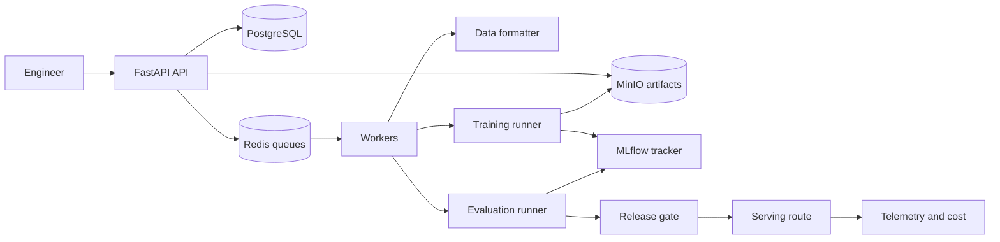

# Open-Model Adaptation Pipeline Technical Implementation Guide

Updated: July 28, 2026

This is the hands-on build guide for the **Open-Model Adaptation Pipeline**. Its normative
requirements are defined in the companion
[Open-Model Adaptation Pipeline Production Implementation Guide](Open-Model-Adaptation-Pipeline-Production-Implementation-Guide.md).
If the two guides conflict, the production guide wins. Update both guides in the same pull request
when a requirement or architecture decision changes.

This guide turns those requirements into an executable repository, implementation stages,
commands, tests, evaluation gates, operational evidence, and a reviewer-ready proof path. It builds
a `DomainTune`-style pipeline for deciding, training, evaluating, registering, serving, and rolling
back open-model adapters.

Relevant local curriculum sources:

- [Deep research report](deep-research-report.md), which identifies `DomainTune` as the
  open-model adaptation portfolio artifact.
- [AI Industry Roadmap and Projects](AI-Industry-Roadmap-and-Projects.md), especially Phase 5.
- [Complete AI Industry Lesson Coverage and Production Plan](AI-Industry-Complete-Lesson-Coverage-Map.md),
  especially Lessons 19-25, 34-36, and 43.
- [AI Industry Curriculum](AI-Industry-Curriculum.md), especially model adaptation and
  post-training.
- [AI Industry Detailed Lessons](AI-Industry-Detailed-Lessons.md), especially tokenizers, SFT,
  LoRA, QLoRA, DPO, adapter lifecycle, serving, and evaluation.
- [Voice Triage Technical Implementation Guide](Voice-Triage-and-Escalation-Agent-Technical-Implementation-Guide.md)
  for the enterprise-grade build-and-evidence convention.

## How to use this guide

Build one stage at a time. Every stage uses the same contract:

1. Read the objective and prerequisites.
2. Create only the listed files and contracts.
3. Implement the steps in order.
4. Run the commands and tests.
5. Inspect the required telemetry.
6. Commit the evidence and stage record.
7. Move on only when every `Done when` item is true.

The fastest useful vertical slice is:

```text
register synthetic instruction dataset
-> validate license, splits, chat template, label masks, and leakage
-> run prompt baseline
-> run tiny SFT smoke
-> train one LoRA adapter on a tiny model
-> evaluate against fixed release set
-> register adapter with digest
-> serve through local API
-> roll back to prompt baseline
```

Do not begin with DPO or a large model. Data formatting, baseline comparison, run tracking,
adapter provenance, and evaluation are the foundation.

## 0. Scope, non-goals, and prerequisites

### In scope

- One bounded domain task and one small open model.
- Public, synthetic, or explicitly authorized instruction, preference, safety, and release-test
  data.
- Prompt-only baseline and optional RAG baseline.
- Dataset registry with manifests, hashes, licenses, privacy, splits, and leakage checks.
- Tokenizer inspection, chat-template validation, label-mask validation, packing, truncation, and
  token-length reports.
- Reproducible small PyTorch training smoke.
- SFT, LoRA, QLoRA where hardware supports it, and DPO experiments.
- MLflow or equivalent experiment tracking.
- Adapter registry with immutable digests and compatibility metadata.
- Task, schema, policy, safety, refusal, over-refusal, latency, memory, throughput, and cost evals.
- Local serving API with baseline route, adapter route, compatibility checks, and rollback.
- Security, privacy, observability, CI/CD, runbooks, and final defense evidence.

### Non-goals for the first production-style version

- Foundation-model pretraining at meaningful scale.
- Continued pretraining unless later evidence justifies it.
- RLHF/PPO/GRPO productionization.
- Reward-model production serving.
- High-impact medical, legal, credit, employment, or safety-critical decisions.
- Training on unclear-license, scraped, private, or sensitive data without governance.
- Large distributed training as the default path.
- Kubernetes, vLLM, or multi-GPU serving as the smallest local build.
- Claiming general model improvement beyond the selected task.

### Local prerequisites

Install:

- Git.
- Python 3.12.
- `uv`.
- Docker with Docker Compose.
- Optional CUDA-capable GPU. CPU-only smoke tests and tiny-model tests must still work.
- Optional Hugging Face credentials for gated models. Public or local tiny models are preferred for
  tests.

Before starting, be able to explain:

- Train/validation/test split.
- Prompting versus RAG versus SFT.
- Tokenizer, chat template, attention mask, and label mask.
- Training loss versus validation loss.
- LoRA rank, target modules, and adapter merge versus dynamic serving.
- QLoRA memory tradeoffs.
- Chosen/rejected preference pairs and DPO reference model.
- Precision, recall, F1, exact match, latency percentiles, GPU memory, and cost metrics.

### Pre-build discovery gate

Before Stage 1:

1. Select one bounded domain task and one allowed output schema or behavior target.
2. Identify data owner, model owner, safety reviewer, approver, and operator.
3. Define prompt-only baseline, optional RAG baseline, target quality metric, safety constraints,
   refusal policy, over-refusal risk, latency target, and cost budget.
4. Approve public, synthetic, or authorized datasets, licenses, classifications, owners, and
   prohibited source classes.
5. Select smallest reasonable base model and tokenizer for local proof.
6. Define non-goals, release gates, rollback target, and stop conditions.
7. Create `docs/product-requirements.md`, `docs/adaptation-decision-framework.md`,
   `docs/metric-tree.md`, `docs/risk-register.md`, `docs/data-policy.md`, and
   `docs/annotation-guide.md`.
8. Map every `OMA-*` requirement to an acceptance criterion and evidence owner.

Do not train an adapter until the task, data-use rights, split policy, baseline plan, and release
gates are at least `locally verified`.

### Canonical executable stack

| Layer | Canonical choice |
|---|---|
| Language and package tool | Python 3.12 and `uv` |
| Training | PyTorch, Transformers, Accelerate |
| SFT/DPO | TRL |
| PEFT | PEFT; bitsandbytes where supported |
| Data | Hugging Face Datasets plus project-owned manifests |
| Tracking | MLflow or compatible local tracker |
| Metadata | PostgreSQL with SQLAlchemy and Alembic |
| Artifact storage | S3-compatible storage; MinIO locally |
| Queue | Redis and RQ |
| API | FastAPI and Pydantic v2 |
| Web | Optional React/Vite dashboard; reports are acceptable for smallest build |
| Tests and quality | pytest, Ruff, mypy |
| Telemetry | OpenTelemetry, Prometheus, Grafana, structured JSON logs |
| Local runtime | Docker Compose |

Model and adapter names are replaceable configuration, not business logic. Every base model,
tokenizer, dataset, formatter, prompt, adapter, eval, and serving route must use immutable
revisions or digests outside explicitly insecure local experiments.

## 1. Final system and invariants

The runtime has four application services:

- `api`: dataset, run, adapter, eval, release, serving, metrics, and admin endpoints.
- `worker`: data validation, training, evaluation, registry, retention, reconciliation jobs.
- `tracker`: MLflow-compatible tracking server or local equivalent.
- `web`: optional dashboard for runs, adapters, evals, release decisions, and serving routes.

It depends on PostgreSQL, Redis, MinIO, optional GPU runtime, and optional local model cache.



Non-negotiable invariants:

- Deny access when identity, tenant, project, dataset, model, adapter, run, or policy evaluation is
  uncertain.
- Never train on data without source, license, split, privacy, and manifest metadata.
- Never use release-test data for training, prompt examples, preference generation, checkpoint
  selection, or calibration.
- Verify chat templates, label masks, truncation, and packing before training.
- Record code, data, base model, tokenizer, config, seed, hardware, metrics, and artifacts for
  every run.
- Register adapters only after digest verification and compatibility metadata.
- Serve adapters only through approved routes with compatibility checks.
- Safety regressions block release.
- Baseline or previous-adapter rollback must always exist before promotion.
- Logs, traces, metrics, reports, and demos exclude unredacted sensitive examples.

## 2. Starter quality gates

These are portfolio-grade starting gates, not universal model-release targets. Calibrate them with
a representative labelled set and record changes in an ADR and eval changelog.

| Area | Starter gate |
|---|---|
| Dataset governance | 1.00 dataset manifests include source, license, split, privacy, and hash |
| Leakage | 0 release-test records appear in training, prompts, preference generation, or validation |
| Formatting | 1.00 tokenizer, chat-template, truncation, packing, and label-mask tests pass |
| Baselines | Prompt-only and optional RAG baselines reported before adaptation claim |
| Run tracking | 1.00 training runs record code, data, model, tokenizer, config, seed, hardware, metrics, artifacts |
| Checkpointing | Resume or explicit unsupported reason documented for each training method |
| Adapter integrity | 1.00 adapter artifacts have immutable digest and compatibility metadata |
| Task quality | Candidate beats baseline by declared margin or decision memo says adaptation is not justified |
| Safety | 0 critical safety regressions |
| Refusal | Under-refusal and over-refusal reported; no critical slice below floor |
| Serving | 1.00 incompatible base/tokenizer/adapter routes rejected |
| Rollback | Baseline or previous-adapter rollback demonstrated |
| Cost | Cost per successful task reported and compared to baseline |

Security and safety gates marked zero-tolerance cannot be relaxed to make a release pass.

### Release comparison rules

Every candidate release must compare against the current approved baseline with the same immutable
dataset version and environment class. The release report must include:

- Application commit and image digest.
- Base model, tokenizer, prompt, formatter, dataset, adapter, and serving-route versions.
- Training config, seed, hardware, library versions, artifact digests, and run IDs.
- Metric table, slice table, changed failures, and owner for each risk.
- Task, schema, policy, safety, refusal, over-refusal, latency, memory, throughput, and cost.
- Launch, hold, reject, or rollback decision with approver and rollback target.

Critical gate failures block release. A waived non-critical failure requires named owner,
expiration date, mitigation, and risk acceptance.

## 3. Build order

1. Repository, reproducible tooling, and local dependencies.
2. API configuration, health, readiness, logging, and correlation IDs.
3. Relational schema, migrations, and artifact storage.
4. Identity, project authorization, data policy, audit, and retention.
5. Dataset registry, manifests, split policy, and leakage checks.
6. Tokenizer, chat template, label masks, packing, and token reports.
7. Prompt-only and optional RAG baselines.
8. Evaluation harness and golden release set.
9. Small PyTorch training smoke with checkpointing and MLflow tracking.
10. SFT runner and checkpoint comparison.
11. LoRA and QLoRA runners.
12. Preference rubric, pair validation, and DPO runner.
13. Adapter registry and artifact integrity.
14. Safety, refusal, behavior, latency, memory, throughput, and cost evals.
15. Serving API with baseline route, adapter route, compatibility checks, and rollback.
16. Security, privacy, poisoning, contamination, and sensitive logging tests.
17. Observability, cost, dashboards, runbooks, and reconciliation.
18. CI/CD, release gates, backup, restore, and production-like staging.
19. Controlled pilot and feedback-to-eval improvement loop.
20. Final portfolio defense package.

## 4. Beginner milestones

| Milestone | Working output | Main concept | Requirement proof |
|---|---|---|---|
| M0 | Reproducible repo and test command | Packaging, lint, types, tests | Engineering baseline |
| M1 | Health/readiness API and local dependencies | Services and configuration | Operational baseline |
| M2 | Dataset manifest and split registry | Data governance | OMA-DATA-01 |
| M3 | Tokenizer and label-mask tests | Training-data correctness | OMA-DATA-02 |
| M4 | Prompt baseline report | Adaptation decision | OMA-DECIDE-01 |
| M5 | Golden eval harness | Evaluation | OMA-EVAL-01 |
| M6 | Tiny PyTorch training run | Training fundamentals | OMA-TRAIN-01 |
| M7 | SFT run tracked in MLflow | SFT | OMA-SFT-01 |
| M8 | LoRA adapter registered | PEFT | OMA-LORA-01/REG-01 |
| M9 | QLoRA memory report | Efficient adaptation | OMA-QLORA-01 |
| M10 | Preference pairs and DPO run | Preference optimization | OMA-DPO-01/02 |
| M11 | Safety regression report | Safety | OMA-EVAL-01 |
| M12 | Serving route with rollback | Serving | OMA-SERVE-01 |
| M13 | Privacy/security suite | Governance | OMA-SEC-01 |
| M14 | Dashboards, costs, reconciliation | Operations | OMA-OPS-01 |
| M15 | Release report and approval | Release | OMA-REL-01 |

Complete M0-M8 before running DPO or adding a large model.

## 5. Target repository and artifact manifest

Create this repository:

```text
open-model-adaptation-pipeline/
  README.md
  pyproject.toml
  uv.lock
  alembic.ini
  .env.example
  .gitignore
  .dockerignore
  docker-compose.yml
  Dockerfile.api
  Dockerfile.worker
  Dockerfile.web
  .github/
    workflows/
      ci.yml
      release.yml
  apps/
    api/
      open_model_adaptation_api/
        __init__.py
        main.py
        settings.py
        dependencies.py
        middleware.py
        errors.py
        readiness.py
        auth/
          oidc.py
          local.py
          authorization.py
        routes/
          health.py
          datasets.py
          baselines.py
          training_runs.py
          adapters.py
          eval_runs.py
          release_candidates.py
          serving.py
          metrics.py
          admin.py
        schemas/
          common.py
          datasets.py
          training.py
          adapters.py
          evals.py
          releases.py
          serving.py
    worker/
      open_model_adaptation_worker/
        __init__.py
        main.py
        queues.py
        jobs/
          data_validation.py
          formatting.py
          baselines.py
          training.py
          evaluation.py
          registry.py
          serving_release.py
          retention.py
          reconciliation.py
    web/
      package.json
      vite.config.ts
      src/
        main.tsx
        app.tsx
        api/
          client.ts
        components/
          RunTable.tsx
          AdapterTable.tsx
          EvalReport.tsx
          ReleasePanel.tsx
          MetricsDashboard.tsx
  packages/
    db/
      open_model_adaptation_db/
        __init__.py
        models.py
        migrations.py
    adaptation/
      open_model_adaptation/
        __init__.py
        contracts.py
        datasets.py
        tokenizer_checks.py
        formatting.py
        baselines.py
        training/
          pytorch_smoke.py
          sft.py
          lora.py
          qlora.py
          dpo.py
          checkpoints.py
        registry.py
        serving.py
        safety.py
        cost.py
        redaction.py
    evals/
      open_model_adaptation_evals/
        __init__.py
        datasets.py
        metrics.py
        runner.py
        reports.py
  tests/
    api/
    worker/
    db/
    adaptation/
    evals/
    security/
    deployment/
    fixtures/
      datasets/
      prompts/
      golden/
      preference_pairs/
      malicious/
  docs/
    product-requirements.md
    adaptation-decision-framework.md
    metric-tree.md
    risk-register.md
    data-policy.md
    annotation-guide.md
    architecture.md
    dataset-contracts.md
    training-contracts.md
    adapter-registry-contract.md
    evaluation-plan.md
    serving-contract.md
    release-policy.md
    threat-model.md
    privacy-checklist.md
    system-card.md
    dataset-card.md
    model-card.md
    adapter-card.md
    deployment.md
    rollback.md
    incident-response.md
    progress-log.md
    learning-notes.md
    stages/
    reports/
    runbooks/
    adr/
  infra/
    prometheus/
      prometheus.yml
    grafana/
      dashboards/
    staging/
      docker-compose.staging.yml
      env.example
  scripts/
    seed_demo.py
    run_eval.py
    run_training.py
    register_adapter.py
    export_evidence.py
    deployment_smoke.ps1
```

## 6. Data model

### Core tables

| Table | Purpose |
|---|---|
| `tenants` | Tenant boundary. |
| `users` | User identity reference. |
| `projects` | Adaptation project and task scope. |
| `dataset_manifests` | Source, license, split, privacy, hash, approval state. |
| `dataset_records` | Optional record-level metadata and hashes. |
| `formatting_runs` | Chat template, label masks, packing, truncation reports. |
| `baseline_runs` | Prompt-only and RAG baseline runs. |
| `training_runs` | SFT, LoRA, QLoRA, DPO job metadata and state. |
| `checkpoints` | Checkpoint metadata, metrics, artifact URI, digest. |
| `adapter_artifacts` | Adapter metadata, digest, compatibility, approval state. |
| `eval_datasets` | Evaluation dataset metadata and split. |
| `eval_runs` | Metrics, gates, versions, reports. |
| `release_candidates` | Candidate adapter, evals, approvers, decision, rollback target. |
| `serving_routes` | Baseline or adapter serving route and current status. |
| `generation_logs` | Minimized serving request metadata, versions, latency, cost. |
| `retention_jobs` | Dataset/artifact deletion and policy work. |
| `cost_events` | Training, eval, serving, storage, and infra cost attribution. |
| `audit_events` | Dataset, run, adapter, eval, release, serving, rollback, deletion audit. |
| `outbox_events` | Transactional lifecycle work awaiting idempotent publication. |

### Required constraints

- Dataset manifests are immutable after approval.
- Release-test split records cannot be used by training, prompt examples, DPO pair generation, or
  checkpoint selection.
- Training runs record immutable base model and tokenizer revisions.
- Checkpoints and adapters require artifact digests before registration.
- Adapter artifacts require compatibility metadata.
- Serving routes can point only to approved adapters or explicit baseline route.
- Audit events are append-only.
- Outbox events are inserted in the same transaction as lifecycle state changes.

### Example version tuple

```json
{
  "app_version": "0.4.0",
  "base_model_id": "tiny-open-model",
  "base_model_revision": "immutable_revision",
  "tokenizer_revision": "immutable_revision",
  "dataset_version": "domain_instructions_v1",
  "formatter_version": "chat_template_checks_v2",
  "training_method": "lora",
  "training_config_version": "lora_config_v3",
  "adapter_id": "adapter_lora_v1",
  "adapter_sha256": "adapter_digest",
  "prompt_version": "domain_prompt_v2",
  "generation_config_version": "gen_config_v1",
  "safety_policy_version": "safety_policy_v2",
  "serving_route_version": "adapter_route_v1"
}
```

### Data invariants

- All tenant-owned tables include `tenant_id`.
- Repository methods require tenant and project scope explicitly.
- User-visible IDs are opaque.
- Dataset, model, tokenizer, prompt, config, checkpoint, adapter, eval, and route versions are
  immutable once used for a release candidate.
- Current route state is a projection from approved release decisions.
- Raw examples, prompts, outputs, preference comments, and eval failures have explicit
  classification and retention.
- Telemetry uses IDs, hashes, counts, metric values, and bounded safe attributes by default.

### Outbox and reconciliation

Use outbox events for:

- Dataset validation requested.
- Formatting run requested.
- Baseline run requested.
- Training run requested.
- Checkpoint registration requested.
- Adapter registration requested.
- Eval run requested.
- Release decision requested.
- Serving route promotion requested.
- Rollback requested.
- Retention or takedown requested.

Reconciliation jobs find missing manifests, stuck runs, unregistered checkpoints, orphan adapter
artifacts, evals without reports, routes pointing to revoked artifacts, and expired artifacts.

## 7. API contracts

### Register dataset

`POST /datasets`

```json
{
  "project_id": "proj_domain_tune",
  "dataset_id": "domain_instructions_v1",
  "source_type": "synthetic",
  "license": "project-owned",
  "privacy_classification": "synthetic",
  "split": "train",
  "manifest_sha256": "manifest_digest"
}
```

### Create training run

`POST /training-runs`

```json
{
  "project_id": "proj_domain_tune",
  "method": "lora",
  "base_model_id": "tiny-open-model",
  "base_model_revision": "immutable_revision",
  "tokenizer_revision": "immutable_revision",
  "dataset_versions": ["domain_instructions_v1"],
  "training_config_id": "lora_config_v3"
}
```

### Register adapter

`POST /adapters`

```json
{
  "adapter_id": "adapter_lora_v1",
  "training_run_id": "train_lora_001",
  "artifact_uri": "s3://adapters/adapter_lora_v1",
  "artifact_sha256": "adapter_digest",
  "base_model_revision": "immutable_revision",
  "tokenizer_revision": "immutable_revision",
  "method": "lora"
}
```

### Minimum API surface

| Method | Path | Purpose |
|---|---|---|
| `GET` | `/health/live` | Process liveness. |
| `GET` | `/health/ready` | Capability-aware readiness. |
| `POST` | `/datasets` | Register dataset manifest. |
| `POST` | `/datasets/{id}:validate` | Run license, privacy, formatting, and leakage checks. |
| `POST` | `/baselines` | Run prompt/RAG baseline. |
| `POST` | `/training-runs` | Create training run. |
| `GET` | `/training-runs/{id}` | Read run state, metrics, artifacts. |
| `POST` | `/adapters` | Register adapter artifact. |
| `GET` | `/adapters/{id}` | Read adapter metadata and approval state. |
| `POST` | `/eval-runs` | Run task/safety/latency/cost eval. |
| `POST` | `/release-candidates` | Create release candidate. |
| `POST` | `/release-candidates/{id}:approve` | Approve candidate with evidence. |
| `POST` | `/release-candidates/{id}:reject` | Reject candidate with reason. |
| `POST` | `/serving-routes/{id}:promote` | Promote route. |
| `POST` | `/serving-routes/{id}:rollback` | Roll back route. |
| `POST` | `/generate` | Generate through baseline or approved adapter route. |
| `GET` | `/metrics/quality` | Quality and safety metrics. |
| `GET` | `/metrics/operations` | Training, registry, serving metrics. |
| `GET` | `/metrics/cost` | Cost by run, route, adapter, task. |

### Capability-aware readiness

`GET /health/ready` returns per-dependency state and a capability map such as `datasets`,
`formatting`, `training`, `evaluation`, `registry`, `serving`, `release`, `retention`, and
`telemetry`.

Training readiness requires artifact storage, tracker, queue, model cache policy, and compatible
runtime. Serving readiness requires approved baseline or adapter route, compatibility checks, and
generation config.

## 8. Stage 1 - Reproducible repository and dependencies

### Objective

Create repository skeleton, dependencies, Docker baseline, CI, and first docs.

### Implement

- `pyproject.toml` with backend packages and dev tools.
- `docker-compose.yml` with PostgreSQL, Redis, MinIO, MLflow-compatible tracker, API, worker.
- API, worker, adaptation package, eval package, and test skeletons.
- First docs: PRD, adaptation decision framework, metric tree, risk register, data policy,
  progress log.
- CI running lint, type check, tests, Docker config.

### Tests and commands

```powershell
uv sync
uv run ruff check .
uv run mypy apps packages tests
uv run pytest
docker compose config
```

### Done when

- Fresh clone can install dependencies and run empty quality gates.
- Stage record `docs/stages/stage-01-repository-platform.md` names verified and unverified
  evidence.

## 9. Stage 2 - API foundation and operational baseline

### Objective

Build FastAPI foundations with settings, errors, readiness, correlation IDs, logs, and metrics.

### Implement

- `main.py`, `settings.py`, `readiness.py`, `middleware.py`, `errors.py`.
- `/health/live` and capability-aware `/health/ready`.
- JSON logs with correlation ID.
- Metrics endpoint.

### Done when

- API starts locally.
- Readiness checks database, Redis, object storage, tracker, queues, and declared capabilities.
- Logs do not contain raw examples or prompts.

## 10. Stage 3 - Schema, migrations, and seed data

### Objective

Implement relational schema, migrations, and seed project.

### Implement

- SQLAlchemy models for all core tables.
- Alembic migrations.
- Seed one tenant, project, synthetic dataset manifest, prompt baseline, and release set.
- Tests for immutable manifests, split restrictions, adapter compatibility, audit append-only, and
  outbox handoff.

### Done when

- `uv run alembic upgrade head` works from fresh database.
- Release-test split cannot be used by training jobs.

## 11. Stage 4 - Identity, authorization, audit, and retention

### Objective

Protect datasets, runs, artifacts, reports, and serving routes.

### Implement

- Local auth adapter and authorization service.
- Project roles: engineer, data_owner, safety_reviewer, approver, operator.
- Audit writer.
- Retention policy and takedown job.
- Tests for cross-tenant denial, role denial, adapter release denial, report denial, and deleted
  artifact denial.

### Done when

- Unauthorized users cannot access datasets, runs, adapters, evals, routes, exports, or audit rows.
- Every mutation writes audit event.

## 12. Stage 5 - Dataset registry, splits, and leakage checks

### Objective

Register governed datasets and prevent leakage.

### Implement

- Dataset manifest loader.
- Source/license/privacy fields.
- Split registry.
- Hashing and near-duplicate checks.
- Leakage checks across train, validation, preference, prompt examples, and release set.
- Dataset card generator.

### Done when

- Synthetic fixture dataset registers and validates.
- Intentional leakage fixture fails.

## 13. Stage 6 - Tokenizer, chat templates, masks, and formatting

### Objective

Validate training records before any training job.

### Implement

- Tokenizer inspection command.
- Chat-template application.
- Attention mask and label mask generation.
- Completion-only loss check.
- Packing and truncation report.
- Token-length distribution report.
- Tests for missing special tokens, bad label masks, overlong examples, and lost supervision.

### Done when

- Formatting report proves labels cover only intended tokens.
- Overlong examples are filtered or truncated with visible reason.

## 14. Stage 7 - Baselines

### Objective

Build fair comparators before adaptation.

### Implement

- Prompt-only baseline runner.
- Optional RAG baseline adapter or stub if task does not need retrieval.
- Structured output validator.
- Baseline eval report with task, schema, safety, latency, and cost.

### Done when

- Baseline comparison report exists before training.
- Decision memo says why adaptation is worth testing.

## 15. Stage 8 - Evaluation harness and golden release set

### Objective

Create fixed evaluation before selecting checkpoints.

### Implement

- Golden release set loader.
- Metrics for task quality, schema validity, policy compliance, refusal, over-refusal, safety,
  general regression, latency, memory, throughput, and cost.
- Release-gate runner.
- Report generator.

### Done when

- Eval report can compare baseline and any candidate by immutable dataset version.
- Release-test data is not accessible to training code paths.

## 16. Stage 9 - PyTorch training smoke and tracking

### Objective

Prove training fundamentals before high-level trainers.

### Implement

- Tiny classifier or tiny causal-LM smoke training.
- Checkpoint save/resume.
- Training/validation loss.
- Seed control.
- MLflow run logging.
- Memory and time report.

### Done when

- Training resumes from checkpoint.
- Run records code version, data version, config, seed, hardware, metrics, and artifacts.

## 17. Stage 10 - SFT runner

### Objective

Run supervised fine-tuning with validation checkpoint selection.

### Implement

- TRL SFTTrainer wrapper.
- Training config schema.
- Validation checkpoint selection.
- Checkpoint comparison.
- Task and safety eval after each candidate checkpoint.
- Report comparing prompt/RAG baseline and SFT.

### Done when

- SFT candidate is evaluated on held-out set.
- Training loss improvement without eval improvement is visible in report.

## 18. Stage 11 - LoRA and QLoRA runners

### Objective

Train efficient adapters and compare memory, quality, and serving options.

### Implement

- PEFT LoRA config builder.
- Target-module inspection.
- Trainable parameter calculation.
- LoRA runner.
- QLoRA runner gated by hardware capability and bitsandbytes support.
- GPU memory report.
- Adapter merge and dynamic-load decision memo.
- Adapter artifact registration.

### Done when

- LoRA adapter is trained, evaluated, digest-verified, and registered.
- QLoRA either runs with memory report or is explicitly marked unsupported in local environment
  with reason.

## 19. Stage 12 - Preference data and DPO runner

### Objective

Use preference pairs to compare DPO against SFT.

### Implement

- Preference rubric.
- Pair validation and disagreement fields.
- DPOTrainer wrapper.
- Reference model configuration.
- DPO report comparing SFT and DPO for helpfulness, policy, refusal, over-refusal, and safety.

### Done when

- Preference pairs pass quality checks.
- DPO candidate is compared with SFT checkpoint on same eval set.

## 20. Stage 13 - Adapter registry and release candidates

### Objective

Make adapters immutable, compatible, approvable, and rollback-capable.

### Implement

- Adapter registry API.
- Artifact digest verification.
- Base model/tokenizer compatibility checks.
- Adapter card generator.
- Release candidate creation.
- Approval/rejection workflow.
- Rollback target requirement.

### Done when

- Adapter without digest or compatibility metadata cannot be approved.
- Release candidate cannot be approved without eval report and rollback target.

## 21. Stage 14 - Serving API and rollback

### Objective

Serve baseline and approved adapter routes with compatibility checks.

### Implement

- `/generate` endpoint.
- Baseline serving route.
- Adapter serving route with local mock generation or tiny local model.
- Compatibility validation.
- Adapter disabled route.
- Rollback endpoint.
- Latency, memory, throughput, and cost metrics.

### Done when

- Approved adapter route serves a response and records version tuple.
- Rollback to baseline or previous adapter works.

## 22. Stage 15 - Security, privacy, poisoning, and governance tests

### Objective

Harden the lifecycle against bad data and unsafe releases.

### Implement

- Threat model.
- Privacy checklist.
- Sensitive-example redaction.
- Prompt-injection and data-poisoning fixtures.
- License restriction fixtures.
- Contaminated benchmark fixture.
- Cross-tenant and role tests.
- Artifact integrity checks.

### Done when

- Security test suite runs in CI.
- Bad source/license/leakage/poisoning fixtures block training or release.

## 23. Stage 16 - Observability, cost, runbooks, and reconciliation

### Objective

Make data, training, eval, registry, serving, cost, and failures visible enough to operate.

### Implement

- OpenTelemetry traces for dataset validation, formatting, training, checkpoint, adapter
  registration, eval, release, serving, rollback, retention.
- Prometheus metrics and Grafana dashboards.
- Cost model for training, eval, serving, storage, and successful task.
- Reconciliation jobs.
- Runbooks.

### Done when

- One adapter lifecycle is traceable by correlation ID.
- Dashboards show run, eval, adapter, serving, memory, latency, and cost metrics.

## 24. Stage 17 - CI/CD, deployment, restore, and pilot

### Objective

Package the system for reproducible delivery and production-like operation.

### Implement

- CI with backend tests, security tests, eval smoke, Docker build.
- Production-like Docker Compose for staging.
- Backup and restore scripts for database and artifact store.
- Release gate in CI.
- Controlled pilot report and feedback-to-eval loop.

### Done when

- Clean staging environment deploys from documented commands.
- Backup/restore and rollback are demonstrated.
- One feedback example is promoted through governed dataset workflow and regression-tested.

## 25. Documentation governance and stage records

The production guide is the requirements authority. This technical guide is the build authority.
Living repository contracts are the implementation authority. Generated reports describe a
specific run; stage snapshots describe what was proved at a point in time.

Document classes:

| Class | Examples | Change rule |
|---|---|---|
| Living authoritative contract | Architecture, dataset, training, adapter registry, evaluation, serving. | Update with implementation in same PR. |
| Architecture decision record | Base model, dataset, LoRA config, QLoRA support, DPO, serving choices. | Append superseding decision; keep history. |
| Immutable stage snapshot | `docs/stages/stage-*.md`. | Correct factual errors visibly; do not rewrite history. |
| Generated report | Baseline, SFT, LoRA, QLoRA, DPO, safety, serving, cost. | Regenerate with run/config/data lineage. |
| Operational runbook | Bad adapter, dataset takedown, serving outage, rollback. | Review and exercise on schedule. |
| Learning/progress record | `learning-notes.md`, `progress-log.md`. | Append verified work, failures, and open questions. |

Use evidence vocabulary consistently: `planned`, `implemented`, `locally verified`,
`externally verified`, and `operationally proven`.

Canonical stage IDs:

| Stage ID | Guide section | Stage record |
|---:|---:|---|
| 01 | 8 | `stage-01-repository-platform.md` |
| 02 | 9 | `stage-02-api-foundation.md` |
| 03 | 10 | `stage-03-schema-migrations.md` |
| 04 | 11 | `stage-04-auth-audit-retention.md` |
| 05 | 12 | `stage-05-dataset-registry.md` |
| 06 | 13 | `stage-06-tokenizer-formatting.md` |
| 07 | 14 | `stage-07-baselines.md` |
| 08 | 15 | `stage-08-evaluation-harness.md` |
| 09 | 16 | `stage-09-pytorch-smoke.md` |
| 10 | 17 | `stage-10-sft.md` |
| 11 | 18 | `stage-11-lora-qlora.md` |
| 12 | 19 | `stage-12-dpo.md` |
| 13 | 20 | `stage-13-adapter-registry.md` |
| 14 | 21 | `stage-14-serving-rollback.md` |
| 15 | 22 | `stage-15-security-governance.md` |
| 16 | 23 | `stage-16-observability-cost.md` |
| 17 | 24 | `stage-17-ci-cd-pilot.md` |

Do not create combined stage records. A pull request may implement two stages, but each retains its
own contract, evidence level, unverified list, and progress entry.

## 26. Minimal and full build paths

### Smallest complete portfolio build

The smallest defensible build includes:

1. Reproducible repo, API, worker, database, object storage, tracker.
2. One task, one tiny model, one synthetic instruction dataset.
3. Dataset manifests, splits, license/privacy fields, leakage checks.
4. Tokenizer, chat-template, label-mask, and token-length reports.
5. Prompt baseline and fixed golden release set.
6. Tiny PyTorch smoke training with checkpoint resume.
7. SFT and LoRA runs tracked in MLflow.
8. QLoRA marked verified or unsupported with reason.
9. Preference pairs and DPO smoke.
10. Adapter registry and local serving route.
11. Safety/privacy/security tests.
12. Cost, latency, memory report, rollback, and final defense package.

### Full production-style path

The full path adds:

- Larger dataset and preference review workflow.
- RAG baseline where relevant.
- More models and adapter configs.
- Hosted or vLLM serving comparison.
- Load testing and canary release.
- Stronger safety and general regression suites.
- Staging deployment and pilot report.
- One feedback-to-dataset-to-release improvement loop.

## 27. Requirement traceability matrix

### Production requirement crosswalk

| Requirement | Primary stage | Evidence |
|---|---|---|
| OMA-DECIDE-01 | Stages 7-8 | Baseline comparison and decision memo |
| OMA-DATA-01 | Stage 5 | Dataset card, manifest, license, privacy, leakage report |
| OMA-DATA-02 | Stage 6 | Chat-template, label-mask, token report tests |
| OMA-TRAIN-01 | Stages 9-12 | MLflow run records and training reports |
| OMA-TRAIN-02 | Stage 9 | Checkpoint resume and validation selection |
| OMA-SFT-01 | Stage 10 | SFT report |
| OMA-LORA-01 | Stage 11 | LoRA report and adapter card |
| OMA-QLORA-01 | Stage 11 | QLoRA memory report or unsupported reason |
| OMA-DPO-01 | Stage 12 | Preference rubric and pair-quality report |
| OMA-DPO-02 | Stage 12 | DPO versus SFT report |
| OMA-EVAL-01 | Stages 8 and 15 | Task/safety/latency/cost reports |
| OMA-REG-01 | Stage 13 | Adapter registry tests |
| OMA-SERVE-01 | Stage 14 | Serving compatibility and rollback tests |
| OMA-SEC-01 | Stage 15 | Privacy, poisoning, access, redaction tests |
| OMA-OPS-01 | Stage 16 | Dashboards, traces, cost report |
| OMA-REL-01 | Stage 17 | Release report and approval record |

### Production-phase crosswalk

This prevents the production plan and technical stage numbering from drifting:

| Production phase | Technical realization |
|---:|---|
| 0 - Discovery, task, adaptation decision | Pre-build discovery gate; Sections 25 and 27 |
| 1 - Repository, contracts, local platform | Sections 8-9 and 25 |
| 2 - Dataset registry and formatting | Sections 12-13 |
| 3 - Baseline evaluation | Sections 14-15 |
| 4 - Training fundamentals | Section 16 |
| 5 - SFT | Section 17 |
| 6 - LoRA and QLoRA | Section 18 |
| 7 - Preference data and DPO | Section 19 |
| 8 - Evaluation, safety, release gates | Sections 15 and 22 |
| 9 - Serving and rollback | Sections 20-21 |
| 10 - Security, privacy, governance | Sections 11 and 22 |
| 11 - Operations and pilot | Sections 23-24 |
| 12 - Portfolio defense | Sections 26, 31, and 33 |

### Requirement-to-evidence manifest

For every release candidate, produce:

```json
{
  "requirement_id": "OMA-LORA-01",
  "implementation_version": "git-sha",
  "version_tuple": {
    "base_model_revision": "immutable_revision",
    "tokenizer_revision": "immutable_revision",
    "dataset_version": "domain_instructions_v1",
    "adapter_id": "adapter_lora_v1"
  },
  "tests": ["test_lora_config_records_target_modules", "test_adapter_digest_required"],
  "eval_run_id": "eval_lora_001",
  "evidence_paths": ["docs/reports/lora-report.md", "docs/adapter-card.md"],
  "status": "locally verified"
}
```

A requirement is incomplete when code exists but its negative tests, evaluation slice, or evidence
record is missing.

### Curriculum crosswalk

| Curriculum area | Project proof |
|---|---|
| Lesson 19 training fundamentals | PyTorch smoke, checkpointing, metrics, memory |
| Lesson 20 tokenizers/data | Chat templates, label masks, splits, leakage |
| Lesson 21 SFT | SFT run and baseline comparison |
| Lesson 22 LoRA/QLoRA | Adapter configs, memory report, registry |
| Lesson 23 DPO | Preference rubric, DPO run, refusal metrics |
| Lesson 24 decisions | Adaptation decision memo and method tradeoffs |
| Lesson 25 efficient training | Checkpointing, mixed precision, memory controls |
| Lesson 34 LLMOps | Experiment tracking, registry, release gates |
| Lesson 35 serving | Adapter route, compatibility, rollback |
| Lesson 36 optimization | Latency, throughput, memory, cost reports |
| Lesson 43 specialization | End-to-end LLM engineer proof |

## 28. Test strategy

### Unit tests

- Dataset manifest validation.
- Split policy.
- Leakage detection.
- Chat template rendering.
- Label masks.
- Token-length filtering.
- LoRA trainable parameter calculation.
- Adapter compatibility.
- Release gate decisions.

### Integration tests

- Dataset registration.
- Formatting report generation.
- Baseline eval.
- Training job creation.
- Adapter registration.
- Eval run and report.
- Serving generate route.
- Rollback.
- Retention/takedown.

### Security tests

- Cross-tenant access denial.
- Role denial for release approval.
- License-restricted dataset blocks training.
- Contaminated release-test fixture blocks release.
- Prompt-injection and poisoned data fixtures.
- Sensitive example redaction.
- Revoked adapter cannot be served.

### Evaluation tests

- Golden release metrics.
- Safety regression report.
- Refusal and over-refusal report.
- Latency/memory/cost report.
- Regression gate pass/fail.

## 29. Data and annotation plan

Use:

```text
data/
  README.md
  public/
    manifest.json
  synthetic/
    manifest.json
  golden/
    manifest.json
  preferences/
    manifest.json
  annotations/
    schema.json
```

Do not commit sensitive real data. Store larger or licensed datasets outside Git with manifests,
checksums, licenses, and retrieval instructions.

Minimum starter counts:

| Slice | Minimum count |
|---|---:|
| Instruction examples | 200 |
| Validation examples | 50 |
| Held-out release examples | 100 |
| Preference pairs | 100 |
| Safety and refusal cases | 50 |
| Over-refusal cases | 25 |
| Difficult-format/schema cases | 25 |
| Prompt-injection or policy-violation cases | 20 |
| Prompt/RAG baseline comparison cases | 20 |

## 30. Operational runbooks

Create runbooks for:

- Bad adapter release.
- Adapter rollback.
- Dataset takedown.
- License restriction discovered.
- Training job failure.
- GPU out of memory.
- Artifact corruption.
- Tracker outage.
- Serving outage.
- Safety regression.
- Privacy incident.
- Backup and restore.

Each runbook names symptoms, dashboards, commands, decision owner, rollback option, communication,
and evidence to preserve.

## 31. Final reviewer proof

A reviewer should be able to run:

```powershell
git clone $env:OPEN_MODEL_ADAPTATION_REPOSITORY_URL
cd open-model-adaptation-pipeline
copy .env.example .env
uv sync
docker compose up --build -d
uv run alembic upgrade head
uv run python scripts/seed_demo.py
uv run pytest
uv run python scripts/run_eval.py --dataset golden --report docs/reports/baseline-comparison-report.md
uv run python scripts/run_training.py --method sft --config configs/sft_tiny.yaml
uv run python scripts/run_training.py --method lora --config configs/lora_tiny.yaml
uv run python scripts/register_adapter.py --run train_lora_demo
uv run python scripts/run_eval.py --candidate adapter_lora_demo --report docs/reports/lora-report.md
powershell -File scripts/deployment_smoke.ps1
```

Then the reviewer should:

1. Inspect dataset manifest, license, privacy, split, and leakage report.
2. Inspect tokenizer, chat-template, label-mask, packing, and truncation report.
3. Compare prompt baseline, optional RAG baseline, SFT, LoRA, QLoRA, and DPO reports.
4. Inspect MLflow or equivalent run records.
5. Verify adapter artifact digest and compatibility metadata.
6. Serve approved adapter route and generate a response.
7. Roll back to baseline.
8. Inspect safety, refusal, over-refusal, latency, memory, throughput, and cost reports.
9. Inspect threat model, dataset/model/adapter cards, release report, dashboards, stage records,
   and open `not verified` claims.

## 32. First practical assignment

1. Create a synthetic instruction dataset with 20 examples and 10 held-out eval examples.
2. Register the dataset manifest.
3. Validate chat template and label masks.
4. Run prompt baseline.
5. Run tiny PyTorch training smoke.
6. Run one tiny LoRA adapter training job.
7. Register adapter with digest.
8. Evaluate adapter against baseline.
9. Serve adapter locally.
10. Roll back to baseline.
11. Write the decision memo: adapt, hold, reject, or prompting is enough.

## 33. Final definition of done and interview defense

The technical implementation is done when:

- A fresh clone can run the local stack and tests.
- Dataset, training, adapter, eval, release, and serving contracts are documented.
- Baselines, SFT, LoRA, QLoRA, and DPO are compared or explicitly marked unsupported with reason.
- Adapter artifacts are registered with immutable digests and compatibility metadata.
- Safety and refusal regression reports exist.
- Serving route and rollback work.
- Dashboards and traces reconstruct an adapter lifecycle by correlation ID.
- The final defense can explain when not to fine-tune, how data leakage was prevented, how
  adapters are served safely, what safety regressions were checked, and what remains unverified.
