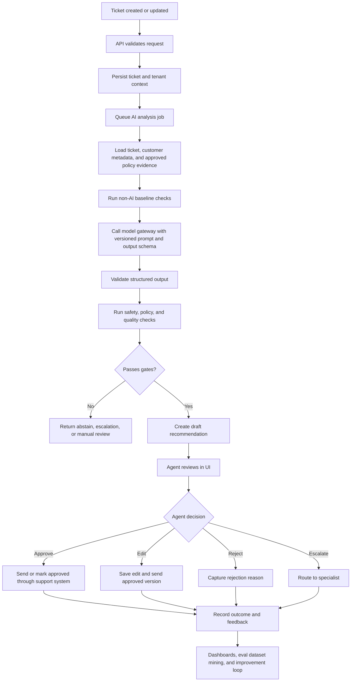

# SupportOps AI Copilot Production Implementation Guide

Updated: July 9, 2026

This file defines the mandatory core portfolio project:

> Build a production-grade support-operations AI copilot that helps support agents classify
> tickets, extract key fields, retrieve approved evidence, draft replies, require human approval,
> capture feedback, measure business value, and operate safely in production.

This is not a chatbot demo. It is a small version of how an enterprise AI product is actually
designed, built, evaluated, deployed, monitored, and improved.

## 1. Production outcome

The finished system should let a support agent open a customer ticket and receive:

- A controlled ticket category.
- Extracted structured fields.
- Priority and escalation recommendation.
- Relevant policy or account evidence.
- A draft response with citations or evidence references.
- A clear confidence and risk signal.
- A human approval workflow before anything is sent.
- Full traceability from output back to ticket, prompt, model, policy evidence, evaluator version,
  user action, cost, and latency.

The project is complete only when it has working software, tests, evaluation, security controls,
observability, deployment evidence, rollback instructions, and a business readout.

## 2. What production-ready means

A production-ready SupportOps AI Copilot has these properties:

| Area | Production expectation |
|---|---|
| Product | Solves a specific support workflow with measurable baseline, pilot metric, and adoption metric. |
| Backend | Typed API, database schema, auth, tenant isolation, background jobs, idempotency, and tests. |
| AI workflow | Structured model outputs, prompt versions, model routing, retries, timeouts, fallbacks, and traceability. |
| Human approval | Drafts are never sent automatically; agents approve, edit, reject, or escalate. |
| Evaluation | Fixed test set, regression suite, quality thresholds, cost and latency thresholds, failure analysis. |
| Security | Least privilege, no model-controlled authorization, PII handling, secret management, prompt-injection controls. |
| Observability | Logs, metrics, traces, quality dashboard, feedback dashboard, cost dashboard, alerts. |
| Deployment | Dockerized app, CI, staging, production environment, migration path, rollback path. |
| Operations | Incident process, model/prompt rollback, weekly evaluation review, feedback-to-improvement loop. |

## 3. End-to-end production flow



## 4. Core user journey

1. A customer submits a support ticket.
2. The backend stores the ticket under the correct tenant.
3. A background job starts AI analysis.
4. The system classifies the ticket, extracts fields, retrieves approved evidence, and drafts a
   response.
5. The agent sees the recommendation, evidence, confidence, and warnings.
6. The agent approves, edits, rejects, or escalates.
7. The system records the agent decision, final response, model output, prompt version, model
   version, cost, latency, and feedback.
8. Evaluation jobs mine failures and difficult examples for future regression tests.

## 5. Required perspectives

### Business perspective

Define the business problem before writing code.

Required decisions:

- Target team: support agents, support leads, QA reviewers, operations managers.
- Workflow: intake, triage, reply drafting, escalation, quality review.
- Baseline: current first-response time, resolution time, escalation rate, QA score, cost per case.
- Success metrics: time saved per ticket, draft acceptance rate, edit distance, resolution quality,
  escalation accuracy, customer satisfaction proxy, cost per successful task.
- Guardrail metrics: unsafe suggestion rate, unsupported claim rate, PII leakage rate, cross-tenant
  access failure rate, manual override rate.
- Launch decision: what result would justify pilot, expansion, rollback, or shutdown.

Deliverables:

- Product requirements document.
- Baseline measurement.
- Metric tree.
- Risk register.
- Pilot plan.

### Product and UX perspective

The product is for agents, not for the model.

Required UX behavior:

- Show model suggestions as drafts, not truth.
- Show evidence beside every recommendation.
- Show confidence and risk warnings in plain language.
- Make approval, edit, reject, and escalate actions explicit.
- Capture rejection reasons without slowing the agent too much.
- Do not hide latency; show job status for long-running analysis.
- Provide support-lead dashboards for adoption, quality, and cost.

Completion evidence:

- Agent review screen.
- Draft editor.
- Evidence panel.
- Feedback controls.
- Operator dashboard.
- UX notes explaining friction points and how they are instrumented.

### Engineering perspective

The project should be a normal production web system before it is an AI system.

Recommended stack:

- Backend: FastAPI.
- Validation: Pydantic.
- Database: PostgreSQL.
- Migrations: Alembic.
- Cache and job state: Redis.
- Background jobs: Celery, RQ, Dramatiq, or a cloud queue.
- Frontend: React or simple server-rendered UI.
- Observability: OpenTelemetry, Prometheus, Grafana, structured logs.
- AI provider access: model gateway service layer.
- Deployment: Docker, Docker Compose locally, one cloud target for production-style deployment.

## 6. Reference architecture

```text
supportops-ai-copilot/
  apps/
    api/                  FastAPI application
    worker/               background AI jobs and eval jobs
    web/                  agent review UI
  packages/
    domain/               business entities and use cases
    prompts/              prompt templates, schemas, versions, tests
    model_gateway/        provider adapters, retries, routing, cost tracking
    evals/                eval datasets, scoring, reports
    observability/        logging, metrics, tracing helpers
  infra/
    docker/
    terraform/
    dashboards/
  docs/
    product-requirements.md
    architecture.md
    threat-model.md
    eval-report.md
    cost-report.md
    incident-runbook.md
```

The exact structure can vary, but the separation should remain:

- API layer handles requests and auth.
- Domain layer owns business rules.
- Model gateway owns provider calls.
- Prompt package owns prompts and output schemas.
- Evaluation package owns quality measurement.
- Worker owns long-running analysis.
- UI owns human review.

## 7. Data model

Minimum production tables:

| Table | Purpose |
|---|---|
| tenants | Customer or business unit boundary. |
| users | Agents, leads, admins, service accounts. |
| tickets | Support ticket text, status, channel, metadata, tenant_id. |
| ticket_events | Ticket lifecycle events for audit and analytics. |
| customers | Optional customer metadata allowed for support workflow. |
| policies | Approved support policy snippets or knowledge records. |
| ai_runs | One model workflow attempt per ticket or task. |
| ai_outputs | Structured classification, extraction, priority, draft, evidence IDs. |
| approvals | Agent approval, edit, reject, escalation, timestamps, reasons. |
| feedback | Agent rating, edit distance, QA review, outcome labels. |
| prompt_versions | Prompt name, version, schema, changelog. |
| model_routes | Provider, model, parameters, fallback route. |
| eval_cases | Fixed regression and benchmark-like cases. |
| eval_results | Scores, failures, model/prompt version, run metadata. |
| cost_events | Token usage, provider cost, feature, tenant, user, request ID. |
| audit_logs | Security-sensitive actions and administrative changes. |

Important data rules:

- Every business row that belongs to a customer must include `tenant_id`.
- Authorization is enforced in application code and database queries.
- The model never decides whether a user can see a ticket, policy, or customer record.
- Raw ticket text and model input/output must follow retention and redaction rules.
- Deletions must propagate to derived records when legally or contractually required.

## 8. API contracts

Minimum endpoints:

| Endpoint | Purpose |
|---|---|
| `POST /tickets` | Create or ingest a ticket. |
| `GET /tickets/{ticket_id}` | Fetch a ticket with authorization checks. |
| `POST /tickets/{ticket_id}/analyze` | Start AI analysis job. |
| `GET /tickets/{ticket_id}/analysis` | Read latest AI recommendation and status. |
| `POST /tickets/{ticket_id}/approval` | Approve, edit, reject, or escalate a draft. |
| `POST /feedback` | Capture agent or QA feedback. |
| `GET /metrics/product` | Product and adoption metrics. |
| `GET /metrics/quality` | Evaluation and model-quality metrics. |
| `GET /metrics/cost` | Cost by feature, tenant, model, and time range. |
| `GET /health` | Liveness check. |
| `GET /ready` | Readiness check including dependencies. |

Contract requirements:

- Request and response schemas are typed.
- Invalid structured AI output cannot reach business logic.
- Idempotency keys are used for ticket ingestion and approval actions.
- Long-running AI jobs return job status instead of blocking the request indefinitely.
- Every API request has a correlation ID.

## 9. AI workflow

The AI workflow should be a controlled pipeline, not one giant prompt.

Recommended tasks:

1. Classify the ticket into a controlled category set.
2. Extract key fields such as product, issue type, order ID, urgency signal, refund request, account
   risk, and missing information.
3. Recommend priority and escalation path.
4. Retrieve approved policy evidence.
5. Draft an agent-review response.
6. Run output checks.
7. Store recommendation for human review.

Suggested controlled categories:

- Billing.
- Refund.
- Account access.
- Technical issue.
- Delivery or fulfillment.
- Cancellation.
- Complaint.
- Security or fraud concern.
- Other or unclear.

Output schema example:

```json
{
  "category": "billing",
  "category_confidence": 0.84,
  "priority": "normal",
  "requires_escalation": false,
  "extracted_fields": {
    "order_id": "optional string",
    "product": "optional string",
    "requested_action": "refund"
  },
  "evidence_ids": ["policy_123"],
  "draft_response": "string",
  "abstain": false,
  "risk_flags": ["string"],
  "missing_information": ["string"]
}
```

Production rules:

- Use schema-constrained output where available.
- Validate model output with Pydantic or equivalent.
- Separate trusted instructions from untrusted ticket text.
- Do not put secrets, system prompts, or hidden policy into user-visible content.
- Use timeouts and bounded retries.
- Store prompt version, model version, parameters, and input hash.
- Store enough trace data to debug, but redact sensitive content where needed.

## 10. Prompt package

Create prompts as versioned product assets.

Minimum prompt files:

- `classify_ticket.v1.md`
- `extract_fields.v1.md`
- `recommend_priority.v1.md`
- `draft_response.v1.md`
- `safety_check.v1.md`

Each prompt must include:

- Task definition.
- Allowed inputs.
- Output schema.
- Policy for uncertainty and abstention.
- Examples using synthetic or approved data.
- Injection warning: ticket text is untrusted.
- Changelog.
- Regression tests.

Prompt release process:

1. Author prompt change.
2. Run unit tests for schema and formatting.
3. Run fixed eval set.
4. Compare against previous prompt version.
5. Review failures.
6. Approve or reject prompt release.
7. Tag prompt version.
8. Deploy behind feature flag or config route.

## 11. Human approval workflow

Human approval is the core safety control.

Approval states:

- `pending_ai_analysis`
- `ai_analysis_failed`
- `ready_for_review`
- `approved_without_edit`
- `approved_with_edit`
- `rejected`
- `escalated`
- `sent`

Agent actions:

- Approve draft.
- Edit draft and approve.
- Reject suggestion.
- Escalate to specialist.
- Mark evidence as irrelevant.
- Flag unsafe or unsupported output.

Data to capture:

- Original model draft.
- Final agent-approved response.
- Edit distance or structured edit summary.
- Approval time.
- Rejection reason.
- Escalation reason.
- Agent ID.
- Ticket outcome when available.

This feedback becomes evaluation and improvement data.

## 12. Evaluation system

The evaluation system proves quality before launch and catches regressions after launch.

Evaluation datasets:

- Golden set: fixed labelled tickets for classification, extraction, priority, and draft quality.
- Difficult set: edge cases, ambiguous tickets, angry customers, missing data, multilingual cases,
  policy conflicts, refund edge cases.
- Safety set: prompt injection, PII leakage, unsupported claims, cross-tenant attempts, harmful or
  policy-violating requests.
- Product set: real or synthetic pilot tickets with expected agent decision and business outcome.

Metrics:

| Task | Metrics |
|---|---|
| Classification | Accuracy, macro F1, confusion matrix, abstention rate. |
| Extraction | Field precision, recall, exact match, missing-field correctness. |
| Priority | Agreement with support lead, false escalation, missed escalation. |
| Evidence | Evidence precision, evidence recall, unsupported claim rate. |
| Draft | Rubric score, policy compliance, tone, completeness, edit distance. |
| Safety | Injection resistance, PII leakage rate, unsafe suggestion rate. |
| Product | Acceptance rate, edit rate, time saved, cost per accepted draft. |
| Operations | Latency, error rate, timeout rate, fallback rate, cost per ticket. |

Release gates:

- Classification macro F1 meets the chosen threshold.
- Critical extraction fields meet threshold.
- Unsupported claim rate is below threshold.
- Safety set has zero critical failures.
- Cost per successful ticket is within budget.
- P95 latency is acceptable for the workflow.
- Human approval is mandatory for outbound customer messages.

Evaluation report must include:

- Dataset description.
- Labeling method.
- Metrics and thresholds.
- Model and prompt versions.
- Failure clusters.
- Launch recommendation.
- Open risks.

## 13. Observability and cost

Instrument the system from the first production-like version.

Logs:

- Request ID.
- Tenant ID.
- User ID.
- Ticket ID.
- Job ID.
- AI run ID.
- Prompt version.
- Model route.
- Approval action.
- Error class.

Metrics:

- Ticket ingestion count.
- AI jobs started, succeeded, failed, timed out.
- Model latency.
- End-to-end ticket analysis latency.
- Token usage.
- Cost by model, feature, tenant, and time.
- Draft acceptance rate.
- Edit rate.
- Rejection rate.
- Escalation rate.
- Unsupported claim rate.
- Safety failure rate.
- Evaluation pass rate.

Traces:

- API request.
- Database queries.
- Queue job.
- Policy retrieval.
- Model gateway call.
- Output validation.
- Approval action.

Dashboards:

- Operations dashboard: latency, errors, dependencies, queue depth.
- Quality dashboard: eval score, failure categories, safety failures.
- Product dashboard: adoption, acceptance, edits, time saved.
- Cost dashboard: cost per request, cost per accepted draft, tenant cost.
- Executive dashboard: pilot health, ROI proxy, risk status.

Alerts:

- AI job failure spike.
- P95 latency breach.
- Cost spike.
- Safety failure.
- Cross-tenant authorization failure.
- Eval regression on release candidate.

## 14. Security, privacy, and governance

Security controls:

- Authentication for all user actions.
- Role-based authorization for tickets, policies, metrics, and admin functions.
- Tenant isolation in every query.
- Service identity for background workers.
- Secrets stored in environment or secret manager, not code.
- Model provider keys never appear in logs or UI.
- Prompt injection tests in CI.
- PII redaction for telemetry where required.
- Audit logs for approval, send, admin, prompt-route changes, and policy changes.

Privacy controls:

- Define what customer data can be sent to model providers.
- Redact or minimize sensitive fields when possible.
- Document retention for tickets, prompts, model inputs, outputs, traces, and feedback.
- Support deletion or export workflows if the business context requires them.
- Use synthetic data for public portfolio demos unless real data is explicitly approved.

Governance controls:

- AI system card.
- Dataset card.
- Prompt and model changelog.
- Risk register.
- Human oversight policy.
- Incident response plan.
- Vendor/model provider assessment.

## 15. Deployment architecture

Local development:

```text
Docker Compose:
  api
  worker
  web
  postgres
  redis
  observability stack
```

Staging:

- Same migrations and deployment process as production.
- Uses test model route or low-risk provider configuration.
- Runs eval gates before promotion.
- Contains synthetic or approved staging data.

Production-style deployment:

- API service.
- Worker service.
- Web service.
- Managed PostgreSQL.
- Managed Redis or queue.
- Secret manager.
- Container registry.
- Load balancer.
- Metrics/logging/tracing backend.
- Backup and restore plan.

Release flow:

1. Pull request.
2. Unit tests.
3. Integration tests.
4. Security tests.
5. Prompt/eval regression tests.
6. Build container images.
7. Deploy to staging.
8. Run smoke tests.
9. Run eval suite against staging route.
10. Approve release.
11. Deploy production canary.
12. Monitor metrics.
13. Expand or rollback.

Rollback strategy:

- Roll back application image.
- Roll back prompt route to previous version.
- Roll back model route to previous provider/model.
- Disable AI analysis with feature flag.
- Keep manual support workflow available.

## 16. Step-by-step implementation plan

### Phase 0: Discovery and acceptance criteria

1. Select one support domain such as billing, refunds, account access, or delivery issues.
2. Write the current workflow.
3. Define users: agent, lead, admin, customer.
4. Define baseline metrics.
5. Define success and guardrail metrics.
6. Write the PRD.
7. Create risk register.
8. Decide what the first pilot will and will not do.

Exit criteria:

- PRD approved.
- Metric tree exists.
- Pilot scope is narrow.
- Non-AI fallback is documented.

### Phase 1: Repository and local platform

1. Create the repo and package structure.
2. Add Python version pinning and dependency lock.
3. Add FastAPI, Pydantic, pytest, Ruff, mypy.
4. Add Docker Compose with API, worker, PostgreSQL, Redis.
5. Add GitHub Actions CI.
6. Add health and readiness endpoints.
7. Add structured logging and correlation IDs.

Exit criteria:

- Fresh clone runs locally.
- CI passes.
- Health checks pass.
- No secrets are committed.

### Phase 2: Core backend and data layer

1. Create tenant, user, ticket, ticket event, policy, AI run, AI output, approval, feedback, and
   audit tables.
2. Add migrations.
3. Implement ticket ingestion.
4. Implement ticket retrieval with tenant authorization.
5. Implement idempotency for ingestion.
6. Add API tests and cross-tenant tests.
7. Add seed data with synthetic tickets and policies.

Exit criteria:

- Migrations run on a fresh database.
- Cross-tenant access tests fail correctly.
- Ticket ingestion is idempotent.
- OpenAPI contract is generated.

### Phase 3: Non-AI baseline

1. Implement simple keyword/rule-based classification.
2. Implement basic field extraction with regex or deterministic parsing.
3. Implement priority rules.
4. Implement a template-based draft response.
5. Measure baseline quality.

Exit criteria:

- Baseline works without any model provider.
- Baseline metrics are recorded.
- AI improvement can be measured against something real.

### Phase 4: Model gateway

1. Create provider adapter interface.
2. Add one hosted model provider.
3. Add request timeout, retry, fallback, and error classification.
4. Add token and cost tracking.
5. Add request and response tracing.
6. Add schema-constrained output or schema validation.
7. Add mock provider for tests.

Exit criteria:

- Provider-specific code is isolated.
- Model failures produce controlled errors.
- Cost is attributable by ticket, user, tenant, and feature.
- Tests run without real provider calls.

### Phase 5: Prompt package

1. Write classification prompt.
2. Write extraction prompt.
3. Write priority recommendation prompt.
4. Write draft response prompt.
5. Write safety check prompt.
6. Add Pydantic output schemas.
7. Add prompt version registry.
8. Add prompt regression fixtures.

Exit criteria:

- Every prompt has a version.
- Every prompt has a schema.
- Invalid output is rejected.
- Prompt regression tests run in CI.

### Phase 6: AI analysis workflow

1. Add `POST /tickets/{ticket_id}/analyze`.
2. Queue analysis job.
3. Load ticket, tenant, allowed customer metadata, and approved policy snippets.
4. Run classification, extraction, priority, evidence selection, draft generation, and safety checks.
5. Persist AI run and AI output.
6. Return job status to UI.
7. Handle failure with manual review fallback.

Exit criteria:

- AI job is asynchronous.
- Every run is traceable.
- Failures do not block normal ticket handling.
- Drafts are stored as recommendations, not sent messages.

### Phase 7: Agent review UI

1. Build ticket list.
2. Build ticket detail view.
3. Show category, extracted fields, priority, evidence, risk flags, and draft.
4. Add approve, edit, reject, and escalate actions.
5. Capture feedback and rejection reasons.
6. Show model/prompt version and generated timestamp for audit.

Exit criteria:

- Agent can complete the full review workflow.
- Edits are stored.
- Rejections are stored.
- Escalations are stored.
- No AI draft is sent without approval.

### Phase 8: Evaluation harness

1. Build labelled golden dataset.
2. Build difficult-case dataset.
3. Build safety dataset.
4. Add scoring scripts.
5. Add model/prompt comparison report.
6. Add CI regression gate for critical checks.
7. Add manual review workflow for new failure cases.

Exit criteria:

- Eval report exists.
- Thresholds are explicit.
- Release can fail because of eval regression.
- Failure cases are added back to the dataset.

### Phase 9: Observability and dashboards

1. Add OpenTelemetry traces.
2. Add structured logs.
3. Add Prometheus metrics or cloud metrics.
4. Create operational dashboard.
5. Create quality dashboard.
6. Create product dashboard.
7. Create cost dashboard.
8. Add alerts for failures, latency, cost, and safety.

Exit criteria:

- One ticket is traceable end to end.
- Cost per accepted draft is visible.
- Product adoption is visible.
- Eval and safety failures are visible.

### Phase 10: Security and privacy hardening

1. Add role-based access control.
2. Add tenant-isolation tests.
3. Add prompt-injection tests.
4. Add PII redaction or minimization.
5. Add audit logs.
6. Add secret-management plan.
7. Add threat model.
8. Add retention and deletion rules.

Exit criteria:

- Security tests run in CI.
- Threat model is documented.
- Authorization is outside model control.
- Sensitive telemetry is protected.

### Phase 11: Deployment

1. Build container images.
2. Configure environment variables and secrets.
3. Configure managed database or production-like database.
4. Run migrations.
5. Deploy API, worker, and web services.
6. Configure logging, metrics, and traces.
7. Run smoke tests.
8. Run eval suite against staging.
9. Document rollback.

Exit criteria:

- Staging deployment works.
- Production-style deployment works or is clearly simulated.
- Rollback instructions are tested.
- Cost controls are documented.

### Phase 12: Pilot and release

1. Select a small ticket category.
2. Enable the copilot for a small agent group.
3. Monitor acceptance, edit, rejection, latency, cost, and safety metrics.
4. Review failure cases daily during pilot.
5. Decide expand, iterate, or rollback.
6. Write pilot report.

Exit criteria:

- Pilot report has business, quality, safety, cost, and UX findings.
- Decision is evidence-backed.
- Next iteration is prioritized.

### Phase 13: Operations and continuous improvement

1. Hold weekly eval review.
2. Mine rejected and heavily edited drafts.
3. Add new difficult cases to eval set.
4. Tune prompts or model route.
5. Compare against baseline.
6. Release through eval gate.
7. Monitor after release.
8. Write incident reports for regressions.

Exit criteria:

- Feedback loop is active.
- Prompt/model changes are versioned.
- Regressions are caught or documented.
- The system improves without losing traceability.

## 17. Completion evidence checklist

The project is not done until each item is present.

Product:

- PRD.
- Workflow map.
- Baseline metrics.
- Success and guardrail metrics.
- Pilot report.

Engineering:

- Running API.
- Running worker.
- Running UI.
- Database migrations.
- Tests.
- CI.
- Docker Compose.

AI:

- Prompt registry.
- Model gateway.
- Structured outputs.
- Prompt regression tests.
- Model/prompt comparison.
- Fallback behavior.

Human review:

- Draft review UI.
- Approval/edit/reject/escalate flow.
- Feedback capture.
- Audit trail.

Evaluation:

- Golden dataset.
- Difficult dataset.
- Safety dataset.
- Evaluation report.
- Regression gate.
- Failure analysis.

Security:

- Auth and authorization.
- Tenant-isolation tests.
- Prompt-injection tests.
- PII policy.
- Threat model.
- Audit logs.

Operations:

- Logs.
- Metrics.
- Traces.
- Dashboards.
- Alerts.
- Cost report.
- Rollback runbook.

Portfolio:

- README.
- Architecture diagram.
- Demo video or screenshots.
- Eval report.
- Cost report.
- Threat model.
- Postmortem or failure-analysis note.
- Interview defense notes.

## 18. Industry-level implementation order

In industry, the order is usually not "build model first." The practical order is:

1. Business workflow and metric definition.
2. Data access, authorization, and audit model.
3. Non-AI backend workflow.
4. Human review workflow.
5. Baseline automation.
6. Model-assisted automation.
7. Evaluation and regression gates.
8. Observability and cost tracking.
9. Security and privacy review.
10. Staging deployment.
11. Limited pilot.
12. Controlled rollout.
13. Weekly improvement loop.

This order matters because the model is only one component. The production value comes from the
workflow around it: correct data, safe permissions, human approval, measurable outcomes, and a
repeatable release process.

## 19. Common failure modes

| Failure | Prevention |
|---|---|
| Building a chatbot instead of a workflow | Start from agent review and approval flow. |
| No baseline | Implement rules/templates first. |
| No eval dataset | Build golden, difficult, and safety sets before launch. |
| Untraceable outputs | Store prompt version, model route, input hash, evidence IDs, and run metadata. |
| Model controls authorization | Enforce permissions in backend and database queries only. |
| No feedback loop | Capture edits, rejections, escalations, and QA outcomes. |
| Cost surprise | Track tokens and cost per ticket from the first model call. |
| Demo-only UI | Build real approve/edit/reject/escalate actions. |
| Unsafe automation | Require human approval before sending customer-facing responses. |
| Vague success claim | Use baseline, pilot metrics, and launch decision report. |

## 20. Interview defense questions

Be ready to answer:

- What support workflow did you choose and why?
- What was the non-AI baseline?
- What did the model improve?
- What did the model make worse?
- How did you evaluate classification, extraction, evidence, and draft quality?
- What were your release thresholds?
- How did you prevent cross-tenant data exposure?
- How did you handle prompt injection?
- Why did you choose this model route?
- What was the cost per accepted draft?
- What was the P95 latency?
- How did agent edits change your eval dataset?
- What would you rollback first: prompt, model, app, or feature flag?
- What would you build next?

## 21. Final definition of done

The SupportOps AI Copilot is production-ready for portfolio purposes when a reviewer can:

1. Clone the repo.
2. Start the local stack.
3. Ingest synthetic tickets.
4. Run AI analysis.
5. Review evidence-backed drafts.
6. Approve, edit, reject, or escalate.
7. See feedback recorded.
8. Run tests and evals.
9. Inspect dashboards or exported metrics.
10. Read the architecture, threat model, eval report, cost report, and rollback runbook.

If any of those steps is missing, the project is still a partial implementation.
