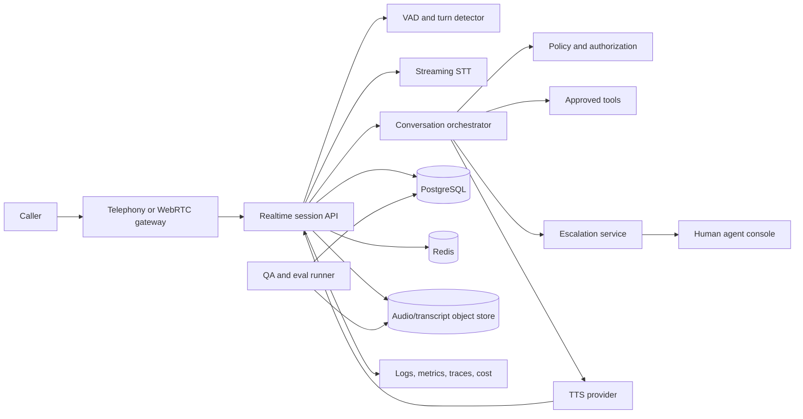

# Voice Triage and Escalation Agent Production Implementation Guide

Updated: July 28, 2026

This file defines the fourth integrated portfolio project:

> Build a production-grade real-time voice triage agent that receives inbound calls or web voice
> sessions; discloses AI use and recording policy; streams speech-to-text, turn detection,
> controlled reasoning, tool-assisted triage, text-to-speech, interruption handling, and human
> escalation; and proves latency, task quality, safety, privacy, reliability, and cost through
> evaluation and operational evidence.

This is not a voice chatbot demo. It is a bounded voice intake and escalation system. It can gather
information, classify intent, answer approved low-risk questions, call approved read-only or
low-risk tools, create a structured handoff, and escalate to a human. It must not impersonate a
human, hide AI involvement, continue recording without policy and consent, handle emergencies as an
autonomous responder, or execute consequential actions without an approved workflow.

Companion: the
[Voice Triage and Escalation Agent Technical Implementation Guide](Voice-Triage-and-Escalation-Agent-Technical-Implementation-Guide.md)
turns these requirements into an executable repository and staged build. This production guide is
the normative source when the two guides conflict; material changes should update both files in the
same pull request.

## Source alignment

This guide operationalizes the local curriculum and research rather than replacing them:

- The project is the fourth integrated portfolio project in the
  [research project mapping](./deep-research-report.md#project-mapping), compressed from
  `VoiceTriage`.
- The project covers streaming voice, real-time workflow constraints, escalation, and
  consent/retention controls as called out in the
  [integrated portfolio projects](./deep-research-report.md#integrated-portfolio-projects).
- Curriculum scope comes from
  [Multimodal, document, speech, and voice AI](./AI-Industry-Curriculum.md#multimodal-document-speech-and-voice-ai).
- Completion evidence aligns to
  [Lesson 03 - Async Python and Service Patterns](./AI-Industry-Complete-Lesson-Coverage-Map.md),
  [Lesson 15 - AI Evaluation Engineering](./AI-Industry-Complete-Lesson-Coverage-Map.md#lesson-15--ai-evaluation-engineering),
  [Lesson 17 - Agents and Tool-Using Systems](./AI-Industry-Complete-Lesson-Coverage-Map.md),
  [Lesson 27 - Speech, Audio, and Voice AI](./AI-Industry-Complete-Lesson-Coverage-Map.md#lesson-27--speech-audio-and-voice-ai),
  [Lesson 28 - AI Security and Privacy](./AI-Industry-Complete-Lesson-Coverage-Map.md#lesson-28--ai-security-and-privacy),
  [Lesson 29 - AI Governance and Risk Management](./AI-Industry-Complete-Lesson-Coverage-Map.md#lesson-29--ai-governance-and-risk-management),
  [Lesson 30 - Production Architecture and Reliability](./AI-Industry-Complete-Lesson-Coverage-Map.md),
  [Lesson 31 - Observability, Feedback, and Cost](./AI-Industry-Complete-Lesson-Coverage-Map.md),
  and [Lesson 50 - Multimodal AI Specialization](./AI-Industry-Complete-Lesson-Coverage-Map.md#lesson-50--multimodal-ai-specialization).
- Roadmap scope aligns to
  [Phase 6 - Multimodal, document and voice AI](./AI-Industry-Roadmap-and-Projects.md#phase-6--multimodal-document--voice-ai-lessons-2627).

When this guide is more specific than a source document, the specificity is an implementation
decision for this project. Record material choices as architecture decision records.

## Evidence and verification vocabulary

Every stage document, report, checklist, and README status must use one of these terms:

| Status | Meaning |
|---|---|
| `planned` | Scope and acceptance criteria exist; implementation has not been claimed. |
| `implemented` | Code or configuration exists; no verification claim is implied. |
| `locally verified` | Reproducible checks passed in a named local environment. |
| `externally verified` | Checks passed in CI, staging, or another independently identified environment. |
| `operationally proven` | The capability met its SLO or acceptance gate during a controlled pilot or production-like exercise. |

Use `Verified` and `Not Verified` sections in stage records. A statement such as "latency is good"
is invalid unless it names the call path, workload, network condition, provider versions, command
or procedure, metric, environment, evidence location, and date. Never use `complete`,
`production-ready`, or `operationally proven` as a substitute for evidence.

## 1. Production outcome

The finished system should let a caller:

- Hear a clear AI disclosure and recording/retention disclosure before meaningful collection.
- Opt out or request a human when policy requires that option.
- Speak naturally, be interrupted safely, and receive low-latency responses.
- Complete a bounded triage workflow without repeating already captured information.
- Receive clarification when the system is uncertain.
- Be escalated to a human with a concise handoff when needed.
- Avoid hidden recording, undisclosed AI use, or unsafe automation.

The system should let a human agent:

- Receive a structured handoff with caller goal, transcript summary, verified details, tool
  results, risk flags, consent state, and open questions.
- Listen to or read only authorized call evidence under the retention and redaction policy.
- See why the agent escalated: low confidence, caller request, emergency signal, policy rule,
  tool failure, sensitive topic, abusive content, or unsupported request.
- Correct transcript, intent, entity, and escalation labels for quality review.
- Resume the conversation without relying on hidden model reasoning.

The system should let a supervisor:

- Monitor containment, escalation reasons, average handle time, latency, caller abandonment, task
  completion, human override, complaint rate, and safety events.
- Review sampled calls for disclosure, consent, tone, accuracy, and escalation quality.
- Tune routing and business rules through reviewed releases, not ad hoc prompt edits.

The system should let an operator:

- Trace one voice session across telephony or WebRTC ingress, audio frames, VAD, STT, turn
  detection, orchestration, tool calls, TTS, playback, interruption, escalation, latency, and cost.
- Compare STT, TTS, VAD, prompt, model, and routing versions.
- See real-time dependency health, queue backlogs, audio quality, provider failures, safety
  events, retention jobs, and cost.
- Release or roll back ASR, VAD, turn detector, prompt, model, tool policy, TTS voice, routing
  rules, escalation policy, and UI versions independently where safe.

The project is complete only when it has working software, reproducible tests, fixed evaluation
sets, latency measurements, turn-taking and interruption proof, consent/recording controls,
security controls, observable SLOs, deployment and recovery evidence, a controlled pilot readout,
and an honest record of what remains unverified.

## 2. Business problem, users, scope, and non-goals

### Business problem

Inbound teams lose time on repetitive intake, routing, status checks, and information gathering.
Traditional IVR trees are rigid, callers dislike repeated prompts, and human agents often receive
poor context. A voice AI system can reduce wait time and improve handoff quality, but voice has
stricter constraints than text: real-time latency, interruption, background noise, accents,
consent, recording laws, emergency handling, and caller trust.

### Primary users

| Persona | Need | Risk if the system fails |
|---|---|---|
| Caller | Get routed or helped quickly. | Confusion, delay, privacy violation, unsafe handling, abandonment. |
| Human agent | Receive concise, accurate handoff. | Repeated questions, missed details, wrong routing, poor customer experience. |
| Supervisor | Monitor quality, workload, and escalation. | Cannot diagnose failures or staffing impact. |
| Compliance/privacy reviewer | Prove disclosure, consent, retention, and human oversight. | Cannot reconstruct what was recorded, used, retained, or deleted. |
| QA or annotation reviewer | Label transcripts, intents, entities, interruptions, and escalations. | Evaluation data becomes noisy or biased. |
| Platform or security operator | Run, monitor, recover, and investigate the service. | Outage, leakage, runaway cost, incomplete incident evidence. |

### Initial domain

Use public, synthetic, or explicitly authorized voice sessions for one bounded support workflow.
Examples:

- Appointment or reservation triage.
- Customer support status check.
- IT helpdesk intake.
- Insurance claim intake routing without adjudication.
- Facility maintenance request triage.

Version 1 should choose one domain, one language, one primary accent/noise profile for pilot
measurement, one escalation destination, and one or two approved read-only tools. Do not begin
with every contact-center queue, every language, every dialect, emergency dispatch, or regulated
decision-making.

Version 1 is English-only unless a language-specific speech and task evaluation pack is approved.
Record detected language and confidence on every session and turn. Confidently unsupported language
must route to human or supported fallback with a typed reason. Do not silently translate live calls
and claim production multilingual support. Adding a language requires STT, TTS, turn-taking,
prompt, safety, privacy, escalation, and evaluation evidence for that language.

### Required scope

- Web or telephony voice ingress with explicit local-development path.
- AI and recording/retention disclosure.
- Consent state capture and policy enforcement.
- Audio streaming, buffering, sampling-rate handling, and jitter controls.
- Voice activity detection, endpointing, turn detection, interruption, and barge-in.
- Streaming or near-real-time STT.
- Bounded conversation orchestration with structured state.
- Approved tool calls during voice sessions.
- TTS playback with interruption support.
- Human escalation and structured handoff.
- Transcript, summary, tool result, escalation, consent, and audit evidence.
- Public speech benchmark plus business-task voice evaluation.
- Security, privacy, retention, observability, cost, deployment, rollback, and recovery.

### Explicit non-goals for the first release

- Emergency dispatch, medical triage, mental-health crisis handling, legal advice, credit
  decisions, employment decisions, or high-impact eligibility decisions.
- Impersonating a human or hiding AI involvement.
- Recording without policy, disclosure, and consent controls.
- Selling, upselling, collecting payment, cancelling service, issuing refunds, changing account
  access, or performing consequential writes without a separate approved workflow.
- Autonomous outbound calling.
- Broad open-ended customer-service coverage.
- Training a foundation speech or language model.
- Perfect accent, dialect, code-switching, or noisy-audio support.
- Speaker identification as identity verification.
- Emotion detection as a decision input.
- Using hidden chain-of-thought as audit evidence.
- Treating a model confidence number as calibrated confidence without calibration evidence.
- Treating public ASR benchmark performance as business-task success.

Non-goals may become later experiments, but they do not weaken the production requirements in this
guide.

## 3. Business outcomes and metric tree

Measure the current workflow before adding voice automation.

Required baseline:

- Median and P95 caller wait time.
- Average handle time.
- Abandonment rate.
- Transfer rate.
- Wrong-route rate.
- First-contact resolution or successful routing rate.
- Human agent intake time.
- Caller repetition rate.
- Complaint or QA defect rate.
- Cost per handled call or successful triage.

Primary outcome metrics:

| Outcome | Example measure |
|---|---|
| Faster routing | Median and P95 time to correct queue or answer. |
| Better agent handoff | Human-rated handoff completeness and reduced repeated questions. |
| Better containment | Percentage of low-risk tasks completed without human intervention. |
| Better caller experience | Abandonment, caller barge-in frustration, satisfaction, complaint rate. |
| Better safety | Correct escalation on emergency, sensitive, unsupported, or low-confidence sessions. |
| Sustainable economics | Cost per successful triage and cost per contained session. |

Guardrail metrics:

- Disclosure failure rate.
- Consent-policy violation rate.
- Recording-retention violation rate.
- Incorrect non-escalation rate.
- Wrong-route rate.
- Unsupported automation rate.
- Tool-call error or unauthorized tool-call rate.
- STT word error rate and intent/entity error rate.
- TTS playback failure rate.
- Barge-in miss and false-barge-in rate.
- P50, P95, and P99 latency by stage and end to end.
- Caller abandonment during AI interaction.
- Sensitive-data exposure rate.
- Provider, network, VAD, STT, LLM, tool, TTS, and escalation failure rates.

Do not claim success from call containment alone. A system that contains more calls by failing to
escalate uncertainty or risk has failed.

## 4. What production-ready means

Production-ready for this project means:

- A voice session can be handled end to end from disclosure to triage result or human handoff.
- AI disclosure, recording disclosure, consent state, and opt-out behavior are implemented and
  audited.
- Audio ingestion, STT, turn detection, orchestration, tool calls, TTS, interruption, and
  escalation are separately observable.
- The agent uses bounded states and tools, not an unconstrained autonomous loop.
- Every tool call has typed arguments, authorization, idempotency where needed, timeout, and audit.
- Escalation is easy for callers and automatic for defined risk conditions.
- Transcript and summary evidence are clearly labelled by source and confidence.
- Evaluation separately measures speech quality, task quality, turn-taking, escalation, safety,
  latency, and cost.
- Deployment, rollback, restore, cost, and incident procedures are reproducible.

The smallest acceptable pilot may support a narrow workflow, but it must still prove the full
control loop: disclosure, consent, streaming audio, turn-taking, task execution, interruption,
escalation, audit, evaluation, observability, and rollback.

## 5. Non-negotiable requirements

| ID | Requirement |
|---|---|
| VTA-CONSENT-01 | Disclose AI use and recording/retention policy before meaningful collection. |
| VTA-CONSENT-02 | Persist consent state and enforce it for recording, transcript, summary, and training/eval use. |
| VTA-AUDIO-01 | Stream audio with bounded buffering, sampling-rate handling, and jitter tolerance. |
| VTA-TURN-01 | Detect speech activity, endpointing, interruptions, and barge-in with measurable latency. |
| VTA-STT-01 | Record STT provider, model, language, partial/final transcript, confidence, and timestamps. |
| VTA-TTS-01 | Synthesize responses with playback state, interruption support, and fallback behavior. |
| VTA-STATE-01 | Use explicit conversation states, termination conditions, and max duration/turn/spend limits. |
| VTA-TOOL-01 | Tool calls require typed schemas, authorization outside the model, timeouts, rate limits, and audit. |
| VTA-ESC-01 | Caller request, emergency signal, unsupported request, low confidence, tool failure, and policy rules route to humans. |
| VTA-HANDOFF-01 | Human handoff includes summary, verified details, open questions, risk flags, tool results, and consent state. |
| VTA-EVAL-01 | Public speech benchmark and business-task voice results are both reported. |
| VTA-EVAL-02 | Release gates include latency, turn-taking, STT quality, task success, escalation, safety, and privacy slices. |
| VTA-SEC-01 | Authorization lives outside the model and is enforced on sessions, tools, transcripts, recordings, handoffs, exports, and audit views. |
| VTA-PRIV-01 | Audio, transcripts, summaries, tool results, and recordings are minimized, redacted where appropriate, retained by policy, and excluded from unsafe logs. |
| VTA-OPS-01 | Audio, turn, model, tool, escalation, latency, quality, cost, and failure metrics are observable by correlation ID. |
| VTA-REL-01 | Failed sessions, provider outages, dropped connections, and tool failures degrade safely and are reconstructable. |
| VTA-REL-02 | STT, VAD, TTS, prompt, model, tool, route, escalation, and policy versions are recorded and rollback-capable. |

## 6. Core journeys and required UX

### Voice session journey

1. A caller starts a telephony or browser voice session.
2. The system establishes audio transport and creates a session ID.
3. The system plays AI disclosure and recording/retention disclosure.
4. Consent state is captured or inferred only according to policy.
5. The system streams audio to VAD and STT.
6. Partial transcripts update session state but do not trigger high-risk actions.
7. End-of-turn detection triggers orchestration.
8. The agent clarifies, answers approved questions, calls approved tools, or escalates.
9. TTS plays responses while monitoring for interruption.
10. The session ends with resolution, escalation, caller hang-up, timeout, or failure state.

The caller must be able to request a human at any point in the supported policy.

### Disclosure and consent journey

The first production release must define:

- AI disclosure wording.
- Recording disclosure wording.
- Whether silence, keypress, speech, or continued use counts as consent.
- What happens when consent is denied or unclear.
- Which artifacts are created without consent.
- Which artifacts require consent.
- Retention periods for audio, transcripts, summaries, tool results, and logs.
- How callers can request deletion or correction where policy allows.

The implementation must not bury consent in a README. It must be enforced in runtime behavior,
audit logs, retention jobs, exports, and evaluation-data promotion.

### Interruption and barge-in journey

Interruption handling must support:

- Detect caller speech during TTS playback.
- Stop or duck playback within the declared latency target.
- Cancel or mark stale any in-flight response that should no longer be spoken.
- Preserve the interrupted response in trace/audit only according to retention policy.
- Resume with the caller's new utterance.
- Avoid false interruption from noise or echo as much as the release thresholds require.

Barge-in is not optional for a realistic voice agent. If it remains planned, the project cannot
claim real-time voice readiness.

### Tool-assisted triage journey

Tools may be used only for approved operations. Examples:

- Look up appointment status.
- Check ticket status.
- Create a draft intake note.
- List available routing queues.
- Read known service hours.
- Open a knowledge-base answer.

The model proposes a tool call; the service validates authorization, schema, rate, timeout, and
business policy. Consequential writes remain out of scope unless a separate approval workflow is
implemented.

### Human escalation journey

Escalation must occur when:

- Caller requests a human.
- Emergency or safety keyword/risk is detected.
- Consent is denied or uncertain and policy requires a human.
- Language is unsupported.
- Audio quality is too low.
- STT confidence or intent confidence is too low.
- Tool call fails or returns conflicting data.
- The request is unsupported or high risk.
- The caller is frustrated, abusive, or repeatedly interrupts under the escalation policy.
- Max turns, duration, or spend is reached.

The human handoff must include concise context, not hidden reasoning:

- Caller goal.
- Consent and recording state.
- Transcript summary with confidence.
- Verified details and open questions.
- Tool calls and results.
- Escalation reason.
- Risk flags.
- Session timeline and correlation ID.

### Post-call review journey

The review UI must support:

- Session playback or transcript view when authorized and retained.
- Turn-by-turn transcript with timestamps and STT confidence.
- TTS response history.
- Barge-in and interruption markers.
- Tool-call and escalation trace.
- Human labels for intent, entity, task success, escalation quality, consent quality, and safety.
- Redaction of sensitive segments.
- Dataset-promotion workflow after QA and privacy review.

## 7. Access, consent, and policy-first architecture

Authorization and consent are part of audio capture, transcript storage, tool use, handoff,
review, export, telemetry, and retention.

### Policy invariants

- Deny access when identity, tenant, call queue, role, session ownership, consent state, retention
  state, redaction profile, or policy evaluation is missing.
- Resolve users and service identities from trusted authentication context; never trust tenant,
  role, queue, or consent values supplied in client JSON.
- Store policy version, consent state, recording state, and retention class with each session,
  audio segment, transcript segment, summary, tool call, handoff, export, and audit event.
- Enforce consent before recording, transcript retention, summary retention, QA review, and dataset
  promotion.
- Re-authorize transcript, audio, handoff, and tool-result views at read time.
- Never reveal restricted sessions through counts, timings, transcript snippets, call recordings,
  handoff summaries, errors, dashboards, exports, or cache behavior.
- Bind caches to tenant, subject-scope hash, session hash, consent state, redaction profile,
  provider version, and output policy.
- Invalidate affected caches when role assignments, queue assignment, consent state, retention
  state, redaction policy, or deletion request changes.
- The model must never decide whether consent exists or whether a user may access a recording,
  transcript, tool result, handoff, or audit row.

### Authorization and consent sequence

```mermaid
flowchart LR
    A[Session starts] --> B[Resolve channel, tenant, queue, policy]
    B --> C[Play disclosure]
    C --> D[Capture consent state]
    D --> E[Create policy-bound session]
    E --> F[Authorize audio and transcript retention]
    F --> G[Authorize tools and orchestration]
    G --> H[Authorize escalation and handoff]
    H --> I[Authorize review/export access]
    I --> J[Write audit event]
```



If any step is uncertain, the system must use a safe fallback: stop recording, route to human,
provide non-recording fallback, or end the session according to policy.

### Canonical policy semantics

The minimum model should support:

- Tenant boundary.
- Queue or contact-center scope.
- Caller consent state.
- Recording state.
- Transcript retention state.
- QA review eligibility.
- Dataset-promotion eligibility.
- Supervisor and compliance scopes.
- Sensitive-topic classification.
- Emergency escalation flag.
- Explicit deny where required.
- Effective and expiration timestamps.
- Policy version.

Document how consent withdrawal works, how deletion requests work, how QA sampling is authorized,
how emergency escalation overrides ordinary routing, and how stale identity data fails.

### Policy-change SLO

Define separate targets for:

- Consent withdrawal.
- Recording deletion.
- Transcript deletion or redaction.
- Queue assignment change.
- Reviewer access removal.
- Retention expiration.
- Redaction-policy change.
- Tool-policy change.

Revocation, deletion, consent withdrawal, and tool-policy restriction normally require stricter
targets than new grants. Measure from authoritative event to confirmed absence or redaction in
audio store, transcript store, summaries, handoffs, exports, caches, logs, review UI, and
evaluation candidates.

## 8. Reference architecture and project boundaries



### Recommended stack

| Layer | Recommended choice |
|---|---|
| API and validation | FastAPI, Pydantic v2, WebSockets |
| Realtime transport | WebRTC or WebSocket audio in local build; telephony adapter behind an interface |
| Worker | RQ or Celery for post-call jobs, evals, retention, and exports |
| Database | PostgreSQL with SQLAlchemy and Alembic |
| Source storage | S3-compatible object storage; MinIO locally |
| Cache and session state | Redis |
| Audio processing | Python audio utilities, VAD adapter, sample-rate conversion |
| STT | Provider-neutral streaming STT interface with deterministic mock and hosted adapter |
| TTS | Provider-neutral TTS interface with deterministic mock and hosted adapter |
| Orchestration | Explicit state machine before any framework |
| Web | React, Vite, TypeScript |
| Telemetry | OpenTelemetry, Prometheus, Grafana, structured JSON logs |
| Local runtime | Docker Compose |

The implementation may choose different tools, but it must preserve the interfaces, contracts,
versioning, evidence, latency measurement, and testability described here.

### Component responsibilities

| Component | Responsibility |
|---|---|
| Realtime API | Session lifecycle, WebSocket/WebRTC control, audio frame routing, response streaming. |
| Policy service | Consent, recording, retention, tool authorization, escalation policy, redaction. |
| VAD/turn service | Voice activity, endpointing, interruption, and barge-in events. |
| STT gateway | Streaming transcripts, timestamps, confidence, provider version, cost. |
| Orchestrator | Explicit triage states, tool proposals, response planning, escalation decisions. |
| Tool service | Schema validation, authorization, idempotency, timeouts, rate limits, audit. |
| TTS gateway | Speech synthesis, playback chunks, voice version, interruption handling. |
| Escalation service | Human handoff creation, queue routing, agent console updates. |
| QA/eval package | Public speech benchmark, business-task voice evals, latency and safety reports. |
| Web app | Supervisor dashboard, session review, human handoff console, QA labels. |
| Observability stack | Logs, traces, metrics, dashboards, alerts, and cost reports. |

### Queue isolation

Separate queues by blast radius:

- `session_events`: durable session event processing.
- `post_call`: transcript finalization, summaries, handoff persistence.
- `retention`: audio/transcript deletion and redaction.
- `eval`: offline speech and task evaluation.
- `qa`: sampled review tasks and annotation workflows.
- `exports`: scoped call evidence exports.
- `maintenance`: reconciliation and stuck-session cleanup.

Interactive audio must not wait behind offline eval or export work. Retention has reserved
capacity and strict age alerts.

### Durable handoff and reconciliation

Use a transactional outbox or equivalent durable handoff for consent changes, session terminal
state, tool calls, escalation, post-call jobs, retention jobs, export jobs, and dataset promotion.

The system must include reconciliation jobs that can:

- Find sessions stuck in active or transferring state.
- Find audio segments without transcript retention state.
- Find transcript segments without consent or policy metadata.
- Find tool calls without terminal result or timeout.
- Find escalations without handoff delivery confirmation.
- Find expired recordings, transcripts, summaries, or exports.
- Find dataset candidates whose consent or privacy eligibility changed.

Reconciliation jobs must be bounded, authorized, idempotent, observable, and safe to replay.

### Documentation and evidence system

Maintain the same documentation discipline as the other portfolio projects.

#### Living authoritative contracts

Maintain:

- `docs/product-requirements.md`
- `docs/workflow-map.md`
- `docs/metric-tree.md`
- `docs/risk-register.md`
- `docs/data-flow-and-trust-boundaries.md`
- `docs/architecture.md`
- `docs/api-contracts.md`
- `docs/realtime-protocol.md`
- `docs/audio-contracts.md`
- `docs/conversation-state-machine.md`
- `docs/tool-contracts.md`
- `docs/escalation-policy.md`
- `docs/consent-recording-policy.md`
- `docs/access-control-model.md`
- `docs/retention-policy.md`
- `docs/evaluation-plan.md`
- `docs/threat-model.md`
- `docs/privacy-checklist.md`
- `docs/system-card.md`
- `docs/dataset-card.md`
- `docs/model-card.md`
- `docs/vendor-assessment.md`
- `docs/provider-data-disclosure.md`
- `docs/feedback-to-eval-loop.md`

Each living contract must state owner, status, last reviewed date, applicable environment, and
superseded decisions.

#### Immutable stage snapshots

Create exactly one immutable record for each canonical technical stage. Every
`docs/stages/stage-XX-*.md` record must contain goal, source requirement IDs, scope, non-scope,
contracts changed, files changed, verification commands, `Verified`, `Not Verified`, risks,
evidence links, and status.

#### Generated or evidence-backed reports

At minimum, maintain:

- `docs/reports/business-baseline-report.md`
- `docs/reports/latency-report.md`
- `docs/reports/stt-benchmark-report.md`
- `docs/reports/turn-taking-report.md`
- `docs/reports/task-eval-report.md`
- `docs/reports/escalation-quality-report.md`
- `docs/reports/consent-retention-report.md`
- `docs/reports/security-red-team-report.md`
- `docs/reports/privacy-report.md`
- `docs/reports/cost-performance-report.md`
- `docs/reports/load-failure-report.md`
- `docs/reports/pilot-report.md`

A generated report must record dataset or workload version, configuration tuple, environment,
command or job identifier, timestamp, metrics, thresholds, failures, and decision.

#### Operational runbooks

At minimum, maintain and exercise:

- `docs/runbooks/rollback.md`
- `docs/runbooks/provider-outage.md`
- `docs/runbooks/telephony-outage.md`
- `docs/runbooks/stuck-session.md`
- `docs/runbooks/escalation-failure.md`
- `docs/runbooks/emergency-escalation.md`
- `docs/runbooks/privacy-incident.md`
- `docs/runbooks/retention-delete.md`
- `docs/runbooks/backup-restore.md`
- `docs/runbooks/incident-response.md`

Runbooks contain preconditions, authority, commands or procedures, decision points, verification,
failure escalation, communications, and exit criteria.

#### Architecture decision records

Use ADRs for choices such as:

- Voice transport.
- Telephony provider.
- VAD and endpointing strategy.
- STT provider and language scope.
- TTS provider and voice selection.
- Explicit state-machine design.
- Tool policy and approval boundary.
- Escalation policy.
- Consent and recording policy.
- Retention and deletion behavior.
- Latency SLOs and release gates.

## 9. Voice session, data, and API contracts

### Session contract

```json
{
  "voice_session_id": "vts_123",
  "tenant_id": "tenant_a",
  "channel": "web_voice",
  "queue": "support_triage",
  "status": "escalated",
  "started_at": "2026-07-28T12:00:00Z",
  "language": "en",
  "consent_state": "recording_allowed",
  "recording_state": "active",
  "escalation_reason": "caller_requested_human",
  "version_tuple": {
    "vad": "vad_rules_v2",
    "stt": "stt_provider_model_v4",
    "orchestrator": "triage_state_machine_v3",
    "prompt": "voice_triage_prompt_v5",
    "tts": "tts_voice_v2",
    "tool_policy": "tool_policy_v2",
    "escalation": "escalation_policy_v4"
  }
}
```

### Audio frame contract

```json
{
  "voice_session_id": "vts_123",
  "frame_id": "frame_456",
  "sequence": 42,
  "timestamp_ms": 840,
  "sample_rate_hz": 16000,
  "codec": "pcm_s16le",
  "duration_ms": 20,
  "direction": "caller_to_agent",
  "jitter_ms": 12,
  "redaction_state": "raw_audio_restricted"
}
```

### Transcript segment contract

```json
{
  "segment_id": "seg_123",
  "voice_session_id": "vts_123",
  "turn_id": "turn_003",
  "speaker": "caller",
  "is_final": true,
  "text": "I need to check my appointment.",
  "start_ms": 1280,
  "end_ms": 3180,
  "confidence": 0.91,
  "stt_version": "stt_provider_model_v4",
  "consent_state": "recording_allowed"
}
```

### Turn contract

```json
{
  "turn_id": "turn_003",
  "voice_session_id": "vts_123",
  "caller_utterance_segment_ids": ["seg_123"],
  "detected_intent": "appointment_status",
  "intent_confidence": 0.88,
  "state_before": "collecting_identifier",
  "state_after": "tool_lookup",
  "interrupted_agent": false,
  "latency": {
    "endpointing_ms": 180,
    "stt_final_ms": 420,
    "orchestration_ms": 620,
    "tts_first_audio_ms": 310,
    "mouth_to_ear_ms": 1530
  }
}
```

### Tool call contract

```json
{
  "tool_call_id": "tool_123",
  "voice_session_id": "vts_123",
  "turn_id": "turn_003",
  "tool_name": "appointment_status_lookup",
  "arguments": {
    "appointment_reference": "ABC123"
  },
  "authorization_scope_hash": "scope_hash",
  "status": "succeeded",
  "latency_ms": 240,
  "result_summary": "Appointment found for tomorrow at 10:00.",
  "idempotency_key": "vts_123:turn_003:appointment_status_lookup"
}
```

### Escalation handoff contract

```json
{
  "handoff_id": "handoff_123",
  "voice_session_id": "vts_123",
  "target_queue": "human_support",
  "reason": "caller_requested_human",
  "summary": "Caller wants appointment status and requested a human.",
  "verified_details": [
    {"name": "appointment_reference", "value": "ABC123", "source": "caller_confirmed"}
  ],
  "open_questions": ["Caller did not confirm callback number."],
  "risk_flags": [],
  "consent_state": "recording_allowed",
  "created_at": "2026-07-28T12:03:00Z"
}
```

### Minimum API surface

| Method | Path | Purpose |
|---|---|---|
| `GET` | `/health/live` | Process liveness. |
| `GET` | `/health/ready` | Capability-aware readiness. |
| `POST` | `/voice-sessions` | Create session metadata and policy context. |
| `WS` | `/voice-sessions/{id}/stream` | Bidirectional audio and control events. |
| `POST` | `/voice-sessions/{id}:consent` | Record consent or opt-out event. |
| `POST` | `/voice-sessions/{id}:end` | End a session with reason. |
| `GET` | `/voice-sessions/{id}` | Read authorized session summary. |
| `GET` | `/voice-sessions/{id}/transcript` | Read authorized transcript. |
| `GET` | `/voice-sessions/{id}/events` | Read authorized timeline events. |
| `GET` | `/voice-sessions/{id}/handoff` | Read authorized escalation handoff. |
| `POST` | `/voice-sessions/{id}:escalate` | Force escalation by policy or caller request. |
| `GET` | `/review-tasks` | List QA review tasks. |
| `POST` | `/review-tasks/{id}/labels` | Add QA labels and corrections. |
| `POST` | `/exports` | Create scoped call evidence export. |
| `GET` | `/metrics/quality` | Speech, task, turn, escalation, and safety metrics. |
| `GET` | `/metrics/operations` | Session, provider, latency, and failure metrics. |
| `GET` | `/metrics/cost` | Cost by tenant, queue, provider, and session type. |
| `POST` | `/admin/releases/{id}:promote` | Operator-only release promotion. |
| `POST` | `/admin/releases/{id}:rollback` | Operator-only rollback. |

All endpoints must enforce authorization server-side. Client-supplied tenant, role, queue, caller,
or consent values are hints only and never proof.

### Data model boundaries

At minimum, separate:

| Data class | Examples | Boundary |
|---|---|---|
| Session metadata | Session ID, channel, queue, status, language. | Mutable workflow projection; no raw audio. |
| Consent and policy | Disclosure played, consent state, recording state, retention policy. | Append-only policy events with version. |
| Audio artifacts | Raw audio, redacted audio, playback audio. | Restricted object store with retention policy. |
| Transcript data | Partial and final STT segments. | Derived text with confidence and consent metadata. |
| Conversation events | Turns, state transitions, interruptions, tool proposals. | Versioned event timeline. |
| Tool results | Approved lookup results and summaries. | Minimized and policy-scoped records. |
| Handoff records | Escalation reason, summary, verified details, open questions. | Human-agent workflow evidence. |
| QA labels | Intent, entity, transcript, task, escalation, safety labels. | Versioned evaluation data after review. |
| Telemetry and cost | Latency, providers, failures, cost events. | Minimized identifiers and safe attributes by default. |
| Audit records | Access, consent, tool, export, release, retention events. | Append-only application record. |

### Data invariants

- All tenant-owned rows include `tenant_id`.
- Source audio, transcripts, summaries, tool results, and handoffs carry consent and retention
  policy IDs.
- Consent and policy events are append-only.
- Raw audio is never written to logs.
- Transcript segments record timestamps, speaker, provider, confidence, language, and final/partial
  state.
- Current session state is a projection from session events.
- Tool calls require schema validation and authorization records.
- Handoff summaries do not include hidden reasoning.
- Evaluation candidates require consent/privacy eligibility and split assignment.
- Audio, transcript, summary, and export deletion are observable.

### Retention classes

Define separate policy for:

- Raw audio.
- Redacted audio.
- Partial transcripts.
- Final transcripts.
- Generated summaries.
- Tool call arguments and results.
- Handoff records.
- QA labels and reviewer notes.
- Evaluation fixtures and outputs.
- Logs, metrics, traces, and screenshots.
- Audit logs.
- Backups.

Deletion, consent withdrawal, legal hold, audit, and business-retention requirements may conflict.
Document the lawful and contractual decision; do not silently retain audio, transcripts,
summaries, tool results, exports, or backups after claiming deletion.

## 10. Realtime voice lifecycle

### End-to-end flow

1. Create session and policy context.
2. Establish WebSocket/WebRTC or telephony media stream.
3. Play AI and recording disclosure.
4. Capture consent or opt-out.
5. Stream audio frames.
6. Run VAD and turn detection.
7. Send audio to STT and record partial/final transcript segments.
8. Update explicit conversation state.
9. Validate whether a tool call, clarification, answer, or escalation is allowed.
10. Generate response text or handoff.
11. Synthesize TTS and stream playback.
12. Detect caller interruption and cancel or adjust playback.
13. End, escalate, transfer, or fail safely.
14. Run post-call finalization, QA sampling, retention, and evaluation jobs.

### Session states

Use explicit states:

- `created`
- `connecting`
- `disclosure_playing`
- `awaiting_consent`
- `active_listening`
- `processing_turn`
- `speaking`
- `interrupted`
- `tool_calling`
- `clarifying`
- `escalating`
- `transferring`
- `resolved`
- `caller_hangup`
- `failed`
- `retention_pending`
- `deleted`

Every transition records actor or service, timestamp, reason, version tuple, and correlation ID.

### Latency budget

Track stage latency:

- Audio ingress jitter.
- VAD detection.
- Endpointing.
- STT partial latency.
- STT final latency.
- Orchestration latency.
- Tool-call latency.
- TTS first-audio latency.
- Playback start latency.
- Barge-in detection and stop latency.
- Escalation handoff latency.
- End-to-end mouth-to-ear latency.

Latency numbers must be reported by environment, provider, network condition, utterance length,
audio quality, and concurrency.

## 11. Conversation, tools, and escalation controls

### Explicit conversation states

The first release should implement a small deterministic state machine:

- `disclose`
- `collect_goal`
- `classify_intent`
- `collect_required_slot`
- `confirm_slot`
- `tool_lookup`
- `answer_low_risk`
- `clarify`
- `escalate`
- `close`

The language model may fill structured fields, propose responses, and propose tool calls, but the
state machine owns allowed transitions, max turns, max duration, max spend, escalation rules, and
termination.

### Tool policy

Each tool must define:

- Name and purpose.
- Allowed states.
- Required arguments.
- Authorization scope.
- Timeout and retry behavior.
- Idempotency semantics.
- Whether the result may be spoken to the caller.
- Whether the result may be included in handoff.
- Redaction policy.
- Failure behavior.

### Emergency and sensitive escalation

The system must define emergency and sensitive-topic handling before pilot. At minimum:

- Detect emergency keywords and high-risk phrases in transcript and caller intent.
- Interrupt ordinary triage and route to human or approved emergency fallback.
- Avoid pretending to be an emergency responder.
- Avoid giving medical, legal, or crisis instructions unless a separately approved policy exists.
- Audit detection, response, and escalation.

### Generated speech content

Spoken responses must:

- Be short enough for voice UX.
- Avoid long lists unless caller asks.
- Confirm important slots before tool calls.
- Mark uncertainty naturally.
- Avoid exposing internal policy, prompts, provider details, hidden reasoning, or inaccessible data.
- Avoid high-impact decisions.
- Offer escalation when policy requires.

## 12. Evaluation and benchmark system

### Required datasets

Use at least three dataset classes:

| Dataset | Purpose |
|---|---|
| Public speech benchmark | Comparable ASR evidence, such as Common Voice-style or equivalent. |
| Synthetic business-task voice set | Scripted or recorded triage conversations with labels. |
| Golden release set | Hand-labelled calls representing pilot workflow, edge cases, interruptions, tool failures, and expected escalation. |

Do not mix prompt examples, calibration, release tests, and training or tuning data. Dataset
leakage must be checked and documented.

### Metrics

Measure separately:

- ASR word error rate, entity error rate, and transcript finalization latency.
- VAD precision/recall and endpointing latency.
- Barge-in detection latency, miss rate, and false-barge-in rate.
- Intent classification precision, recall, macro F1, and confusion matrix.
- Slot extraction exact match and normalized match.
- Tool selection accuracy and tool-argument correctness.
- Task success and containment on supported tasks.
- Escalation precision, recall, and wrong-route rate.
- Consent disclosure correctness.
- Safety and emergency escalation recall.
- TTS first-audio latency, playback failure, and interruption behavior.
- Caller abandonment or simulated hang-up rate.
- Cost by session, turn, provider, and task.

### Starter quality gates

These are portfolio-grade starting gates, not universal contact-center requirements. Calibrate them
with a representative labelled set and record changes in an ADR and eval changelog.

| Area | Starter gate |
|---|---|
| Disclosure and consent | 1.00 of release sessions play disclosure and persist policy state before meaningful collection. |
| Authorization | 0 unauthorized sessions, transcripts, recordings, tool results, handoffs, exports, or audit rows exposed. |
| Tool authorization | 0 unauthorized tool calls; 1.00 malformed tool arguments rejected. |
| ASR quality | WER reported on public and business sets; no unsupported quality claim without slice results. |
| Intent classification | Macro F1 >= 0.85 on the supported release set. |
| Slot extraction | Critical slot recall >= 0.90 or routed to human. |
| Task success | >= 0.80 on supported low-risk business tasks in the first pilot. |
| Escalation recall | >= 0.95 on caller-requested, emergency, unsupported, low-confidence, and tool-failure cases. |
| Wrong non-escalation | <= 0.05 on high-risk release cases. |
| Barge-in | P95 playback stop after caller speech <= 500 ms in the reference environment. |
| End-to-end latency | P95 mouth-to-ear <= declared pilot target; initial local target <= 2500 ms for simple turns. |
| Sensitive telemetry | 0 raw audio or unredacted sensitive transcript payloads in sampled logs, traces, metrics, or screenshots. |
| Retention | 1.00 retention/delete fixtures remove or redact artifacts according to policy. |
| Cost | Alert threshold defined per session and per successful triage before pilot. |

Security gates marked zero-tolerance cannot be relaxed to make a release pass.

### Release comparison rules

- Compare the candidate against the current approved release using the same immutable dataset
  version and environment class.
- Report absolute metrics, deltas, uncertainty where available, changed failures, and slice-level
  regressions.
- Treat changed transport, VAD, STT, TTS, model, prompt, state machine, tool policy, escalation
  policy, consent policy, redaction profile, or provider as a configuration change requiring
  relevant regression suites.
- Do not promote a candidate merely because average task success improved.
- Critical gate failure always blocks.
- A waived non-critical failure needs named owner, expiration, mitigation, and risk acceptance.
- Store launch, hold, or rollback decision with approver, evidence links, candidate version tuple,
  and rollback target.

### Required release report

The release candidate report must contain:

- Application commit and image digest.
- Database, event, API, and realtime protocol versions.
- Public speech benchmark, synthetic task set, and golden release-set versions and hashes.
- Transport, VAD, STT, TTS, state machine, prompt, model, tool-policy, escalation-policy,
  consent-policy, redaction-profile, and retention-policy versions.
- Environment and dependency versions.
- Latency table and stage breakdown.
- Quality table and slice table.
- Changed failures and open risks.
- Consent, authorization, tool, emergency, prompt-injection, privacy, and retention gate results.
- Cost by session, turn, provider, and task.
- Decision, approvers, canary plan, rollback target, and follow-up owners.

### Minimum release dataset shape

For the smallest credible portfolio pilot, maintain at least:

- 50 labelled business-task calls or call fragments.
- 100 labelled turns.
- 100 labelled intents.
- 100 labelled slots or entities.
- 25 caller-requested escalation cases.
- 20 emergency or sensitive-topic escalation cases.
- 25 low-confidence or noisy-audio cases.
- 25 interruption or barge-in cases.
- 20 tool-failure or timeout cases.
- 20 unsupported-language or unsupported-request cases.
- 20 access-control and retention cases.
- 20 prompt-injection or malicious caller utterance cases.

These are starter counts for engineering proof, not statistical sufficiency claims.

### Failure attribution

Every failed eval case must be assigned at least one primary cause:

- Bad source audio.
- Unsupported language or accent slice.
- VAD failure.
- Endpointing failure.
- STT failure.
- Intent classification failure.
- Slot extraction failure.
- State-machine transition gap.
- Tool selection or argument failure.
- Tool dependency failure.
- TTS or playback failure.
- Interruption handling failure.
- Escalation policy gap.
- Consent or privacy block.
- Ground-truth label issue.
- Provider or network outage.

Fixes should target the failed layer, not hide every failure behind a larger model.

## 13. Security, privacy, and governance

### Trust boundaries

Treat every caller utterance, transcript, tool result, and generated response as untrusted until
validated. A voice session can contain:

- Prompt injection or attempts to reveal policies.
- Social engineering.
- Sensitive personal data.
- Payment, health, legal, or emergency content.
- Background voices.
- Children or bystanders.
- Accidental recording of private information.
- Abusive or threatening language.

Model and STT outputs are untrusted until schema validation, deterministic checks, and policy
evaluation pass.

### Required controls

- Deny-by-default authorization for sessions, recordings, transcripts, tool results, handoffs,
  exports, review tasks, and audit views.
- AI disclosure and recording disclosure before meaningful collection.
- Consent-aware retention and dataset-promotion controls.
- Encryption in transit and at rest.
- Secrets management outside the repository.
- PII minimization and redaction in logs, traces, screenshots, transcripts, summaries, and eval
  exports.
- Role-based access to audio, transcripts, summaries, tool results, handoffs, and exports.
- Retention policy, deletion policy, and legal-hold support.
- Prompt-injection tests for caller speech and tool results.
- Output validation for every model-produced JSON object.
- Rate, concurrency, timeout, duration, turn, and spend controls.
- Audit logs for consent, recording, tool calls, escalation, access, exports, admin actions, and
  model releases.

### Voice-specific safety

Required controls:

- Do not impersonate a human.
- Do not hide AI involvement.
- Do not continue after opt-out where policy requires stopping or transfer.
- Do not use emotion detection as a decision input.
- Do not use speaker identity as authentication unless a separate verified identity system exists.
- Do not make emergency, medical, legal, credit, employment, or eligibility decisions.
- Escalate high-risk topics according to documented policy.
- Keep spoken responses concise and interruptible.
- Prevent tool results from injecting instructions into the agent.

### Privacy

Privacy controls must be explicit because audio can reveal identities, locations, account
information, background voices, health details, children, and bystanders. The system must:

- Minimize raw audio retention.
- Record consent and purpose for transcript, summary, QA, and dataset use.
- Redact sensitive values from logs, traces, screenshots, reports, and demos.
- Support role-specific transcript and audio access.
- Define retention, deletion, legal hold, and backup behavior before pilot.
- Prevent raw QA notes or transcripts from becoming training/prompt data without privacy review.

### Governance

The release process must prove:

- Scope and non-goals remain visible in the product UI, README, system card, and reviewer training.
- High-impact decisions remain outside model authority.
- Escalation exists for uncertainty, emergency, unsupported requests, tool failure, consent issues,
  and caller request.
- Dataset cards document labels, splits, limitations, privacy posture, and leakage checks.
- Model/STT/TTS cards document provider, version, configuration, known limits, and fallback
  behavior.
- Risk register entries have owner, mitigation, status, and review trigger.
- Pilot decisions are reversible and tied to measured outcomes.

### Governance documents

The project package must include:

- Product requirements.
- Dataset cards.
- STT/TTS/model cards.
- System card.
- Consent and recording policy.
- Privacy impact checklist.
- Threat model.
- Risk register.
- Human escalation plan.
- Retention and deletion policy.
- Release report.
- Incident response runbook.
- QA reviewer guide.

### Prohibited claims

Do not claim:

- Emergency response readiness.
- Medical, legal, credit, employment, or high-impact decision readiness.
- Human equivalence.
- Consent compliance certification.
- Bias-free behavior across accents, dialects, ages, or languages.
- Production speech quality from public benchmark results alone.
- Replacement of contact-center staff.

The defensible claim is narrower: the system assists bounded voice triage and human escalation
within a measured workflow, with explicit disclosure, consent, evaluation, and operator controls.

## 14. Observability, feedback, and cost

### Correlation model

Every session, audio segment, turn, STT call, orchestration step, tool call, TTS call, playback
chunk, interruption, escalation, handoff, export, evaluation run, and retention job must carry
correlation IDs.

### Metrics

Track:

- Sessions created, connected, disclosed, consented, contained, escalated, abandoned, and failed.
- Audio quality, jitter, packet loss, and dropped connections.
- VAD, endpointing, STT, orchestration, tool, TTS, playback, barge-in, and escalation latency.
- STT partial/final events, WER where labelled, and entity errors.
- Intent, slot, tool, task, escalation, and safety metrics.
- Consent opt-out, recording disabled, deletion, and redaction events.
- Human handoff queue and SLA.
- Provider calls, tokens, audio seconds, cost, and failure rate.
- Sensitive access denials and redaction events.

### Dashboards

Minimum dashboards:

- Realtime session health.
- Latency breakdown.
- Speech and task quality.
- Escalation and human handoff workload.
- Consent, privacy, and retention.
- Tool calls and dependency health.
- Cost by queue, provider, session, and task.
- SLO and incident dashboard.

### Feedback loop

QA labels and human-agent corrections can improve the system only after governance:

1. Capture label or correction with reason code.
2. Sample and quality-review annotations.
3. Check consent and privacy eligibility.
4. Add accepted examples to a versioned dataset.
5. Run regression evals.
6. Compare old and new provider/prompt/state-machine/tool-policy versions.
7. Approve, reject, or roll back release.
8. Update dataset/model/system cards.

Do not train, prompt, or tune on raw calls without consent, privacy review, and data-quality checks.

## 15. Reliability, SLOs, and degraded modes

### Required service indicators

- Session creation availability.
- Realtime media availability.
- Disclosure playback success.
- STT availability.
- TTS availability.
- Tool dependency availability.
- Escalation availability.
- End-to-end turn latency.
- Barge-in stop latency.
- Session terminal-state completion.
- Retention job completion.

### Example initial objectives

| Indicator | Initial objective |
|---|---|
| Session creation | 99.5% during pilot business hours. |
| Disclosure playback | 99.9% during pilot business hours. |
| Human escalation | 99.5% during pilot business hours. |
| Simple-turn mouth-to-ear latency | P95 <= 2500 ms in reference local/staging environment. |
| Barge-in stop latency | P95 <= 500 ms in reference environment. |
| Terminal state | 99% of sessions reach terminal state within 2 minutes after disconnect. |
| Retention job | 99% of expired artifacts processed within declared SLO. |

Record audio quality, network, provider, concurrency, utterance length, and warm/cold status beside
every latency number.

### Degraded modes

The system should degrade safely:

- If STT fails, apologize briefly and route to human or end according to policy.
- If TTS fails, route to human or use approved fallback channel where available.
- If tool lookup fails, do not invent results; clarify or escalate.
- If escalation service fails, preserve handoff and alert operators.
- If consent is unclear, stop recording and route or end according to policy.
- If language is unsupported, route to human or supported fallback.
- If emergency signal appears, interrupt ordinary flow and escalate.
- If latency exceeds budget, shorten responses, disable nonessential tools, or escalate.
- If authorization is uncertain, deny access.

Safe degradation prefers human escalation, delay, or call termination over unsupported automation.

## 16. Deployment, release, rollback, and incident response

### Local production-like topology

The local stack should include:

- Realtime API service.
- Worker service.
- Web supervisor/QA console.
- PostgreSQL.
- Redis.
- MinIO or equivalent object storage.
- Mock STT, TTS, and tool providers.
- Optional hosted STT/TTS/model adapters.
- Prometheus and Grafana.

### Staging and production-style target

Staging must use production-like identity, storage, queues, secrets, telemetry, consent policy, and
retention settings. Production-style deployment should support separate release of:

- Application code.
- Realtime protocol.
- Conversation state machine.
- VAD and endpointing configuration.
- STT provider/model.
- TTS provider/voice.
- Prompt and model.
- Tool policy.
- Escalation policy.
- Consent and recording policy.
- Redaction profile.
- Retention policy.
- QA/eval dataset version.

### Release version tuple

Every session records:

- Application version.
- Realtime protocol version.
- VAD version.
- STT provider/model version.
- TTS provider/voice version.
- Orchestrator/state-machine version.
- Prompt version.
- Model version.
- Tool-policy version.
- Escalation-policy version.
- Consent-policy version.
- Redaction-profile version.
- Retention-policy version.

### Rollback options

- Disable AI containment and route all calls to humans.
- Disable hosted STT or switch to fallback provider.
- Disable hosted TTS or switch to fallback voice.
- Disable generated responses and use scripted prompts.
- Disable tool calls.
- Raise escalation thresholds.
- Lower max duration, max turns, or max spend.
- Roll back prompt, state machine, VAD, STT, TTS, tool policy, escalation policy, consent policy,
  or redaction profile.
- Freeze QA labels from entering datasets.

### Incident priorities

| Priority | Example |
|---|---|
| P0 | Undisclosed recording, consent-policy violation, or unauthorized audio/transcript exposure. |
| P0 | Emergency or high-risk call not escalated because of system behavior. |
| P1 | System performs unsupported consequential action or tool call. |
| P1 | Broad wrong-route or wrong non-escalation regression. |
| P2 | Realtime media, STT, TTS, or escalation outage causing service degradation. |
| P2 | Cost runaway or retention job failure. |
| P3 | Non-critical intent regression with workaround. |

Every incident must produce a timeline, affected sessions, version tuple, root cause, caller or
agent impact, remediation, evaluation gap, and prevention task.

## 17. Step-by-step implementation plan

### Phase 0: Discovery, queue, and controls

- Select one voice workflow, one queue, one language, one escalation target, and one or two tools.
- Define supported and unsupported tasks, consent policy, recording policy, emergency handling,
  retention, access roles, success metrics, and stop conditions.
- Create product requirements, metric tree, risk register, data policy, and annotation guide.

### Phase 1: Repository, contracts, and local platform

- Create reproducible Python, web, Docker, test, lint, type-check, and CI foundations.
- Define `VTA-*` requirements and evidence status vocabulary.
- Stand up PostgreSQL, Redis, MinIO, API, worker, and web shell.

### Phase 2: Identity, policy, consent, and audit

- Implement tenants, queues, roles, session ownership, consent state, recording state, retention
  policy, redaction profiles, and deny-by-default access.
- Audit disclosure, consent, recording, tool calls, escalation, exports, admin actions, and
  releases.

### Phase 3: Realtime transport and audio pipeline

- Implement WebSocket/WebRTC local audio streaming, buffering, sample-rate handling, jitter
  metrics, session events, and mock audio fixtures.

### Phase 4: VAD, endpointing, and interruption

- Add voice activity detection, end-of-turn detection, playback state, interruption, barge-in, and
  latency measurement.

### Phase 5: STT and transcript lifecycle

- Implement streaming STT interface, deterministic mock, hosted adapter, partial/final transcript
  segments, timestamps, confidence, and retention policy.

### Phase 6: Conversation state machine

- Implement explicit triage states, supported intents, slots, clarification, max turns/duration,
  safe termination, and low-confidence routing.

### Phase 7: Tool calls and low-risk task completion

- Implement approved read-only tools with schemas, authorization, timeouts, rate limits,
  idempotency, result redaction, and audit.

### Phase 8: TTS and spoken response control

- Implement TTS provider interface, deterministic mock, hosted adapter, playback chunks, short
  voice responses, response cancellation, and fallback behavior.

### Phase 9: Escalation and human handoff

- Implement human escalation queue, handoff packet, risk flags, open questions, transfer state,
  agent console, and failure handling.

### Phase 10: Evaluation harness and calibration

- Add public speech benchmark adapter, synthetic business-task set, golden release set, latency
  harness, turn-taking eval, task eval, escalation eval, safety eval, and release reports.

### Phase 11: Privacy, security, and red-team hardening

- Add PII redaction, sensitive logging tests, prompt-injection tests, caller abuse tests,
  unauthorized access tests, retention, deletion, consent withdrawal, and legal hold.

### Phase 12: Observability, cost, and operations

- Add traces, structured logs, metrics, dashboards, cost attribution, alerts, and runbooks.

### Phase 13: Reliability and failure injection

- Test dropped media connection, STT outage, TTS outage, tool timeout, escalation outage, provider
  latency spike, retention failure, rollback, restore, and stuck-session reconciliation.

### Phase 14: Staging deployment and controlled pilot

- Deploy production-like staging.
- Run labelled replay, user pilot, privacy review, and operational drills.
- Compare against manual baseline.

### Phase 15: Portfolio defense

- Package architecture, evidence, eval reports, threat model, latency/cost report, incident
  exercise, release notes, demo script, and interview defense answers.

## 18. Completion evidence checklist

### Product and business

- Product requirements name workflow, users, supported tasks, unsupported tasks, escalation, and
  measured baseline.
- Metric tree links business outcomes to latency, task success, escalation, privacy, safety, and
  cost metrics.
- Controlled pilot report compares manual and assisted workflow.

### Voice and conversation

- End-to-end voice session works with disclosure, consent, streaming audio, STT, state machine,
  TTS, interruption, and escalation.
- VAD, STT, TTS, turn-taking, task, and escalation metrics are reported separately.
- Barge-in and caller-requested human escalation work end to end.

### Engineering

- Reproducible local setup, CI, linting, typing, tests, migrations, and Docker Compose exist.
- Realtime protocol, API contracts, provider contracts, tool contracts, and event contracts are
  documented and tested.
- Session events are idempotent and versioned.

### Human escalation

- Handoff packet includes consent state, summary, verified details, open questions, tool results,
  risk flags, and escalation reason.
- Human agent console or handoff view works end to end.
- QA labels preserve original transcripts and outputs.

### Security, privacy, and governance

- Threat model, consent policy, recording policy, privacy checklist, retention policy, access
  tests, red-team tests, and sensitive logging tests exist.
- Zero unauthorized session, recording, transcript, tool, handoff, export, or audit access in the
  release test suite.
- No raw audio or unredacted sensitive transcript payloads in logs, traces, eval exports, or demo
  artifacts.

### Operations

- Dashboards show realtime health, latency, speech/task quality, escalation, privacy, cost, and
  SLOs.
- Runbooks cover provider outage, telephony outage, stuck session, escalation failure, privacy
  incident, rollback, restore, and retention deletion.
- Deployment and rollback are demonstrated in a production-like environment.

### Portfolio

- README explains scope, non-goals, setup, architecture, metrics, and demo.
- ADRs explain transport, STT/TTS, state machine, tools, escalation, consent, retention, and
  rollout tradeoffs.
- Final defense package includes demo script, eval report, latency report, cost report, threat
  model, incident exercise, limitations, and next steps.

## 19. Industry-level implementation order

| Order | Build | Why it comes here |
|---:|---|---|
| 1 | Workflow discovery, consent/recording policy, non-goals, PRD, metric tree, risk register. | Authority and caller safety determine every later technical choice. |
| 2 | Repository, CI, local platform, health/readiness, logging, and stage records. | Reproducibility and evidence discipline start before model work. |
| 3 | Identity, consent, authorization, audit, and retention model. | Voice privacy cannot be retrofitted safely. |
| 4 | Realtime transport, audio buffering, sample-rate handling, and session lifecycle. | Audio plumbing is the first runtime proof. |
| 5 | VAD, endpointing, interruption, and latency instrumentation. | Turn-taking determines whether the system feels usable. |
| 6 | STT and transcript lifecycle. | Task quality depends on measurable transcription behavior. |
| 7 | Explicit conversation state machine, supported intents, slots, and safe fallback. | Bounded behavior comes before open-ended generation. |
| 8 | Approved tools with schemas, authorization, and audit. | Tool use must be safe before it is useful. |
| 9 | TTS playback, concise response policy, and barge-in cancellation. | Voice UX requires real playback control. |
| 10 | Human escalation and handoff. | Safety and business value depend on human handoff. |
| 11 | Evaluation harness, public benchmark, golden set, calibration, and release gates. | Quality claims need fixed datasets and failure attribution. |
| 12 | Privacy, security, retention, and red-team hardening. | Audio and transcript risk must be tested before pilot. |
| 13 | Observability, cost, SLOs, runbooks, rollback, restore, and failure injection. | Operators need evidence to investigate and recover. |
| 14 | Staging, controlled pilot, feedback-to-eval loop, and portfolio defense. | The final claim is evidence-backed and reversible. |

Skipping directly to STT plus LLM plus TTS is acceptable only as a labelled spike. It cannot be
called the production implementation path.

## 20. Common failure modes

| Failure mode | Symptom | Prevention |
|---|---|---|
| No disclosure or consent gate | Call artifacts exist without policy proof. | Runtime disclosure, consent state, retention policy, and audit. |
| Latency measured only end to end | Cannot diagnose bad voice UX. | Measure VAD, STT, orchestration, tool, TTS, playback, and barge-in separately. |
| No barge-in | Caller talks over long TTS response. | Playback interruption detection and cancellation tests. |
| Public ASR overclaim | Benchmark looks good but task fails. | Business-task golden set with intents, slots, and escalations. |
| Tool abuse | Model calls unsupported or unauthorized tool. | Tool policy outside the model with schema and authorization gates. |
| Escalation afterthought | High-risk calls remain with AI too long. | Caller-requested, emergency, low-confidence, tool-failure, and max-turn escalation rules. |
| Raw audio in telemetry | Sensitive information leaks through logs or traces. | Redaction, sampling controls, and sensitive telemetry tests. |
| Unbounded conversation loop | Cost and duration run away. | Explicit state machine, max turns, max duration, max spend, and terminal states. |
| Transcript as truth | STT errors drive wrong routing. | Confidence, confirmation, critical-slot review, and escalation. |
| Dataset contamination | Demo scripts leak into release tests. | Dataset versioning, split policy, and leakage checks. |

## 21. Interview defense questions

### Product and workflow

- What exact voice workflow does the system support, and what does it refuse to handle?
- Which manual baseline did you measure before automation?
- Why did you choose this queue, language, and escalation path first?

### Speech and voice

- Why is voice latency different from chat latency?
- How do VAD, endpointing, STT partials, and TTS first-audio latency affect caller experience?
- How does interruption handling work?
- How do you handle background noise, accents, and low-confidence transcription?

### Agents and tools

- What does the state machine own, and what does the model own?
- How are tool calls authorized and audited?
- What happens when a tool times out or returns conflicting information?

### Evaluation

- Why are public speech benchmark results insufficient by themselves?
- How do you evaluate task success and escalation separately from WER?
- What are the release gates for barge-in, consent, and emergency escalation?

### Security and privacy

- What is recorded before consent?
- How do you prevent raw audio or sensitive transcripts from entering logs?
- How do consent withdrawal and retention deletion work?
- How do you prevent prompt injection through caller speech or tool results?

### Reliability and operations

- What is the safe degraded mode when STT, TTS, telephony, or escalation fails?
- How do you investigate a high-latency call?
- How do you roll back a bad prompt, STT provider, or escalation policy?

### Portfolio honesty

- What remains unverified?
- Which languages, accents, domains, and call types are unsupported?
- What would change before using this for emergency, medical, legal, or high-impact workflows?

## 22. Final definition of done

The Voice Triage and Escalation Agent is done when another engineer can clone the repository, run
the local stack, start a representative voice session, hear disclosure, record consent, speak to
the agent, interrupt playback, complete a supported low-risk task or route to a human, inspect the
handoff, run public and business-task voice evaluations, review security/privacy controls, inspect
latency and cost dashboards, perform rollback and restore drills, and defend the system's
limitations without claiming unsupported autonomous voice decisions.
