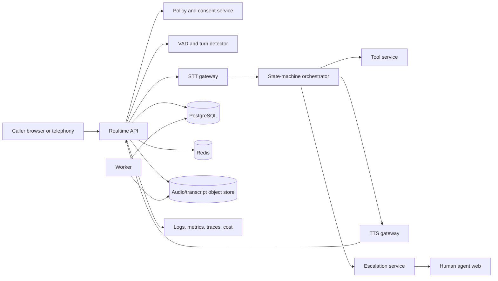

# Voice Triage and Escalation Agent Technical Implementation Guide

Updated: July 28, 2026

This is the hands-on build guide for the **Voice Triage and Escalation Agent**. Its normative
requirements are defined in the companion
[Voice Triage and Escalation Agent Production Implementation Guide](Voice-Triage-and-Escalation-Agent-Production-Implementation-Guide.md).
If the two guides conflict, the production guide wins. Update both guides in the same pull request
when a requirement or architecture decision changes.

This guide turns those requirements into an executable repository, implementation stages,
commands, tests, evaluation gates, operational evidence, and a reviewer-ready proof path. It builds
a controlled voice intake and escalation assistant over public, synthetic, or explicitly
authorized voice sessions.

Relevant local curriculum sources:

- [Deep research report](deep-research-report.md), which identifies the project as the compressed
  `VoiceTriage` portfolio artifact.
- [AI Industry Roadmap and Projects](AI-Industry-Roadmap-and-Projects.md), especially Phase 6.
- [Complete AI Industry Lesson Coverage and Production Plan](AI-Industry-Complete-Lesson-Coverage-Map.md),
  especially Lessons 03, 15, 17, 27, 28-31, and 50.
- [AI Industry Curriculum](AI-Industry-Curriculum.md), especially speech systems and voice agents.
- [AI Industry Detailed Lessons](AI-Industry-Detailed-Lessons.md), especially real-time voice
  workflows, transcription, synthesis, tools, interruption, evaluation, and privacy controls.
- [Document Intelligence Claims Reviewer Technical Implementation Guide](Document-Intelligence-Claims-Reviewer-Technical-Implementation-Guide.md)
  for the enterprise-grade build-and-evidence convention.

## How to use this guide

Build one stage at a time. Every stage uses the same contract:

1. Read the objective and prerequisites.
2. Create only the listed files and contracts.
3. Implement the steps in order.
4. Run the commands and tests.
5. Inspect the required telemetry.
6. Commit the evidence and stage record.
7. Move on only when every `Done when` item is true.

The fastest useful vertical slice is:

```text
start local web voice session
-> play AI and recording disclosure
-> record consent state
-> stream audio frames
-> detect end of turn
-> mock STT transcript
-> run explicit triage state machine
-> call one approved read-only tool
-> mock TTS response
-> interrupt playback
-> escalate to human with structured handoff
-> run latency and task eval smoke
```

Do not begin with a free-form voice bot. Transport, disclosure, consent, state, tool policy,
latency, interruption, and escalation are the foundation.

## 0. Scope, non-goals, and prerequisites

### In scope

- One bounded voice triage workflow, queue, language, and escalation destination.
- Web voice local path using WebSocket or WebRTC; telephony adapter behind an interface.
- AI and recording disclosure.
- Consent state, recording state, retention policy, and redaction profile.
- Audio frames, buffering, sample-rate handling, jitter metrics, VAD, endpointing, and barge-in.
- Streaming STT interface with deterministic mock and optional hosted adapter.
- Explicit conversation state machine, supported intents, slots, and safe fallbacks.
- Approved read-only or low-risk tool calls with schemas and authorization.
- TTS interface with deterministic mock and optional hosted adapter.
- Human escalation, structured handoff, QA review, and label workflow.
- Public speech benchmark adapter plus synthetic and business-task golden datasets.
- Privacy, retention, access control, observability, cost accounting, CI/CD, rollback, restore,
  and pilot evidence.

### Non-goals for the first production-style version

- Emergency dispatch, medical triage, mental-health crisis handling, legal advice, credit,
  employment, or high-impact eligibility decisions.
- Impersonating a human or hiding AI involvement.
- Recording without policy, disclosure, and consent controls.
- Consequential account writes, payments, cancellations, refunds, or access changes.
- Autonomous outbound calling.
- Training a foundation speech or language model.
- Perfect noisy-audio, accent, dialect, or multilingual support.
- Speaker identification as identity verification.
- Emotion detection as a decision input.
- Kubernetes or specialized GPU serving as the default local build.

### Local prerequisites

Install:

- Git.
- Python 3.12.
- `uv`.
- Docker with Docker Compose.
- Node.js LTS and npm.
- A browser with microphone access for local manual testing.
- Optional hosted STT, TTS, realtime, or model credentials. Mock providers are the default in
  tests.

Before starting, be able to explain:

- HTTP and WebSocket basics.
- Async Python and cancellation.
- Audio frames, sample rates, codecs, and buffering.
- Voice activity detection and endpointing.
- Authentication versus authorization.
- Why caller speech, transcripts, and tool results are untrusted.
- Precision, recall, F1, word error rate, latency percentiles, and labelled evaluation cases.

### Pre-build discovery gate

Before Stage 1:

1. Select one bounded voice workflow, queue, language, and escalation target.
2. Identify callers, human agents, supervisors, QA reviewers, compliance/privacy reviewers, and
   platform/security operators.
3. Define supported tasks, unsupported tasks, tool boundaries, caller opt-out, escalation reasons,
   emergency handling, retention, access roles, and downstream handoff.
4. Measure or define a plan to measure baseline wait time, handle time, wrong-route rate,
   abandonment, agent intake time, and cost.
5. Approve public, synthetic, or authorized audio/transcript data sources, licenses,
   classifications, owners, and prohibited data classes.
6. Define in-scope formats, language, audio quality assumptions, pilot cohort, non-goals, success
   metrics, guardrails, SLOs, cost limits, and stop conditions.
7. Create `docs/product-requirements.md`, `docs/metric-tree.md`,
   `docs/risk-register.md`, `docs/consent-recording-policy.md`, `docs/data-policy.md`, and
   `docs/annotation-guide.md`.
8. Map every `VTA-*` requirement to an acceptance criterion and evidence owner.

Do not select a telephony provider, hosted STT/TTS provider, or agent framework until the workflow,
consent policy, data-use rights, and non-goal boundaries are at least `locally verified`.

### Canonical executable stack

| Layer | Canonical choice |
|---|---|
| Language and package tool | Python 3.12 and `uv` |
| API and validation | FastAPI, Pydantic v2, and WebSockets |
| Authentication | OIDC discovery/JWKS with `PyJWT[crypto]`; explicitly gated local adapter |
| ORM and migrations | SQLAlchemy 2 and Alembic |
| Primary database | PostgreSQL 16 |
| Queue and cache | Redis and RQ |
| Audio/transcript storage | S3-compatible storage; MinIO locally |
| Realtime local transport | Browser microphone to WebSocket audio stream |
| Telephony | Adapter interface; mock provider first |
| VAD | Versioned adapter with deterministic test double |
| STT | Provider-neutral `SpeechToTextProvider`; deterministic mock plus hosted adapter |
| TTS | Provider-neutral `TextToSpeechProvider`; deterministic mock plus hosted adapter |
| Orchestration | Explicit state machine before any framework |
| Web | React, Vite, and TypeScript |
| Tests and quality | pytest, Ruff, mypy, and Playwright |
| Telemetry | OpenTelemetry, Prometheus, Grafana, and structured JSON logs |
| Local runtime | Docker Compose |
| Reference cloud | AWS: ECS Fargate, RDS PostgreSQL, ElastiCache, S3, ALB/ACM, Secrets Manager |

Provider names and voices are replaceable configuration, not business logic. Every transport, VAD,
STT, TTS, state-machine, prompt, model, tool-policy, escalation-policy, consent-policy, and
retention-policy version must be recorded on sessions and evaluation runs.

## 1. Final system and invariants

The runtime has three application services:

- `api`: identity-aware session, realtime stream, consent, transcript, handoff, review, export,
  metrics, and administration endpoints.
- `worker`: post-call finalization, QA sampling, evals, exports, retention, deletion,
  reconciliation, and reporting.
- `web`: local voice UI, human handoff console, supervisor dashboard, QA review, and operator
  views.

It depends on PostgreSQL, Redis, MinIO, mock providers, optional hosted STT/TTS/model providers,
and optional telephony provider adapter.



Non-negotiable invariants:

- Deny access when identity, tenant, queue, role, session ownership, consent state, retention
  state, or policy evaluation is uncertain.
- Play disclosure and enforce consent policy before meaningful collection.
- Never trust caller speech, transcripts, model output, or tool results without validation.
- The explicit state machine owns allowed transitions, max turns, max duration, max spend, and
  escalation rules.
- Caller-requested human, emergency signal, unsupported language, low confidence, tool failure, and
  max-budget events route to human or safe fallback.
- Tool calls require typed schemas, authorization outside the model, timeouts, rate limits, and
  audit.
- Raw audio is never written to logs.
- Transcript, summary, recording, QA, export, and dataset use obey consent and retention policy.
- Public speech benchmark, synthetic-task, and release-test datasets are separated.
- Logs, traces, metrics, screenshots, and eval exports exclude raw audio and unredacted sensitive
  transcripts.

## 2. Starter quality gates

These are portfolio-grade starting gates, not universal contact-center targets. Calibrate them
with a representative labelled set and record any change in an ADR and eval changelog. Security
gates marked zero-tolerance cannot be relaxed to make a release pass.

| Area | Starter gate |
|---|---|
| Disclosure and consent | 1.00 release sessions play disclosure and persist policy state before meaningful collection |
| Authorization | 0 unauthorized sessions, recordings, transcripts, tools, handoffs, exports, or audit rows exposed |
| Tool authorization | 0 unauthorized tool calls; 1.00 malformed tool arguments rejected |
| Intent classification | Macro F1 >= 0.85 on supported release set |
| Critical slots | Recall >= 0.90 or route to human |
| Task success | >= 0.80 on supported low-risk business tasks in first pilot |
| Escalation recall | >= 0.95 on caller-requested, emergency, unsupported, low-confidence, and tool-failure cases |
| Wrong non-escalation | <= 0.05 on high-risk release cases |
| Barge-in | P95 playback stop after caller speech <= 500 ms in reference environment |
| Latency | P95 mouth-to-ear <= declared target; local simple-turn starting target <= 2500 ms |
| Sensitive telemetry | 0 raw audio or unredacted sensitive transcript payloads in sampled logs/traces/metrics/screenshots |
| Retention | 1.00 retention/delete fixtures remove or redact artifacts according to policy |
| Idempotency | 1.00 duplicate/retry/reconcile tests avoid duplicate terminal states, handoffs, and exports |
| Cost | Cost per session and per successful triage reported with alert thresholds |

Record audio quality, network, provider, concurrency, utterance length, and warm/cold status beside
every latency number.

### Release comparison rules

Every candidate release must compare against the current approved release with the same immutable
dataset version and environment class. The release report must include:

- Application commit and image digest.
- Database, event, API, and realtime protocol versions.
- Transport, VAD, STT, TTS, state machine, prompt, model, tool-policy, escalation-policy,
  consent-policy, redaction-profile, and retention-policy versions.
- Public speech benchmark, synthetic-task, and golden release-set versions and hashes.
- Metric table, latency table, slice table, changed failures, and owner for each risk.
- Consent, authorization, emergency, tool, privacy, retention, and prompt-injection gate results.
- Launch, hold, or rollback decision with approver and rollback target.

Critical gate failures block release. A waived non-critical failure requires named owner,
expiration date, mitigation, and risk acceptance.

## 3. Build order

1. Repository, reproducible tooling, and local dependencies.
2. API configuration, health, readiness, logging, and correlation IDs.
3. Relational schema and migrations.
4. Identity, tenants, queues, roles, consent, policy, retention, and audit.
5. Session creation and local realtime WebSocket transport.
6. Audio frames, buffering, sample-rate handling, and jitter metrics.
7. Disclosure, consent, recording state, and policy enforcement.
8. VAD, endpointing, interruption, and barge-in.
9. STT provider interface, mock provider, transcripts, timestamps, and confidence.
10. Explicit triage state machine, intents, slots, clarification, and termination.
11. Tool service with schemas, authorization, timeouts, and audit.
12. TTS provider interface, mock provider, playback chunks, and cancellation.
13. Human escalation, handoff packet, agent console, and QA labels.
14. Public speech benchmark, business-task set, golden release set, and latency harness.
15. Hosted STT/TTS/model adapters behind stable interfaces.
16. Security, privacy, prompt-injection, retention, and deletion tests.
17. Observability, feedback, cost, SLOs, alerts, and runbooks.
18. CI/CD, deployment, rollback, restore, and production-like staging.
19. Controlled pilot and feedback-to-eval improvement loop.
20. Final portfolio defense package.

Each stage should be a small pull request whose tests and evidence stand alone.

## 4. Beginner milestones

| Milestone | Working output | Main concept | Requirement proof |
|---|---|---|---|
| M0 | Reproducible repo and test command | Packaging, lint, types, tests | Engineering baseline |
| M1 | Health/readiness API and local dependencies | Services and configuration | Operational baseline |
| M2 | Tenant, queue, session, consent schema | Relational modelling | VTA-SEC-01 |
| M3 | Local voice WebSocket echo | Realtime transport | VTA-AUDIO-01 |
| M4 | Disclosure and consent event | Runtime policy | VTA-CONSENT-01/02 |
| M5 | Audio frames and VAD events | Audio processing | VTA-TURN-01 |
| M6 | Mock STT transcript segments | Streaming transcript lifecycle | VTA-STT-01 |
| M7 | State-machine triage turn | Bounded conversation | VTA-STATE-01 |
| M8 | One approved tool call | Tool safety | VTA-TOOL-01 |
| M9 | Mock TTS playback and interruption | Voice UX | VTA-TTS-01 |
| M10 | Human handoff packet | Escalation | VTA-ESC-01/HANDOFF-01 |
| M11 | Public and golden eval report | Evaluation | VTA-EVAL-01/02 |
| M12 | Hosted provider adapter comparison | Provider gateway | VTA-REL-02 |
| M13 | Privacy and security suite | Sensitive data controls | VTA-SEC-01/PRIV-01 |
| M14 | Dashboards, traces, costs, reconciliation | Operations | VTA-OPS-01 |
| M15 | Deploy, rollback, restore | Release engineering | VTA-REL-01/02 |
| M16 | Pilot report and defense package | Portfolio proof | Final proof |

Complete M0-M11 before adding hosted providers or broad tool coverage.

## 5. Target repository and artifact manifest

Create this repository:

```text
voice-triage-escalation-agent/
  README.md
  pyproject.toml
  uv.lock
  alembic.ini
  .env.example
  .gitignore
  .dockerignore
  docker-compose.yml
  Dockerfile.api
  Dockerfile.worker
  Dockerfile.web
  .github/
    workflows/
      ci.yml
      release.yml
  apps/
    api/
      voice_triage_api/
        __init__.py
        main.py
        settings.py
        dependencies.py
        middleware.py
        errors.py
        readiness.py
        auth/
          oidc.py
          local.py
          authorization.py
        routes/
          health.py
          voice_sessions.py
          realtime.py
          transcripts.py
          handoffs.py
          review_tasks.py
          exports.py
          metrics.py
          admin.py
        schemas/
          common.py
          voice_sessions.py
          realtime.py
          transcripts.py
          tools.py
          handoffs.py
          review_tasks.py
          exports.py
    worker/
      voice_triage_worker/
        __init__.py
        main.py
        queues.py
        jobs/
          post_call.py
          qa_sampling.py
          evals.py
          exports.py
          retention.py
          reconciliation.py
    web/
      package.json
      vite.config.ts
      src/
        main.tsx
        app.tsx
        api/
          client.ts
          realtime.ts
        components/
          VoiceConsole.tsx
          SessionTimeline.tsx
          TranscriptView.tsx
          HandoffPanel.tsx
          ReviewQueue.tsx
          MetricsDashboard.tsx
        routes/
          VoiceDemoPage.tsx
          HandoffPage.tsx
          SessionReviewPage.tsx
          QueuePage.tsx
          AdminVersionsPage.tsx
  packages/
    db/
      voice_triage_db/
        __init__.py
        models.py
        migrations.py
    voice/
      voice_triage_voice/
        __init__.py
        contracts.py
        frames.py
        vad.py
        turn_detection.py
        stt.py
        tts.py
        playback.py
        state_machine.py
        tools.py
        escalation.py
        policy.py
        redaction.py
        providers/
          mock_stt.py
          mock_tts.py
          hosted_stt.py
          hosted_tts.py
    evals/
      voice_triage_evals/
        __init__.py
        datasets.py
        annotations.py
        metrics.py
        latency.py
        runner.py
        reports.py
  tests/
    api/
    worker/
    db/
    voice/
    evals/
    security/
    deployment/
    fixtures/
      audio/
      sessions/
      golden/
      malicious/
  docs/
    product-requirements.md
    metric-tree.md
    risk-register.md
    workflow-map.md
    consent-recording-policy.md
    data-policy.md
    annotation-guide.md
    architecture.md
    api-contracts.md
    realtime-protocol.md
    audio-contracts.md
    conversation-state-machine.md
    tool-contracts.md
    escalation-policy.md
    access-control-model.md
    retention-policy.md
    threat-model.md
    privacy-checklist.md
    evaluation-plan.md
    cost-report.md
    deployment.md
    rollback.md
    incident-response.md
    progress-log.md
    learning-notes.md
    stages/
    reports/
    runbooks/
    adr/
  infra/
    prometheus/
      prometheus.yml
    grafana/
      dashboards/
    staging/
      docker-compose.staging.yml
      env.example
  scripts/
    seed_demo.py
    run_eval.py
    replay_audio.py
    export_evidence.py
    deployment_smoke.ps1
```

The repo tree is intentionally explicit. Remove a file only if its responsibility is clearly owned
elsewhere and the architecture document says where.

## 6. Data model

### Core tables

Implement these tables first:

| Table | Purpose |
|---|---|
| `tenants` | Tenant boundary. |
| `users` | User identity reference. |
| `roles` | Analyst, agent, supervisor, QA, compliance, operator. |
| `queues` | Voice workflow and escalation queue metadata. |
| `user_queue_roles` | Scoped queue access. |
| `voice_sessions` | Session metadata and current projection. |
| `policy_events` | Disclosure, consent, recording, retention, redaction events. |
| `audio_segments` | Restricted audio object references and metadata. |
| `transcript_segments` | Partial/final STT segments with timestamps and confidence. |
| `turns` | Caller turns, state transitions, intent, slots, latency. |
| `conversation_events` | Timeline events, interruptions, failures, terminal states. |
| `tool_calls` | Tool name, arguments hash, authorization, result summary, status. |
| `handoffs` | Human escalation packet and delivery status. |
| `review_tasks` | QA and human-review queue items. |
| `review_labels` | Transcript, intent, slot, escalation, safety, and task labels. |
| `exports` | Scoped session evidence export records. |
| `retention_jobs` | Audio/transcript deletion, redaction, legal-hold work. |
| `cost_events` | STT, TTS, model, tool, storage, and infra cost attribution. |
| `audit_events` | Access, consent, tool, handoff, export, admin, release audit trail. |
| `outbox_events` | Transactional lifecycle work awaiting idempotent publication. |
| `eval_datasets` | Dataset metadata, split, source, and version. |
| `eval_cases` | Labelled benchmark and release cases. |
| `eval_runs` | Metrics, gates, versions, and reports. |

### Required constraints

- Consent and policy events are append-only.
- Raw audio object references are immutable after write.
- Transcript segments cannot be silently rewritten; corrections create review labels.
- Tool-call arguments and results are minimized and redacted before broad display.
- Handoff summaries preserve generated and human-authored sources separately.
- Review labels cannot enter release datasets until consent/privacy eligibility is verified.
- Audit events are append-only.
- Outbox events are inserted in the same transaction as lifecycle state changes.
- Retention jobs check consent withdrawal, legal hold, audit policy, and backup policy.

### Example version tuple

```json
{
  "app_version": "0.5.0",
  "realtime_protocol_version": "ws_audio_v1",
  "vad_version": "vad_rules_v2",
  "stt_version": "mock_stt_v1",
  "tts_version": "mock_tts_v1",
  "state_machine_version": "support_triage_sm_v3",
  "prompt_version": "voice_triage_prompt_v4",
  "model_version": "mock_llm_v1",
  "tool_policy_version": "tool_policy_v2",
  "escalation_policy_version": "escalation_policy_v3",
  "consent_policy_version": "consent_policy_v2",
  "redaction_profile_version": "voice_redaction_v1",
  "retention_policy_version": "voice_retention_v1"
}
```

### Data invariants

- All tenant-owned tables include `tenant_id`.
- Repository methods require tenant scope explicitly.
- External call IDs are never used as authorization proof.
- User-visible IDs are opaque.
- Current session state is a projection from policy events, audio segments, transcript segments,
  turns, tool calls, handoffs, review labels, retention policy, and legal hold.
- Audio, transcripts, summaries, handoffs, and exports carry consent and retention policy IDs.
- Evidence access is re-authorized at read time.
- Raw audio is never stored in logs, traces, screenshots, or eval reports.
- Historical cost and performance records survive only in aggregated or minimized form permitted
  by policy after content deletion.

### Retention classes

Implement retention policy IDs for:

- Raw audio.
- Redacted audio.
- Partial transcripts.
- Final transcripts.
- Generated summaries.
- Tool arguments and results.
- Handoff records.
- QA labels and reviewer notes.
- Evidence packet exports and download tokens.
- Evaluation fixtures, labels, reports, and sampled errors.
- Logs, metrics, traces, screenshots, and dashboards.
- Audit logs.
- Database and object-store backups.

### Outbox and reconciliation

Use an `outbox_events` table or equivalent durable handoff for:

- Session created.
- Disclosure played.
- Consent changed.
- Audio segment stored.
- Transcript segment finalized.
- Turn completed.
- Tool call requested.
- Escalation requested.
- Handoff delivered.
- Session ended.
- Export requested.
- Delete or redact requested.
- Dataset promotion requested.

Each outbox event includes event ID, idempotency key, tenant, session, turn or task ID, operation,
expected prior state, producer version, actor or service identity, correlation ID, causation ID,
attempt count, and next-visible retry time.

Add reconciliation jobs that find:

- Sessions stuck in active, speaking, transferring, or retention-pending states.
- Audio segments without consent/retention metadata.
- Transcript segments without finalization or deletion state.
- Tool calls without terminal result or timeout.
- Escalations without handoff delivery confirmation.
- Expired recordings, transcripts, summaries, or exports.
- Dataset candidates whose consent or privacy eligibility changed.
- Outbox events that exceeded retry or age thresholds.

Reconciliation must be bounded, authorized, idempotent, observable, and safe to replay.

## 7. Realtime, API, and event contracts

### Create session

`POST /voice-sessions`

Request:

```json
{
  "channel": "web_voice",
  "queue": "support_triage",
  "language": "en",
  "client_request_id": "demo-001"
}
```

Response:

```json
{
  "voice_session_id": "vts_01",
  "status": "created",
  "disclosure_required": true,
  "stream_url": "/voice-sessions/vts_01/stream"
}
```

### Realtime stream event envelope

All client and server realtime events use:

```json
{
  "event_id": "evt_123",
  "voice_session_id": "vts_01",
  "type": "audio_frame",
  "sequence": 42,
  "timestamp_ms": 840,
  "payload": {},
  "correlation_id": "corr_123"
}
```

Supported event types:

- `audio_frame`
- `playback_chunk`
- `playback_started`
- `playback_stopped`
- `disclosure_played`
- `consent_state_changed`
- `vad_started`
- `vad_stopped`
- `stt_partial`
- `stt_final`
- `turn_started`
- `turn_completed`
- `tool_call_started`
- `tool_call_completed`
- `handoff_created`
- `session_error`
- `session_closed`

### Audio frame payload

```json
{
  "encoding": "pcm_s16le",
  "sample_rate_hz": 16000,
  "duration_ms": 20,
  "direction": "caller_to_agent",
  "bytes_base64": "test-fixture-only"
}
```

In production, binary frames may be used. Tests should still validate metadata, sequence,
duration, sampling rate, and bounds. Never log frame payload bytes.

### Consent event

`POST /voice-sessions/{voice_session_id}:consent`

Request:

```json
{
  "consent_state": "recording_allowed",
  "method": "spoken_yes",
  "policy_version": "consent_policy_v2"
}
```

Response:

```json
{
  "policy_event_id": "pe_01",
  "voice_session_id": "vts_01",
  "recording_state": "active",
  "retention_policy_id": "voice_retention_v1"
}
```

### Handoff response

`GET /voice-sessions/{voice_session_id}/handoff`

Response:

```json
{
  "handoff_id": "handoff_01",
  "target_queue": "human_support",
  "reason": "caller_requested_human",
  "summary": "Caller asked for appointment status and requested a human.",
  "verified_details": [
    {"name": "appointment_reference", "value": "ABC123", "source": "caller_confirmed"}
  ],
  "open_questions": ["Callback number not confirmed."],
  "risk_flags": [],
  "consent_state": "recording_allowed"
}
```

### Minimum API surface

| Method | Path | Purpose |
|---|---|---|
| `GET` | `/health/live` | Process liveness without dependency checks. |
| `GET` | `/health/ready` | Capability-aware readiness. |
| `POST` | `/voice-sessions` | Create session metadata and policy context. |
| `WS` | `/voice-sessions/{id}/stream` | Bidirectional audio and control events. |
| `POST` | `/voice-sessions/{id}:consent` | Record consent or opt-out event. |
| `POST` | `/voice-sessions/{id}:end` | End session with reason. |
| `GET` | `/voice-sessions/{id}` | Read authorized session summary. |
| `GET` | `/voice-sessions/{id}/transcript` | Read authorized transcript. |
| `GET` | `/voice-sessions/{id}/events` | Read authorized timeline events. |
| `GET` | `/voice-sessions/{id}/handoff` | Read authorized handoff. |
| `POST` | `/voice-sessions/{id}:escalate` | Force escalation by policy or caller request. |
| `GET` | `/review-tasks` | List QA review tasks. |
| `POST` | `/review-tasks/{id}/labels` | Add QA labels and corrections. |
| `POST` | `/exports` | Generate scoped evidence packet. |
| `GET` | `/metrics/quality` | Speech, task, turn, escalation, safety metrics. |
| `GET` | `/metrics/operations` | Session, provider, latency, failure metrics. |
| `GET` | `/metrics/cost` | Cost by tenant, queue, provider, session type. |
| `POST` | `/admin/releases/{id}:promote` | Operator-only release promotion. |
| `POST` | `/admin/releases/{id}:rollback` | Operator-only rollback. |

### API and realtime requirements

- Typed request and response models.
- Reproducible OpenAPI generation or checked-in schema snapshots.
- Versioned realtime event schema.
- Consistent error envelope with correlation ID.
- Idempotency for session creation, consent changes, escalation, session end, export, and
  deletion.
- Bounded audio frame size, frame duration, session duration, turn count, tool calls, response
  length, and export size.
- No stack trace, raw provider error, policy detail, tool secret, raw audio, or sensitive transcript
  in user errors.
- Rate limits and quotas scoped by subject, tenant, queue, and operation risk.
- Contract, authorization, negative, redaction, and dropped-connection tests.

### Capability-aware readiness

`GET /health/live` proves only that the process can answer. `GET /health/ready` must return
time-bounded per-dependency state and a capability map such as `session_intake`, `realtime_audio`,
`disclosure`, `stt`, `tts`, `tools`, `escalation`, `review`, `export`, `evaluation`,
`retention`, and `telemetry`.

Rules:

- Each deployment role declares required capabilities. Return HTTP `200` only when every required
  capability for that role is ready; otherwise return controlled `503` details.
- Session readiness requires database, Redis, identity/authorization, policy configuration, and
  object storage.
- Realtime readiness requires stream handler, frame bounds, VAD configuration, and session state.
- STT/TTS readiness requires configured provider or mock, timeouts, and compatible version tuple.
- Escalation readiness requires target queue, handoff writer, agent-console path, and audit writer.
- Retention readiness requires policy, object storage, deletion worker, and audit writer.

Readiness responses must not expose secrets, raw provider errors, tenant data, or policy internals
to ordinary users.

## 8. Stage 1 - Reproducible repository and dependencies

### Objective

Create the repository skeleton, dependency management, linting, typing, unit test command, Docker
baseline, and first documentation files.

### Implement

- `pyproject.toml` with project packages and dev tools.
- `docker-compose.yml` with PostgreSQL, Redis, MinIO, API, worker, and web placeholders.
- API, worker, voice package, eval package, and test skeletons.
- `docs/product-requirements.md`, `docs/metric-tree.md`, `docs/risk-register.md`,
  `docs/consent-recording-policy.md`, `docs/data-policy.md`, and `docs/progress-log.md`.
- `.github/workflows/ci.yml` running lint, type check, tests, and frontend checks.

### Tests and commands

```powershell
uv sync
uv run ruff check .
uv run mypy apps packages tests
uv run pytest
docker compose config
npm --prefix apps/web install
npm --prefix apps/web run build
```

### Done when

- A fresh clone can install dependencies and run all empty quality gates.
- Docker Compose validates.
- Stage record `docs/stages/stage-01-repository-platform.md` names verified and unverified
  evidence.

## 9. Stage 2 - API foundation and operational baseline

### Objective

Build FastAPI service foundations with configuration, structured errors, health/readiness,
correlation IDs, logs, and basic metrics.

### Implement

- `voice_triage_api/settings.py`.
- `main.py`, `readiness.py`, `middleware.py`, `errors.py`.
- `/health/live` and capability-aware `/health/ready`.
- JSON logging with correlation ID.
- Prometheus metrics endpoint.
- Tests for settings, error shape, health, readiness, and correlation propagation.

### Done when

- API starts locally.
- Readiness checks database, Redis, object storage, identity configuration, queues, and declared
  capability requirements.
- Logs include correlation ID without sensitive payloads.

## 10. Stage 3 - Schema, migrations, and seed data

### Objective

Implement the relational schema, migrations, seed data, and lifecycle constraints.

### Implement

- SQLAlchemy models for tenants, users, roles, queues, sessions, policy events, audio segments,
  transcript segments, turns, conversation events, tool calls, handoffs, review tasks, review
  labels, exports, retention jobs, cost events, audit events, outbox events, and eval records.
- Alembic migrations.
- Seed script with one tenant, users, roles, queue, consent policy, retention policy, and synthetic
  session.
- Model tests for constraints, relationships, immutable records, outbox handoff, retention guards,
  and cost-event minimization.

### Done when

- `uv run alembic upgrade head` works from a fresh database.
- Consent and policy events are append-only.
- Outbox events are written transactionally with lifecycle state changes.

## 11. Stage 4 - Identity, authorization, consent, and audit

### Objective

Enforce deny-by-default access before sessions, transcripts, recordings, tool results, handoffs,
exports, and audit data are exposed.

### Implement

- OIDC/JWKS adapter and local development adapter.
- Authorization service with tenant, queue, role, session ownership, compliance, and operator
  scopes.
- Consent policy and recording state service.
- Retention policy resolver.
- Audit event writer.
- Tests for cross-tenant denial, queue denial, unassigned session denial, transcript denial,
  recording denial, export denial, and admin-only release views.

### Done when

- Unauthorized users cannot see sessions, transcripts, recordings, tool results, handoffs, exports,
  or audit rows.
- Every consent, recording, tool, handoff, export, admin, and release mutation writes an audit
  event.

## 12. Stage 5 - Session creation and local realtime transport

### Objective

Implement session creation and a local WebSocket audio/control-event path.

### Implement

- `/voice-sessions`.
- `/voice-sessions/{id}/stream` WebSocket route.
- Realtime event envelope and schema validation.
- Frame sequencing and bounded message size.
- Session start, close, disconnect, and error events.
- Browser demo UI with microphone permission and mock audio fallback.

### Done when

- A local browser can open a session and send bounded audio/control events.
- Dropped connection creates a terminal or recoverable state.
- Frame payload bytes are never logged.

## 13. Stage 6 - Audio frames, buffering, and jitter metrics

### Objective

Normalize audio frame metadata and make audio-path health observable.

### Implement

- Audio frame contract.
- Sample-rate validation and conversion adapter.
- Jitter, dropped-frame, sequence-gap, and buffering metrics.
- Object storage adapter for restricted audio segments when consent allows.
- Tests for oversized frames, wrong sample rate, out-of-order frames, missing sequence, and consent
  denial.

### Done when

- Audio fixtures replay through the stream route.
- Audio metrics appear in traces and Prometheus.
- Consent-denied sessions do not persist raw audio except where policy explicitly allows.

## 14. Stage 7 - Disclosure, consent, recording state, and policy enforcement

### Objective

Make AI disclosure and recording policy runtime behavior, not documentation only.

### Implement

- Disclosure prompt/version registry.
- Consent event API.
- Runtime guard that blocks meaningful collection or retention until policy conditions are met.
- Opt-out behavior.
- Recording state transitions.
- Retention eligibility flags for audio, transcript, summaries, QA, and eval.
- Tests for consent allowed, denied, unclear, withdrawn, and stale policy version.

### Done when

- Every session records disclosure, consent state, recording state, policy version, and audit.
- Consent withdrawal triggers retention or redaction workflow.

## 15. Stage 8 - VAD, endpointing, interruption, and barge-in

### Objective

Detect caller speech, end of turn, and interruptions with measurable latency.

### Implement

- VAD provider interface and deterministic test double.
- Endpointing policy.
- Playback state tracker.
- Barge-in detector.
- Response cancellation and stale-response marker.
- Latency metrics for VAD start/stop, endpointing, and playback stop.
- Tests for silence, speech, noise, false-start, caller interruption during TTS, and echo-like
  fixture.

### Done when

- A caller can interrupt mock playback and the system stops within the declared local target.
- Turn boundaries and interruption events appear in the session timeline.

## 16. Stage 9 - STT provider and transcript lifecycle

### Objective

Create versioned streaming STT contracts, transcript segments, and quality hooks.

### Implement

- `SpeechToTextProvider` interface.
- Deterministic mock STT.
- Optional hosted STT adapter placeholder.
- Partial and final transcript segment persistence.
- Timestamp, speaker, language, confidence, provider version, and retention metadata.
- Tests for partial/final order, low confidence, unsupported language, provider timeout, malformed
  response, and redaction.

### Done when

- Audio fixture produces partial and final transcript segments.
- Low-confidence or unsupported-language transcripts route to human or safe fallback.

## 17. Stage 10 - Explicit triage state machine

### Objective

Implement bounded conversation behavior before adding broad model generation.

### Implement

- State machine with `disclose`, `collect_goal`, `classify_intent`, `collect_required_slot`,
  `confirm_slot`, `tool_lookup`, `answer_low_risk`, `clarify`, `escalate`, and `close`.
- Supported intent taxonomy.
- Slot schemas and confirmation rules.
- Max turns, max duration, max spend, and terminal states.
- Response policy for short spoken answers.
- Tests for happy path, missing slot, low confidence, unsupported request, max turns, and caller
  request for human.

### Done when

- A seeded transcript can drive the state machine to resolved, clarified, or escalated states.
- No state transition depends on hidden reasoning.

## 18. Stage 11 - Tool service and approved low-risk actions

### Objective

Allow bounded tool calls during voice sessions without giving the model authority.

### Implement

- Tool registry with JSON Schema contracts.
- One read-only tool, such as appointment or ticket status lookup.
- Tool authorization service.
- Timeouts, retries, rate limits, idempotency, and result redaction.
- Tool result speech/handoff policy.
- Tests for unauthorized tool, malformed args, timeout, duplicate call, result injection, and
  conflicting tool result.

### Done when

- A supported voice turn can call one approved tool and speak or hand off an allowed result.
- Tool failures clarify or escalate; they do not produce invented results.

## 19. Stage 12 - TTS provider, playback, and cancellation

### Objective

Synthesize concise spoken responses and control playback state.

### Implement

- `TextToSpeechProvider` interface.
- Deterministic mock TTS.
- Optional hosted TTS adapter placeholder.
- Playback chunk events.
- Voice version and output metadata.
- Response length policy.
- Cancellation on interruption.
- Tests for first-audio latency, playback chunks, cancellation, provider failure, and fallback.

### Done when

- Mock TTS response plays through the local web voice UI.
- Barge-in stops playback and prevents stale speech from continuing.

## 20. Stage 13 - Human escalation, handoff, and QA workflow

### Objective

Create a reliable human handoff path and review workflow.

### Implement

- Escalation policy engine.
- Handoff packet writer.
- Human agent console or handoff view.
- QA review tasks.
- Review labels for transcript, intent, slots, task success, escalation quality, consent quality,
  safety, and latency notes.
- Tests for caller-requested escalation, emergency escalation, unsupported request, tool failure,
  low confidence, handoff delivery failure, and QA label retention eligibility.

### Done when

- A local session escalates to a human handoff with summary, verified details, open questions, risk
  flags, consent state, and timeline.
- QA labels preserve original model/STT outputs.

## 21. Stage 14 - Evaluation harness and latency lab

### Objective

Build repeatable evaluation for public speech quality, business-task success, turn-taking,
escalation, safety, privacy, latency, and cost.

### Implement

- Dataset registry and split policy.
- Public speech benchmark adapter.
- Synthetic business-task session set.
- Golden release set loader.
- Audio replay harness.
- Metrics for WER, entity error, endpointing, barge-in, intent, slots, tool selection, task
  success, escalation, consent, safety, latency, and cost.
- Release report template.
- Dataset leakage check.

### Commands

```powershell
uv run python scripts/run_eval.py --dataset public --report docs/reports/stt-benchmark-report.md
uv run python scripts/run_eval.py --dataset golden --report docs/reports/task-eval-report.md
uv run pytest tests/evals
```

### Done when

- Public and golden reports are generated from versioned datasets.
- Release gates block promotion when zero-tolerance checks fail.
- Metrics are reported by audio quality, intent, escalation reason, and latency slice.

## 22. Stage 15 - Hosted STT, TTS, and model adapters

### Objective

Add hosted providers behind stable interfaces without changing business logic.

### Implement

- Hosted STT adapter.
- Hosted TTS adapter.
- Optional hosted model adapter for structured response planning.
- Provider-neutral request and response contracts.
- Timeout, retry, response-size, spend, token/audio-second controls.
- Provider data-disclosure record.
- Comparison report against deterministic baseline.

### Done when

- Hosted adapters can be disabled without breaking transport, consent, state machine, tools, or
  human escalation.
- Eval report compares baseline and hosted providers on the same dataset.

## 23. Stage 16 - Security, privacy, retention, and deletion

### Objective

Harden the system against audio leakage, transcript leakage, prompt injection, unauthorized access,
tool abuse, and retention failures.

### Implement

- Threat model.
- Privacy checklist.
- Sensitive-data redaction utilities for logs, traces, screenshots, reports, transcripts,
  summaries, and exports.
- Prompt-injection fixtures through caller utterances and tool results.
- Cross-tenant and role-permission tests.
- Consent withdrawal, retention expiration, legal hold, deletion job, and backup policy.
- Export redaction profiles.
- Dependency scanning in CI.

### Done when

- Security test suite runs in CI.
- Sensitive telemetry sampling shows zero raw audio or unredacted sensitive transcript payloads.
- Deletion removes or redacts audio, transcript, summary, export, and eval candidate access
  according to policy.

## 24. Stage 17 - Observability, cost, SLOs, and operations

### Objective

Make realtime sessions, latency, quality, escalation, failures, privacy, and cost visible enough
to operate.

### Implement

- OpenTelemetry traces for session, disclosure, consent, audio frames, VAD, STT, orchestration,
  tools, TTS, playback, barge-in, handoff, review, export, eval, and retention.
- Prometheus metrics for sessions, queues, latencies, quality gates, provider calls, failures,
  privacy events, and cost.
- Grafana dashboards.
- Alerts for provider outage, high latency, stuck sessions, escalation failure, disclosure failure,
  retention failure, privacy event, and cost threshold.
- Runbooks for common incidents.
- Cost report by session, turn, provider, queue, and task.

### Done when

- One seeded session can be traced end to end by correlation ID.
- Dashboards show live local voice path and eval metrics.
- Runbooks name exact commands and rollback options.

## 25. Stage 18 - CI/CD, deployment, rollback, restore, and DR

### Objective

Package the system for reproducible delivery and production-like operation.

### Implement

- GitHub Actions CI with backend tests, frontend tests, realtime protocol tests, security tests,
  eval smoke, and Docker build.
- Production-like Docker Compose for staging.
- Environment variable and secret documentation.
- Database backup and restore scripts.
- Object-store backup and restore procedure.
- Rollback procedure for app, realtime protocol, VAD, STT, TTS, prompt, state machine, tool
  policy, escalation policy, consent policy, redaction profile, and retention policy.
- Deployment smoke script.

### Done when

- A clean staging environment can be deployed from documented commands.
- Rollback and restore are demonstrated and recorded.
- Failed release gates block deployment.

## 26. Stage 19 - Controlled pilot and improvement loop

### Objective

Run a bounded pilot against the manual baseline and promote reviewed feedback safely.

### Implement

- Pilot cohort and session set.
- Manual baseline report.
- Assisted workflow report.
- Human-agent and QA training guide.
- Feedback capture and annotation quality review.
- Consent/privacy eligibility check for dataset promotion.
- Before/after eval comparison for one approved improvement.
- Post-pilot limitations and next-step report.

### Done when

- Pilot report compares manual and assisted outcomes.
- At least one QA label or human-agent correction is promoted into a new dataset version through
  review.
- A regression suite approves or rejects one versioned improvement.

## 27. Documentation governance and stage records

The production guide is the requirements authority. This technical guide is the build authority.
Living repository contracts are the implementation authority. Generated reports describe a
specific run; stage snapshots describe what was proved at a point in time.

Document classes:

| Class | Examples | Change rule |
|---|---|---|
| Living authoritative contract | Architecture, API, realtime protocol, audio, state machine, tools, escalation, consent. | Update with implementation in the same PR. |
| Architecture decision record | Transport, STT/TTS, model, state, tool, consent, retention choices. | Append a superseding decision; keep history. |
| Immutable stage snapshot | `docs/stages/stage-*.md`. | Correct factual errors visibly; do not rewrite history. |
| Generated report | Eval, latency, cost, privacy, benchmark, load/failure. | Regenerate with run/config/data lineage. |
| Operational runbook | Incident, rollback, provider outage, stuck session, retention delete. | Review and exercise on schedule. |
| Learning/progress record | `learning-notes.md`, `progress-log.md`. | Append verified work, failures, and open questions. |

Use this evidence vocabulary consistently:

- `planned`: specified, no implementation claim.
- `implemented`: code or configuration exists, verification not yet recorded.
- `locally verified`: reproducible verification passed in the reference local environment.
- `externally verified`: passed in staging or an independent environment.
- `operationally proven`: exercised successfully during a controlled pilot or real operation.

Every stage snapshot uses these stable headings:

1. Status and evidence level.
2. Goal.
3. Guide and requirement mapping.
4. Runtime flow.
5. Files changed.
6. Contracts and data.
7. Failure behavior.
8. Tests.
9. Verification commands.
10. Verified evidence.
11. Not verified.
12. Learning questions.
13. Next stage.

Canonical stage IDs never drift from guide sections:

| Stage ID | Guide section | Stage record |
|---:|---:|---|
| 01 | 8 | `stage-01-repository-platform.md` |
| 02 | 9 | `stage-02-api-foundation.md` |
| 03 | 10 | `stage-03-schema-migrations.md` |
| 04 | 11 | `stage-04-identity-consent-audit.md` |
| 05 | 12 | `stage-05-session-realtime-transport.md` |
| 06 | 13 | `stage-06-audio-frames-buffering.md` |
| 07 | 14 | `stage-07-disclosure-consent-policy.md` |
| 08 | 15 | `stage-08-vad-barge-in.md` |
| 09 | 16 | `stage-09-stt-transcripts.md` |
| 10 | 17 | `stage-10-state-machine.md` |
| 11 | 18 | `stage-11-tool-service.md` |
| 12 | 19 | `stage-12-tts-playback.md` |
| 13 | 20 | `stage-13-escalation-handoff-qa.md` |
| 14 | 21 | `stage-14-evaluation-latency.md` |
| 15 | 22 | `stage-15-hosted-adapters.md` |
| 16 | 23 | `stage-16-security-privacy-retention.md` |
| 17 | 24 | `stage-17-observability-cost-operations.md` |
| 18 | 25 | `stage-18-ci-cd-deployment-dr.md` |
| 19 | 26 | `stage-19-controlled-pilot-improvement.md` |

Do not create combined stage records. A pull request may implement two stages, but each retains its
own contract, evidence level, unverified list, and progress entry.

## 28. Minimal and full build paths

### Smallest complete portfolio build

The smallest defensible build includes:

1. Reproducible repo, API, worker, web, database, queues, and object storage.
2. One workflow, one queue, one language, and one escalation path.
3. Disclosure, consent, recording state, retention policy, and audit.
4. WebSocket local voice path with audio frame bounds and metrics.
5. VAD, endpointing, and barge-in using deterministic fixtures.
6. Mock STT and mock TTS plus transcript and playback lifecycle.
7. Explicit state machine with at least three supported intents.
8. One approved read-only tool.
9. Human escalation and handoff view.
10. Public speech benchmark smoke and golden task-eval report.
11. Privacy/security suite and sensitive telemetry tests.
12. Traces, dashboards, cost report, rollback, restore, and final defense package.

### Full production-style path

The full path adds:

- Telephony adapter.
- Hosted STT/TTS/model providers.
- Larger audio/noise/accent slices.
- More intents, slots, and tools.
- Stronger latency/load testing.
- More QA and supervisor workflows.
- Consent withdrawal and deletion exercises.
- Staging deployment and pilot report.
- One feedback-to-dataset-to-release improvement loop.

Do not add breadth before disclosure, consent, turn-taking, escalation, evaluation, and privacy
controls are solid.

## 29. Requirement traceability matrix

### Production requirement crosswalk

| Requirement | Primary stage | Evidence |
|---|---|---|
| VTA-CONSENT-01 | Stage 7 | Disclosure playback and audit tests |
| VTA-CONSENT-02 | Stages 7 and 16 | Consent, retention, deletion, dataset eligibility tests |
| VTA-AUDIO-01 | Stages 5-6 | Frame bounds, sample-rate, jitter, stream tests |
| VTA-TURN-01 | Stage 8 | VAD, endpointing, interruption, barge-in latency report |
| VTA-STT-01 | Stage 9 | Transcript contract and STT eval report |
| VTA-TTS-01 | Stage 12 | Playback, cancellation, fallback tests |
| VTA-STATE-01 | Stage 10 | State-machine and max-budget tests |
| VTA-TOOL-01 | Stage 11 | Tool schema, authorization, timeout, injection tests |
| VTA-ESC-01 | Stage 13 | Escalation policy and handoff tests |
| VTA-HANDOFF-01 | Stage 13 | Handoff packet contract and UI tests |
| VTA-EVAL-01 | Stage 14 | Public and golden eval reports |
| VTA-EVAL-02 | Stage 14 | Slice report and release gates |
| VTA-SEC-01 | Stages 4 and 16 | Authorization and red-team tests |
| VTA-PRIV-01 | Stage 16 | Redaction, retention, deletion, sensitive telemetry tests |
| VTA-OPS-01 | Stage 17 | Dashboard screenshots, traces, cost report |
| VTA-REL-01 | Stages 17-18 | Failure injection, reconciliation, rollback, restore tests |
| VTA-REL-02 | Stages 14-18 | Version tuple and release/rollback report |

### Production-phase crosswalk

| Production phase | Technical realization |
|---:|---|
| 0 - Discovery, queue, controls | Pre-build discovery gate; Sections 27 and 29 |
| 1 - Repository, contracts, platform | Sections 8-9 and 27 |
| 2 - Identity, policy, consent, audit | Sections 10-11 and 14 |
| 3 - Realtime transport and audio pipeline | Sections 12-13 |
| 4 - VAD, endpointing, interruption | Section 15 |
| 5 - STT and transcript lifecycle | Section 16 |
| 6 - Conversation state machine | Section 17 |
| 7 - Tool calls and task completion | Section 18 |
| 8 - TTS and response control | Section 19 |
| 9 - Escalation and handoff | Section 20 |
| 10 - Evaluation and calibration | Section 21 |
| 11 - Privacy, security, red-team hardening | Section 23 |
| 12 - Observability, cost, operations | Section 24 |
| 13 - Reliability and failure injection | Sections 24-25 |
| 14 - Staging deployment and pilot | Sections 25-26 |
| 15 - Portfolio defense | Sections 28, 33, and 35 |

### Requirement-to-evidence manifest

For every release candidate, produce a machine-readable traceability manifest such as:

```json
{
  "requirement_id": "VTA-TURN-01",
  "implementation_version": "git-sha",
  "version_tuple": {
    "vad_version": "vad_rules_v2",
    "stt_version": "mock_stt_v1",
    "tts_version": "mock_tts_v1",
    "state_machine_version": "support_triage_sm_v3"
  },
  "tests": [
    "test_barge_in_stops_playback",
    "test_endpointing_latency_recorded"
  ],
  "eval_run_id": "eval_2026_07_28_golden_voice",
  "evidence_paths": [
    "docs/reports/turn-taking-report.md",
    "docs/reports/latency-report.md"
  ],
  "status": "locally verified"
}
```

A requirement is incomplete when code exists but its negative tests, evaluation slice, or evidence
record is missing.

### Curriculum crosswalk

| Curriculum area | Project proof |
|---|---|
| Lesson 03 async services | Realtime stream, cancellation, provider timeouts |
| Lesson 15 evaluation | Public speech benchmark, golden task set, release gates |
| Lesson 17 agents and tools | Explicit state machine, bounded tools, escalation |
| Lesson 27 speech/audio/voice | STT, TTS, VAD, turn-taking, barge-in, latency |
| Lesson 28 security/privacy | Consent, recording, PII controls, prompt injection, retention |
| Lesson 29 governance | Risk register, system card, dataset card, oversight plan |
| Lesson 30 reliability | Degraded modes, failover, rollback, restore |
| Lesson 31 observability/cost | Traces, dashboards, cost per session and task |
| Lesson 50 specialization | Voice workflow, public benchmark, business-task eval, human review |

## 30. Test strategy

### Unit tests

- Audio frame validation.
- Sample-rate conversion.
- VAD event interpretation.
- Endpointing policy.
- State-machine transitions.
- Slot normalization.
- Tool schema validation.
- Authorization decisions.
- Redaction utilities.
- Idempotency keys.

### Integration tests

- WebSocket session lifecycle.
- Disclosure and consent flow.
- Audio fixture replay.
- STT provider contract.
- TTS provider contract.
- Tool call and result.
- Handoff creation.
- Export generation.
- Retention and deletion.

### Contract tests

- REST API request/response schemas.
- Realtime event schemas.
- Provider request/response schemas.
- Tool schemas.
- Handoff packet schema.
- Version tuple shape.
- Eval report schema.

### Security tests

- Cross-tenant access denial.
- Queue and role denial.
- Unauthorized recording/transcript/export denial.
- Prompt injection through caller speech.
- Prompt injection through tool result.
- Unauthorized tool call denial.
- Sensitive payload redaction.
- Deleted or consent-withdrawn artifact denial.

### Evaluation tests

- Public speech benchmark smoke.
- Golden task metrics.
- Latency report generation.
- Turn-taking and barge-in report.
- Dataset split leakage check.
- Regression gate pass/fail.

## 31. Data and annotation plan

### Dataset folders

Use:

```text
data/
  README.md
  public/
    manifest.json
  synthetic/
    manifest.json
  golden/
    manifest.json
  annotations/
    schema.json
```

Do not commit sensitive real calls. Use synthetic audio fixtures in Git. Store larger or licensed
datasets outside Git with manifests, checksums, licenses, consent status, and retrieval
instructions.

### Annotation schema

Each labelled turn should include:

- Voice session ID.
- Turn ID.
- Audio fixture reference.
- Transcript label.
- Intent label.
- Slot labels.
- Tool decision label.
- Expected state transition.
- Expected escalation decision.
- Consent/recording policy label.
- Safety label.
- Annotator ID or role.
- Review status.
- Disagreement notes.

### Annotation quality

Require:

- Double annotation for golden escalation and safety cases where feasible.
- Adjudication for disagreements.
- Label changelog.
- Split policy.
- Leakage check.
- Consent/privacy review before dataset promotion.

### Minimum dataset sizes for portfolio proof

Use these as starter engineering counts, not statistical sufficiency claims:

| Slice | Minimum count |
|---|---:|
| Labelled business-task calls or fragments | 50 |
| Labelled turns | 100 |
| Labelled intents | 100 |
| Labelled slots or entities | 100 |
| Caller-requested escalation cases | 25 |
| Emergency or sensitive-topic escalation cases | 20 |
| Low-confidence or noisy-audio cases | 25 |
| Interruption or barge-in cases | 25 |
| Tool-failure or timeout cases | 20 |
| Unsupported-language or unsupported-request cases | 20 |
| Access-control and retention cases | 20 |
| Prompt-injection or malicious caller utterance cases | 20 |

Record which examples are public, synthetic, generated, manually labelled, QA-corrected, or
excluded from release testing.

## 32. Operational runbooks

Create runbooks for:

- STT provider outage.
- TTS provider outage.
- Telephony or WebRTC outage.
- High-latency sessions.
- Stuck active session.
- Escalation failure.
- Emergency escalation.
- Tool dependency outage.
- Disclosure or consent failure.
- Human handoff backlog.
- Unauthorized transcript or recording alert.
- Sensitive telemetry finding.
- Retention/delete failure.
- Database restore.
- Disable AI containment and route to humans.
- Roll back version tuple.

Each runbook must name symptoms, dashboards, commands, decision owner, rollback option, caller or
agent communication, and evidence to preserve.

## 33. Final reviewer proof

A reviewer should be able to run commands like these from the README:

```powershell
git clone $env:VOICE_TRIAGE_REPOSITORY_URL
cd voice-triage-escalation-agent
copy .env.example .env
uv sync
npm --prefix apps/web install
docker compose up --build -d
uv run alembic upgrade head
uv run python scripts/seed_demo.py
uv run pytest
uv run python scripts/replay_audio.py --fixture tests/fixtures/audio/demo.wav --session vts_demo
uv run python scripts/run_eval.py --dataset public --report docs/reports/stt-benchmark-report.md
uv run python scripts/run_eval.py --dataset golden --report docs/reports/task-eval-report.md
powershell -File scripts/deployment_smoke.ps1
uv run python scripts/export_evidence.py --session vts_demo --output docs/reports/demo-session-evidence.json
```

Then, using two synthetic tenants or queues and at least three identities, the reviewer should:

1. Open API docs and the web UI.
2. Start a local web voice session.
3. Hear disclosure and record consent state.
4. Stream or replay a synthetic audio fixture.
5. Inspect audio frame metadata, VAD events, transcript segments, and turn boundaries.
6. Interrupt mock TTS playback and verify barge-in cancellation.
7. Complete one supported low-risk task using an approved tool.
8. Trigger caller-requested, low-confidence, unsupported, and tool-failure escalation.
9. Inspect human handoff with summary, verified details, open questions, risk flags, and consent
   state.
10. Prove unauthorized identity cannot access restricted session, recording, transcript, tool
    result, handoff, export, or audit data.
11. Withdraw consent or expire retention and confirm audio/transcript/export access changes.
12. Run public speech benchmark, golden task eval, security, and privacy suites.
13. Follow one session through traces and find version tuple, latency breakdown, provider calls,
    and cost.
14. Disable hosted providers or AI containment and prove human escalation still works.
15. Exercise rollback, restore, and stuck-session reconciliation.
16. Inspect eval reports, threat model, consent policy, system/dataset/model cards, dashboards,
    stage records, and open `not verified` claims.

The proof is not a video alone. It must include commands, test results, reports, dashboards,
architecture notes, limitations, and the exact date/environment of verification.

## 34. First practical assignment

Start with a tiny vertical slice:

1. Create `support_triage_sm_v1` with `collect_goal`, `collect_identifier`, `tool_lookup`,
   `escalate`, and `close`.
2. Create one synthetic audio fixture for "I need to check my appointment".
3. Start a voice session through the API.
4. Play disclosure and record consent.
5. Stream or replay the fixture through the WebSocket path.
6. Produce a mock STT final transcript.
7. Extract intent `appointment_status` and slot `appointment_reference`.
8. Call a mock read-only appointment status tool.
9. Play a mock TTS response.
10. Interrupt playback once.
11. Escalate to human and create a handoff packet.
12. Add one golden eval case and report transcript, intent, slot, tool, escalation, and latency
    results.

This assignment proves the architecture better than a broad voice demo that cannot show consent,
barge-in, tool authorization, or human handoff.

## 35. Final definition of done and interview defense

The technical implementation is done when:

- A fresh clone can run the local stack and tests.
- The database schema, realtime protocol, API contracts, provider contracts, tool contracts, and
  eval reports are documented.
- A representative voice session processes end to end.
- Disclosure, consent, recording state, and retention behavior are enforced.
- Barge-in and human escalation work.
- Public and golden evaluation reports exist.
- Security, privacy, retention, and sensitive telemetry tests pass.
- Dashboards and traces reconstruct a session by correlation ID.
- Rollback and restore are demonstrated.
- The final defense can explain what the system does not decide, why escalation exists, where STT,
  TTS, tools, and the model can fail, how quality is measured, and what remains unverified.
