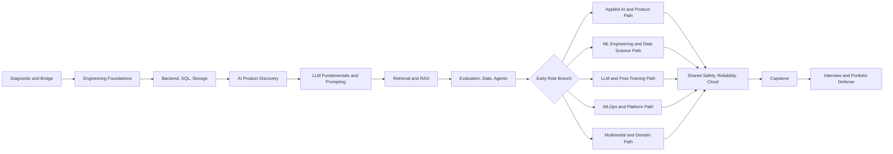

# Analytical Review of the GitHub Lesson Coverage Map

## Executive summary

The lesson coverage map is unusually ambitious and substantially better than the average “AI curriculum” floating around online. It defines a 57-lesson program with 40 shared core lessons, 11 role-specific specialization lessons, 6 interview-prep lessons, one junior entry checkpoint, and 5 formal readiness assessments. The scope is broad: software engineering foundations, backend systems, SQL and storage, applied AI discovery, LLM integration, prompt engineering, RAG, evaluation, data engineering, tool use and MCP, post-training, multimodal work, safety and governance, production reliability, cloud, Kubernetes, LLMOps/MLOps, open-model serving, inference optimization, classical ML, deep learning, and a capstone. That breadth lines up far more closely with project-based, systems-oriented curricula such as Full Stack Deep Learning, Stanford’s CS224N and CS329T, Berkeley’s ML systems courses, and modern MLOps syllabi than with theory-only ML courses. citeturn1view0turn2view0turn3view0turn4view0turn5view0turn17search2turn17search3turn17search8turn8search11turn16search5turn16search4turn15search0

The plan is strongest for applied AI engineering, generative AI engineering, RAG/search-heavy product work, and MLOps/platform roles. It is also notably better than most curricula on evaluation, safety, traceability, and operational concerns; those are usually hand-waved, but here they are explicit in lesson outcomes and readiness gates. That is consistent with current industry needs: job postings for MLOps and applied ML roles emphasize deployment, monitoring, drift detection, CI/CD, production support, cloud infrastructure, and measurable business impact; current trustworthy-agent and LLMOps course materials likewise emphasize evaluation, iteration, deployment, and operational learning loops. citeturn2view0turn3view0turn4view0turn6view0turn19search1turn19search5turn19search17turn19search8turn19search19turn16search5turn15search0turn17search3

The bad news is that the map is not fully industry-ready **for an unspecified learner** in its current form. It silently assumes the learner can absorb backend engineering, SQL, distributed systems, product framing, modern LLM application design, evaluation science, cloud deployment, Kubernetes, PEFT/post-training, and classical ML in one continuous track without a formal branching structure until late in the program. That is unrealistic for many learners. It also overweights GenAI platform engineering relative to classical data science, statistical experimentation, causal reasoning, forecasting, business analytics, front-end product instrumentation, and domain-specific regulatory workflows. Data scientist and AI product manager roles still routinely require strong experimentation, analytics-to-decision translation, stakeholder alignment, and ROI framing, which the map covers, but not deeply enough. citeturn1view0turn4view0turn6view0turn14search5turn14search11turn19search2turn19search6turn14search13

The optimal structure is **mixed**, not theory-only and not coding-only. A credible industry path should be roughly **30% theory and papers, 50% guided implementation, and 20% portfolio, evaluation, and oral defense**, because current roles require both conceptual judgment and operational execution. Theory-only would fail hiring screens that ask for deployed systems, monitoring, APIs, and production trade-offs; coding-only would fail system-design, model-selection, evaluation, safety, and post-training interviews. That balance is also the only way to do justice to the map’s own “Understand → Build → Operate” standard. citeturn1view0turn19search1turn19search5turn19search8turn14search2turn19search6turn17search3turn16search5turn16search12

My overall verdict is blunt: **keep the map, but restructure it, add missing industry modules, and narrow the required portfolio to a smaller set of high-quality proving grounds**. As written, it is an excellent master map; as a learner-facing curriculum, it is still too broad, too assumption-heavy, and too light on explicit benchmark datasets, product analytics, domain packs, and data-science decision-making. citeturn1view0turn6view0turn21search0turn21search1turn21search2turn20search1turn20search9turn22search0turn22search2turn22search3

## What the map already does unusually well

The map’s biggest strength is that it treats AI work as **systems engineering**, not as prompt tinkering. The core sequence starts with reproducible environments, typed Python, async services, testing, APIs, SQL, and storage before the learner touches LLM product work. That is directionally correct. Industry roles keep asking for production ownership, not just notebook proficiency, and courses like Berkeley’s ML systems engineering and Made With ML similarly put containers, workflows, reproducibility, monitoring, and deployment near the center rather than the edges. citeturn1view0turn15search0turn16search4turn19search8turn19search17

The LLM/application stack is also well chosen. The map covers model APIs, structured outputs, tool calling, prompt versioning, retrieval, reranking, abstention, evidence-backed generation, evaluation gates, and agent workflow control. That aligns with the modern applied-LLM stack described in Full Stack Deep Learning and Stanford’s agentic-system material, and it connects well to the actual technical foundations in the literature: transformers, RAG, LoRA, QLoRA, and DPO are not random buzzwords here; they are foundational mechanisms with clear production consequences. citeturn2view0turn17search2turn17search3turn17search8turn16search5turn12search0turn13search1turn12search2turn12search3turn13search0

The post-training and serving sections are also better than average. Many curricula mention fine-tuning and stop there. This map goes from PyTorch fundamentals through tokenization, SFT, LoRA/QLoRA, DPO, adaptation decisions, distributed training, open-model serving, and inference optimization. That progression is technically sound and clearly grounded in the tooling and papers that dominate modern open-model work: PyTorch distributed and FSDP, vLLM’s OpenAI-compatible serving surface, KServe’s Kubernetes-native serving model, and MLflow’s tracking and registry workflow all support the kind of lifecycle the map is trying to teach. citeturn2view0turn3view0turn7search2turn7search8turn10search1turn10search5turn11search0turn11search1turn11search9

The emphasis on evaluation, governance, and security is another real strength. The map includes golden datasets, difficult-case mining, judge calibration, human evaluation, security regression testing, governance packages, incident processes, and release gates. That matches where trustworthy-LLM practice has moved: NIST’s AI RMF and Generative AI Profile explicitly frame trustworthy AI around lifecycle governance and risk management, while OWASP’s GenAI guidance treats prompt injection, agent/tool abuse, retrieval poisoning, and related threats as first-class engineering problems rather than afterthoughts. citeturn2view0turn3view0turn10search3turn10search11turn10search15turn10search0turn10search4turn10search12turn10search16

The map is also honest about at least two scope boundaries: robotics and edge AI are recorded as extensions rather than quietly omitted. That is good intellectual hygiene. Too many curricula pretend “AI engineer” automatically covers embedded systems, ROS, sensor fusion, or real-time control. This one explicitly says it does not. citeturn5view0turn6view0

## Industry-readiness across roles and competencies

By role, my assessment is: **Applied AI / GenAI engineering: strong; MLOps / platform / inference: strong; ML engineering: strong-minus; data science: moderate; LLM/post-training research engineering: moderate-to-strong; product/PM: moderate; domain-specific application readiness: moderate-minus**. That scoring is an inference from the map plus current job signals. Roles in MLOps and ML engineering consistently ask for deployment, monitoring, CI/CD, drift handling, cloud, APIs, and production ownership, which the map covers extensively. Data science and product roles, by contrast, still depend heavily on experimentation, causal/statistical judgment, product instrumentation, and business decision framing, where the map is thinner. Research-oriented roles increasingly demand rigorous evaluation and post-training depth, which the map includes, but frontier math/research methodology remains underdeveloped. citeturn2view0turn3view0turn4view0turn6view0turn19search1turn19search5turn19search17turn19search8turn14search5turn14search11turn14search2turn14search12turn19search6

The underlying reason is simple: the map is built around an enterprise customer-operations AI platform, so it naturally privileges system integration, retrieval, workflow control, approval loops, and production operations. That makes it very relevant for applied AI engineering, forward-deployed work, and enterprise platform teams. It is less naturally aligned with domains where the center of gravity is causal inference, experimentation, econometrics, scientific modeling, recommender economics, or regulated decision science. citeturn1view0turn4view0turn6view0turn14search5turn14search20

### Current map topics versus industry-required competencies

| Industry-required competency | Current map coverage | Industry signal | Assessment |
|---|---|---|---|
| Production software engineering, APIs, testing, CI/CD, containers | Very strong: Lessons 01–06 explicitly cover environment reproducibility, typed Python, async services, tests, API/backend engineering, SQL/storage. citeturn1view0 | MLE/MLOps postings emphasize production ownership, APIs, monitoring, CI/CD, and collaboration with engineering teams. citeturn19search1turn19search5turn19search17turn19search0 | **Strong** |
| LLM application engineering | Strong: Lessons 08–11 cover model APIs, prompting, structured outputs, traceability, feedback, and product metrics. citeturn2view0 | FSDL and agentic-system curricula emphasize prompt systems, iteration, deployment, and evaluation. citeturn17search2turn17search3turn16search5 | **Strong** |
| Retrieval, search, and production RAG | Strong: Lessons 12–14 include lexical/dense/hybrid retrieval, reranking, ingestion, provenance, permissions, abstention, and retrieval observability. citeturn2view0 | RAG literature and search engineering practice make retrieval quality, provenance, and evaluation central. citeturn13search1turn13search2turn21search0turn14search11 | **Strong** |
| Evaluation, release gating, and safety | Strong: Lessons 15, 28–29, 31, 34 and specializations 45–46 cover eval datasets, judges, adversarial testing, governance, dashboards, and release gates. citeturn2view0turn3view0turn4view0 | Current research and standards emphasize evaluation strategy, trustworthiness, and GenAI risk controls. citeturn14search2turn14search12turn10search3turn10search11turn10search0turn10search12 | **Strong** |
| Data engineering, lineage, PII handling, dataset quality | Moderate-to-strong: Lessons 06, 13, 16, 34 cover data layers, ingestion, dataset versioning, lineage, PII redaction, and feedback-to-training loops. citeturn1view0turn2view0turn4view0 | Modern production roles require data contracts, quality checks, and reproducible pipelines. citeturn15search0turn19search0turn19search8 | **Strong-minus** because warehouses/lakehouse/streaming are underweighted |
| Post-training and open-model adaptation | Strong: Lessons 19–25 and 35–36 closely mirror the open-model post-training lifecycle. citeturn2view0turn3view0 | PyTorch docs and seminal papers support this stack: transformer fundamentals, LoRA, QLoRA, DPO, distributed training, efficient serving. citeturn12search0turn12search2turn12search3turn13search0turn7search2turn11search0 | **Strong** |
| MLOps, serving, infra, Kubernetes | Strong: Lessons 30–36 and specialization 44 are directly relevant to platform roles. citeturn3view0turn4view0 | Job postings call for Kubernetes, IaC, deployment, drift monitoring, production support, and cloud optimization. KServe, MLflow, Airflow, and vLLM map cleanly to this need. citeturn19search5turn19search17turn11search1turn11search3turn10search1turn11search0 | **Strong** |
| Classical ML, experimentation, and business analytics | Present but not deep enough: Lessons 37–39 cover baselines, trees/boosting, DL, some A/B testing, and production ML. citeturn4view0 | Data scientist roles still ask for EDA, preprocessing, model development, deployment, monitoring, experiment design, Bayesian/statistical reasoning, and business interpretation. citeturn14search5turn14search18turn19search8 | **Moderate** |
| Product management, AI product ops, and stakeholder alignment | Light-to-moderate: Lessons 07, 11, 29, 31, 41, 51 include discovery, metrics, governance, and product ownership. citeturn1view0turn4view0turn6view0 | AI PM postings emphasize shaping portfolios, defining roadmaps and success metrics, managing cross-functional teams, and ensuring measurable ROI and adoption. citeturn19search2turn19search6turn14search3turn14search13 | **Moderate** |
| Domain-specific depth | Partial: customer support is the main spine; insurance claims, voice, multimodal, search/recommendation, and robotics/edge boundaries appear later. citeturn1view0turn3view0turn5view0 | Industry hiring often values deep familiarity with a domain’s workflows, metrics, regulations, and data idiosyncrasies. citeturn14search1turn19search6turn14search20 | **Moderate-minus** |
| Front-end/UI instrumentation and user research | Minimal: React appears only as “minimal UI” or basic fundamentals in one specialization. citeturn2view0turn4view0 | Real AI products require UX iteration, telemetry, feedback design, and human factors; FSDL explicitly includes UX for language interfaces. citeturn17search2turn17search6 | **Weak-to-moderate** |
| Research methodology and paper reproduction | Medium: the map includes training and post-training mechanics, but not a systematic paper reading/reproduction track or stronger math foundations. citeturn2view0turn3view0turn4view0 | CS224N and current research roles expect deeper theory, experimental design, and method comparison than the map explicitly enforces. citeturn8search11turn14search2turn14search15 | **Moderate** |

The conclusion from that table is not subtle: the map is already good enough to anchor an applied AI engineer or MLOps-oriented path, but it is still **imbalanced** if the goal is one curriculum that prepares applicants equally well for data science, product leadership, research-heavy roles, and domain-specialist tracks. citeturn6view0turn19search1turn14search5turn14search2turn19search6

## Critical gaps, missing topics, and unstated assumptions

The most serious technical gap is **statistics and decision science depth**. The map includes practical vectors/probability/statistics inside Lesson 37 and mentions A/B testing, but it does not clearly allocate serious time to experiment design, statistical power, confidence intervals, Bayesian methods, uplift modeling, causal inference, forecasting, time-series validation, survival analysis, or decision-theoretic model selection. That is a problem for data science roles, but it is also a problem for AI product teams that need to decide whether a feature actually created business value. Current data-science and product postings still emphasize measurable business impact and rigorous analysis, not just shipping a model-backed API. citeturn4view0turn14search5turn14search18turn19search6

The second major gap is the **data platform stack used in many enterprises**. The map has strong data lineage and pipeline concepts, but it is light on warehouses and lakehouse patterns such as Snowflake/BigQuery/Redshift equivalents, dbt-style analytics engineering, Kafka or event streaming, and open table formats such as Delta/Iceberg/Hudi. Airflow or Dagster only appear as optional orchestration tools in specific lessons; the learner could complete the map without ever building a realistic analytics-to-serving data path. That leaves a hole for ML engineers, data engineers, and platform teams working in companies where the hard part is not the model but the data contracts, feature freshness, and batch/streaming integration. citeturn2view0turn4view0turn11search3turn11search15turn19search0turn19search17

The third gap is **product and UX realism**. The map talks about discovery, human approval, user feedback, and business metrics, which is good, but it underweights front-end instrumentation, conversation UX, accessibility, dashboard design for operators, experiment readouts for executives, and the practical craft of shipping AI features that users understand and trust. FSDL is correct to treat language-interface UX as a first-class topic; your map treats it more like a side corridor. If the goal includes product/PM readiness or customer-facing AI roles, that is insufficient. citeturn1view0turn2view0turn4view0turn17search2turn17search6

A fourth gap is **benchmark and dataset concreteness**. The map asks for evaluation datasets, training data pipelines, and multimodal workflows, but it does not specify a canonical benchmark pack. That matters because portfolio quality depends on comparable evidence. Retrieval work should force the learner to evaluate on something like BEIR; document AI should use datasets like FUNSD or DocVQA; speech work should use something like Common Voice; recommendation work should use MovieLens; preference learning should use open conversation or preference sets such as OpenAssistant, UltraFeedback, or HelpSteer. Without those anchors, “evaluation” becomes too easy to fake. citeturn2view0turn3view0turn21search0turn21search2turn21search17turn20search9turn20search1turn22search2turn22search0turn22search3

A fifth gap is **framework portability and ecosystem realism**. The map is explicitly PyTorch-first, which is defensible and sensible for modern open-model work, and CS224N also uses PyTorch. But there is almost no explicit TensorFlow/TFX/TF Serving awareness beyond generic ML concepts. TensorFlow’s own docs still show live production-relevant capabilities such as TF Decision Forests for classification/regression/ranking and TF Serving support for online serving at scale. I would not recommend dual-tracking the whole curriculum in both frameworks—that would be a waste—but I would recommend one interoperability module or comparison lab so learners can explain the trade-off instead of sounding dogmatic. citeturn2view0turn8search11turn7search3turn7search15

A sixth gap is minor but important: the map mentions “OpenTelemetry Generative AI conventions,” but the official OpenTelemetry docs now state those GenAI semantic conventions have moved to a dedicated repository, including conventions for GenAI spans, metrics, events, and MCP-related telemetry. That means Lesson 31 and Lesson 18 should be updated with current references rather than outdated paths. It is not a conceptual flaw, but it is exactly the sort of freshness issue that makes a curriculum feel stale fast. citeturn2view0turn3view0turn18search0turn18search5turn18search6

The biggest **soft-skill** gap is that the map does not explicitly force repeated practice in writing, persuasion, and operational communication. Industry roles increasingly expect candidates to produce PRDs, design docs, threat models, experiment readouts, incident reports, rollout plans, and postmortems, then defend those documents orally. Some of that is implied by your lessons, but it should be made mandatory and recurrent, not incidental. Job descriptions for AI PMs, senior MLEs, and research scientists all highlight cross-functional collaboration, planning, communication, and measurable impact. citeturn1view0turn4view0turn5view0turn19search6turn9search5turn14search2turn14search15

The map also rests on several unstated assumptions that should be made explicit. It assumes the learner is already at least somewhat comfortable with programming and debugging; it assumes access to cloud budget or GPUs for later lessons; it assumes the learner can tolerate a single business context dominating the core; it assumes annotation and human-review capacity for evaluation work; and it assumes that “one massive curriculum” is better than early branching. Those assumptions are not fatal, but if you leave them implicit, weaker learners will drown and stronger learners will waste time. citeturn1view0turn2view0turn3view0turn4view0

## Recommended curriculum architecture

The correct delivery model is **mixed**, with hard rejection of the two bad extremes. A theory-only version would not satisfy roles demanding deployed services, monitoring, CI/CD, cloud, or production ownership. A coding-only version would produce cargo-cult engineers who can wire tools together but cannot reason about transformers, retrieval trade-offs, PEFT decisions, evaluation contamination, calibration, or risk controls. The best contemporary courses in this space are project-based for exactly that reason: Berkeley’s systems courses are explicitly project-heavy, FSDL is full-stack and operational, Stanford’s trustworthy-agent course is project-based, and Made With ML treats design, systems, data, model, testing, reproducibility, and production as one lifecycle. citeturn16search4turn17search2turn17search3turn16search5turn15search0

For an unspecified learner, I recommend a **two-ramp structure**. Ramp A is a beginner-to-professional path that keeps the full engineering foundation and adds a statistics bridge. Ramp B is a faster path for learners who already know Python, SQL, Git, testing, and basic cloud. Both then converge into a role-common AI systems core, before splitting into specializations earlier than Lesson 41. In other words, the current map’s content is mostly right, but the branching point is too late. citeturn1view0turn4view0turn6view0

### Recommended modules and time estimates

The table below is a **recommended restructuring**, not a mere restatement of the map. The hours are my estimate for serious completion with working artifacts and defensible understanding.

| Recommended module | Scope | Suggested time | Primary assessment methods |
|---|---|---:|---|
| Foundations diagnostic and bridge | Entry diagnostic; optional Python/statistics/Linux bridge before L01 for learners who need it. | 20–60 hrs | Timed diagnostic, short coding exercises, stats quiz, environment setup check |
| Engineering foundations | L01–L04: reproducible envs, typed Python, async, testing, code quality. citeturn1view0 | 60 hrs | Repo audit, CI pass, unit/integration tests, code review |
| Backend, data, and APIs | L05–L06 plus stronger SQL and data-modeling practice. citeturn1view0 | 55 hrs | API contract test, schema design review, SQL lab, migration exercise |
| AI product discovery and LLM fundamentals | L07–L11. citeturn1view0turn2view0 | 70 hrs | PRD, model-comparison memo, prompt test suite, product demo |
| Retrieval and RAG systems | L12–L14. citeturn2view0 | 75 hrs | Retrieval benchmark report, ingestion pipeline demo, grounded-answer eval |
| Evaluation, data engineering, and agents | L15–L18. citeturn2view0 | 85 hrs | Golden dataset package, judge calibration report, secure tool-workflow demo |
| Training and post-training core | L19–L25. citeturn2view0turn3view0 | 110 hrs | Reproducible training run, adapter artifact, DPO comparison, cost-quality report |
| Multimodal and voice | L26–L27. citeturn3view0 | 45 hrs | Document workflow demo, latency/eval sheet, privacy checklist |
| Safety, governance, and reliability | L28–L31. citeturn3view0 | 70 hrs | Threat model, red-team suite, dashboards, incident/postmortem simulation |
| Cloud, Kubernetes, MLOps, and serving | L32–L36. citeturn3view0turn4view0 | 120 hrs | Terraform review, K8s deployment, registry lineage demo, load/perf benchmark |
| Classical ML and ML systems | L37–L39 plus added experiment design and causal/forecasting block. citeturn4view0 | 95 hrs | Tabular ML report, calibration/error analysis, deployment, monitoring plan |
| Capstone, specialization, and interviews | L40–L57, but specialization starts earlier as a parallel track. citeturn4view0turn5view0turn6view0 | 140–220 hrs | Capstone defense, mock system design, SQL/coding interviews, portfolio review |

For most learners, that is roughly **845 to 1,065 hours** depending on how much bridging and specialization depth they need. That is a lot, but it is also what honesty looks like. Anyone promising “industry-ready AI engineer” from this scope in a few weeks is selling nonsense. The content footprint is closer to a serious bootstrapped apprenticeship or a compact graduate-level project sequence than to a weekend course. citeturn1view0turn6view0turn16search4turn16search12turn15search0

The assessment style should also be more rigorous than ordinary coursework. Every module should end with five things: a working artifact, a quantitative evaluation report, a trade-off memo, a failure-analysis note, and a short oral defense. That pattern matches current hiring reality better than quiz-heavy assessment, because interviewers keep probing architecture choices, evaluation choices, incident handling, and business reasoning. citeturn5view0turn19search6turn14search2turn9search5

### Recommended curriculum flow

The flow below reflects the structure I would actually implement for industry readiness, using earlier branching than the current coverage map but preserving its core content and readiness philosophy. citeturn1view0turn6view0turn15search0turn16search5turn17search3

## Integrated portfolio projects

The map currently produces too many potential artifacts and not enough **portfolio coherence**. For hiring, fewer stronger repos beat dozens of half-finished labs. I would collapse the portfolio into **eight integrated projects**, each deliberately chosen to prove multiple competencies across roles. Collectively, they cover the map’s main technical areas and industry perspectives. citeturn6view0turn19search8turn19search17turn14search2turn19search6

### Project mapping

| Project | Objective | Suggested datasets and tools | Deliverables | Difficulty | Curriculum mapping |
|---|---|---|---|---|---|
| SupportOps AI copilot | Build a production-grade customer-support assistant with classification, extraction, draft response generation, human approval, and auditability. | Customer Support on Twitter or equivalent support-ticket corpus; FastAPI, PostgreSQL, Redis, model API, OpenTelemetry, prompt registry. citeturn23search0turn23search7turn18search5 | Deployed API/UI, prompt suite, eval report, feedback dashboard, architecture doc, cost report | Medium | L01–L11, L31–L32, L40 |
| Enterprise RAG knowledge assistant | Build permission-aware RAG with ingestion, chunking, hybrid retrieval, reranking, citations, abstention, and eval gates. | BEIR for retrieval benchmarking plus internal/public policy corpus; pgvector/OpenSearch, reranker, eval harness. citeturn21search0turn23search6turn2view0 | Ingestion pipeline, retrieval benchmark, grounded-answer dashboard, access-control tests | Medium-hard | L12–L18, L28, L30–L31, L40 |
| Document intelligence claims reviewer | Extract and verify fields from scanned documents, receipts, and forms; route low-confidence cases to humans. | FUNSD, DocVQA, optionally receipt/form corpora; OCR engine, OpenCV, multimodal model/API, PyTorch or Transformers. citeturn21search2turn21search17turn21search1 | Multimodal pipeline, extraction metrics, evidence viewer, privacy checklist | Medium-hard | L13, L15–L16, L26, L28–L29, L50 |
| Voice triage and escalation agent | Build a realtime voice assistant with STT/TTS, interruption handling, structured actions, and escalation to humans. | Common Voice for baseline ASR experiments; realtime speech/voice APIs, WebSockets/WebRTC, evaluation harness. citeturn20search9turn20search15turn3view0 | Voice demo, latency report, task-completion metrics, consent/retention policy | Hard | L03, L17, L27, L28–L31, L50 |
| Open-model adaptation pipeline | Fine-tune and evaluate a small open model with SFT, LoRA/QLoRA, and DPO; compare against prompting/RAG baselines. | OpenAssistant, UltraFeedback, HelpSteer or similar; PyTorch, Transformers, TRL, PEFT, MLflow. citeturn22search2turn22search0turn22search3turn10search1turn12search2turn12search3turn13search0 | Dataset card, training runs, adapter registry, benchmark report, serving decision memo | Hard | L19–L25, L34–L36, L43 |
| MLOps and serving platform | Build a self-service train-evaluate-approve-deploy-monitor workflow for both classical ML and LLM adapters. | Small tabular dataset plus one LLM artifact; Airflow/Dagster, MLflow, DVC, Terraform, Kubernetes, KServe/vLLM. citeturn11search3turn10search1turn10search5turn11search1turn11search0 | Workflow DAG, model registry, canary release demo, rollback demo, platform README | Hard | L30–L36, L38, L44 |
| Predictive SLA or churn system | Build a classical ML system with feature pipelines, calibration, deployment, monitoring, and retraining triggers. | Public tabular business dataset such as churn/service risk data; scikit-learn/XGBoost/LightGBM, MLflow, FastAPI, monitoring stack. citeturn14search5turn19search8turn7search3turn10search5 | EDA notebook, feature pipeline, model comparison, deployed scoring API, drift plan | Medium | L37–L39, L47 |
| Recommendation and search stack | Build a two-stage recommender/search system with candidate generation, reranking, offline metrics, and online-style evaluation. | MovieLens for recommenders; BM25+dense retrieval stack for search; vector/rerank tooling. citeturn20search1turn20search14turn21search0 | Candidate generator, ranking model, evaluation report, service API, experiment memo | Hard | L12, L15, L37–L39, L49 |

Those eight projects are enough. More would just dilute attention. If someone cannot make those eight believable, adding twenty smaller repositories will not save them. citeturn6view0turn19search8turn19search17

For hiring value, each project repository should contain the same structure: a crisp problem statement, architecture diagram, reproducible setup, tests, benchmark/evaluation results, cost/performance notes, threat model where relevant, a short demo video, and a “what failed and what I changed” section. Recruiters and interviewers are not impressed by repo count; they are impressed by evidence, clarity, and honest trade-off reasoning. citeturn1view0turn5view0turn19search6turn14search2turn9search5

### Project-to-topic relationship

The graph below shows how the recommended portfolio compresses the map’s breadth into a smaller number of stronger artifacts. citeturn1view0turn6view0turn21search0turn20search1turn20search9turn22search0

```mermaid
graph TD
    P1[SupportOps Copilot] --> T1[Engineering and APIs]
    P1 --> T2[Prompting and Product Metrics]

    P2[Enterprise RAG Assistant] --> T3[Retrieval and Ingestion]
    P2 --> T4[Evaluation and Access Control]

    P3[Document Intelligence Reviewer] --> T5[Multimodal and Document AI]
    P3 --> T6[Human Review and Governance]

    P4[Voice Triage Agent] --> T7[Realtime Systems]
    P4 --> T8[Agents and Safety]

    P5[Open-Model Adaptation Pipeline] --> T9[PyTorch and Post-Training]
    P5 --> T10[Serving and Benchmarking]

    P6[MLOps and Serving Platform] --> T11[Cloud, Kubernetes, CI/CD]
    P6 --> T12[Registries and Monitoring]

    P7[Predictive SLA or Churn System] --> T13[Classical ML]
    P7 --> T14[Production ML]

    P8[Recommendation and Search Stack] --> T15[Ranking and Recommendation]
    P8 --> T4
```

## Gap-prioritized action plan

The correct next step is not “add everything.” It is to fix the highest-leverage gaps first.

| Priority | Change to the map | Why it matters | Hiring payoff |
|---|---|---|---|
| P0 | Add an explicit pre-core diagnostic and two entry ramps: one for learners who need Python/statistics/Linux reinforcement, one for learners who can fast-track. | The current unified sequence assumes too much prior skill. citeturn1view0turn4view0 | Reduces dropout and makes claims of role readiness more credible |
| P0 | Add a required **statistics, experimentation, and causal reasoning** module before or alongside Lessons 37–39. | Data science, AI PM, and ML product decisions require more than model fitting. citeturn14search5turn14search18turn19search6 | Improves DS readiness and case/system-design performance |
| P0 | Add a required **data platform and analytics engineering** block: warehouse/lakehouse basics, dbt-style transformation, batch vs stream, feature freshness, event schemas. | Current data coverage is solid but too narrow for enterprise reality. citeturn2view0turn11search3turn19search17 | Improves MLE, data engineer, and platform-role fit |
| P0 | Define a canonical benchmark pack with required public datasets for retrieval, document AI, speech, recommendation, and preference learning. | Without fixed benchmarks, “evaluation” becomes vague and portfolio artifacts become incomparable. citeturn21search0turn21search2turn21search17turn20search9turn20search1turn22search0turn22search2turn22search3 | Makes portfolios and mock interviews evidence-backed |
| P1 | Move specialization branching earlier, around the evaluation/data/agents stage, instead of waiting until Lesson 41. | The current late branching makes the core too wide for many learners. citeturn2view0turn4view0turn6view0 | Cuts wasted effort and improves role focus |
| P1 | Strengthen product/UX coverage with a real module on AI UX, operator workflows, instrumentation, accessibility, and adoption metrics. | Product-facing AI roles need more than discovery docs. FSDL explicitly elevates UX for language interfaces. citeturn17search2turn17search6turn19search6 | Improves PM, applied AI, and forward-deployed readiness |
| P1 | Add one framework/interoperability lab covering TensorFlow-serving/TF-DF awareness and explicit cross-framework trade-offs. | PyTorch-first is fine; PyTorch-only thinking is not. citeturn8search11turn7search3turn7search15 | Helps candidates answer “why this stack?” rather than reciting fashions |
| P1 | Refresh observability references so Lesson 31 uses the current OpenTelemetry GenAI convention location and MCP-aware telemetry references. | Prevents stale curriculum details. citeturn18search0turn18search5 | Signals current operational literacy |
| P2 | Add optional research extension: math refresh, paper reproduction cadence, ablation design, reading group, and replication reports. | Research-track applicants need more than implementation familiarity. citeturn8search11turn14search2turn14search15 | Improves applied-scientist and research-engineer competitiveness |
| P2 | Add domain packs with metrics, data constraints, and regulation templates for at least healthcare, finance/risk, search/recommendation, and industrial ops. | One customer-support spine is useful, but too generic. citeturn1view0turn14search1turn14search20 | Increases transferability to domain-specific hiring |

For portfolio strategy, do not try to showcase every lesson independently. The strongest hiring package would contain **four anchor artifacts**: one deployed AI product repo, one evaluated RAG/search repo, one classical ML system repo, and one post-training/serving or MLOps platform repo. Around those, include two supporting documents that applicants usually neglect: a design-doc bundle and an incident/postmortem bundle. That combination maps much more directly to how experienced interviewers evaluate candidates than “many cool demos.” citeturn6view0turn19search1turn19search8turn19search17turn19search6

Interview preparation should also be widened slightly beyond the current lessons 52–57. The map already includes coding, SQL, applied AI cases, LLM/model-training interviews, system design, and portfolio defense. Keep those, but add explicit prep on experiment design, cost modeling, business metric selection, failure-mode taxonomy, model evaluation contamination, drift diagnosis, and how to explain a deployment rollback to a non-technical stakeholder. Those are the kinds of questions that separate someone who really built systems from someone who merely followed a tutorial. citeturn5view0turn6view0turn14search2turn19search6turn19search17

The final judgment is straightforward. The coverage map is already a **high-quality master blueprint** for an AI-industry curriculum. It is broad, unusually operational, and technically serious. But breadth is not the same thing as readiness. To become truly industry-ready for a broad set of roles, it needs earlier branching, stronger statistics and data-platform depth, concrete public benchmark packs, better product/UX instrumentation, refreshed observability references, and a portfolio strategy that focuses on fewer, stronger, evidence-heavy projects. If you make those changes, the map stops being merely ambitious and starts becoming genuinely competitive with the strongest public AI engineering curricula. citeturn1view0turn6view0turn15search0turn16search4turn16search5turn17search2