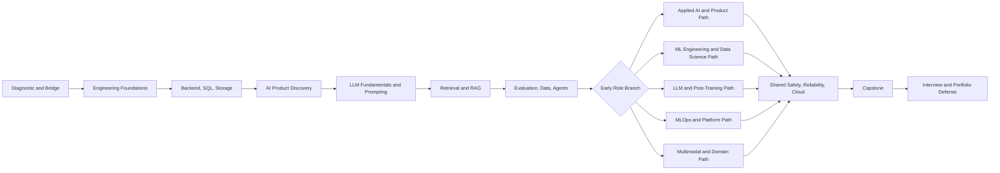

# Analytical Review of the GitHub Lesson Coverage Map

## Executive summary

The lesson coverage map is unusually ambitious and substantially better than the average “AI curriculum” floating around online. It defines a 57-lesson program with 40 shared core lessons, 11 role-specific specialization lessons, 6 interview-prep lessons, one junior entry checkpoint, and 5 formal readiness assessments. The scope is broad: software engineering foundations, backend systems, SQL and storage, applied AI discovery, LLM integration, prompt engineering, RAG, evaluation, data engineering, tool use and MCP, post-training, multimodal work, safety and governance, production reliability, cloud, Kubernetes, LLMOps/MLOps, open-model serving, inference optimization, classical ML, deep learning, and a capstone. That breadth lines up far more closely with project-based, systems-oriented curricula such as Full Stack Deep Learning, Stanford’s CS224N and CS329T, Berkeley’s ML systems courses, and modern MLOps syllabi than with theory-only ML courses.

The plan is strongest for applied AI engineering, generative AI engineering, RAG/search-heavy product work, and MLOps/platform roles. It is also notably better than most curricula on evaluation, safety, traceability, and operational concerns; those are usually hand-waved, but here they are explicit in lesson outcomes and readiness gates. That is consistent with current industry needs: job postings for MLOps and applied ML roles emphasize deployment, monitoring, drift detection, CI/CD, production support, cloud infrastructure, and measurable business impact; current trustworthy-agent and LLMOps course materials likewise emphasize evaluation, iteration, deployment, and operational learning loops.

The bad news is that the map is not fully industry-ready **for an unspecified learner** in its current form. It silently assumes the learner can absorb backend engineering, SQL, distributed systems, product framing, modern LLM application design, evaluation science, cloud deployment, Kubernetes, PEFT/post-training, and classical ML in one continuous track without a formal branching structure until late in the program. That is unrealistic for many learners. It also overweights GenAI platform engineering relative to classical data science, statistical experimentation, causal reasoning, forecasting, business analytics, front-end product instrumentation, and domain-specific regulatory workflows. Data scientist and AI product manager roles still routinely require strong experimentation, analytics-to-decision translation, stakeholder alignment, and ROI framing, which the map covers, but not deeply enough.

The optimal structure is **mixed**, not theory-only and not coding-only. A credible industry path should be roughly **30% theory and papers, 50% guided implementation, and 20% portfolio, evaluation, and oral defense**, because current roles require both conceptual judgment and operational execution. Theory-only would fail hiring screens that ask for deployed systems, monitoring, APIs, and production trade-offs; coding-only would fail system-design, model-selection, evaluation, safety, and post-training interviews. That balance is also the only way to do justice to the map’s own “Understand → Build → Operate” standard.

My overall verdict is blunt: **keep the map, but restructure it, add missing industry modules, and narrow the required portfolio to a smaller set of high-quality proving grounds**. As written, it is an excellent master map; as a learner-facing curriculum, it is still too broad, too assumption-heavy, and too light on explicit benchmark datasets, product analytics, domain packs, and data-science decision-making.

## Evidence base and coverage verdict

This report was reconciled against:

- [AI-Industry-Complete-Lesson-Coverage-Map.md](AI-Industry-Complete-Lesson-Coverage-Map.md)
- [AI-Industry-Curriculum.md](AI-Industry-Curriculum.md)
- [AI-Industry-Detailed-Lessons.md](AI-Industry-Detailed-Lessons.md)
- [AI-Industry-Detailed-Outline.md](AI-Industry-Detailed-Outline.md)
- [AI-Industry-Roadmap-and-Projects.md](AI-Industry-Roadmap-and-Projects.md)
- [api-integration-system-interview-prep.md](api-integration-system-interview-prep.md)
- Local project evidence visible in this repository, especially `supportops-ai-copilot/`, `labs/model-behavior-lab/`, the SupportOps implementation guides, and the Enterprise RAG implementation guides.

Strict answer to the "does this cover everything, 200%" question: **not as implemented code yet**. The documents now define a very strong planning map, and the roadmap projects can cover the stated curriculum if completed to the required ship standard. The repository itself does not yet contain built, verified implementations for every named roadmap project.

| Coverage question | Verdict |
|---|---|
| Do the referenced documents assign every major planned topic to lessons, projects, or readiness gates? | **Mostly yes for the stated Applied AI / GenAI / MLOps / .NET-oriented curriculum.** The complete coverage map now owns the research-review gaps, July 28 implementation-review amendments, role branches, project artifacts, and final completeness rule. |
| Do the projects mentioned in the roadmap cover the curriculum from all stated role perspectives? | **Yes as a portfolio design, with boundaries.** The phase projects plus `Atlas`, `Atlas.DotNet`, and optional `IncidentPilot` cover applied AI, GenAI, LLM/post-training, MLOps/platform, inference, security, evaluation, ML engineering, search/recommendation, multimodal/voice, forward-deployed, solutions-architecture, and .NET enterprise perspectives. |
| Does the current repo already prove that coverage through working projects? | **No.** The local repo shows substantial `supportops-ai-copilot/` implementation evidence, `labs/model-behavior-lab/`, and Enterprise RAG guide documents. It does not yet show completed project repos for `CargoEvents`, `ClauseScan`, `MedPolicy Navigator`, `EvalForge`, `OpsPilot`, `DomainTune`, `ClaimVision`, `VoiceTriage`, `GuardRail Gateway`, `ModelMesh`, `ChurnGuard`, `ListingMatch`, `Atlas`, `Atlas.DotNet`, `AegisOps`, or `IncidentPilot`. |
| Does the curriculum cover literally every AI industry topic? | **No, and it should not claim that.** Robotics, edge AI, diffusion/media generation, general reinforcement learning, symbolic/neuro-symbolic AI, and exhaustive domain specializations are explicitly treated as career bridges, optional extensions, or deferred topics. |
| What would make a "complete" claim defensible? | Every selected lesson must be generated, every selected project must satisfy the ship standard, every project must have evaluation/security/observability/cost/rollback evidence, and every role-readiness claim must pass the corresponding assessment. |

The wording throughout this report should therefore be read as **planning coverage unless it explicitly says implemented evidence**. The earlier draft also used non-portable internal citation markers; those have been removed so the file renders as clean standalone Markdown.

## What the map already does unusually well

The map’s biggest strength is that it treats AI work as **systems engineering**, not as prompt tinkering. The core sequence starts with reproducible environments, typed Python, async services, testing, APIs, SQL, and storage before the learner touches LLM product work. That is directionally correct. Industry roles keep asking for production ownership, not just notebook proficiency, and courses like Berkeley’s ML systems engineering and Made With ML similarly put containers, workflows, reproducibility, monitoring, and deployment near the center rather than the edges.

The LLM/application stack is also well chosen. The map covers model APIs, structured outputs, tool calling, prompt versioning, retrieval, reranking, abstention, evidence-backed generation, evaluation gates, and agent workflow control. That aligns with the modern applied-LLM stack described in Full Stack Deep Learning and Stanford’s agentic-system material, and it connects well to the actual technical foundations in the literature: transformers, RAG, LoRA, QLoRA, and DPO are not random buzzwords here; they are foundational mechanisms with clear production consequences.

The post-training and serving sections are also better than average. Many curricula mention fine-tuning and stop there. This map goes from PyTorch fundamentals through tokenization, SFT, LoRA/QLoRA, DPO, adaptation decisions, distributed training, open-model serving, and inference optimization. That progression is technically sound and clearly grounded in the tooling and papers that dominate modern open-model work: PyTorch distributed and FSDP, vLLM’s OpenAI-compatible serving surface, KServe’s Kubernetes-native serving model, and MLflow’s tracking and registry workflow all support the kind of lifecycle the map is trying to teach.

The emphasis on evaluation, governance, and security is another real strength. The map includes golden datasets, difficult-case mining, judge calibration, human evaluation, security regression testing, governance packages, incident processes, and release gates. That matches where trustworthy-LLM practice has moved: NIST’s AI RMF and Generative AI Profile explicitly frame trustworthy AI around lifecycle governance and risk management, while OWASP’s GenAI guidance treats prompt injection, agent/tool abuse, retrieval poisoning, and related threats as first-class engineering problems rather than afterthoughts.

The map is also honest about at least two scope boundaries: robotics and edge AI are recorded as extensions rather than quietly omitted. That is good intellectual hygiene. Too many curricula pretend “AI engineer” automatically covers embedded systems, ROS, sensor fusion, or real-time control. This one explicitly says it does not.

## Industry-readiness across roles and competencies

By role, my assessment is: **Applied AI / GenAI engineering: strong; MLOps / platform / inference: strong; ML engineering: strong-minus; data science: moderate; LLM/post-training research engineering: moderate-to-strong; product/PM: moderate; domain-specific application readiness: moderate-minus**. That scoring is an inference from the map plus current job signals. Roles in MLOps and ML engineering consistently ask for deployment, monitoring, CI/CD, drift handling, cloud, APIs, and production ownership, which the map covers extensively. Data science and product roles, by contrast, still depend heavily on experimentation, causal/statistical judgment, product instrumentation, and business decision framing, where the map is thinner. Research-oriented roles increasingly demand rigorous evaluation and post-training depth, which the map includes, but frontier math/research methodology remains underdeveloped.

The underlying reason is simple: the map is built around an enterprise customer-operations AI platform, so it naturally privileges system integration, retrieval, workflow control, approval loops, and production operations. That makes it very relevant for applied AI engineering, forward-deployed work, and enterprise platform teams. It is less naturally aligned with domains where the center of gravity is causal inference, experimentation, econometrics, scientific modeling, recommender economics, or regulated decision science.

### Current map topics versus industry-required competencies

| Industry-required competency | Current map coverage | Industry signal | Assessment |
|---|---|---|---|
| Production software engineering, APIs, testing, CI/CD, containers | Very strong: Lessons 01–06 explicitly cover environment reproducibility, typed Python, async services, tests, API/backend engineering, SQL/storage. | MLE/MLOps postings emphasize production ownership, APIs, monitoring, CI/CD, and collaboration with engineering teams. | **Strong** |
| LLM application engineering | Strong: Lessons 08–11 cover model APIs, prompting, structured outputs, traceability, feedback, and product metrics. | FSDL and agentic-system curricula emphasize prompt systems, iteration, deployment, and evaluation. | **Strong** |
| Retrieval, search, and production RAG | Strong: Lessons 12–14 include lexical/dense/hybrid retrieval, reranking, ingestion, provenance, permissions, abstention, and retrieval observability. | RAG literature and search engineering practice make retrieval quality, provenance, and evaluation central. | **Strong** |
| Evaluation, release gating, and safety | Strong: Lessons 15, 28–29, 31, 34 and specializations 45–46 cover eval datasets, judges, adversarial testing, governance, dashboards, and release gates. | Current research and standards emphasize evaluation strategy, trustworthiness, and GenAI risk controls. | **Strong** |
| Data engineering, lineage, PII handling, dataset quality | Moderate-to-strong: Lessons 06, 13, 16, 34 cover data layers, ingestion, dataset versioning, lineage, PII redaction, and feedback-to-training loops. | Modern production roles require data contracts, quality checks, and reproducible pipelines. | **Strong-minus** because warehouses/lakehouse/streaming are underweighted |
| Post-training and open-model adaptation | Strong: Lessons 19–25 and 35–36 closely mirror the open-model post-training lifecycle. | PyTorch docs and seminal papers support this stack: transformer fundamentals, LoRA, QLoRA, DPO, distributed training, efficient serving. | **Strong** |
| MLOps, serving, infra, Kubernetes | Strong: Lessons 30–36 and specialization 44 are directly relevant to platform roles. | Job postings call for Kubernetes, IaC, deployment, drift monitoring, production support, and cloud optimization. KServe, MLflow, Airflow, and vLLM map cleanly to this need. | **Strong** |
| Classical ML, experimentation, and business analytics | Present but not deep enough: Lessons 37–39 cover baselines, trees/boosting, DL, some A/B testing, and production ML. | Data scientist roles still ask for EDA, preprocessing, model development, deployment, monitoring, experiment design, Bayesian/statistical reasoning, and business interpretation. | **Moderate** |
| Product management, AI product ops, and stakeholder alignment | Light-to-moderate: Lessons 07, 11, 29, 31, 41, 51 include discovery, metrics, governance, and product ownership. | AI PM postings emphasize shaping portfolios, defining roadmaps and success metrics, managing cross-functional teams, and ensuring measurable ROI and adoption. | **Moderate** |
| Domain-specific depth | Partial: customer support is the main spine; insurance claims, voice, multimodal, search/recommendation, and robotics/edge boundaries appear later. | Industry hiring often values deep familiarity with a domain’s workflows, metrics, regulations, and data idiosyncrasies. | **Moderate-minus** |
| Front-end/UI instrumentation and user research | Minimal: React appears only as “minimal UI” or basic fundamentals in one specialization. | Real AI products require UX iteration, telemetry, feedback design, and human factors; FSDL explicitly includes UX for language interfaces. | **Weak-to-moderate** |
| Research methodology and paper reproduction | Medium: the map includes training and post-training mechanics, but not a systematic paper reading/reproduction track or stronger math foundations. | CS224N and current research roles expect deeper theory, experimental design, and method comparison than the map explicitly enforces. | **Moderate** |

The conclusion from that table is not subtle: the map is already good enough to anchor an applied AI engineer or MLOps-oriented path, but it is still **imbalanced** if the goal is one curriculum that prepares applicants equally well for data science, product leadership, research-heavy roles, and domain-specialist tracks.

## Critical gaps, missing topics, and unstated assumptions

The most serious technical gap is **statistics and decision science depth**. The map includes practical vectors/probability/statistics inside Lesson 37 and mentions A/B testing, but it does not clearly allocate serious time to experiment design, statistical power, confidence intervals, Bayesian methods, uplift modeling, causal inference, forecasting, time-series validation, survival analysis, or decision-theoretic model selection. That is a problem for data science roles, but it is also a problem for AI product teams that need to decide whether a feature actually created business value. Current data-science and product postings still emphasize measurable business impact and rigorous analysis, not just shipping a model-backed API.

The second major gap is the **data platform stack used in many enterprises**. The map has strong data lineage and pipeline concepts, but it is light on warehouses and lakehouse patterns such as Snowflake/BigQuery/Redshift equivalents, dbt-style analytics engineering, Kafka or event streaming, and open table formats such as Delta/Iceberg/Hudi. Airflow or Dagster only appear as optional orchestration tools in specific lessons; the learner could complete the map without ever building a realistic analytics-to-serving data path. That leaves a hole for ML engineers, data engineers, and platform teams working in companies where the hard part is not the model but the data contracts, feature freshness, and batch/streaming integration.

The third gap is **product and UX realism**. The map talks about discovery, human approval, user feedback, and business metrics, which is good, but it underweights front-end instrumentation, conversation UX, accessibility, dashboard design for operators, experiment readouts for executives, and the practical craft of shipping AI features that users understand and trust. FSDL is correct to treat language-interface UX as a first-class topic; your map treats it more like a side corridor. If the goal includes product/PM readiness or customer-facing AI roles, that is insufficient.

A fourth gap is **benchmark and dataset concreteness**. The map asks for evaluation datasets, training data pipelines, and multimodal workflows, but it does not specify a canonical benchmark pack. That matters because portfolio quality depends on comparable evidence. Retrieval work should force the learner to evaluate on something like BEIR; document AI should use datasets like FUNSD or DocVQA; speech work should use something like Common Voice; recommendation work should use MovieLens; preference learning should use open conversation or preference sets such as OpenAssistant, UltraFeedback, or HelpSteer. Without those anchors, “evaluation” becomes too easy to fake.

A fifth gap is **framework portability and ecosystem realism**. The map is explicitly PyTorch-first, which is defensible and sensible for modern open-model work, and CS224N also uses PyTorch. But there is almost no explicit TensorFlow/TFX/TF Serving awareness beyond generic ML concepts. TensorFlow’s own docs still show live production-relevant capabilities such as TF Decision Forests for classification/regression/ranking and TF Serving support for online serving at scale. I would not recommend dual-tracking the whole curriculum in both frameworks—that would be a waste—but I would recommend one interoperability module or comparison lab so learners can explain the trade-off instead of sounding dogmatic.

A sixth gap is minor but important: the map mentions “OpenTelemetry Generative AI conventions,” but the official OpenTelemetry docs now state those GenAI semantic conventions have moved to a dedicated repository, including conventions for GenAI spans, metrics, events, and MCP-related telemetry. That means Lesson 31 and Lesson 18 should be updated with current references rather than outdated paths. It is not a conceptual flaw, but it is exactly the sort of freshness issue that makes a curriculum feel stale fast.

The biggest **soft-skill** gap is that the map does not explicitly force repeated practice in writing, persuasion, and operational communication. Industry roles increasingly expect candidates to produce PRDs, design docs, threat models, experiment readouts, incident reports, rollout plans, and postmortems, then defend those documents orally. Some of that is implied by your lessons, but it should be made mandatory and recurrent, not incidental. Job descriptions for AI PMs, senior MLEs, and research scientists all highlight cross-functional collaboration, planning, communication, and measurable impact.

The map also rests on several unstated assumptions that should be made explicit. It assumes the learner is already at least somewhat comfortable with programming and debugging; it assumes access to cloud budget or GPUs for later lessons; it assumes the learner can tolerate a single business context dominating the core; it assumes annotation and human-review capacity for evaluation work; and it assumes that “one massive curriculum” is better than early branching. Those assumptions are not fatal, but if you leave them implicit, weaker learners will drown and stronger learners will waste time.

## Recommended curriculum architecture

The correct delivery model is **mixed**, with hard rejection of the two bad extremes. A theory-only version would not satisfy roles demanding deployed services, monitoring, CI/CD, cloud, or production ownership. A coding-only version would produce cargo-cult engineers who can wire tools together but cannot reason about transformers, retrieval trade-offs, PEFT decisions, evaluation contamination, calibration, or risk controls. The best contemporary courses in this space are project-based for exactly that reason: Berkeley’s systems courses are explicitly project-heavy, FSDL is full-stack and operational, Stanford’s trustworthy-agent course is project-based, and Made With ML treats design, systems, data, model, testing, reproducibility, and production as one lifecycle.

For an unspecified learner, I recommend a **two-ramp structure**. Ramp A is a beginner-to-professional path that keeps the full engineering foundation and adds a statistics bridge. Ramp B is a faster path for learners who already know Python, SQL, Git, testing, and basic cloud. Both then converge into a role-common AI systems core, before splitting into specializations earlier than Lesson 41. In other words, the current map’s content is mostly right, but the branching point is too late.

### Recommended modules and time estimates

The table below is a **recommended restructuring**, not a mere restatement of the map. The hours are my estimate for serious completion with working artifacts and defensible understanding.

| Recommended module | Scope | Suggested time | Primary assessment methods |
|---|---|---:|---|
| Foundations diagnostic and bridge | Entry diagnostic; optional Python/statistics/Linux bridge before L01 for learners who need it. | 20–60 hrs | Timed diagnostic, short coding exercises, stats quiz, environment setup check |
| Engineering foundations | L01–L04: reproducible envs, typed Python, async, testing, code quality. | 60 hrs | Repo audit, CI pass, unit/integration tests, code review |
| Backend, data, and APIs | L05–L06 plus stronger SQL and data-modeling practice. | 55 hrs | API contract test, schema design review, SQL lab, migration exercise |
| AI product discovery and LLM fundamentals | L07–L11. | 70 hrs | PRD, model-comparison memo, prompt test suite, product demo |
| Retrieval and RAG systems | L12–L14. | 75 hrs | Retrieval benchmark report, ingestion pipeline demo, grounded-answer eval |
| Evaluation, data engineering, and agents | L15–L18. | 85 hrs | Golden dataset package, judge calibration report, secure tool-workflow demo |
| Training and post-training core | L19–L25. | 110 hrs | Reproducible training run, adapter artifact, DPO comparison, cost-quality report |
| Multimodal and voice | L26–L27. | 45 hrs | Document workflow demo, latency/eval sheet, privacy checklist |
| Safety, governance, and reliability | L28–L31. | 70 hrs | Threat model, red-team suite, dashboards, incident/postmortem simulation |
| Cloud, Kubernetes, MLOps, and serving | L32–L36. | 120 hrs | Terraform review, K8s deployment, registry lineage demo, load/perf benchmark |
| Classical ML and ML systems | L37–L39 plus added experiment design and causal/forecasting block. | 95 hrs | Tabular ML report, calibration/error analysis, deployment, monitoring plan |
| Capstone, specialization, and interviews | L40–L57, but specialization starts earlier as a parallel track. | 140–220 hrs | Capstone defense, mock system design, SQL/coding interviews, portfolio review |

For most learners, that is roughly **845 to 1,065 hours** depending on how much bridging and specialization depth they need. That is a lot, but it is also what honesty looks like. Anyone promising “industry-ready AI engineer” from this scope in a few weeks is selling nonsense. The content footprint is closer to a serious bootstrapped apprenticeship or a compact graduate-level project sequence than to a weekend course.

The assessment style should also be more rigorous than ordinary coursework. Every module should end with five things: a working artifact, a quantitative evaluation report, a trade-off memo, a failure-analysis note, and a short oral defense. That pattern matches current hiring reality better than quiz-heavy assessment, because interviewers keep probing architecture choices, evaluation choices, incident handling, and business reasoning.

### Recommended curriculum flow

The flow below reflects the structure I would actually implement for industry readiness, using earlier branching than the current coverage map but preserving its core content and readiness philosophy.

```mermaid
flowchart LR
    A[Diagnostic and Bridge] --> B[Engineering Foundations]
    B --> C[Backend, SQL, Storage]
    C --> D[AI Product Discovery]
    D --> E[LLM Fundamentals and Prompting]
    E --> F[Retrieval and RAG]
    F --> G[Evaluation, Data, Agents]
    G --> H{Early Role Branch}
    H --> I[Applied AI and Product Path]
    H --> J[ML Engineering and Data Science Path]
    H --> K[LLM and Post-Training Path]
    H --> L[MLOps and Platform Path]
    H --> M[Multimodal and Domain Path]
    I --> N[Shared Safety, Reliability, Cloud]
    J --> N
    K --> N
    L --> N
    M --> N
    N --> O[Capstone]
    O --> P[Interview and Portfolio Defense]
```

## Integrated portfolio projects

The map currently produces too many potential artifacts and not enough **portfolio coherence**. For hiring, fewer stronger repos beat dozens of half-finished labs. I would collapse the portfolio into **nine integrated projects**, each deliberately chosen to prove multiple competencies across roles. Collectively, they cover the map’s main technical areas and industry perspectives.

This is a compression strategy, not a contradiction of the roadmap. [AI-Industry-Roadmap-and-Projects.md](AI-Industry-Roadmap-and-Projects.md) defines named phase projects such as `CargoEvents`, `ClauseScan`, `MedPolicy Navigator`, `EvalForge`, `OpsPilot`, `DomainTune`, `ClaimVision`, `VoiceTriage`, `GuardRail Gateway`, `ModelMesh`, `ChurnGuard`, `ListingMatch`, optional `IncidentPilot`, and the `Atlas` capstone. The nine projects below are the smallest portfolio set I would use to prove the same breadth without producing a scattered collection of shallow repos.

| Roadmap project or project family | Compressed portfolio artifact | Coverage note |
|---|---|---|
| `CargoEvents`, `ClauseScan`, SupportOps AI Copilot | SupportOps AI copilot | Combines backend foundations, LLM app integration, prompt contracts, approval, metrics, and deployment evidence. |
| `MedPolicy Navigator`, Enterprise RAG | Enterprise RAG knowledge assistant | Covers retrieval, ingestion, authorization, citations, abstention, RAG evaluation, and bounded agentic retrieval. |
| `ClaimVision` | Document intelligence claims reviewer | Covers multimodal document processing, extraction, evidence, privacy, and human review. |
| `VoiceTriage` | Voice triage and escalation agent | Covers streaming voice, realtime workflow constraints, escalation, and consent/retention controls. |
| `DomainTune` | Open-model adaptation pipeline | Covers SFT, LoRA, QLoRA, DPO, adapter registry, model comparison, and serving tradeoffs. |
| `ModelMesh`, optional `IncidentPilot` | MLOps and serving platform | Covers cloud, Kubernetes, registry, rollout, rollback, monitoring, incident evidence, and platform operations. |
| `ChurnGuard` | Predictive SLA or churn system | Covers classical ML, calibration, business decision readouts, drift, and retraining. |
| `ListingMatch` and search/ranking role branch | Recommendation and search stack | Covers recommenders, ranking, offline metrics, feedback loops, and online-style experimentation. |
| `Atlas`, `Atlas.DotNet`, `GuardRail Gateway`, `OpsPilot`, AegisOps | AegisOps governed agent platform | Covers integrated agent architecture, tools/MCP/A2A, governed memory, .NET parity, safety, audit, localization, and production rollout. |

### Project mapping

| Project | Objective | Suggested datasets and tools | Deliverables | Difficulty | Curriculum mapping |
|---|---|---|---|---|---|
| SupportOps AI copilot | Build a production-grade customer-support assistant with classification, extraction, draft response generation, human approval, and auditability. | Customer Support on Twitter or equivalent support-ticket corpus; FastAPI, PostgreSQL, Redis, model API, OpenTelemetry, prompt registry. | Deployed API/UI, prompt suite, eval report, feedback dashboard, architecture doc, cost report | Medium | L01–L11, L31–L32, L40 |
| Enterprise RAG knowledge assistant | Build permission-aware RAG with ingestion, chunking, hybrid retrieval, reranking, citations, abstention, and eval gates. | BEIR for retrieval benchmarking plus internal/public policy corpus; pgvector/OpenSearch, reranker, eval harness. | Ingestion pipeline, retrieval benchmark, grounded-answer dashboard, access-control tests | Medium-hard | L12–L18, L28, L30–L31, L40 |
| Document intelligence claims reviewer | Extract and verify fields from scanned documents, receipts, and forms; route low-confidence cases to humans. | FUNSD, DocVQA, optionally receipt/form corpora; OCR engine, OpenCV, multimodal model/API, PyTorch or Transformers. | Multimodal pipeline, extraction metrics, evidence viewer, privacy checklist | Medium-hard | L13, L15–L16, L26, L28–L29, L50 |
| Voice triage and escalation agent | Build a realtime voice assistant with STT/TTS, interruption handling, structured actions, and escalation to humans. | Common Voice for baseline ASR experiments; realtime speech/voice APIs, WebSockets/WebRTC, evaluation harness. | Voice demo, latency report, task-completion metrics, consent/retention policy | Hard | L03, L17, L27, L28–L31, L50 |
| Open-model adaptation pipeline | Fine-tune and evaluate a small open model with SFT, LoRA/QLoRA, and DPO; compare against prompting/RAG baselines. | OpenAssistant, UltraFeedback, HelpSteer or similar; PyTorch, Transformers, TRL, PEFT, MLflow. | Dataset card, training runs, adapter registry, benchmark report, serving decision memo | Hard | L19–L25, L34–L36, L43 |
| MLOps and serving platform | Build a self-service train-evaluate-approve-deploy-monitor workflow for both classical ML and LLM adapters. | Small tabular dataset plus one LLM artifact; Airflow/Dagster, MLflow, DVC, Terraform, Kubernetes, KServe/vLLM. | Workflow DAG, model registry, canary release demo, rollback demo, platform README | Hard | L30–L36, L38, L44 |
| Predictive SLA or churn system | Build a classical ML system with feature pipelines, calibration, deployment, monitoring, and retraining triggers. | Public tabular business dataset such as churn/service risk data; scikit-learn/XGBoost/LightGBM, MLflow, FastAPI, monitoring stack. | EDA notebook, feature pipeline, model comparison, deployed scoring API, drift plan | Medium | L37–L39, L47 |
| Recommendation and search stack | Build a two-stage recommender/search system with candidate generation, reranking, offline metrics, and online-style evaluation. | MovieLens for recommenders; BM25+dense retrieval stack for search; vector/rerank tooling. | Candidate generator, ranking model, evaluation report, service API, experiment memo | Hard | L12, L15, L37–L39, L49 |
| **AegisOps governed agent platform** | Build and operate a multilingual, multi-provider enterprise agent that plans bounded workflows, retrieves evidence, maintains governed memory, uses MCP/A2A-connected tools, obtains approval for consequential actions, and produces replayable audit evidence. | Synthetic English/Arabic operations cases plus public or sanitized policy documents; Python, FastAPI, Pydantic, PostgreSQL/pgvector, Redis, OpenSearch, LangGraph or explicit state graphs, MCP SDK, one A2A implementation, Azure OpenAI, one alternate hosted provider, one open model, OpenTelemetry, Application Insights or ELK, Docker, Kubernetes, Terraform. | Working agent platform, provider and framework trade-off report, RAG/memory service, secured MCP server, A2A handoff, bilingual eval and red-team packs, agent capability card, trace/replay dashboard, cost/cache report, UAE residency control record, canary/rollback/failover demonstration | Very hard | L01–L18, L28–L36, L40, L42, L45–L46, L51, L54, L56–L57 |

Those nine projects are enough. More would just dilute attention. If someone cannot make those nine believable, adding twenty smaller repositories will not save them.

For hiring value, each project repository should contain the same structure: a crisp problem statement, architecture diagram, reproducible setup, tests, benchmark/evaluation results, cost/performance notes, threat model where relevant, a short demo video, and a “what failed and what I changed” section. Recruiters and interviewers are not impressed by repo count; they are impressed by evidence, clarity, and honest trade-off reasoning.

### POD-aligned Agentic Engineer project — AegisOps

`AegisOps` is a new standalone project, not an extension of the SupportOps copilot. Its purpose is to turn the Agentic Engineer role profile into one implementable, testable production system.

**Scenario:** A UAE-based enterprise operations team receives cases in English and Arabic. Each case may require policy retrieval, customer or asset lookup, evidence synthesis, a multi-step remediation plan, specialist-agent handoffs, and a controlled write such as updating a ticket, notifying a customer, or changing a low-risk configuration. The platform may propose consequential actions, but it may execute them only after an authorized human approves the exact action and arguments.

#### Required architecture and evidence

| Capability thread | Required implementation | Evidence that proves completion |
|---|---|---|
| Engineering foundation | Build typed, asynchronous Python services with Pydantic validation, explicit interfaces, dependency injection, bounded concurrency, structured errors, and maintainable package boundaries. Enforce formatting, linting, type checking, dependency auditing, and unit, integration, contract, failure, load, and security tests. | Reproducible environment, architecture/package review, passing CI quality gates, coverage and mutation-risk report where useful, API contract tests, and a fresh-clone deployment demonstration. |
| Agent architecture | Implement the workflow first as an explicit state graph with goal, plan, act, verify, recover, escalate, and terminate states. Compare bounded ReAct-style, plan-and-execute, and reflection/verifier variants without making an unconstrained autonomous loop the default. | Architecture decision record, state diagram, loop-termination tests, maximum step/time/spend enforcement, and a comparison report showing when each pattern helps or harms quality, latency, and cost. |
| Provider and framework portability | Create provider-independent model and agent-runtime interfaces. Implement an Azure OpenAI path, an Anthropic-compatible alternate, and a Mistral/Llama open-model path served through vLLM or TensorRT-LLM where supported. Compare native/custom orchestration, LangGraph, Semantic Kernel, LlamaIndex, LangChain, AutoGen, CrewAI, the OpenAI Agents SDK, and at least one provider-native agent SDK spike, but implement only the explicit loop and one justified framework adapter deeply. | Provider/framework decision matrix and provider-native SDK spike covering quality, tool reliability, structured-output validity, latency, cost, context capacity, regional availability, data handling, failover, and lock-in. |
| Prompt, context, and cost controls | Version system prompts and output contracts; compare zero-shot and few-shot prompts on normal and edge cases; add context selection, summarization, token/context budgets, hosted prompt caching where supported, semantic/tool-result caching with authorization-aware keys, request batching where semantics permit, and complexity-based model routing. | Prompt and edge-case regression suite, zero-shot/few-shot comparison, cache-hit and invalidation report, batch-semantics tests, preflight cost estimate, per-agent/model/use-case budget alerts, and cost per successful task. |
| Retrieval and governed memory | Build permission-aware hybrid RAG with metadata filters, reranking, citations, freshness, and abstention. Implement one production retrieval backend and a FAISS local baseline; compare Azure AI Search, pgvector/OpenSearch, Pinecone, and Weaviate as deployment alternatives. Separate request context, session state, durable workflow state, user preferences, retrieval-backed memory, and summarized memory. Add explicit write policy, provenance, consent, expiration, correction, and deletion. | Retrieval benchmark, backend trade-off record, access-control tests, citation verification, memory-policy document, memory read/write tests, deletion/expiry demonstration, and context-budget report. |
| Tools, MCP, and A2A | Define OpenAPI/JSON Schema contracts; validate and bound inputs and result sizes; enforce least privilege, rate limits, idempotency, timeouts, retries, compensation, and sandboxing. Implement fallback-tool selection and structured failure responses that help the runtime recover or escalate. Author and deploy at least one secured MCP server. Implement one authenticated A2A handoff with identity and policy context propagation. | Tool-contract tests, SQL-injection and excessive-fetch tests, fallback selection and all-tools-failed tests, duplicate-write tests, malicious MCP-server/tool-result tests, MCP capability allowlist, and A2A interoperability and cross-agent authorization tests. |
| Safety and human control | Keep authorization outside the model. Add prompt-injection defenses, output DLP for PII and secrets, harmful/bias policy checks, refusal and over-refusal handling, tenant isolation, and exact-action approval for consequential writes. | Threat model, red-team report, zero successful unauthorized-write cases, approval audit records, refusal-quality and subgroup-safety reports, and compliance-ready control evidence. |
| Agent evaluation and feedback loop | Build versioned English and Arabic golden datasets containing happy paths, difficult cases, boundary cases, tool failures, adversarial prompts, permission violations, and escalation cases. Measure task completion, factual/grounded output, tool selection, argument correctness, invalid actions, step count, recovery, escalation, human intervention, latency, and cost. Calibrate model judges against human labels. Feed sampled operator feedback through review, dataset versioning, regression evaluation, and controlled prompt/model/tool releases. | Evaluation report with slices and confidence intervals, judge-calibration report, human-review workflow, feedback-to-dataset lineage, before/after regression evidence, CI release gates, and a blocked release demonstration. |
| Multimodal agent workflow | Accept at least one non-text input such as a policy image, scanned form, document attachment, or voice note. Extract evidence, preserve modality provenance, allow the agent to use tools from the multimodal result, and route low-confidence cases to a human. | Modality-specific evaluation slice, evidence/provenance view, latency and cost report, low-confidence routing tests, and privacy/retention controls. |
| Observability and safe replay | Trace model, retrieval, memory, parsing, policy, tool, MCP, and A2A operations with correlation identifiers and stage-level latency. Store redacted state transitions, tool inputs/outputs, policy decisions, and concise decision summaries for authorized replay. Never require or store hidden chain-of-thought. | OpenTelemetry traces, Application Insights or ELK dashboards, one AI trace/evaluation view using LangSmith, Braintrust, or equivalent, sensitive-telemetry tests, authorized replay demonstration, agent success/error/latency/cost dashboards, and incident reconstruction exercise. |
| UAE/Arabic delivery profile | Support Arabic and English prompts, retrieval, evaluation, operator UX, and right-to-left presentation. Document regional provider availability, data residency, retention, cross-border transfer assumptions, and regulated-industry control mappings. | Bilingual quality and safety report, locale-specific failure analysis, RTL usability evidence, data-flow/residency diagram, and UAE deployment/control decision record. |
| Engineering collaboration and documentation | Run explicit Backend, QA, Data, Security, and operator review gates. Review API/tool contracts, prompts, memory policy, guardrails, evaluation data, and failure behavior as code and design changes. | API-contract signoff, QA scenario matrix, data-feature request, prompt/tool/security code-review records, agent capability card, operating limitations, and escalation documentation. |
| Production delivery | Package the system as independently deployable services with GitHub Actions or Azure DevOps CI/CD, environment separation, secrets management, feature flags, canary rollout, rollback, provider failover, backups, SLOs, load shedding, and disaster recovery. | Reproducible infrastructure, load/failure-injection report, feature-flag and canary evidence, provider/tool outage drill, rollback and restore demonstration, runbooks, and postmortem. |

#### Implementation sequence

1. **Discovery and controls:** define users, workflow, allowed and prohibited actions, approval boundaries, success metrics, residency constraints, and the non-AI fallback.
2. **Deterministic baseline:** implement typed async services and the case workflow without an autonomous loop; create API/tool contracts, software quality gates, and the first golden dataset.
3. **Provider gateway:** add Azure OpenAI, alternate-hosted, and open-model adapters; structured outputs, streaming, routing, caching, batching, token budgets, cost attribution, provider-native SDK spike, and failover.
4. **RAG and memory:** implement ingestion, hybrid retrieval, reranking, citations, governed session/persistent memory, summarization, expiration, and deletion.
5. **Agent runtime:** add bounded planning, execution, verification, recovery, escalation, reflection/verifier experiments, and loop termination.
6. **Secure tools and protocols:** add read/write tools, approval, sandboxing, MCP server/client integration, and one A2A specialist handoff.
7. **Safety, evaluation, feedback, and review:** add input/output controls, bilingual/adversarial and multimodal datasets, agent and tool metrics, human review, red teaming, the reviewed feedback-to-dataset-to-release loop, cross-functional code/design review gates, and CI release gates.
8. **Observability and replay:** add end-to-end traces, sanitized state snapshots, authorized replay, dashboards, cost alerts, and incident reconstruction.
9. **UAE production profile:** validate Arabic/RTL behavior, residency and retention controls, regional provider choices, and compliance evidence.
10. **Production rollout:** deploy with infrastructure as code, feature flags, canary traffic, rollback, provider failover, load/failure testing, and operational handoff.

#### Acceptance gates

- Every consequential write requires approval of the exact tool, target, and arguments; the adversarial suite produces zero unauthorized actions.
- Formatting, linting, type checking, dependency auditing, and required unit, integration, contract, failure, and security suites pass in CI.
- Structured outputs meet an initial 95% validity target, and task-completion, tool-selection, argument-correctness, recovery, and escalation thresholds are defined from a measured baseline before launch.
- Unauthorized documents never enter model context; citations resolve to permitted evidence; memory deletion and expiration are demonstrable.
- English and Arabic quality, safety, latency, and refusal results are reported separately, with any allowed parity gap explicitly approved.
- The selected multimodal workflow meets declared extraction/task thresholds, preserves evidence provenance, and sends low-confidence cases to human review.
- Prompt injection, malicious tool output, data-exfiltration, SQL-injection, oversized-result, cross-tenant, and denial-of-service tests run in CI.
- No raw hidden reasoning or unredacted sensitive prompt content appears in logs, traces, replay snapshots, or evaluation exports.
- Cost, latency, step, and token budgets can stop or reroute a run before uncontrolled spend occurs.
- A model-provider outage, tool failure, MCP failure, A2A authorization failure, canary regression, rollback, and restore are each demonstrated.
- Backend, QA, Data, Security, and operator reviewers approve the relevant contracts, tests, policies, and operational evidence before production rollout.
- At least one reviewed production-feedback sample is promoted into a new dataset version, exercises the regression suite, and results in an approved or rejected versioned change.
- Another engineer can deploy, operate, investigate, and safely disable the platform using the supplied documentation and runbooks.

#### Required project package

- Product requirements, workflow map, architecture diagram, threat model, and architecture decision records.
- API, tool, MCP, A2A, event, memory, identity, and policy contracts, plus their cross-functional review records.
- Agent capability card covering goals, tools, data access, limits, prohibited actions, escalation rules, and known failure modes.
- Versioned bilingual golden, difficult-case, and adversarial datasets with annotation guidance and human-review evidence.
- Evaluation, red-team, retrieval, memory, cache, cost, localization, load, failure-injection, and residency reports.
- Source code, tests, CI/CD, infrastructure as code, dashboards, feature-flag configuration, deployment/rollback configuration, runbooks, incident report, and production handoff checklist.

**Scope controls:** implement one framework and one cloud path deeply, then prove portability through adapters and comparison evidence. Do not expose chain-of-thought, permit unsupervised high-impact writes, claim fixed cache savings without measurement, or treat multi-agent design as the default when one controlled workflow is sufficient.

### Project-to-topic relationship

The graph below shows how the recommended portfolio compresses the map’s breadth into a smaller number of stronger artifacts.

```mermaid
graph TD
    P1[SupportOps Copilot] --> T1[Engineering and APIs]
    P1 --> T2[Prompting and Product Metrics]

    P2[Enterprise RAG Assistant] --> T3[Retrieval and Ingestion]
    P2 --> T4[Evaluation and Access Control]

    P3[Document Intelligence Reviewer] --> T5[Multimodal and Document AI]
    P3 --> T6[Human Review and Governance]

    P4[Voice Triage Agent] --> T7[Realtime Systems]
    P4 --> T8[Agents and Safety]

    P5[Open-Model Adaptation Pipeline] --> T9[PyTorch and Post-Training]
    P5 --> T10[Serving and Benchmarking]

    P6[MLOps and Serving Platform] --> T11[Cloud, Kubernetes, CI/CD]
    P6 --> T12[Registries and Monitoring]

    P7[Predictive SLA or Churn System] --> T13[Classical ML]
    P7 --> T14[Production ML]

    P8[Recommendation and Search Stack] --> T15[Ranking and Recommendation]
    P8 --> T4

    P9[AegisOps Governed Agent Platform] --> T3
    P9 --> T4
    P9 --> T8
    P9 --> T11
    P9 --> T12
    P9 --> T16[Agent Architecture and Memory]
    P9 --> T17[MCP, A2A, and Human Control]
    P9 --> T18[Arabic, UAE Residency, and Governed Operations]
```

## Implementation Decision Addendum — July 28, 2026

### Status Guardrail

This addendum records **scope and curriculum-planning decisions** made after reviewing the supporting AI-topic images against the seven curriculum documents. It does not replace the analytical findings above.

Most importantly, **accepted does not mean generated, coded, taught, deployed, or validated**. It means the topic is approved for synchronized ownership, outcomes, exercises, and acceptance evidence in the planning documents. The lesson-generation status in the complete lesson coverage map remains the authority for what lesson content actually exists. No remaining lesson should be described as complete merely because its plan was expanded here.

Use these status labels:

- **Accepted — core integration:** add or repair coverage inside existing lessons without increasing the 57-lesson count.
- **Accepted — parallel proof lane:** add implementation evidence for a target stack while preserving the primary Python path.
- **Accepted — optional satellite:** add a role-relevant project that is not a prerequisite for every learner.
- **Deferred:** legitimate subject, but not important enough for the current Applied AI/.NET job-readiness path to displace core work.

### Accepted Decisions

| Decision | Status and importance | Curriculum ownership | Required evidence; not a completion claim |
|---|---|---|---|
| Add a **parallel .NET Applied AI lane** without replacing Python | Accepted — parallel proof lane; **essential for the target learner** | Lessons 09, 14, 17–18, 30–31, and 40; roadmap and interview preparation | One evolving ASP.NET Core path using provider-neutral model contracts, streaming, typed output validation, permission-aware RAG, controlled tools/MCP, workload identity, telemetry, deployment/rollback, and contract/evaluation parity. It is not a requirement to port every notebook or service. |
| Repair **agent memory** coverage | Accepted — core integration; **essential** | Lesson 17, synchronized through curriculum, outline, detailed lessons, and coverage map | Distinguish request context, session state, durable workflow state, preferences, retrieval-backed memory, and summarized memory; define write policy, provenance, consent, expiry, correction, deletion, and tests. Do not equate memory with saving a transcript. |
| Extend production RAG with **bounded agentic retrieval** | Accepted — core integration; **high** | Lesson 14 and its project/evaluation evidence | Classic RAG remains the baseline. Add planned subqueries, iterative/parallel retrieval, reranking/evidence verification, authorization on every iteration, termination/budget limits, and a classic-versus-agentic quality/latency/cost comparison. |
| Add **AI API integration and system-design interview preparation** | Accepted — core integration; **high** | `api-integration-system-interview-prep.md` plus interview-prep lesson cross-references | Reuse the shipment scenario as an AI exception copilot and cover gateway abstraction, C# design, streaming, structured outputs, RAG, tools/MCP, identity/authorization, resilience, budgets, injection/PII, evaluation, telemetry, approval, mock questions, and study-plan practice. |
| Add SRE fundamentals and an **IncidentPilot** AIOps project | Accepted — RED/USE and operational reasoning are core; `IncidentPilot` is an optional satellite; **medium-high for SRE/MLOps/platform roles** | Lesson 31 operations outcomes, Phase 8 roadmap, optional portfolio | Deterministic monitoring baseline, evidence-linked incident timeline, ranked hypotheses rather than asserted causes, runbook retrieval, failure drills, and externally authorized human-approved remediation. This does not authorize unsupervised self-healing. |
| Require an **AI architecture decision exercise** | Accepted — core integration; **medium** | Lessons 30 and 40, roadmap/capstone evidence | ADR comparing modular monolith, event-driven workers, and separate services using scaling, failure isolation, security/data ownership, deployment, and team forces; include an evolutionary extraction trigger and rejected alternatives. It is not a survey of every architecture pattern. |

These decisions deliberately concentrate on high-leverage gaps. They make the existing program more coherent for production Applied AI and enterprise .NET work without turning every image label or vendor logo into another required lesson.

### Deferred Or Role-Specific Topics

| Topic | Decision | Reason and re-entry condition |
|---|---|---|
| Diffusion, text-to-image, image editing, and text-to-video | Deferred from the shared core | Important for generative-media roles, but not required for the current production Applied AI/.NET path. Add as a media specialization when a target role or project requires generation rather than multimodal understanding. |
| General reinforcement learning beyond LLM post-training | Deferred from the shared core | MDPs, value learning, policy gradients, and actor-critic methods are valid specialist material. Re-enter for RL/control/research roles; keep existing RLHF/PPO/GRPO coverage scoped to post-training. |
| Classical symbolic AI and neuro-symbolic systems | Deferred from the shared core | Add when planning, knowledge representation, formal reasoning, ontology, or expert-system roles become explicit targets. Do not add only to make a topic list look exhaustive. |
| Every agent framework, model provider, vector database, or logo in the images | Rejected as a coverage strategy | Teach contracts, selection criteria, failure modes, and one deep implementation plus limited portability spikes. Revisit a product only when it represents a real deployment constraint. |
| A survey of all software architecture styles | Rejected as a required expansion | The accepted ADR compares the three shapes most relevant to this platform and teaches evolutionary decision-making. Add another pattern only when the project creates its decision forces. |
| Product-specific `SKILL.md` as a universal industry standard | Deferred as a named core requirement | Reusable, versioned, permissioned, tested agent capabilities are important; teach those durable properties. Add a product-specific skill format as a lab only when the selected runtime uses it. |

### Portability And Preview Safeguards

- Keep Python as the primary curriculum implementation. The .NET lane proves transfer through one coherent end-to-end path and shared contracts/evaluations.
- Use a provider-neutral application boundary. `Microsoft.Extensions.AI.IChatClient` is one appropriate .NET abstraction, but provider routing, authorization, validation, evaluation, and fallback remain application responsibilities.
- Semantic Kernel is optional. For Microsoft Agent Framework or any rapidly changing agent/runtime feature, verify the release status of the exact package and feature at implementation time. Pin preview dependencies, isolate them behind adapters, record migration risk, and never make preview-only behavior a readiness requirement.
- OpenTelemetry GenAI conventions and instrumentation continue to evolve. Pin the selected convention/version, record it, and map a small internal telemetry contract so dashboards and tests are not coupled to one transient attribute name.
- Entra ID and managed identity belong in the Azure/.NET proof path where supported; the durable outcome is least-privilege user/workload identity and authorization outside the model, with an equivalent mechanism on another cloud.
- MCP coverage should emphasize authenticated boundaries, capability allowlists, schemas, authorization, untrusted tool results, idempotency, approval, and audit rather than one SDK's current API.

### Synchronization And Acceptance Check

The July 28 change set should be considered synchronized only when:

1. Curriculum, detailed outline, detailed lessons, and complete coverage map assign the same accepted topics to the same existing lesson numbers.
2. Lesson 17 contains memory outcomes and evidence rather than leaving memory only in a high-level overview.
3. Lesson 14 keeps classic RAG as the prerequisite and requires a bounded classic-versus-agentic comparison.
4. Lessons 30–31 and the roadmap distinguish core operational literacy from optional `IncidentPilot` scope.
5. Roadmap/capstone evidence identifies the .NET lane as parallel and the architecture ADR as required, without implying that all projects need duplicate Python and C# implementations.
6. The API interview guide includes the AI exception-copilot system-design material and study integration.
7. The complete lesson map's generated/not-generated status remains unchanged unless lesson artifacts are actually created and verified.
8. Preview features are visibly labeled and version-pinned in eventual implementations.

This addendum narrows the implementation decision for the target Applied AI/.NET path; it does not erase the broader statistics, data-platform, benchmark, product/UX, research, or domain recommendations in the action plan below. Those remain valid prioritization inputs for other role branches.

## Gap-prioritized action plan

The correct next step is not “add everything.” It is to fix the highest-leverage gaps first.

| Priority | Change to the map | Why it matters | Hiring payoff |
|---|---|---|---|
| P0 | Add an explicit pre-core diagnostic and two entry ramps: one for learners who need Python/statistics/Linux reinforcement, one for learners who can fast-track. | The current unified sequence assumes too much prior skill. | Reduces dropout and makes claims of role readiness more credible |
| P0 | Add a required **statistics, experimentation, and causal reasoning** module before or alongside Lessons 37–39. | Data science, AI PM, and ML product decisions require more than model fitting. | Improves DS readiness and case/system-design performance |
| P0 | Add a required **data platform and analytics engineering** block: warehouse/lakehouse basics, dbt-style transformation, batch vs stream, feature freshness, event schemas. | Current data coverage is solid but too narrow for enterprise reality. | Improves MLE, data engineer, and platform-role fit |
| P0 | Define a canonical benchmark pack with required public datasets for retrieval, document AI, speech, recommendation, and preference learning. | Without fixed benchmarks, “evaluation” becomes vague and portfolio artifacts become incomparable. | Makes portfolios and mock interviews evidence-backed |
| P0 | Add the **AegisOps governed agent platform** as the POD-aligned Agentic Engineer proving ground and map each role-profile requirement to an implementation stage and acceptance gate. | Agent memory, framework choice, hosted prompt caching, A2A implementation, safe replay, feature flags, Arabic/UAE delivery, and role-specific readiness are otherwise fragmented or absent. | Creates one defensible project for production Agentic Engineer interviews and readiness assessment |
| P1 | Move specialization branching earlier, around the evaluation/data/agents stage, instead of waiting until Lesson 41. | The current late branching makes the core too wide for many learners. | Cuts wasted effort and improves role focus |
| P1 | Strengthen product/UX coverage with a real module on AI UX, operator workflows, instrumentation, accessibility, and adoption metrics. | Product-facing AI roles need more than discovery docs. FSDL explicitly elevates UX for language interfaces. | Improves PM, applied AI, and forward-deployed readiness |
| P1 | Add one framework/interoperability lab covering TensorFlow-serving/TF-DF awareness and explicit cross-framework trade-offs. | PyTorch-first is fine; PyTorch-only thinking is not. | Helps candidates answer “why this stack?” rather than reciting fashions |
| P1 | Refresh observability references so Lesson 31 uses the current OpenTelemetry GenAI convention location and MCP-aware telemetry references. | Prevents stale curriculum details. | Signals current operational literacy |
| P2 | Add optional research extension: math refresh, paper reproduction cadence, ablation design, reading group, and replication reports. | Research-track applicants need more than implementation familiarity. | Improves applied-scientist and research-engineer competitiveness |
| P2 | Add domain packs with metrics, data constraints, and regulation templates for at least healthcare, finance/risk, search/recommendation, and industrial ops. | One customer-support spine is useful, but too generic. | Increases transferability to domain-specific hiring |

For portfolio strategy, do not try to showcase every lesson independently. The strongest hiring package would contain **four anchor artifacts**: one deployed AI product repo, one evaluated RAG/search repo, one classical ML system repo, and one post-training/serving or MLOps platform repo. Around those, include two supporting documents that applicants usually neglect: a design-doc bundle and an incident/postmortem bundle. That combination maps much more directly to how experienced interviewers evaluate candidates than “many cool demos.”

Interview preparation should also be widened slightly beyond the current lessons 52–57. The map already includes coding, SQL, applied AI cases, LLM/model-training interviews, system design, and portfolio defense. Keep those, but add explicit prep on experiment design, cost modeling, business metric selection, failure-mode taxonomy, model evaluation contamination, drift diagnosis, and how to explain a deployment rollback to a non-technical stakeholder. Those are the kinds of questions that separate someone who really built systems from someone who merely followed a tutorial.

The final judgment is straightforward. The coverage map is already a **high-quality master blueprint** for an AI-industry curriculum. It is broad, unusually operational, and technically serious. But breadth is not the same thing as readiness. To become truly industry-ready for a broad set of roles, it needs earlier branching, stronger statistics and data-platform depth, concrete public benchmark packs, better product/UX instrumentation, refreshed observability references, and a portfolio strategy that focuses on fewer, stronger, evidence-heavy projects. If you make those changes, the map stops being merely ambitious and starts becoming genuinely competitive with the strongest public AI engineering curricula.
