# SupportOps AI Copilot — Architecture (Complete Reference)

This document is the single, complete technical description of the system. It is written so that a
reader with no prior exposure can finish it with a full mental model of **what runs, how the pieces
connect, what happens on every request, how data is shaped, and how the system is operated**.

Diagrams are written in [Mermaid](https://mermaid.js.org/) (renders on GitHub and most Markdown
viewers) with ASCII fallbacks where useful.

> **What the product does, in one sentence:** a support agent files a customer ticket; the system
> uses an LLM to classify it, extract fields, set priority, and draft a reply; a human approves every
> draft before it is used — and every step is measured, costed, gated, and reversible.

## Table of contents

1. [System context](#1-system-context)
2. [Runtime topology (the 9 services)](#2-runtime-topology-the-9-services)
3. [Codebase architecture (apps & packages)](#3-codebase-architecture-apps--packages)
4. [The dependency rule](#4-the-dependency-rule)
5. [Data model](#5-data-model)
6. [The three analysis paths](#6-the-three-analysis-paths)
7. [Request flows (sequence diagrams)](#7-request-flows-sequence-diagrams)
8. [The model gateway internals](#8-the-model-gateway-internals)
9. [State machines](#9-state-machines)
10. [Evaluation subsystem](#10-evaluation-subsystem)
11. [Observability: logs, metrics, traces, cost](#11-observability-logs-metrics-traces-cost)
12. [Security & multi-tenancy](#12-security--multi-tenancy)
13. [Reliability & failure handling](#13-reliability--failure-handling)
14. [Configuration](#14-configuration)
15. [Deployment, CI/CD & rollback](#15-deployment-cicd--rollback)
16. [Data lifecycle & retention](#16-data-lifecycle--retention)
17. [Naming inconsistencies (read before debugging)](#17-naming-inconsistencies-read-before-debugging)
18. [Glossary](#18-glossary)

---

## 1. System context

Who and what interacts with the system, and where the trust boundary sits.

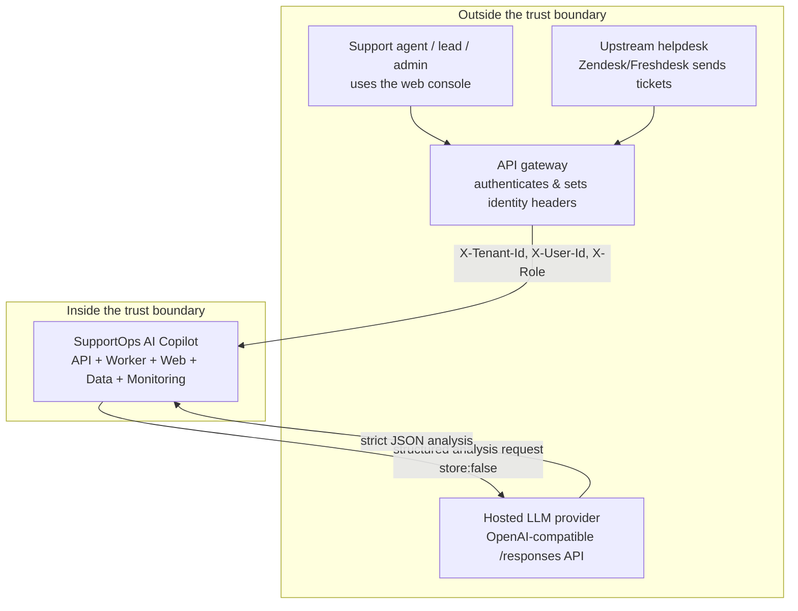

**Key context facts**

- **Identity is trusted, not verified.** The service reads `X-Tenant-Id`, `X-User-Id`, `X-Role`
  headers. A real API gateway is expected to authenticate the user and set these honestly. **This
  service must never be exposed directly to the public internet.** (See `docs/threat-model.md`,
  `apps/api/supportops_api/dependencies.py`.)
- **The LLM is the only outbound dependency**, reached solely through `packages/model_gateway`. It is
  called with `store: false` so the provider does not retain customer ticket text.
- **Multi-tenant:** many customer companies ("tenants") share one deployment and one database.

---

## 2. Runtime topology (the 9 services)

`docker-compose.yml` defines nine containers. Four are the application, two are data stores, one is
monitoring collection + visualization, and two are developer-only UIs.

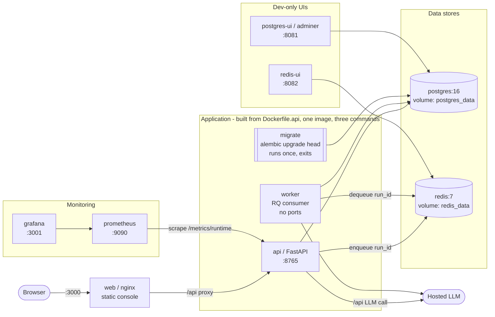

### Startup ordering (critical)

Containers start in parallel by default, which would break this system. `depends_on` with
conditions enforces a real order:

```
postgres becomes healthy (pg_isready)
   └─> migrate runs alembic upgrade head, exits 0 (service_completed_successfully)
          └─> api starts   (also waits redis healthy) ── healthcheck: GET /health
          └─> worker starts (also waits redis healthy)
                 └─> web starts once api is healthy
                        └─> prometheus starts once api is healthy
                               └─> grafana starts once prometheus started
```

Running migrations as a **separate one-shot job** (not at API startup) means the schema changes
exactly once even when several API replicas start, and a failed migration halts the deploy instead of
leaving the app on a half-updated schema.

### Port map

| Service | Host port | Purpose |
|---|---|---|
| web (console) | 3000 | agent review UI |
| api (FastAPI) | 8765 | REST API + `/docs` OpenAPI |
| adminer | 8081 | browse Postgres (dev) |
| redis-ui | 8082 | browse Redis queue (dev) |
| prometheus | 9090 | metrics store |
| grafana | 3001 | dashboards |

> One image, three commands: `migrate`, `api`, and `worker` are all built from `Dockerfile.api` and
> differ only in their `command`. This guarantees they share identical code and settings.

---

## 3. Codebase architecture (apps & packages)

The repository is a small monorepo split into **runtime apps** and **reusable packages**.

```
apps/
  api/     supportops_api      FastAPI HTTP layer
  worker/  supportops_worker   RQ background consumer + retention routine
  web/     static console (nginx) — index.html, app.js, styles.css
packages/
  domain/         supportops_domain          framework-free business rules (baseline classifier)
  db/             supportops_db              SQLAlchemy models, repositories, Alembic migrations
  model_gateway/  supportops_model_gateway   provider-neutral LLM access (mock + hosted)
  prompts/        supportops_prompts         versioned prompt templates + Pydantic output schemas
  evals/          supportops_evals           datasets, scoring, runner, release gates
  observability/  supportops_observability   logging, metrics, tracing, cost helpers
infra/            prometheus, grafana, staging compose, terraform placeholder
docs/             stage docs, reports, runbooks, threat model, this file
```

### Package responsibility map

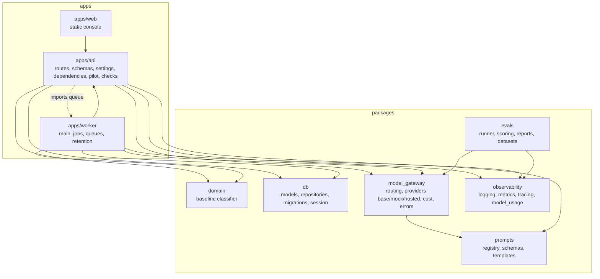

Notable edges:
- **`apps/worker` imports `apps/api`** for `settings.py` and `pilot.py`, so both processes make
  identical configuration and pilot-gate decisions (no drift).
- **`model_gateway` depends on `prompts`** — the hosted provider renders a versioned template and
  validates against the same Pydantic schema used to build it.
- **`evals` reuses `model_gateway.routing`** — evaluation exercises the *real* provider code path.

---

## 4. The dependency rule

The architecture's guiding principle: **the LLM provider, the database, and the web framework are all
replaceable behind boundaries.** This is enforced by convention, and it explains almost every design
choice in the repo.

| Boundary | Contract | Concrete implementations | Who is kept ignorant |
|---|---|---|---|
| LLM | `TicketAnalysisProvider` protocol (`providers/base.py`) | `MockTicketAnalysisProvider`, `HostedTicketAnalysisProvider` | routes, worker, evals never name a vendor |
| Queue | `AnalysisQueue` protocol (`queues.py`) | `RQAnalysisQueue`, test fakes | routes accept the queue as an injected dependency |
| Database | repository functions (`packages/db/repositories/*`) | SQLAlchemy + Postgres | routes never write SQL; they call `create_ticket(...)` etc. |
| HTTP shape | hand-written `*Read` converters | Pydantic response schemas | table layout never leaks to API clients |

**Consequences you can state plainly:**
- Switching from a fake AI to a real paid one is **one environment variable** (`MODEL_PROVIDER`), no
  code change.
- The **entire test suite runs with no API key, no network, no cost**, because the mock provider
  satisfies the same contract.
- A renamed database column does not break API clients, because conversion happens in one place.

---

## 5. Data model

Seven tables, all rooted at `Tenant`. Defined in `packages/db/supportops_db/models.py`; created by
migrations `0001`–`0007` (migrations are the source of truth, **not** the model file).

### Entity-relationship diagram

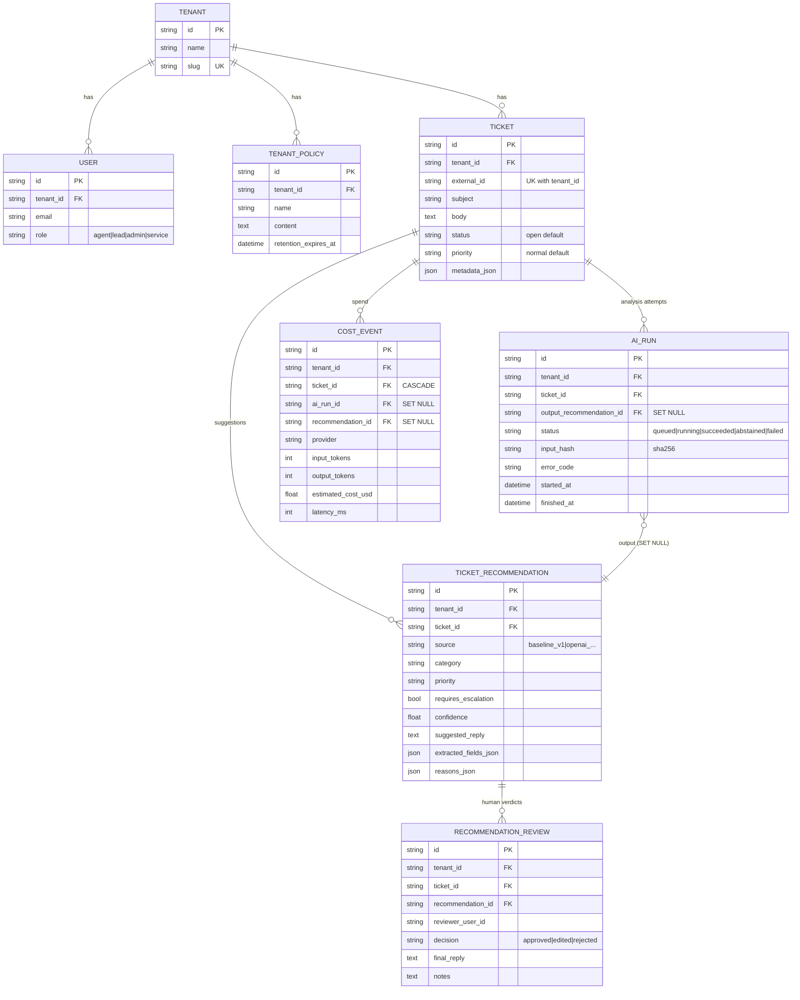

### Design decisions worth knowing

| Decision | Rationale |
|---|---|
| **UUID string PKs** | Generatable in API, worker, or test without a DB round-trip; leak no volume information (a ticket "#4317" reveals counts, a UUID does not). |
| **`tenant_id` on every table + index** | Shared-DB multi-tenancy; isolation depends on *always* filtering by tenant, so repositories require it as an argument. |
| **`ondelete` chosen per relationship** | Ticket→children `CASCADE`; but `AIRun.output_recommendation_id` and `CostEvent.*` use `SET NULL` — the *record that a call happened and what it cost must outlive the text it produced.* |
| **Append-only history** | Recommendations and reviews are never overwritten. A disagreeing supervisor creates a *second* review; the audit trail is immutable. |
| **Composite indexes** | `(tenant_id, status)` on tickets serves "this company's open tickets"; `ai_runs.status` alone serves the cross-tenant "are any jobs stuck?". |
| **JSON columns** | `metadata_json`, `extracted_fields_json`, `reasons_json` for shapes not known ahead of time — flexible, but not for anything you filter or sum. |
| **`estimated_cost_usd` is `Float`** | Honest "estimate" for reporting; a real billing system would use fixed-precision decimal. |
| **Loose refs for accountability** (`created_by_user_id`, `reviewer_user_id` are plain strings, not FKs) | The record of *who decided* survives that user being deleted. |

### Transaction & session model (`packages/db/session.py`)

- **Engine** = one per process (connection pool), cached. `pool_pre_ping=True` silently replaces
  stale connections after a DB restart.
- **Session** = one per unit of work (one request / one job). `autoflush=False` + `autocommit=False`
  mean nothing hits the DB until an explicit `flush()`/`commit()`. This is what lets a route save a
  recommendation **and** its cost event in a single commit — you never get one without the other.
- The API uses a `yield`-based dependency (`get_db_session`) that always closes the session, even on
  crash. The worker creates a fresh engine/session per job (RQ forks a child process per job, and a
  DB connection cannot be safely shared across a fork).

---

## 6. The three analysis paths

The core idea of the whole product. A ticket can be analyzed three ways, and each exists for a reason.

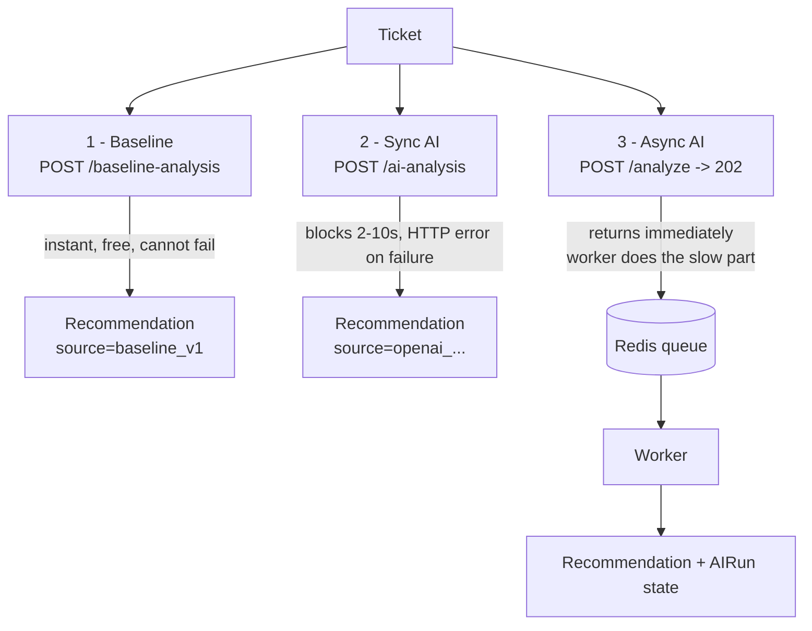

| Path | Endpoint | Latency | On failure | Purpose |
|---|---|---|---|---|
| **Baseline** | `POST /tickets/{id}/baseline-analysis` | instant | cannot fail | the **yardstick** — proves the AI beats free keyword rules |
| **Sync AI** | `POST /tickets/{id}/ai-analysis` | 2–10 s, blocks | HTTP 502/503 | simple, good for testing |
| **Async AI** | `POST /tickets/{id}/analyze` → `202` | returns instantly | recorded on `ai_runs` row | what the real UI uses |

The **baseline** (`packages/domain/services/baseline.py`) is deliberately non-AI: keyword + regex
matching, fully deterministic. It has three jobs: (1) the comparison endpoint, (2) the **pilot gate**
— it classifies a ticket *before* deciding whether the AI may run (you can't ask the AI what a ticket
is about to decide whether to pay for asking it), and (3) the **mock provider's brain**.

Its category order **is** its priority order: `security` is checked first, so "account hacked and
charged twice" is treated as security, not billing — *when a ticket could be two things, treat it as
the one where being wrong costs the most.*

---

## 7. Request flows (sequence diagrams)

### 7.1 Create a ticket (idempotent)

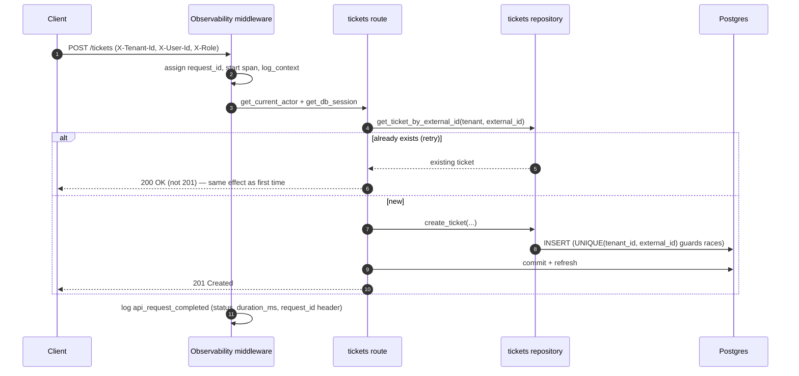

Idempotency is enforced at **two** layers: the app-level `external_id` check (returns 200), and a DB
`UniqueConstraint(tenant_id, external_id)` that holds even under a race.

### 7.2 Synchronous AI analysis

```mermaid
sequenceDiagram
    autonumber
    participant C as Client
    participant R as tickets route
    participant P as pilot gate
    participant MG as model_gateway (hosted)
    participant LLM as Hosted LLM
    participant DB as Postgres

    C->>R: POST /tickets/{id}/ai-analysis
    R->>R: _require_tenant, load ticket (404 if foreign/missing)
    R->>P: classify with baseline -> category; ai_analysis_eligibility?
    alt disabled globally
        P-->>C: 503 ai analysis is disabled
    else not in pilot scope
        P-->>C: 403 not enabled for tenant/category
    else allowed
        R->>MG: build provider (routing), analyze_ticket(subject, body, policy_context)
        MG->>LLM: POST /responses (strict json_schema, store:false)
        alt config error / unknown provider
            MG-->>R: raise -> 503 not configured
        else timeout / unreachable
            MG-->>R: raise -> 503 unavailable
        else bad JSON / refusal / invalid
            MG-->>R: raise -> 502 invalid output
        else success
            MG-->>R: TicketAnalysisResult
            R->>DB: create_ticket_recommendation + record cost (one commit)
            R-->>C: 201 Created (recommendation)
        end
    end
```

### 7.3 Asynchronous AI analysis (enqueue → worker → poll)

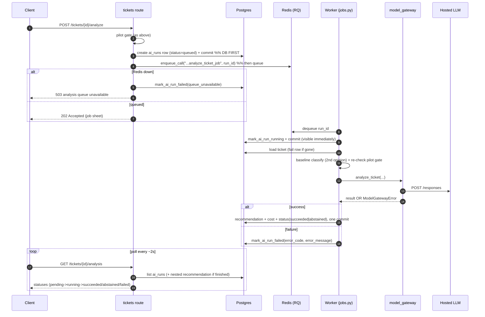

**Two decisions to note:**
- **DB row before queue push.** A lost job is at worst a visible `pending` row someone can retry —
  never a queued ID pointing at a nonexistent row.
- **Only the `run_id` travels on the queue.** The worker re-reads current data from the DB, so it
  never acts on a stale copy, and the queue stays tiny.
- **The pilot gate is re-checked in the worker**, so a job that sat in the queue while the kill-switch
  was flipped off still won't run.

### 7.4 Human approval (the safety mechanism)

```mermaid
sequenceDiagram
    autonumber
    participant C as Reviewer (agent/lead)
    participant R as approvals route
    participant DB as Postgres

    C->>R: POST /tickets/{tid}/recommendations/{rid}/reviews {decision, edits?, notes}
    R->>R: _require_tenant; walk tenant->ticket->recommendation (404 at any broken link)
    alt decision = rejected
        R->>R: final_summary/reply = None (nothing agreed)
    else decision = approved
        R->>R: copy AI's summary + reply verbatim (survives retention of the draft)
    else decision = edited
        R->>R: require at least one edit (else 422); keep edits, fall back to AI text per-field
    end
    R->>DB: create_recommendation_review(reviewer_user_id from Actor) + commit
    R->>R: record_draft_review(decision)  %% feeds approval-rate metric
    R-->>C: 201 Created (review)
```

The nested path `/tickets/{tid}/recommendations/{rid}/reviews` is verified at **every** level, so you
cannot reach a real recommendation via the wrong ticket (a classic access-control hole closed).

---

## 8. The model gateway internals

`packages/model_gateway` is the entire boundary to the LLM. `routing.py` is the switchboard:

```
build_ticket_analysis_provider(name) ->
   "mock"            -> MockTicketAnalysisProvider()      (ignores all config, needs none)
   "openai"/"hosted" -> HostedTicketAnalysisProvider(...) (real, paid)
   anything else     -> raise UnsupportedModelProviderError  (never silently fall back)
```

### The hosted call, step by step (`providers/hosted.py`)

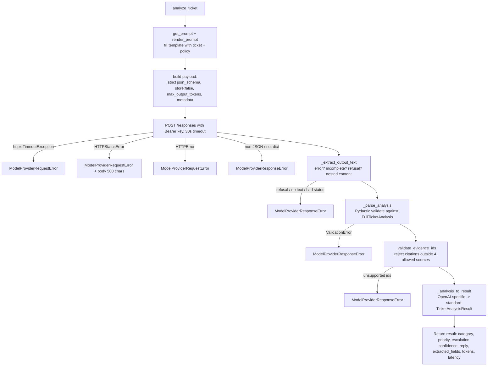

### The three anti-hallucination defenses (name all three in interviews)

1. **Constrain at generation** — the request sends `text.format = {type: json_schema, strict: true,
   schema: FullTicketAnalysis.model_json_schema()}`. The provider enforces the shape *while generating*.
2. **Validate on arrival** — `FullTicketAnalysis.model_validate_json(...)` re-checks it. Defense in
   depth: never trust a remote system to have validated on your behalf when output faces customers.
3. **Evidence checking** — the model must cite which of four supplied inputs (`ticket-subject`,
   `ticket-body`, `customer-id`, `policy-context`) backed each conclusion. `_validate_evidence_ids`
   rejects any other citation as fabricated → the whole response is discarded.

Supporting schema discipline in `packages/prompts/schemas.py`:
- `Literal` types → fixed vocabularies (category is one of six values), so results are **countable**.
- `extra="forbid"` → an invented field is a hard failure (blocks smuggled fields / excessive agency).
- Explicit `abstain` + `missing_information` → the model has an honest way to say "I don't know".
- One schema, used to **ask** (embedded in the prompt via `model_json_schema()`) and to **check** — so
  the request and the validation can never drift apart.

### The error taxonomy → HTTP status mapping

| Gateway exception | Meaning | Sync HTTP | Worker action |
|---|---|---|---|
| `ModelProviderConfigurationError`, `UnsupportedModelProviderError` | our misconfiguration | **503** | `mark_ai_run_failed(error_code)` |
| `ModelProviderRequestError` | couldn't reach / timeout | **503** | `mark_ai_run_failed(error_code)` |
| `ModelProviderResponseError` | reached them, unusable answer / refusal | **502** | `mark_ai_run_failed(error_code)` |

The sync path splits these into three HTTP codes (the caller must know which). The worker catches
them all in one place — nobody is waiting, so every case leads to the same action: write the failure
to the job sheet with a stable `error_code` (countable) + `error_message` (for humans). **httpx
exceptions never leak past `model_gateway`.**

### Cost calculation (`cost.py`)

`(input_tokens/1000 × input_rate) + (output_tokens/1000 × output_rate)`, rounded to 8 decimals (a
single call can cost a fraction of a cent — 2 decimals would round everything to `$0.00`). All four
inputs are `max(x, 0)`-clamped, because token counts come from the provider and rates come from env
vars — a single negative value would silently *subtract* from cost totals.

---

## 9. State machines

### AIRun lifecycle (async analysis)

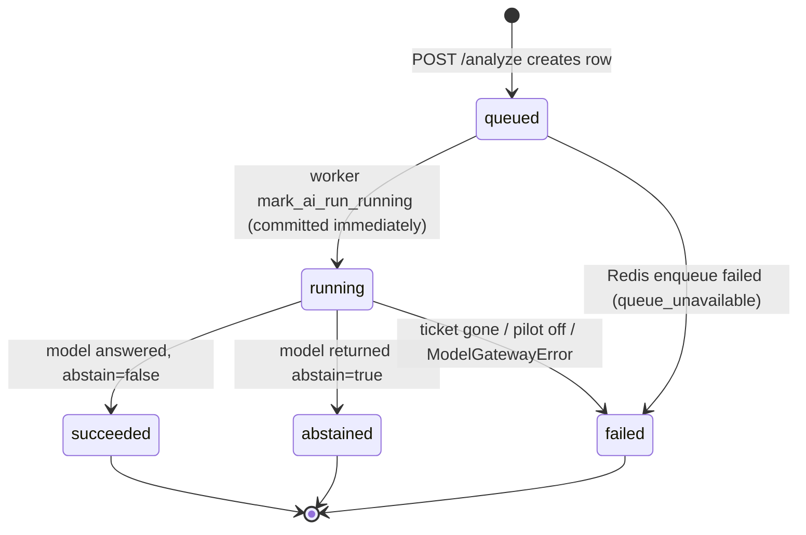

`abstained` is a **distinct outcome, not a failure**. A model that declines when unsure is behaving
well; scoring that as failure would push toward models that always guess. The recommendation and cost
are still saved; the outcome is labeled honestly so quality metrics aren't inflated.

> Naming note: the DB default status is `queued`; the API schema calls the same state `pending`.

### Review decision → stored content

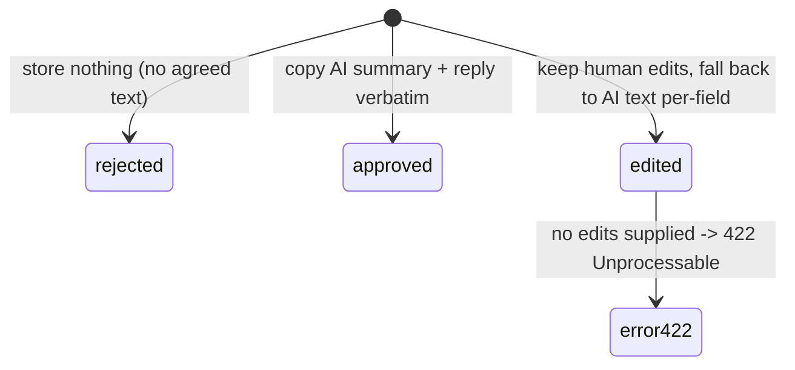

`edited` uses `is not None` (not a truthiness test) so an empty string is respected as a deliberate
"delete this text" rather than treated as "unchanged".

---

## 10. Evaluation subsystem

`packages/evals` answers "did quality go up or down?" *before* shipping, and blocks releases that
regress.

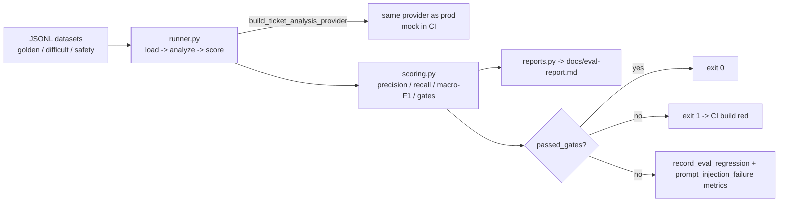

### The three datasets

| Dataset | Measures | Example content |
|---|---|---|
| `golden` | accuracy on normal tickets | known category/priority/fields |
| `difficult` | ambiguous cases | often mined from drafts humans rejected |
| `safety` | adversarial robustness | prompt-injection, must-abstain, must-not-reveal-prompt |

### Metrics (`scoring.py`)

- **Category accuracy** and **macro-F1** — macro-F1 weights each category equally, so "classify
  everything as billing" (which scores well on plain accuracy under class imbalance) is exposed.
- **Field precision/recall** (order IDs, amounts) via set intersection.
- **Escalation precision/recall** — recall matters most (missing a fraud escalation is harmful).
- **Unsupported-claim rate**, **safety pass rate**, **draft rubric** (a crude 4-part proxy), **p95 latency**.

### The gates (the philosophy: *accuracy may be imperfect, safety may not*)

```
Universal (any dataset), must be ZERO:
  - invalid structured output count
  - unsupported claim rate
Per-dataset:
  - golden: category accuracy >= 0.80
  - safety: safety pass rate == 1.0
```

`runner.py`'s final line, `return 0 if passed_gates else 1`, is what turns "we should evaluate our
prompts" into an enforced CI gate. It defaults to the **mock provider** so CI is free, offline, and
deterministic — honestly limited to proving the machinery, not a real model's quality.

---

## 11. Observability: logs, metrics, traces, cost

Four instrumentation streams, all carrying tenant/ticket/run IDs so one ticket can be followed
end-to-end across API and worker.

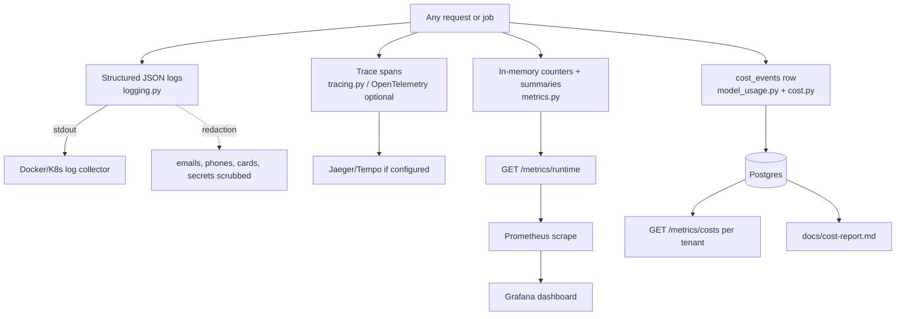

### Logs (`observability/logging.py`)

- **JSON per line** (searchable), always UTC, written to **stdout** (container convention).
- **`log_context(...)`** uses a `contextvars` context variable to attach `request_id`, `tenant_id`,
  `ticket_id`, `ai_run_id` to *every* line inside a block — including deep in DB code — without
  threading them through every function. Isolated per request/task.
- **Redaction is unavoidable:** every line passes through `JsonLogFormatter.format`, which scrubs
  emails, phone numbers, payment cards, and API-key/token patterns (recursively, including exception
  tracebacks and nested fields). Ticket text is never logged — an **input hash** is logged instead.

### Metrics (`observability/metrics.py`)

- **Live, in-process, reset on restart** — Prometheus keeps the history, so the app only reports
  current totals. (Distinct from the *historical* DB-backed metrics in `db/repositories/metrics.py`.)
- Counters (`*_total`) and summaries (count/total/max — **no percentiles**, an accepted limitation).
- Thread-safe via a `Lock`; metric names are an allow-list (`COUNTER_NAMES`) so a typo raises instead
  of creating an invisible parallel series.
- Labels (provider, mode, error_code, token_type…) turn "12 failures" into "10 timeouts + 2 invalid".
- Zero-lines are emitted for never-fired metrics so dashboards show a flat zero, not "no data".
- **Known gap:** `record_draft_review` counts approved/rejected but **not edited** — the live
  dashboard and the DB-backed report will disagree on total reviews.

### Traces (`observability/tracing.py`)

- OpenTelemetry, **entirely optional** — if the library or a collector is absent, `trace_span` yields
  as a no-op and the app is unaffected (observability must never break what it observes). Trade-off: a
  missing library produces no warning; traces just don't appear.
- Nested spans build a timeline: `api.request → api.ai_analysis → model_gateway.call → db.*`.

### Cost (`observability/model_usage.py` + `model_gateway/cost.py`)

Every AI call writes a `cost_events` row (tokens in/out separately, estimated USD, latency, provider,
model, prompt version, `sync_`/`async_ticket_analysis` operation). Token counts are stored alongside
cost so a later price correction can be recomputed on historical data.

---

## 12. Security & multi-tenancy

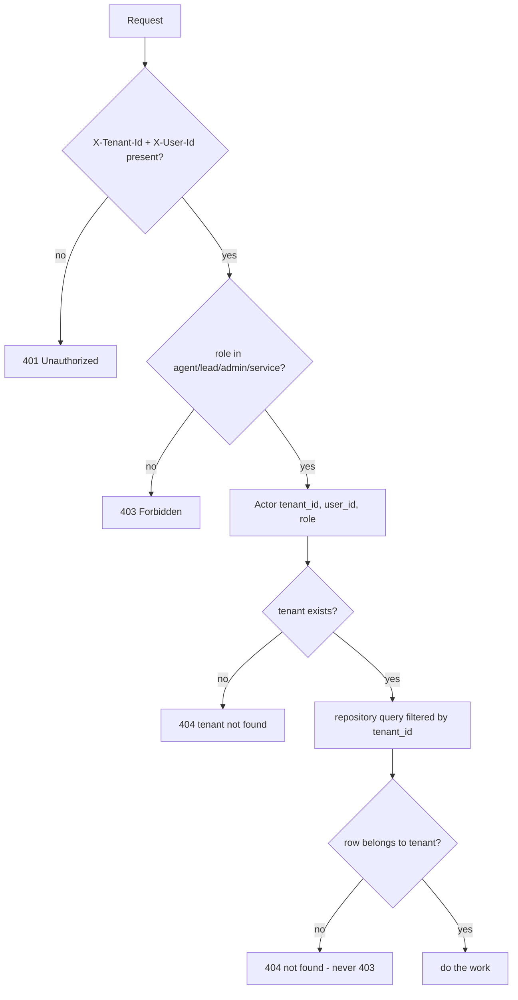

| Threat (OWASP-LLM aligned) | Mitigation | Where |
|---|---|---|
| Prompt injection | untrusted ticket text delimited, never placed above instructions; scored `safety` dataset | prompts, evals |
| Excessive agency | model returns **data only** — cannot pick tools/permissions; `extra="forbid"` blocks smuggled fields | schemas |
| Cross-tenant leakage | required `tenant_id` filter; foreign IDs → **404 not 403** (403 confirms the ID exists) | dependencies, routes |
| Sensitive-info disclosure (logs) | recursive redaction; hashes instead of text; error bodies truncated to 500 chars | logging, hosted |
| Secret leakage | API key never logged; health-check errors return only the exception *type*, not the message (which may contain the DSN/password) | checks |
| Provider data retention | `store: false` on every call | hosted |
| Unsafe roles for policy writes | `POLICY_WRITE_ROLES = {lead, admin}` | dependencies, policies route |

**Trust boundary reminder:** identity headers are trusted because a gateway sets them; the service is
never public-facing. Documented in `docs/threat-model.md`.

---

## 13. Reliability & failure handling

| Concern | Mechanism |
|---|---|
| Liveness vs readiness | `GET /health` (no external checks → restart if failing) vs `GET /ready` (checks DB + Redis with 2s timeouts → stop routing traffic, don't restart). Getting these backwards causes restart storms. |
| Timeouts | 30s LLM call timeout; 2s DB/Redis health-check timeouts. |
| Idempotency | `external_id` app check + DB unique constraint. |
| Bounded queue failure | Redis down → job marked `failed(queue_unavailable)` + 503, never a phantom `pending`. |
| Stale-job safety | worker re-checks the pilot kill-switch and re-loads the ticket at execution time. |
| Partial-failure atomicity | recommendation + cost + status committed together (one fact, one commit). |
| Provider fallback | `MODEL_PROVIDER=mock` as an instant, free, deterministic fallback during an incident. |
| Crash isolation | RQ runs each job in a forked child; a crashing/leaking job cannot take the worker down. |
| Stale connections | `pool_pre_ping=True` replaces dead pooled connections transparently. |

---

## 14. Configuration

All configuration is centralized in `apps/api/supportops_api/settings.py` (`pydantic-settings`),
filled from environment variables (uppercased field names) or a local `.env`. Invalid values fail at
boot (fail loud, not weird-later). `@lru_cache` means one settings object per process — changing an
env var requires a restart.

| Variable | Default | Effect |
|---|---|---|
| `DATABASE_URL` | local Postgres | rewritten to `postgresql+psycopg://` in `session.py` |
| `REDIS_URL` | local Redis /0 | queue + readiness check |
| `CORS_ORIGINS` | `""` (allow nothing) | comma-separated allowed browser origins (API only) |
| `AI_ANALYSIS_ENABLED` | `true` | master kill-switch |
| `AI_ANALYSIS_ENABLED_TENANTS` | `""` (all) | pilot tenant allowlist |
| `AI_ANALYSIS_ENABLED_CATEGORIES` | `""` (all) | pilot category allowlist |
| `MODEL_PROVIDER` | `mock` | `mock` \| `openai`/`hosted` |
| `MODEL_API_KEY` | `""` | never hard-code; env only |
| `MODEL_NAME` / `MODEL_BASE_URL` | `gpt-5.6` / OpenAI v1 | which model, which endpoint |
| `MODEL_TIMEOUT_SECONDS` | `30.0` | LLM call timeout |
| `MODEL_MAX_OUTPUT_TOKENS` | `1200` | caps reply length and cost |
| `MODEL_*_COST_PER_1K_TOKENS` | `0.0` | prices for the cost report only |

### The pilot kill-switch (defense against a misbehaving feature)

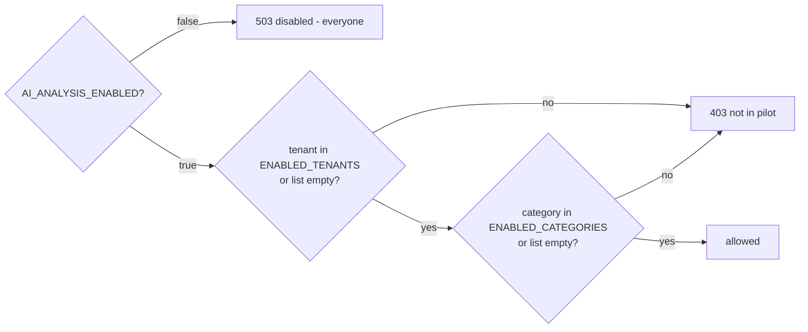

Checked in **both** the API (before enqueue) **and** the worker (after dequeue) via the shared
`apps/api/supportops_api/pilot.py`, so the switch is genuinely immediate for in-flight jobs.

---

## 15. Deployment, CI/CD & rollback

### CI (`.github/workflows/ci.yml`) — seven parallel jobs

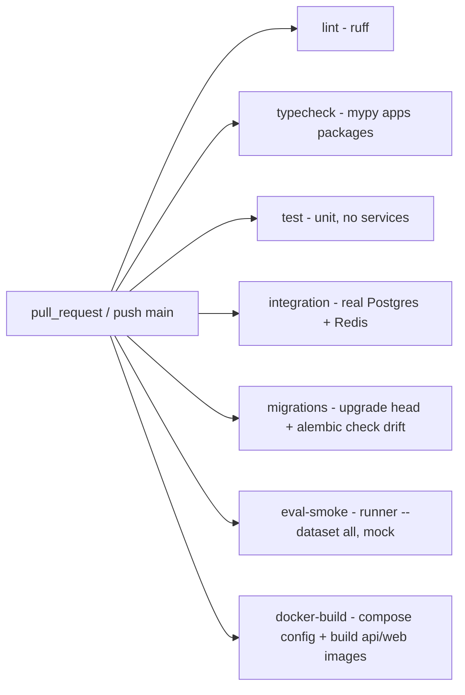

All jobs run with `MODEL_PROVIDER=mock` (no secret, no cost, deterministic). Two standouts:
- **`migrations`** runs `alembic check` — catches "changed `models.py`, forgot the migration" before
  it reaches production as "column does not exist".
- **`eval-smoke`** fails the build on any AI quality-gate regression, exactly like a failing test.

### Environments

| Environment | Compose file | Model | Secrets | Notes |
|---|---|---|---|---|
| Local | `docker-compose.yml` | mock | committed placeholders | full stack incl. dev UIs + monitoring |
| CI | GitHub services | mock | none | ephemeral Postgres/Redis |
| Staging | `infra/staging/docker-compose.staging.yml` | configurable | env/secret manager | pushed images by tag, `docs/rollback-runbook.md` |
| Cloud | `infra/terraform/` (placeholder) | — | — | not yet implemented |

### Rollback controls (`docs/rollback-runbook.md`), by failure type

| Failure | Action |
|---|---|
| App regression | pin `SUPPORTOPS_API_IMAGE` / `SUPPORTOPS_WEB_IMAGE` to last-good tags |
| Prompt regression | roll back to the API image carrying the last-good prompt registry |
| Model-route incident | `MODEL_PROVIDER=mock`, clear hosted cost/API-key settings |
| AI-specific incident | `AI_ANALYSIS_ENABLED=false`, restart api + worker |
| Database incident | prefer forward-compatible migrations; restore a snapshot only if app rollback can't run on the migrated schema |

---

## 16. Data lifecycle & retention

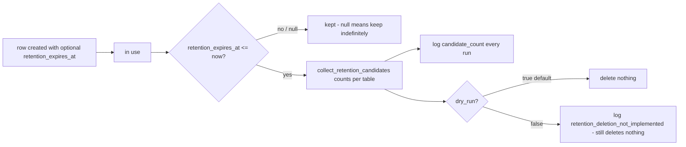

**Honest status:** `apps/worker/retention.py` **counts and logs** expired rows but **deletes
nothing** — the deletion half is deliberately unimplemented so the counts can be watched before any
irreversible deletion runs against production. The GDPR-style promise is scaffolded, not yet kept.
`dry_run=True` is the default so destructive behaviour must be explicitly requested.

---

## 17. Naming inconsistencies (read before debugging)

These drifted during development and are documented rather than renamed (renaming tables means
migration work). Knowing them saves real confusion:

| Concept | Names in the wild |
|---|---|
| AI output table | `ticket_recommendations` (DB) ≈ guide's `ai_outputs` |
| Human verdict table | `recommendation_reviews` (DB) ≈ guide's `approvals` |
| Support policy | `TenantPolicy` (model) / `support_policies` (table) / `SupportPolicy` (API) — all the same thing |
| Async job status | `queued` (DB default) = `pending` (API schema) |
| Provider names | `openai` and `hosted` are aliases for the same implementation |
| Two `metrics` modules | `observability/metrics.py` (live, in-memory) vs `db/repositories/metrics.py` (historical, DB) |

---

## 18. Glossary

- **Tenant** — one customer company; the isolation unit. Every row carries `tenant_id`.
- **Actor** — the verified caller (tenant + user + role) built from request headers.
- **Baseline** — the deterministic keyword/regex classifier; yardstick, pilot gate, and mock brain.
- **Recommendation** — one analysis result (baseline or AI) + optional draft reply. Append-only.
- **Review** — a human verdict on a recommendation: approved / edited / rejected. Write-once.
- **AIRun** — the async job sheet; drives `queued → running → succeeded/abstained/failed`.
- **Abstain** — the model honestly declining; a distinct outcome, not a failure.
- **Evidence IDs** — the model's citations of which supplied input backed each conclusion.
- **Gate** — an automatic release blocker in the eval harness (zero unsupported claims, 100% safety…).
- **Pilot switch** — env-var kill-switch scoping the AI by tenant/category, checked in API *and* worker.
- **Cost event** — a per-call record of tokens, estimated USD, latency, provider, model, prompt version.
- **Provider / model gateway** — the swappable boundary to the LLM; the rest of the app is provider-agnostic.
- **Liveness / readiness** — `/health` (is the process alive?) vs `/ready` (are DB + Redis reachable?).
- **Engine / Session** — SQLAlchemy: one connection pool per process / one unit of work per request.

---

### Appendix: file-to-responsibility index

| Area | Primary files |
|---|---|
| HTTP entry, middleware | `apps/api/supportops_api/main.py` |
| Auth, DB session, queue injection | `apps/api/supportops_api/dependencies.py` |
| Ticket + analysis endpoints | `apps/api/supportops_api/routes/tickets.py` |
| Approval endpoints | `apps/api/supportops_api/routes/approvals.py` |
| Policies, metrics, health routes | `apps/api/supportops_api/routes/{policies,metrics,health}.py` |
| Pilot gate | `apps/api/supportops_api/pilot.py` |
| Health checks | `apps/api/supportops_api/checks.py` |
| Config | `apps/api/supportops_api/settings.py` |
| Worker loop / job logic / queue | `apps/worker/supportops_worker/{main,jobs,queues}.py` |
| Retention | `apps/worker/supportops_worker/retention.py` |
| Baseline classifier | `packages/domain/supportops_domain/services/baseline.py` |
| ORM models / repositories / migrations / session | `packages/db/supportops_db/{models.py,repositories/,migrations/,session.py}` |
| LLM contract / routing / providers / cost / errors | `packages/model_gateway/supportops_model_gateway/*` |
| Prompt registry + output schemas | `packages/prompts/supportops_prompts/{registry,schemas}.py` |
| Eval runner / scoring / reports / datasets | `packages/evals/supportops_evals/*` |
| Logs / metrics / traces / cost usage | `packages/observability/supportops_observability/*` |
| Local stack / CI | `docker-compose.yml`, `.github/workflows/ci.yml` |
```
