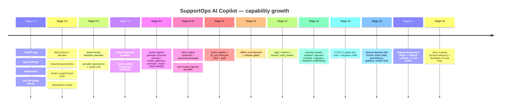

# File Change Log & Overall Improvement Map

This is the **cumulative, project-wide view** of what was built and changed, stage by stage, and
where every file lives today. Each individual stage doc (`stage-09` … `stage-18`) lists the files for
that stage; this file ties them all together and describes the overall trajectory.

Use it to answer three questions quickly:
1. *What did each stage add or change?* → [Section 2, the per-stage matrix](#2-per-stage-added--changed-matrix).
2. *Which stage introduced or last touched a given file?* → [Section 3, the file index](#3-file-index-who-touched-what).
3. *How did the whole project improve over time?* → [Section 1, the overall arc](#1-the-overall-improvement-arc).

---

## 1. The overall improvement arc

The project grew in one direction: **from a bare health-check API to a governed, observable,
production-shaped LLM product** — adding exactly one production concern per stage and never breaking
the public API contract established earlier.

### What "improvement" meant at each layer

| Layer | Started as | Became |
|---|---|---|
| **API** | one `/health` route | tenant-scoped tickets, 3 analysis paths, approvals, policies, metrics, pilot — with correct 200/201/202/401/403/404/422/502/503 semantics |
| **Data** | none | 7 tables, migrations 0001–0007, per-relationship `ondelete`, retention columns, deliberate indexes |
| **AI access** | none | provider-neutral gateway: mock + hosted, strict structured output, evidence validation, error taxonomy, cost accounting |
| **Prompts** | inline strings (implied) | versioned artifacts with declared output schemas and injection boundaries |
| **Quality** | manual demo tickets | golden/difficult/safety datasets + gates enforced in CI |
| **Operability** | print statements (implied) | JSON logs + request IDs, Prometheus metrics, optional traces, durable cost events, dashboards |
| **Security** | none | server-side tenant isolation, RBAC, injection controls, PII/secret redaction, threat model |
| **Release** | run locally | 7-job CI, local prod-like stack, staging path, rollback runbook, pilot kill-switch |

### Design invariants held across every stage
- **The public API shape never regressed** — new capabilities were added behind the same `*Read`
  response schemas, so earlier clients kept working.
- **Everything runs offline by default** (`MODEL_PROVIDER=mock`), so tests and CI need no API key.
- **Provenance was recorded from the start** — every recommendation stores `source`, `model_name`,
  and `prompt_version`, which is what later made cost, evaluation, and pilot analysis possible.
- **Human approval was never removed** — the AI drafts, a person decides, from Stage 7 onward.

---

## 2. Per-stage added / changed matrix

"➕ new" = file created in that stage. "✎ changed" = existing file modified. Stages 1–8.5 predate the
detailed stage docs and are summarized from `progress-log.md`.

| Stage | Theme | Key new files (➕) | Key changed files (✎) |
|---|---|---|---|
| 1–1A | API foundation + Docker | `apps/api/.../main.py`, `settings.py`, `routes/health.py`, `Dockerfile.api`, `docker-compose.yml`, `.dockerignore` | — |
| 2 | Real readiness checks | `apps/api/.../checks.py` | `routes/health.py` |
| 3 | DB models + first migration | `packages/db/...` (`base.py`, `models.py`, `session.py`, `migrations/`, `0001`), `alembic.ini` | `Dockerfile.api` |
| 4 | Tenant-scoped ticket APIs | `dependencies.py`, `routes/tickets.py`, `schemas/tickets.py`, `repositories/{tenants,tickets}.py`, `seed.py` | `main.py` |
| 5 | Baseline classifier | `packages/domain/.../baseline.py`, `0002`, `repositories/recommendations.py`, `schemas/ai.py` | `models.py`, `routes/tickets.py` |
| 6 | Mock LLM abstraction | `providers/base.py`, `providers/mock.py`, `routing.py`, `errors.py`, `0003` | `models.py`, `routes/tickets.py`, `settings.py` |
| 7 | Human approval | `routes/approvals.py`, `schemas/approvals.py`, `repositories/approvals.py`, `0004` | `models.py` |
| 8 | Review metrics | `routes/metrics.py`, `schemas/metrics.py`, `repositories/metrics.py` | `main.py` |
| 8.5 | Structure realignment | moved code into `packages/{domain,model_gateway,prompts,evals,observability}`; `docs/{architecture,eval-report,cost-report}.md` | many imports |
| **9** | Prompt contract | `prompts/{schemas,registry}.py`, 5 templates, prompt tests, `stage-09` | `progress-log`, `README` |
| **10** | Hosted provider | `providers/hosted.py`, `full_ticket_analysis.v1.md`, `stage-10` | `registry.py`, `routing.py`, `client.py`, `settings.py`, `routes/tickets.py`, `requirements.txt` |
| **11** | Async worker | `apps/worker/{main,queues,jobs}.py`, `repositories/ai_runs.py`, `0005`, `stage-11` | `models.py`, `routes/tickets.py`, `dependencies.py`, `schemas/ai.py`, `docker-compose.yml`, `requirements.txt` |
| **12** | Eval harness | `evals/{runner,scoring,reports}.py`, 3 datasets, eval tests, `stage-12` | `eval-report.md` |
| **13** | Observability + cost | `observability/{logging,metrics,tracing,model_usage}.py`, `repositories/cost_events.py`, `model_gateway/cost.py`, `0006`, `stage-13` | `models.py`, `main.py`, `routes/metrics.py`, `settings.py`, `routes/tickets.py`, `worker/jobs.py`, `worker/main.py`, `requirements.txt`, `docker-compose.yml`, `cost-report.md` |
| **14** | Security | `routes/policies.py`, `schemas/policies.py`, `repositories/policies.py`, `worker/retention.py`, `0007`, `stage-14`, `threat-model.md` | `models.py`, `dependencies.py`, `routes/tickets.py`, `worker/jobs.py`, `providers/hosted.py`, `full_ticket_analysis.v1.md`, `logging.py` |
| **15** | CI/CD | `.github/workflows/ci.yml`, `tests/integration/`, `stage-15` | `pyproject.toml`, `requirements-dev.txt`, typing fixes in `metrics.py`/`cost_events.py`/`retention.py`/`approvals.py`/`queues.py` |
| **16** | Local deployment | `apps/web/*`, `Dockerfile.web`, `infra/prometheus/*`, `infra/grafana/*`, `scripts/deployment-smoke.ps1`, `tests/deployment/`, `stage-16` | `docker-compose.yml`, `main.py`, `settings.py`, `ci.yml` |
| **17** | Staging + rollback | `infra/staging/docker-compose.staging.yml`, `infra/staging/env.example`, `rollback-runbook.md`, `stage-17` | `settings.py`, `routes/tickets.py`, `worker/jobs.py`, `.gitignore` |
| **18** | Pilot + feedback loop | `apps/api/.../pilot.py`, `repositories/pilot.py`, `stage-18`, `pilot-report.md`, `feedback-to-eval-loop.md` | `settings.py`, `routes/tickets.py`, `routes/metrics.py`, `schemas/metrics.py`, `worker/jobs.py`, `web/src/app.js`, `docker-compose.yml`, `difficult_cases.jsonl` |

---

## 3. File index (who touched what)

For each source file: the stage that **created** it, and the later stages that **modified** it. This
is the fastest way to understand why a file looks the way it does.

### apps/api
| File | Created | Later changed by |
|---|---|---|
| `main.py` | 1 | 8, 13 (middleware), 16 (CORS) |
| `settings.py` | 1 | 6, 10, 13, 16, 17, 18 |
| `dependencies.py` | 4 | 11 (queue), 14 (roles) |
| `checks.py` | 2 | — |
| `pilot.py` | 18 | — |
| `seed.py` | 4 | later demo updates |
| `routes/health.py` | 1 (as 2) | 2 |
| `routes/tickets.py` | 4 | 5, 6, 10, 11, 13, 14, 17, 18 |
| `routes/approvals.py` | 7 (8.5 move) | 15 (typing) |
| `routes/policies.py` | 14 | — |
| `routes/metrics.py` | 8 | 13, 18 |
| `schemas/tickets.py` | 4 | — |
| `schemas/ai.py` | 5 (8.5 split) | 11 |
| `schemas/approvals.py` | 7 (8.5 split) | — |
| `schemas/metrics.py` | 8 | 13, 18 |
| `schemas/policies.py` | 14 | — |

### apps/worker
| File | Created | Later changed by |
|---|---|---|
| `main.py` | 11 | 13 (logging) |
| `queues.py` | 11 | 15 (typing) |
| `jobs.py` | 11 | 13, 14, 17, 18 |
| `retention.py` | 14 | 15 (typing) |

### apps/web
| File | Created | Later changed by |
|---|---|---|
| `src/index.html`, `src/app.js`, `src/styles.css`, `nginx.conf` | 16 | 18 (pilot panel in `app.js`) |

### packages
| File | Created | Later changed by |
|---|---|---|
| `db/models.py` | 3 | 5, 6, 7, 11, 13, 14 |
| `db/session.py`, `db/base.py` | 3 | — |
| `db/repositories/{tenants,tickets}.py` | 4 | — |
| `db/repositories/recommendations.py` | 5 | — |
| `db/repositories/approvals.py` | 7 | — |
| `db/repositories/metrics.py` | 8 | — |
| `db/repositories/ai_runs.py` | 11 | — |
| `db/repositories/cost_events.py` | 13 | 15 (typing) |
| `db/repositories/policies.py` | 14 | — |
| `db/repositories/pilot.py` | 18 | — |
| `db/migrations/versions/0001…0007` | 3,5,6,7,11,13,14 | — |
| `domain/services/baseline.py` | 5 (8.5 move) | — |
| `model_gateway/providers/base.py` | 6 | — |
| `model_gateway/providers/mock.py` | 6 | — |
| `model_gateway/providers/hosted.py` | 10 | 14 (evidence allowlist) |
| `model_gateway/routing.py` | 6 | 10 |
| `model_gateway/client.py` | 6/8.5 | 10 |
| `model_gateway/errors.py` | 6/8.5 | 10 |
| `model_gateway/cost.py` | 13 | — |
| `prompts/schemas.py`, `prompts/registry.py` | 9 | 10 (registry entry) |
| `prompts/templates/*.v1.md` | 9 | 10 (+full_ticket_analysis), 14 (security boundaries) |
| `evals/{runner,scoring,reports}.py` | 12 | — |
| `evals/datasets/*.jsonl` | 12 | 18 (difficult cases) |
| `observability/{logging,metrics,tracing,model_usage}.py` | 13 | 14 (redaction), 15 (typing) |

### infra / build / CI
| File | Created | Later changed by |
|---|---|---|
| `Dockerfile.api`, `.dockerignore` | 1A | 3 |
| `docker-compose.yml` | 1A | 11, 13, 16, 18 |
| `Dockerfile.web`, `apps/web/nginx.conf` | 16 | — |
| `infra/prometheus/prometheus.yml`, `infra/grafana/*` | 16 | — |
| `infra/staging/docker-compose.staging.yml`, `infra/staging/env.example` | 17 | 18 (pilot defaults) |
| `.github/workflows/ci.yml` | 15 | 16 (web build) |
| `scripts/deployment-smoke.ps1` | 16 | — |
| `pyproject.toml`, `requirements*.txt`, `alembic.ini` | 1/3 | 10, 11, 13, 15 |

### docs
| File | Created | Purpose |
|---|---|---|
| `progress-log.md` | 1 | per-stage build log (source of truth for counts) |
| `architecture.md` | 8.5 | full technical reference (expanded) |
| `data-model.md`, `api-contracts.md` | early | schema + endpoint contracts |
| `eval-report.md`, `cost-report.md` | 8.5/12/13 | generated/curated reports |
| `learning-notes.md` | ongoing | build-break-debug notes |
| `stage-09 … stage-18` | per stage | detailed stage explanations |
| `threat-model.md` | 14 | security boundary + threats |
| `rollback-runbook.md` | 17 | rollback by failure type |
| `pilot-report.md`, `feedback-to-eval-loop.md` | 18 | pilot analysis + improvement loop |
| `interview-prep.md`, `file-change-log.md` | latest | study guide + this cumulative map |

---

## 4. How to keep this current

When a new stage lands:
1. Add its `## Files Added and Changed in This Stage` section to that stage's doc (copy the format
   from `stage-18`).
2. Add one row to the [matrix in Section 2](#2-per-stage-added--changed-matrix).
3. Update any touched file's "Later changed by" cell in the [Section 3 index](#3-file-index-who-touched-what).
4. Record verification counts/commands under the matching stage in `progress-log.md`.
